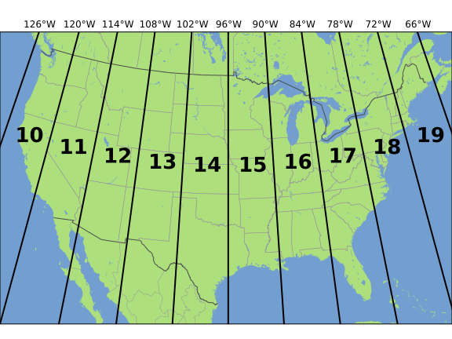
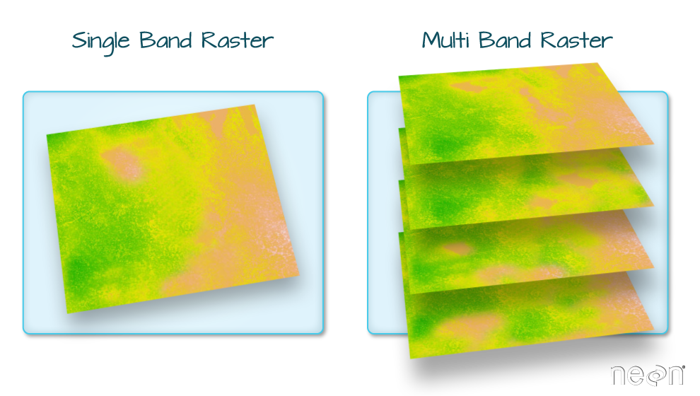
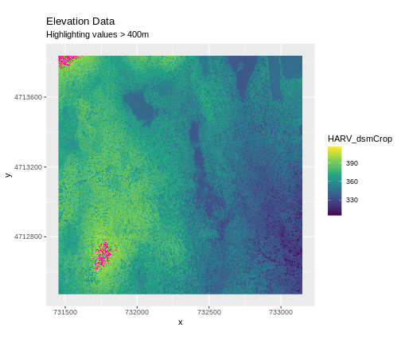
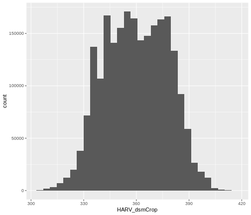

::::::::::::::::::::::::::::::::::::::: objectives

- Describe the fundamental attributes of a raster dataset.
- Explore raster attributes and metadata using R.
- Import rasters into R using the `terra` package.
- Plot a raster file in R using the `ggplot2` package.
- Describe the difference between single- and multi-band rasters.

::::::::::::::::::::::::::::::::::::::::::::::::::

:::::::::::::::::::::::::::::::::::::::: questions

- What is a raster dataset?
- How do I work with and plot raster data in R?
- How can I handle missing or bad data values for a raster?

::::::::::::::::::::::::::::::::::::::::::::::::::


::::::::::::::::::::::::::::::::::::::::::  prereq

## Things You'll Need To Complete This Episode

See the [lesson homepage](.) for detailed information about the software,
data, and other prerequisites you will need to work through the examples in this episode.


::::::::::::::::::::::::::::::::::::::::::::::::::

In this episode, we will introduce the fundamental principles, packages and
metadata/raster attributes that are needed to work with raster data in R. We will
discuss some of the core metadata elements that we need to understand to work with
rasters in R, including CRS and resolution. We will also explore missing and bad
data values as stored in a raster and how R handles these elements.

We will continue to work with the `dplyr` and `ggplot2` packages that were introduced
in the [Introduction to R for Geospatial Data](https://datacarpentry.org/r-intro-geospatial/) 
lesson. We will use two additional packages in this episode to work with raster 
data - the `terra` and `sf` packages. Make sure that you have these packages 
loaded.


```r
library(terra)
library(ggplot2)
library(dplyr)
```

:::::::::::::::::::::::::::::::::::::::::  callout

## Introduce the Data

If not already discussed, introduce the datasets that will be used in this
lesson. A brief introduction to the datasets can be found on the
[Geospatial workshop homepage](https://datacarpentry.org/geospatial-workshop/#data).

For more detailed information about the datasets, check
out the [Geospatial workshop data
page](https://datacarpentry.org/geospatial-workshop/data/).


::::::::::::::::::::::::::::::::::::::::::::::::::

## View Raster File Attributes

We will be working with a series of GeoTIFF files in this lesson. The
GeoTIFF format contains a set of embedded tags with metadata about the raster
data. We can use the function `describe()` to get information about our raster
data before we read that data into R. It is ideal to do this before importing
your data.


```r
describe("data/NEON-DS-Airborne-Remote-Sensing/HARV/DSM/HARV_dsmCrop.tif")
```

```{.output}
 [1] "Driver: GTiff/GeoTIFF"                                                                                                                                                                                                                                                         
 [2] "Files: data/NEON-DS-Airborne-Remote-Sensing/HARV/DSM/HARV_dsmCrop.tif"                                                                                                                                                                                                         
 [3] "Size is 1697, 1367"                                                                                                                                                                                                                                                            
 [4] "Coordinate System is:"                                                                                                                                                                                                                                                         
 [5] "PROJCRS[\"WGS 84 / UTM zone 18N\","                                                                                                                                                                                                                                            
 [6] "    BASEGEOGCRS[\"WGS 84\","                                                                                                                                                                                                                                                   
 [7] "        DATUM[\"World Geodetic System 1984\","                                                                                                                                                                                                                                 
 [8] "            ELLIPSOID[\"WGS 84\",6378137,298.257223563,"                                                                                                                                                                                                                       
 [9] "                LENGTHUNIT[\"metre\",1]]],"                                                                                                                                                                                                                                    
[10] "        PRIMEM[\"Greenwich\",0,"                                                                                                                                                                                                                                               
[11] "            ANGLEUNIT[\"degree\",0.0174532925199433]],"                                                                                                                                                                                                                        
[12] "        ID[\"EPSG\",4326]],"                                                                                                                                                                                                                                                   
[13] "    CONVERSION[\"UTM zone 18N\","                                                                                                                                                                                                                                              
[14] "        METHOD[\"Transverse Mercator\","                                                                                                                                                                                                                                       
[15] "            ID[\"EPSG\",9807]],"                                                                                                                                                                                                                                               
[16] "        PARAMETER[\"Latitude of natural origin\",0,"                                                                                                                                                                                                                           
[17] "            ANGLEUNIT[\"degree\",0.0174532925199433],"                                                                                                                                                                                                                         
[18] "            ID[\"EPSG\",8801]],"                                                                                                                                                                                                                                               
[19] "        PARAMETER[\"Longitude of natural origin\",-75,"                                                                                                                                                                                                                        
[20] "            ANGLEUNIT[\"degree\",0.0174532925199433],"                                                                                                                                                                                                                         
[21] "            ID[\"EPSG\",8802]],"                                                                                                                                                                                                                                               
[22] "        PARAMETER[\"Scale factor at natural origin\",0.9996,"                                                                                                                                                                                                                  
[23] "            SCALEUNIT[\"unity\",1],"                                                                                                                                                                                                                                           
[24] "            ID[\"EPSG\",8805]],"                                                                                                                                                                                                                                               
[25] "        PARAMETER[\"False easting\",500000,"                                                                                                                                                                                                                                   
[26] "            LENGTHUNIT[\"metre\",1],"                                                                                                                                                                                                                                          
[27] "            ID[\"EPSG\",8806]],"                                                                                                                                                                                                                                               
[28] "        PARAMETER[\"False northing\",0,"                                                                                                                                                                                                                                       
[29] "            LENGTHUNIT[\"metre\",1],"                                                                                                                                                                                                                                          
[30] "            ID[\"EPSG\",8807]]],"                                                                                                                                                                                                                                              
[31] "    CS[Cartesian,2],"                                                                                                                                                                                                                                                          
[32] "        AXIS[\"(E)\",east,"                                                                                                                                                                                                                                                    
[33] "            ORDER[1],"                                                                                                                                                                                                                                                         
[34] "            LENGTHUNIT[\"metre\",1]],"                                                                                                                                                                                                                                         
[35] "        AXIS[\"(N)\",north,"                                                                                                                                                                                                                                                   
[36] "            ORDER[2],"                                                                                                                                                                                                                                                         
[37] "            LENGTHUNIT[\"metre\",1]],"                                                                                                                                                                                                                                         
[38] "    USAGE["                                                                                                                                                                                                                                                                    
[39] "        SCOPE[\"Engineering survey, topographic mapping.\"],"                                                                                                                                                                                                                  
[40] "        AREA[\"Between 78°W and 72°W, northern hemisphere between equator and 84°N, onshore and offshore. Bahamas. Canada - Nunavut; Ontario; Quebec. Colombia. Cuba. Ecuador. Greenland. Haiti. Jamica. Panama. Turks and Caicos Islands. United States (USA). Venezuela.\"],"
[41] "        BBOX[0,-78,84,-72]],"                                                                                                                                                                                                                                                  
[42] "    ID[\"EPSG\",32618]]"                                                                                                                                                                                                                                                       
[43] "Data axis to CRS axis mapping: 1,2"                                                                                                                                                                                                                                            
[44] "Origin = (731453.000000000000000,4713838.000000000000000)"                                                                                                                                                                                                                     
[45] "Pixel Size = (1.000000000000000,-1.000000000000000)"                                                                                                                                                                                                                           
[46] "Metadata:"                                                                                                                                                                                                                                                                     
[47] "  AREA_OR_POINT=Area"                                                                                                                                                                                                                                                          
[48] "Image Structure Metadata:"                                                                                                                                                                                                                                                     
[49] "  COMPRESSION=LZW"                                                                                                                                                                                                                                                             
[50] "  INTERLEAVE=BAND"                                                                                                                                                                                                                                                             
[51] "Corner Coordinates:"                                                                                                                                                                                                                                                           
[52] "Upper Left  (  731453.000, 4713838.000) ( 72d10'52.71\"W, 42d32'32.18\"N)"                                                                                                                                                                                                     
[53] "Lower Left  (  731453.000, 4712471.000) ( 72d10'54.71\"W, 42d31'47.92\"N)"                                                                                                                                                                                                     
[54] "Upper Right (  733150.000, 4713838.000) ( 72d 9'38.40\"W, 42d32'30.35\"N)"                                                                                                                                                                                                     
[55] "Lower Right (  733150.000, 4712471.000) ( 72d 9'40.41\"W, 42d31'46.08\"N)"                                                                                                                                                                                                     
[56] "Center      (  732301.500, 4713154.500) ( 72d10'16.56\"W, 42d32' 9.13\"N)"                                                                                                                                                                                                     
[57] "Band 1 Block=1697x1 Type=Float64, ColorInterp=Gray"                                                                                                                                                                                                                            
[58] "  Min=305.070 Max=416.070 "                                                                                                                                                                                                                                                    
[59] "  Minimum=305.070, Maximum=416.070, Mean=359.853, StdDev=17.832"                                                                                                                                                                                                               
[60] "  NoData Value=-9999"                                                                                                                                                                                                                                                          
[61] "  Metadata:"                                                                                                                                                                                                                                                                   
[62] "    STATISTICS_MAXIMUM=416.06997680664"                                                                                                                                                                                                                                        
[63] "    STATISTICS_MEAN=359.85311802914"                                                                                                                                                                                                                                           
[64] "    STATISTICS_MINIMUM=305.07000732422"                                                                                                                                                                                                                                        
[65] "    STATISTICS_STDDEV=17.83169335933"                                                                                                                                                                                                                                          
```

If you wish to store this information in R, you can do the following:


```r
HARV_dsmCrop_info <- capture.output(
  describe("data/NEON-DS-Airborne-Remote-Sensing/HARV/DSM/HARV_dsmCrop.tif")
)
```

Each line of text that was printed to the console is now stored as an element of
the character vector `HARV_dsmCrop_info`. We will be exploring this data throughout this
episode. By the end of this episode, you will be able to explain and understand the output above.

## Open a Raster in R

Now that we've previewed the metadata for our GeoTIFF, let's import this
raster dataset into R and explore its metadata more closely. We can use the `rast()`
function to open a raster in R.

:::::::::::::::::::::::::::::::::::::::::  callout

## Data Tip - Object names

To improve code
readability, file and object names should be used that make it clear what is in
the file. The data for this episode were collected from Harvard Forest so
we'll use a naming convention of `datatype_HARV`.


::::::::::::::::::::::::::::::::::::::::::::::::::

First we will load our raster file into R and view the data structure.


```r
DSM_HARV <-
  rast("data/NEON-DS-Airborne-Remote-Sensing/HARV/DSM/HARV_dsmCrop.tif")

DSM_HARV
```

```{.output}
class       : SpatRaster 
dimensions  : 1367, 1697, 1  (nrow, ncol, nlyr)
resolution  : 1, 1  (x, y)
extent      : 731453, 733150, 4712471, 4713838  (xmin, xmax, ymin, ymax)
coord. ref. : WGS 84 / UTM zone 18N (EPSG:32618) 
source      : HARV_dsmCrop.tif 
name        : HARV_dsmCrop 
min value   :       305.07 
max value   :       416.07 
```

The information above includes a report of min and max values, but no other data
range statistics. Similar to other R data structures like vectors and data frame
columns, descriptive statistics for raster data can be retrieved like


```r
summary(DSM_HARV)
```

```{.warning}
Warning: [summary] used a sample
```

```{.output}
  HARV_dsmCrop  
 Min.   :305.6  
 1st Qu.:345.6  
 Median :359.6  
 Mean   :359.8  
 3rd Qu.:374.3  
 Max.   :414.7  
```

but note the warning - unless you force R to calculate these statistics using
every cell in the raster, it will take a random sample of 100,000 cells and
calculate from that instead. To force calculation all the values, you can use 
the function `values`:


```r
summary(values(DSM_HARV))
```

```{.output}
  HARV_dsmCrop  
 Min.   :305.1  
 1st Qu.:345.6  
 Median :359.7  
 Mean   :359.9  
 3rd Qu.:374.3  
 Max.   :416.1  
```

To visualise this data in R using `ggplot2`, we need to convert it to a
dataframe. We learned about dataframes in [an earlier
lesson](https://datacarpentry.org/r-intro-geospatial/04-data-structures-part2/index.html).
The `terra` package has an built-in function for conversion to a plotable dataframe.


```r
DSM_HARV_df <- as.data.frame(DSM_HARV, xy = TRUE)
```

Now when we view the structure of our data, we will see a standard
dataframe format.


```r
str(DSM_HARV_df)
```

```{.output}
'data.frame':	2319799 obs. of  3 variables:
 $ x           : num  731454 731454 731456 731456 731458 ...
 $ y           : num  4713838 4713838 4713838 4713838 4713838 ...
 $ HARV_dsmCrop: num  409 408 407 407 409 ...
```

We can use `ggplot()` to plot this data. We will set the color scale to 
`scale_fill_viridis_c` which is a color-blindness friendly color scale. We will 
also use the `coord_quickmap()` function to use an approximate Mercator 
projection for our plots. This approximation is suitable for small areas that 
are not too close to the poles. Other coordinate systems are available in 
ggplot2 if needed, you can learn about them at their help page `?coord_map`.


```r
ggplot() +
    geom_raster(data = DSM_HARV_df , aes(x = x, y = y, fill = HARV_dsmCrop)) +
    scale_fill_viridis_c() +
    coord_quickmap()
```

<div class="figure" style="text-align: center">

<p class="caption">Raster plot with ggplot2 using the viridis color scale</p>
</div>

::::::::::::::::  callout

## Plotting Tip

More information about the Viridis palette used above at
[R Viridis package documentation](https://cran.r-project.org/web/packages/viridis/vignettes/intro-to-viridis.html).

::::::::::::::::::


:::::::::::::::::::::::::::::::::::::::::  challenge

## Plotting Tip

For faster, simpler plots, you can use the `plot` function from the `terra` package.


:::::::::::::::  solution

## Show plot

See `?plot` for more arguments to customize the plot


```r
plot(DSM_HARV)
```


:::::::::::::::::

:::::::::::::::::::::::::::::::::::::::::::


This map shows the elevation of our study site in Harvard Forest. From the
legend, we can see that the maximum elevation is ~400, but we can't tell whether
this is 400 feet or 400 meters because the legend doesn't show us the units. We
can look at the metadata of our object to see what the units are. Much of the
metadata that we're interested in is part of the CRS. We introduced the
concept of a CRS in [an earlier
lesson](https://datacarpentry.org/organization-geospatial/03-crs).

Now we will see how features of the CRS appear in our data file and what
meanings they have.

### View Raster Coordinate Reference System (CRS) in R

We can view the CRS string associated with our R object using the`crs()`
function.


```r
crs(DSM_HARV, proj = TRUE)
```

```{.output}
[1] "+proj=utm +zone=18 +datum=WGS84 +units=m +no_defs"
```

:::::::::::::::::::::::::::::::::::::::  challenge

## Challenge

What units are our data in?

:::::::::::::::  solution

## Answers

`+units=m` tells us that our data is in meters.

:::::::::::::::::::::::::

::::::::::::::::::::::::::::::::::::::::::::::::::

## Understanding CRS in Proj4 Format

The CRS for our data is given to us by R in `proj4` format. Let's break down
the pieces of `proj4` string. The string contains all of the individual CRS
elements that R or another GIS might need. Each element is specified with a
`+` sign, similar to how a `.csv` file is delimited or broken up by a `,`. After
each `+` we see the CRS element being defined. For example projection (`proj=`)
and datum (`datum=`).

### UTM Proj4 String

A projection string (like the one of `DSM_HARV`) specifies the UTM projection 
as follows:

`+proj=utm +zone=18 +datum=WGS84 +units=m +no_defs +ellps=WGS84 +towgs84=0,0,0`

- **proj=utm:** the projection is UTM, UTM has several zones.
- **zone=18:** the zone is 18
- **datum=WGS84:** the datum is WGS84 (the datum refers to the  0,0 reference for
  the coordinate system used in the projection)
- **units=m:** the units for the coordinates are in meters
- **ellps=WGS84:** the ellipsoid (how the earth's  roundness is calculated) for
  the data is WGS84

Note that the zone is unique to the UTM projection. Not all CRSs will have a
zone. Image source: Chrismurf at English Wikipedia, via [Wikimedia Commons](https://en.wikipedia.org/wiki/Universal_Transverse_Mercator_coordinate_system#/media/File:Utm-zones-USA.svg) (CC-BY).


{alt='UTM zones in the USA.'}

## Calculate Raster Min and Max Values

It is useful to know the minimum or maximum values of a raster dataset. In this
case, given we are working with elevation data, these values represent the
min/max elevation range at our site.

Raster statistics are often calculated and embedded in a GeoTIFF for us. We
can view these values:


```r
minmax(DSM_HARV)
```

```{.output}
    HARV_dsmCrop
min       305.07
max       416.07
```

```r
min(values(DSM_HARV))
```

```{.output}
[1] 305.07
```

```r
max(values(DSM_HARV))
```

```{.output}
[1] 416.07
```

:::::::::::::::::::::::::::::::::::::::::  callout

## Data Tip - Set min and max values

If the minimum and maximum values haven't already been
calculated, we can calculate them using the
`setMinMax()` function.


```r
DSM_HARV <- setMinMax(DSM_HARV)
```

::::::::::::::::::::::::::::::::::::::::::::::::::

We can see that the elevation at our site ranges from 305.0700073m to
416.0699768m.

## Raster Bands

The Digital Surface Model object (`DSM_HARV`) that we've been working with is a
single band raster. This means that there is only one dataset stored in the
raster: surface elevation in meters for one time period.

{alt='Multi-band raster image'}

A raster dataset can contain one or more bands. We can use the `rast()`
function to import one single band from a single or multi-band raster. We can
view the number of bands in a raster using the `nly()` function.


```r
nlyr(DSM_HARV)
```

```{.output}
[1] 1
```

However, raster data can also be multi-band, meaning that one raster file
contains data for more than one variable or time period for each cell. By
default the `raster()` function only imports the first band in a raster
regardless of whether it has one or more bands. Jump to a later episode in
this series for information on working with multi-band rasters:
[Work with Multi-band Rasters in R](05-raster-multi-band-in-r/).

## Dealing with Missing Data

Raster data often has a `NoDataValue` associated with it. This is a value
assigned to pixels where data is missing or no data were collected.

By default the shape of a raster is always rectangular. So if we have  a dataset
that has a shape that isn't rectangular, some pixels at the edge of the raster
will have `NoDataValue`s. This often happens when the data were collected by an
airplane which only flew over some part of a defined region.

In the image below, the pixels that are black have `NoDataValue`s. The camera
did not collect data in these areas.


```{.output}
The legacy packages maptools, rgdal, and rgeos, underpinning the sp package,
which was just loaded, will retire in October 2023.
Please refer to R-spatial evolution reports for details, especially
https://r-spatial.org/r/2023/05/15/evolution4.html.
It may be desirable to make the sf package available;
package maintainers should consider adding sf to Suggests:.
The sp package is now running under evolution status 2
     (status 2 uses the sf package in place of rgdal)
```


In the next image, the black edges have been assigned `NoDataValue`. R doesn't
render pixels that contain a specified `NoDataValue`. R assigns missing data
with the `NoDataValue` as `NA`.

The difference here shows up as ragged edges on the plot, rather than black
spaces where there is no data.


If your raster already has `NA` values set correctly but you aren't sure where 
they are, you can deliberately plot them in a particular colour. This can be 
useful when checking a dataset's coverage. For instance, sometimes data can be 
missing where a sensor could not 'see' its target data, and you may wish to 
locate that missing data and fill it in.

To highlight `NA` values in ggplot, alter the `scale_fill_*()` layer to contain 
a colour instruction for `NA` values, like `scale_fill_viridis_c(na.value = 'deeppink')`


The value that is conventionally used to take note of missing data (the
`NoDataValue` value) varies by the raster data type. For floating-point rasters,
the figure `-3.4e+38` is a common default, and for integers, `-9999` is
common. Some disciplines have specific conventions that vary from these
common values.

In some cases, other `NA` values may be more appropriate. An `NA` value should
be a) outside the range of valid values, and b) a value that fits the data type
in use. For instance, if your data ranges continuously from -20 to 100, 0 is
not an acceptable `NA` value! Or, for categories that number 1-15, 0 might be
fine for `NA`, but using -.000003 will force you to save the GeoTIFF on disk
as a floating point raster, resulting in a bigger file.

If we are lucky, our GeoTIFF file has a tag that tells us what is the
`NoDataValue`. If we are less lucky, we can find that information in the
raster's metadata. If a `NoDataValue` was stored in the GeoTIFF tag, when R
opens up the raster, it will assign each instance of the value to `NA`. Values
of `NA` will be ignored by R as demonstrated above.

:::::::::::::::::::::::::::::::::::::::::  challenge

## Challenge

Use the output from the `describe()` and `sources()` functions to find out what 
`NoDataValue` is used for our `DSM_HARV` dataset.

:::::::::::::::  solution

## Answers


```r
describe(sources(DSM_HARV))
```

```{.output}
 [1] "Driver: GTiff/GeoTIFF"                                                                                                                                                                                                                                                         
 [2] "Files: /home/runner/work/r-raster-vector-geospatial/r-raster-vector-geospatial/site/built/data/NEON-DS-Airborne-Remote-Sensing/HARV/DSM/HARV_dsmCrop.tif"                                                                                                                      
 [3] "Size is 1697, 1367"                                                                                                                                                                                                                                                            
 [4] "Coordinate System is:"                                                                                                                                                                                                                                                         
 [5] "PROJCRS[\"WGS 84 / UTM zone 18N\","                                                                                                                                                                                                                                            
 [6] "    BASEGEOGCRS[\"WGS 84\","                                                                                                                                                                                                                                                   
 [7] "        DATUM[\"World Geodetic System 1984\","                                                                                                                                                                                                                                 
 [8] "            ELLIPSOID[\"WGS 84\",6378137,298.257223563,"                                                                                                                                                                                                                       
 [9] "                LENGTHUNIT[\"metre\",1]]],"                                                                                                                                                                                                                                    
[10] "        PRIMEM[\"Greenwich\",0,"                                                                                                                                                                                                                                               
[11] "            ANGLEUNIT[\"degree\",0.0174532925199433]],"                                                                                                                                                                                                                        
[12] "        ID[\"EPSG\",4326]],"                                                                                                                                                                                                                                                   
[13] "    CONVERSION[\"UTM zone 18N\","                                                                                                                                                                                                                                              
[14] "        METHOD[\"Transverse Mercator\","                                                                                                                                                                                                                                       
[15] "            ID[\"EPSG\",9807]],"                                                                                                                                                                                                                                               
[16] "        PARAMETER[\"Latitude of natural origin\",0,"                                                                                                                                                                                                                           
[17] "            ANGLEUNIT[\"degree\",0.0174532925199433],"                                                                                                                                                                                                                         
[18] "            ID[\"EPSG\",8801]],"                                                                                                                                                                                                                                               
[19] "        PARAMETER[\"Longitude of natural origin\",-75,"                                                                                                                                                                                                                        
[20] "            ANGLEUNIT[\"degree\",0.0174532925199433],"                                                                                                                                                                                                                         
[21] "            ID[\"EPSG\",8802]],"                                                                                                                                                                                                                                               
[22] "        PARAMETER[\"Scale factor at natural origin\",0.9996,"                                                                                                                                                                                                                  
[23] "            SCALEUNIT[\"unity\",1],"                                                                                                                                                                                                                                           
[24] "            ID[\"EPSG\",8805]],"                                                                                                                                                                                                                                               
[25] "        PARAMETER[\"False easting\",500000,"                                                                                                                                                                                                                                   
[26] "            LENGTHUNIT[\"metre\",1],"                                                                                                                                                                                                                                          
[27] "            ID[\"EPSG\",8806]],"                                                                                                                                                                                                                                               
[28] "        PARAMETER[\"False northing\",0,"                                                                                                                                                                                                                                       
[29] "            LENGTHUNIT[\"metre\",1],"                                                                                                                                                                                                                                          
[30] "            ID[\"EPSG\",8807]]],"                                                                                                                                                                                                                                              
[31] "    CS[Cartesian,2],"                                                                                                                                                                                                                                                          
[32] "        AXIS[\"(E)\",east,"                                                                                                                                                                                                                                                    
[33] "            ORDER[1],"                                                                                                                                                                                                                                                         
[34] "            LENGTHUNIT[\"metre\",1]],"                                                                                                                                                                                                                                         
[35] "        AXIS[\"(N)\",north,"                                                                                                                                                                                                                                                   
[36] "            ORDER[2],"                                                                                                                                                                                                                                                         
[37] "            LENGTHUNIT[\"metre\",1]],"                                                                                                                                                                                                                                         
[38] "    USAGE["                                                                                                                                                                                                                                                                    
[39] "        SCOPE[\"Engineering survey, topographic mapping.\"],"                                                                                                                                                                                                                  
[40] "        AREA[\"Between 78°W and 72°W, northern hemisphere between equator and 84°N, onshore and offshore. Bahamas. Canada - Nunavut; Ontario; Quebec. Colombia. Cuba. Ecuador. Greenland. Haiti. Jamica. Panama. Turks and Caicos Islands. United States (USA). Venezuela.\"],"
[41] "        BBOX[0,-78,84,-72]],"                                                                                                                                                                                                                                                  
[42] "    ID[\"EPSG\",32618]]"                                                                                                                                                                                                                                                       
[43] "Data axis to CRS axis mapping: 1,2"                                                                                                                                                                                                                                            
[44] "Origin = (731453.000000000000000,4713838.000000000000000)"                                                                                                                                                                                                                     
[45] "Pixel Size = (1.000000000000000,-1.000000000000000)"                                                                                                                                                                                                                           
[46] "Metadata:"                                                                                                                                                                                                                                                                     
[47] "  AREA_OR_POINT=Area"                                                                                                                                                                                                                                                          
[48] "Image Structure Metadata:"                                                                                                                                                                                                                                                     
[49] "  COMPRESSION=LZW"                                                                                                                                                                                                                                                             
[50] "  INTERLEAVE=BAND"                                                                                                                                                                                                                                                             
[51] "Corner Coordinates:"                                                                                                                                                                                                                                                           
[52] "Upper Left  (  731453.000, 4713838.000) ( 72d10'52.71\"W, 42d32'32.18\"N)"                                                                                                                                                                                                     
[53] "Lower Left  (  731453.000, 4712471.000) ( 72d10'54.71\"W, 42d31'47.92\"N)"                                                                                                                                                                                                     
[54] "Upper Right (  733150.000, 4713838.000) ( 72d 9'38.40\"W, 42d32'30.35\"N)"                                                                                                                                                                                                     
[55] "Lower Right (  733150.000, 4712471.000) ( 72d 9'40.41\"W, 42d31'46.08\"N)"                                                                                                                                                                                                     
[56] "Center      (  732301.500, 4713154.500) ( 72d10'16.56\"W, 42d32' 9.13\"N)"                                                                                                                                                                                                     
[57] "Band 1 Block=1697x1 Type=Float64, ColorInterp=Gray"                                                                                                                                                                                                                            
[58] "  Min=305.070 Max=416.070 "                                                                                                                                                                                                                                                    
[59] "  Minimum=305.070, Maximum=416.070, Mean=359.853, StdDev=17.832"                                                                                                                                                                                                               
[60] "  NoData Value=-9999"                                                                                                                                                                                                                                                          
[61] "  Metadata:"                                                                                                                                                                                                                                                                   
[62] "    STATISTICS_MAXIMUM=416.06997680664"                                                                                                                                                                                                                                        
[63] "    STATISTICS_MEAN=359.85311802914"                                                                                                                                                                                                                                           
[64] "    STATISTICS_MINIMUM=305.07000732422"                                                                                                                                                                                                                                        
[65] "    STATISTICS_STDDEV=17.83169335933"                                                                                                                                                                                                                                          
```

`NoDataValue` are encoded as -9999.

:::::::::::::::::::::::::

::::::::::::::::::::::::::::::::::::::::::::::::::

## Bad Data Values in Rasters

Bad data values are different from `NoDataValue`s. Bad data values are values
that fall outside of the applicable range of a dataset.

Examples of Bad Data Values:

- The normalized difference vegetation index (NDVI), which is a measure of
  greenness, has a valid range of -1 to 1. Any value outside of that range would
  be considered a "bad" or miscalculated value.
- Reflectance data in an image will often range from 0-1 or 0-10,000 depending
  upon how the data are scaled. Thus a value greater than 1 or greater than 10,000
  is likely caused by an error in either data collection or processing.

### Find Bad Data Values

Sometimes a raster's metadata will tell us the range of expected values for a
raster. Values outside of this range are suspect and we need to consider that
when we analyze the data. Sometimes, we need to use some common sense and
scientific insight as we examine the data - just as we would for field data to
identify questionable values.

Plotting data with appropriate highlighting can help reveal patterns in bad
values and may suggest a solution. Below, reclassification is used to highlight
elevation values over 400m with a contrasting colour.



## Create A Histogram of Raster Values

We can explore the distribution of values contained within our raster using the
`geom_histogram()` function which produces a histogram. Histograms are often
useful in identifying outliers and bad data values in our raster data.


```r
ggplot() +
    geom_histogram(data = DSM_HARV_df, aes(HARV_dsmCrop))
```

```{.output}
`stat_bin()` using `bins = 30`. Pick better value with `binwidth`.
```



Notice that a warning message is thrown when R creates the histogram.

`stat_bin()` using `bins = 30`. Pick better value with `binwidth`.

This warning is caused by a default setting in `geom_histogram` enforcing that there are
30 bins for the data. We can define the number of bins we want in the histogram
by using the `bins` value in the `geom_histogram()` function.


```r
ggplot() +
    geom_histogram(data = DSM_HARV_df, aes(HARV_dsmCrop), bins = 40)
```


Note that the shape of this histogram looks similar to the previous one that
was created using the default of 30 bins. The distribution of elevation values
for our `Digital Surface Model (DSM)` looks reasonable. It is likely there are
no bad data values in this particular raster.

:::::::::::::::::::::::::::::::::::::::  challenge

## Challenge: Explore Raster Metadata

Use `describe()` to determine the following about the `NEON-DS-Airborne-Remote-Sensing/HARV/DSM/HARV_DSMhill.tif` file:

1. Does this file have the same CRS as `DSM_HARV`?
2. What is the `NoDataValue`?
3. What is resolution of the raster data?
4. How large would a 5x5 pixel area be on the Earth's surface?
5. Is the file a multi- or single-band raster?

Notice: this file is a hillshade. We will learn about hillshades in the [Working with Multi-band Rasters in R](05-raster-multi-band-in-r/) episode.

:::::::::::::::  solution

## Answers


```r
describe("data/NEON-DS-Airborne-Remote-Sensing/HARV/DSM/HARV_DSMhill.tif")
```

```{.output}
 [1] "Driver: GTiff/GeoTIFF"                                                                                                                                                                                                                                                         
 [2] "Files: data/NEON-DS-Airborne-Remote-Sensing/HARV/DSM/HARV_DSMhill.tif"                                                                                                                                                                                                         
 [3] "Size is 1697, 1367"                                                                                                                                                                                                                                                            
 [4] "Coordinate System is:"                                                                                                                                                                                                                                                         
 [5] "PROJCRS[\"WGS 84 / UTM zone 18N\","                                                                                                                                                                                                                                            
 [6] "    BASEGEOGCRS[\"WGS 84\","                                                                                                                                                                                                                                                   
 [7] "        DATUM[\"World Geodetic System 1984\","                                                                                                                                                                                                                                 
 [8] "            ELLIPSOID[\"WGS 84\",6378137,298.257223563,"                                                                                                                                                                                                                       
 [9] "                LENGTHUNIT[\"metre\",1]]],"                                                                                                                                                                                                                                    
[10] "        PRIMEM[\"Greenwich\",0,"                                                                                                                                                                                                                                               
[11] "            ANGLEUNIT[\"degree\",0.0174532925199433]],"                                                                                                                                                                                                                        
[12] "        ID[\"EPSG\",4326]],"                                                                                                                                                                                                                                                   
[13] "    CONVERSION[\"UTM zone 18N\","                                                                                                                                                                                                                                              
[14] "        METHOD[\"Transverse Mercator\","                                                                                                                                                                                                                                       
[15] "            ID[\"EPSG\",9807]],"                                                                                                                                                                                                                                               
[16] "        PARAMETER[\"Latitude of natural origin\",0,"                                                                                                                                                                                                                           
[17] "            ANGLEUNIT[\"degree\",0.0174532925199433],"                                                                                                                                                                                                                         
[18] "            ID[\"EPSG\",8801]],"                                                                                                                                                                                                                                               
[19] "        PARAMETER[\"Longitude of natural origin\",-75,"                                                                                                                                                                                                                        
[20] "            ANGLEUNIT[\"degree\",0.0174532925199433],"                                                                                                                                                                                                                         
[21] "            ID[\"EPSG\",8802]],"                                                                                                                                                                                                                                               
[22] "        PARAMETER[\"Scale factor at natural origin\",0.9996,"                                                                                                                                                                                                                  
[23] "            SCALEUNIT[\"unity\",1],"                                                                                                                                                                                                                                           
[24] "            ID[\"EPSG\",8805]],"                                                                                                                                                                                                                                               
[25] "        PARAMETER[\"False easting\",500000,"                                                                                                                                                                                                                                   
[26] "            LENGTHUNIT[\"metre\",1],"                                                                                                                                                                                                                                          
[27] "            ID[\"EPSG\",8806]],"                                                                                                                                                                                                                                               
[28] "        PARAMETER[\"False northing\",0,"                                                                                                                                                                                                                                       
[29] "            LENGTHUNIT[\"metre\",1],"                                                                                                                                                                                                                                          
[30] "            ID[\"EPSG\",8807]]],"                                                                                                                                                                                                                                              
[31] "    CS[Cartesian,2],"                                                                                                                                                                                                                                                          
[32] "        AXIS[\"(E)\",east,"                                                                                                                                                                                                                                                    
[33] "            ORDER[1],"                                                                                                                                                                                                                                                         
[34] "            LENGTHUNIT[\"metre\",1]],"                                                                                                                                                                                                                                         
[35] "        AXIS[\"(N)\",north,"                                                                                                                                                                                                                                                   
[36] "            ORDER[2],"                                                                                                                                                                                                                                                         
[37] "            LENGTHUNIT[\"metre\",1]],"                                                                                                                                                                                                                                         
[38] "    USAGE["                                                                                                                                                                                                                                                                    
[39] "        SCOPE[\"Engineering survey, topographic mapping.\"],"                                                                                                                                                                                                                  
[40] "        AREA[\"Between 78°W and 72°W, northern hemisphere between equator and 84°N, onshore and offshore. Bahamas. Canada - Nunavut; Ontario; Quebec. Colombia. Cuba. Ecuador. Greenland. Haiti. Jamica. Panama. Turks and Caicos Islands. United States (USA). Venezuela.\"],"
[41] "        BBOX[0,-78,84,-72]],"                                                                                                                                                                                                                                                  
[42] "    ID[\"EPSG\",32618]]"                                                                                                                                                                                                                                                       
[43] "Data axis to CRS axis mapping: 1,2"                                                                                                                                                                                                                                            
[44] "Origin = (731453.000000000000000,4713838.000000000000000)"                                                                                                                                                                                                                     
[45] "Pixel Size = (1.000000000000000,-1.000000000000000)"                                                                                                                                                                                                                           
[46] "Metadata:"                                                                                                                                                                                                                                                                     
[47] "  AREA_OR_POINT=Area"                                                                                                                                                                                                                                                          
[48] "Image Structure Metadata:"                                                                                                                                                                                                                                                     
[49] "  COMPRESSION=LZW"                                                                                                                                                                                                                                                             
[50] "  INTERLEAVE=BAND"                                                                                                                                                                                                                                                             
[51] "Corner Coordinates:"                                                                                                                                                                                                                                                           
[52] "Upper Left  (  731453.000, 4713838.000) ( 72d10'52.71\"W, 42d32'32.18\"N)"                                                                                                                                                                                                     
[53] "Lower Left  (  731453.000, 4712471.000) ( 72d10'54.71\"W, 42d31'47.92\"N)"                                                                                                                                                                                                     
[54] "Upper Right (  733150.000, 4713838.000) ( 72d 9'38.40\"W, 42d32'30.35\"N)"                                                                                                                                                                                                     
[55] "Lower Right (  733150.000, 4712471.000) ( 72d 9'40.41\"W, 42d31'46.08\"N)"                                                                                                                                                                                                     
[56] "Center      (  732301.500, 4713154.500) ( 72d10'16.56\"W, 42d32' 9.13\"N)"                                                                                                                                                                                                     
[57] "Band 1 Block=1697x1 Type=Float64, ColorInterp=Gray"                                                                                                                                                                                                                            
[58] "  Min=-0.714 Max=1.000 "                                                                                                                                                                                                                                                       
[59] "  Minimum=-0.714, Maximum=1.000, Mean=0.313, StdDev=0.481"                                                                                                                                                                                                                     
[60] "  NoData Value=-9999"                                                                                                                                                                                                                                                          
[61] "  Metadata:"                                                                                                                                                                                                                                                                   
[62] "    STATISTICS_MAXIMUM=0.99999973665016"                                                                                                                                                                                                                                       
[63] "    STATISTICS_MEAN=0.31255246777216"                                                                                                                                                                                                                                          
[64] "    STATISTICS_MINIMUM=-0.71362979358008"                                                                                                                                                                                                                                      
[65] "    STATISTICS_STDDEV=0.48129385401108"                                                                                                                                                                                                                                        
```


1. If this file has the same CRS as DSM_HARV?  Yes: UTM Zone 18, WGS84, meters.
2. What format `NoDataValues` take?  -9999
3. The resolution of the raster data? 1x1
4. How large a 5x5 pixel area would be? 5mx5m How? We are given resolution of 1x1 and units in meters, therefore resolution of 5x5 means 5x5m.
5. Is the file a multi- or single-band raster?  Single.

:::::::::::::::

::::::::::::::::::::::::::::::::::::::::::::::::::


:::::::::::::::::::::::::::::::::::::::::  callout

## More Resources

- [Read more about the `terra` package in R.](https://cran.r-project.org/package=terra)
  

::::::::::::::::::::::::::::::::::::::::::::::::::


:::::::::::::::::::::::::::::::::::::::: keypoints

- The GeoTIFF file format includes metadata about the raster data.
- To plot raster data with the `ggplot2` package, we need to convert it to a dataframe.
- R stores CRS information in the Proj4 format.
- Be careful when dealing with missing or bad data values.

::::::::::::::::::::::::::::::::::::::::::::::::::


