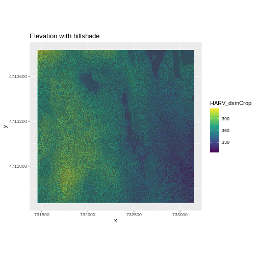

::::::::::::::::::::::::::::::::::::::: objectives

- Build customized plots for a single band raster using the `ggplot2` package.
- Layer a raster dataset on top of a hillshade to create an elegant basemap.

::::::::::::::::::::::::::::::::::::::::::::::::::

:::::::::::::::::::::::::::::::::::::::: questions

- How can I create categorized or customized maps of raster data?
- How can I customize the color scheme of a raster image?
- How can I layer raster data in a single image?

::::::::::::::::::::::::::::::::::::::::::::::::::


::::::::::::::::::::::::::::::::::::::::::  prereq

## Things You'll Need To Complete This Episode

See the [lesson homepage](.) for detailed information about the software,
data, and other prerequisites you will need to work through the examples in this episode.


::::::::::::::::::::::::::::::::::::::::::::::::::

## Plot Raster Data in R

This episode covers how to plot a raster in R using the `ggplot2`
package with customized coloring schemes.
It also covers how to layer a raster on top of a hillshade to produce an 
eloquent map. We will continue working with the Digital Surface Model (DSM) 
raster for the NEON Harvard Forest Field Site.

## Plotting Data Using Breaks

In the previous episode, we viewed our data using a continuous color ramp. For
clarity and visibility of the plot, we may prefer to view the data "symbolized" 
or colored according to ranges of values. This is comparable to a "classified"
map. To do this, we need to tell `ggplot` how many groups to break our data 
into, and where those breaks should be. To make these decisions, it is useful 
to first explore the distribution of the data using a bar plot. To begin with, 
we will use `dplyr`'s `mutate()` function combined with `cut()` to split the 
data into 3 bins.


```r
DSM_HARV_df <- DSM_HARV_df %>%
                mutate(fct_elevation = cut(HARV_dsmCrop, breaks = 3))

ggplot() +
    geom_bar(data = DSM_HARV_df, aes(fct_elevation))
```


If we want to know the cutoff values for the groups, we can ask for the unique 
values of `fct_elevation`:


```r
unique(DSM_HARV_df$fct_elevation)
```

```{.output}
[1] (379,416] (342,379] (305,342]
Levels: (305,342] (342,379] (379,416]
```

And we can get the count of values in each group using `dplyr`'s `group_by()` 
and `count()` functions:


```r
DSM_HARV_df %>%
        group_by(fct_elevation) %>%
        count()
```

```{.output}
# A tibble: 3 × 2
# Groups:   fct_elevation [3]
  fct_elevation       n
  <fct>           <int>
1 (305,342]      418891
2 (342,379]     1530073
3 (379,416]      370835
```

We might prefer to customize the cutoff values for these groups.
Lets round the cutoff values so that we have groups for the ranges of
301–350 m, 351–400 m, and 401–450 m.
To implement this we will give `mutate()` a numeric vector of break points 
instead of the number of breaks we want.


```r
custom_bins <- c(300, 350, 400, 450)

DSM_HARV_df <- DSM_HARV_df %>%
  mutate(fct_elevation_2 = cut(HARV_dsmCrop, breaks = custom_bins))

unique(DSM_HARV_df$fct_elevation_2)
```

```{.output}
[1] (400,450] (350,400] (300,350]
Levels: (300,350] (350,400] (400,450]
```

:::::::::::::::::::::::::::::::::::::::::  callout

## Data Tips

Note that when we assign break values a set of 4 values will result in 3 bins 
of data.

The bin intervals are shown using `(` to mean exclusive and `]` to mean 
inclusive. For example: `(305, 342]` means "from 306 through 342".


::::::::::::::::::::::::::::::::::::::::::::::::::

And now we can plot our bar plot again, using the new groups:


```r
ggplot() +
  geom_bar(data = DSM_HARV_df, aes(fct_elevation_2))
```


And we can get the count of values in each group in the same way we did before:


```r
DSM_HARV_df %>%
  group_by(fct_elevation_2) %>%
  count()
```

```{.output}
# A tibble: 3 × 2
# Groups:   fct_elevation_2 [3]
  fct_elevation_2       n
  <fct>             <int>
1 (300,350]        741815
2 (350,400]       1567316
3 (400,450]         10668
```

We can use those groups to plot our raster data, with each group being a 
different color:


```r
ggplot() +
  geom_raster(data = DSM_HARV_df , aes(x = x, y = y, fill = fct_elevation_2)) + 
  coord_quickmap()
```


The plot above uses the default colors inside `ggplot` for raster objects.
We can specify our own colors to make the plot look a little nicer.
R has a built in set of colors for plotting terrain, which are built in
to the `terrain.colors()` function.
Since we have three bins, we want to create a 3-color palette:


```r
terrain.colors(3)
```

```{.output}
[1] "#00A600" "#ECB176" "#F2F2F2"
```

The `terrain.colors()` function returns *hex colors* -
each of these character strings represents a color.
To use these in our map, we pass them across using the
`scale_fill_manual()` function.


```r
ggplot() +
 geom_raster(data = DSM_HARV_df , aes(x = x, y = y,
                                      fill = fct_elevation_2)) + 
    scale_fill_manual(values = terrain.colors(3)) + 
    coord_quickmap()
```


### More Plot Formatting

If we need to create multiple plots using the same color palette, we can create
an R object (`my_col`) for the set of colors that we want to use. We can then
quickly change the palette across all plots by modifying the `my_col` object, 
rather than each individual plot.

We can label the x- and y-axes of our plot too using `xlab` and `ylab`.
We can also give the legend a more meaningful title by passing a value
to the `name` argument of the `scale_fill_manual()` function.


```r
my_col <- terrain.colors(3)

ggplot() +
 geom_raster(data = DSM_HARV_df , aes(x = x, y = y,
                                      fill = fct_elevation_2)) + 
    scale_fill_manual(values = my_col, name = "Elevation") + 
    coord_quickmap()
```


Or we can also turn off the labels of both axes by passing `element_blank()` to
the relevant part of the `theme()` function.


```r
ggplot() +
 geom_raster(data = DSM_HARV_df , aes(x = x, y = y,
                                      fill = fct_elevation_2)) + 
    scale_fill_manual(values = my_col, name = "Elevation") +
    theme(axis.title = element_blank()) + 
    coord_quickmap()
```


:::::::::::::::::::::::::::::::::::::::  challenge

## Challenge: Plot Using Custom Breaks

Create a plot of the Harvard Forest Digital Surface Model (DSM) that has:

1. Six classified ranges of values (break points) that are evenly divided among 
   the range of pixel values.
2. Axis labels.
3. A plot title.

:::::::::::::::  solution

## Answers


```r
DSM_HARV_df <- DSM_HARV_df  %>%
               mutate(fct_elevation_6 = cut(HARV_dsmCrop, breaks = 6)) 

 my_col <- terrain.colors(6)

ggplot() +
    geom_raster(data = DSM_HARV_df , aes(x = x, y = y,
                                      fill = fct_elevation_6)) + 
    scale_fill_manual(values = my_col, name = "Elevation") + 
    ggtitle("Classified Elevation Map - NEON Harvard Forest Field Site") +
    xlab("UTM Easting Coordinate (m)") +
    ylab("UTM Northing Coordinate (m)") + 
    coord_quickmap()
```


:::::::::::::::::::::::::

::::::::::::::::::::::::::::::::::::::::::::::::::

## Layering Rasters

We can layer a raster on top of a hillshade raster for the same area, and use a
transparency factor to create a 3-dimensional shaded effect. A
hillshade is a raster that maps the shadows and texture that you would see from
above when viewing terrain.
We will add a custom color, making the plot grey.

First we need to read in our DSM hillshade data and view the structure:


```r
DSM_hill_HARV <-
  rast("data/NEON-DS-Airborne-Remote-Sensing/HARV/DSM/HARV_DSMhill.tif")

DSM_hill_HARV
```

```{.output}
class       : SpatRaster 
dimensions  : 1367, 1697, 1  (nrow, ncol, nlyr)
resolution  : 1, 1  (x, y)
extent      : 731453, 733150, 4712471, 4713838  (xmin, xmax, ymin, ymax)
coord. ref. : WGS 84 / UTM zone 18N (EPSG:32618) 
source      : HARV_DSMhill.tif 
name        : HARV_DSMhill 
min value   :   -0.7136298 
max value   :    0.9999997 
```

Next we convert it to a dataframe, so that we can plot it using `ggplot2`:


```r
DSM_hill_HARV_df <- as.data.frame(DSM_hill_HARV, xy = TRUE) 

str(DSM_hill_HARV_df)
```

```{.output}
'data.frame':	2313675 obs. of  3 variables:
 $ x           : num  731454 731456 731456 731458 731458 ...
 $ y           : num  4713836 4713836 4713836 4713836 4713836 ...
 $ HARV_DSMhill: num  -0.15567 0.00743 0.86989 0.9791 0.96283 ...
```

Now we can plot the hillshade data:


```r
ggplot() +
  geom_raster(data = DSM_hill_HARV_df,
              aes(x = x, y = y, alpha = HARV_DSMhill)) + 
  scale_alpha(range =  c(0.15, 0.65), guide = "none") + 
  coord_quickmap()
```


:::::::::::::::::::::::::::::::::::::::::  callout

## Data Tips

Turn off, or hide, the legend on a plot by adding `guide = "none"`
to a `scale_something()` function or by setting
`theme(legend.position = "none")`.

The alpha value determines how transparent the colors will be (0 being
transparent, 1 being opaque).


::::::::::::::::::::::::::::::::::::::::::::::::::

We can layer another raster on top of our hillshade by adding another call to
the `geom_raster()` function. Let's overlay `DSM_HARV` on top of the `hill_HARV`.


```r
ggplot() +
  geom_raster(data = DSM_HARV_df , 
              aes(x = x, y = y, 
                  fill = HARV_dsmCrop)) + 
  geom_raster(data = DSM_hill_HARV_df, 
              aes(x = x, y = y, 
                  alpha = HARV_DSMhill)) +  
  scale_fill_viridis_c() +  
  scale_alpha(range = c(0.15, 0.65), guide = "none") +  
  ggtitle("Elevation with hillshade") +
  coord_quickmap()
```



:::::::::::::::::::::::::::::::::::::::  challenge

## Challenge: Create DTM \& DSM for SJER

Use the files in the `data/NEON-DS-Airborne-Remote-Sensing/SJER/` directory to 
create a Digital Terrain Model map and Digital Surface Model map of the San 
Joaquin Experimental Range field site.

Make sure to:

- include hillshade in the maps,
- label axes on the DSM map and exclude them from the DTM map,
- include a title for each map,
- experiment with various alpha values and color palettes to represent the
  data.

:::::::::::::::  solution

## Answers


```r
# CREATE DSM MAPS

# import DSM data
DSM_SJER <- 
  rast("data/NEON-DS-Airborne-Remote-Sensing/SJER/DSM/SJER_dsmCrop.tif")
# convert to a df for plotting
DSM_SJER_df <- as.data.frame(DSM_SJER, xy = TRUE)

# import DSM hillshade
DSM_hill_SJER <- 
  rast("data/NEON-DS-Airborne-Remote-Sensing/SJER/DSM/SJER_dsmHill.tif")
# convert to a df for plotting
DSM_hill_SJER_df <- as.data.frame(DSM_hill_SJER, xy = TRUE)

# Build Plot
ggplot() +
    geom_raster(data = DSM_SJER_df , 
                aes(x = x, y = y, 
                     fill = SJER_dsmCrop,
                     alpha = 0.8)
                ) + 
    geom_raster(data = DSM_hill_SJER_df, 
                aes(x = x, y = y, 
                  alpha = SJER_dsmHill)
                ) +
    scale_fill_viridis_c() +
    guides(fill = guide_colorbar()) +
    scale_alpha(range = c(0.4, 0.7), guide = "none") +
    # remove grey background and grid lines
    theme_bw() + 
    theme(panel.grid.major = element_blank(), 
          panel.grid.minor = element_blank()) +
    xlab("UTM Easting Coordinate (m)") +
    ylab("UTM Northing Coordinate (m)") +
    ggtitle("DSM with Hillshade") +
    coord_quickmap()
```


```r
# CREATE DTM MAP
# import DTM
DTM_SJER <- 
  rast("data/NEON-DS-Airborne-Remote-Sensing/SJER/DTM/SJER_dtmCrop.tif")
DTM_SJER_df <- as.data.frame(DTM_SJER, xy = TRUE)

# DTM Hillshade
DTM_hill_SJER <- 
  rast("data/NEON-DS-Airborne-Remote-Sensing/SJER/DTM/SJER_dtmHill.tif")
DTM_hill_SJER_df <- as.data.frame(DTM_hill_SJER, xy = TRUE)

ggplot() +
    geom_raster(data = DTM_SJER_df ,
                aes(x = x, y = y,
                     fill = SJER_dtmCrop,
                     alpha = 2.0)
                ) +
    geom_raster(data = DTM_hill_SJER_df,
                aes(x = x, y = y,
                  alpha = SJER_dtmHill)
                ) +
    scale_fill_viridis_c() +
    guides(fill = guide_colorbar()) +
    scale_alpha(range = c(0.4, 0.7), guide = "none") +
    theme_bw() +
    theme(panel.grid.major = element_blank(), 
          panel.grid.minor = element_blank()) +
    theme(axis.title.x = element_blank(),
          axis.title.y = element_blank()) +
    ggtitle("DTM with Hillshade") +
    coord_quickmap()
```


:::::::::::::::::::::::::

::::::::::::::::::::::::::::::::::::::::::::::::::


:::::::::::::::::::::::::::::::::::::::: keypoints

- Continuous data ranges can be grouped into categories using `mutate()` and `cut()`.
- Use built-in `terrain.colors()` or set your preferred color scheme manually.
- Layer rasters on top of one another by using the `alpha` aesthetic.

::::::::::::::::::::::::::::::::::::::::::::::::::


