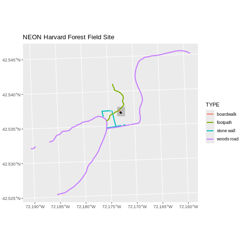
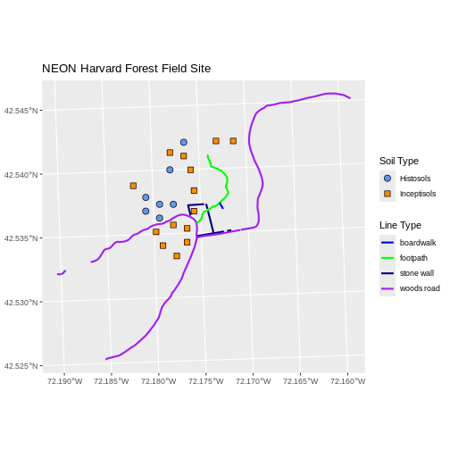

::::::::::::::::::::::::::::::::::::::: objectives

- Plot multiple vector layers in the same plot.
- Apply custom symbols to spatial objects in a plot.
- Create a multi-layered plot with raster and vector data.

::::::::::::::::::::::::::::::::::::::::::::::::::

:::::::::::::::::::::::::::::::::::::::: questions

- How can I create map compositions with custom legends using ggplot?
- How can I plot raster and vector data together?

::::::::::::::::::::::::::::::::::::::::::::::::::


::::::::::::::::::::::::::::::::::::::::::  prereq

## Things You'll Need To Complete This Episode

See the [lesson homepage](.) for detailed information about the software, data,
and other prerequisites you will need to work through the examples in this
episode.


::::::::::::::::::::::::::::::::::::::::::::::::::

This episode builds upon
[the previous episode](07-vector-shapefile-attributes-in-r/)
to work with vector layers in R and explore how to plot multiple
vector layers. It also covers how to plot raster and vector data together on the
same plot.

## Load the Data

To work with vector data in R, we can use the `sf` library. The `terra`
package also allows us to explore metadata using similar commands for both
raster and vector files. Make sure that you have these packages loaded.

We will continue to work with the three ESRI `shapefile` that we loaded in the
[Open and Plot Vector Layers in R](06-vector-open-shapefile-in-r/) episode.

## Plotting Multiple Vector Layers

In the [previous episode](07-vector-shapefile-attributes-in-r/), we learned how
to plot information from a single vector layer and do some plot customization
including adding a custom legend. However, what if we want to create a more
complex plot with many vector layers and unique symbols that need to be
represented clearly in a legend?

Now, let's create a plot that combines our tower location (`point_HARV`), site
boundary (`aoi_boundary_HARV`) and roads (`lines_HARV`) spatial objects. We
will need to build a custom legend as well.

To begin, we will create a plot with the site boundary as the first layer. Then
layer the tower location and road data on top using `+`.


```r
ggplot() +
  geom_sf(data = aoi_boundary_HARV, fill = "grey", color = "grey") +
  geom_sf(data = lines_HARV, aes(color = TYPE), size = 1) +
  geom_sf(data = point_HARV) +
  ggtitle("NEON Harvard Forest Field Site") +
  coord_sf()
```



Next, let's build a custom legend using the symbology (the colors and symbols)
that we used to create the plot above. For example, it might be good if the
lines were symbolized as lines. In the previous episode, you may have noticed
that the default legend behavior for `geom_sf` is to draw a 'patch' for each
legend entry. If you want the legend to draw lines or points, you need to add
an instruction to the `geom_sf` call - in this case, `show.legend = 'line'`.


```r
ggplot() +
  geom_sf(data = aoi_boundary_HARV, fill = "grey", color = "grey") +
  geom_sf(data = lines_HARV, aes(color = TYPE),
          show.legend = "line", size = 1) +
  geom_sf(data = point_HARV, aes(fill = Sub_Type), color = "black") +
  scale_color_manual(values = road_colors) +
  scale_fill_manual(values = "black") +
  ggtitle("NEON Harvard Forest Field Site") +
  coord_sf()
```


Now lets adjust the legend titles by passing a `name` to the respective `color`
and `fill` palettes.


```r
ggplot() +
  geom_sf(data = aoi_boundary_HARV, fill = "grey", color = "grey") +
  geom_sf(data = point_HARV, aes(fill = Sub_Type)) +
  geom_sf(data = lines_HARV, aes(color = TYPE), show.legend = "line",
          size = 1) +
  scale_color_manual(values = road_colors, name = "Line Type") +
  scale_fill_manual(values = "black", name = "Tower Location") +
  ggtitle("NEON Harvard Forest Field Site") +
  coord_sf()
```


Finally, it might be better if the points were symbolized as a symbol. We can
customize this using `shape` parameters in our call to `geom_sf`: 16 is a point
symbol, 15 is a box.

:::::::::::::::::::::::::::::::::::::::::  callout

## Data Tip

To view a short list of `shape` symbols,
type `?pch` into the R console.


::::::::::::::::::::::::::::::::::::::::::::::::::


```r
ggplot() +
  geom_sf(data = aoi_boundary_HARV, fill = "grey", color = "grey") +
  geom_sf(data = point_HARV, aes(fill = Sub_Type), shape = 15) +
  geom_sf(data = lines_HARV, aes(color = TYPE),
          show.legend = "line", size = 1) +
  scale_color_manual(values = road_colors, name = "Line Type") +
  scale_fill_manual(values = "black", name = "Tower Location") +
  ggtitle("NEON Harvard Forest Field Site") +
  coord_sf()
```


:::::::::::::::::::::::::::::::::::::::  challenge

## Challenge: Plot Polygon by Attribute

1. Using the `NEON-DS-Site-Layout-Files/HARV/PlotLocations_HARV.shp` ESRI `shapefile`,
  create a map of study plot locations, with each point colored by the soil
  type (`soilTypeOr`). How many different soil types are there at this
  particular field site? Overlay this layer on top of the `lines_HARV` layer
  (the roads). Create a custom legend that applies line symbols to lines and
  point symbols to the points.

2. Modify the plot above. Tell R to plot each point, using a different symbol
   of `shape` value.

:::::::::::::::  solution

## Answers

First we need to read in the data and see how many unique soils are represented
in the `soilTypeOr` attribute.


```r
plot_locations <-
  st_read("data/NEON-DS-Site-Layout-Files/HARV/PlotLocations_HARV.shp")
```

```{.output}
Reading layer `PlotLocations_HARV' from data source 
  `/home/runner/work/r-raster-vector-geospatial/r-raster-vector-geospatial/site/built/data/NEON-DS-Site-Layout-Files/HARV/PlotLocations_HARV.shp' 
  using driver `ESRI Shapefile'
Simple feature collection with 21 features and 25 fields
Geometry type: POINT
Dimension:     XY
Bounding box:  xmin: 731405.3 ymin: 4712845 xmax: 732275.3 ymax: 4713846
Projected CRS: WGS 84 / UTM zone 18N
```

```r
plot_locations$soilTypeOr <- as.factor(plot_locations$soilTypeOr)
levels(plot_locations$soilTypeOr)
```

```{.output}
[1] "Histosols"   "Inceptisols"
```

Next we can create a new color palette with one color for each soil type.


```r
blue_orange <- c("cornflowerblue", "darkorange")
```

Finally, we will create our plot.


```r
ggplot() +
  geom_sf(data = lines_HARV, aes(color = TYPE), show.legend = "line") +
  geom_sf(data = plot_locations, aes(fill = soilTypeOr),
          shape = 21, show.legend = 'point') +
  scale_color_manual(name = "Line Type", values = road_colors,
     guide = guide_legend(override.aes = list(linetype = "solid",
                                              shape = NA))) +
  scale_fill_manual(name = "Soil Type", values = blue_orange,
     guide = guide_legend(override.aes = list(linetype = "blank", shape = 21,
                                              colour = NA))) +
  ggtitle("NEON Harvard Forest Field Site") +
  coord_sf()
```


If we want each soil to be shown with a different symbol, we can give multiple
values to the `scale_shape_manual()` argument.


```r
ggplot() +
  geom_sf(data = lines_HARV, aes(color = TYPE), show.legend = "line", size = 1) +
  geom_sf(data = plot_locations, aes(fill = soilTypeOr, shape = soilTypeOr),
          show.legend = 'point', size = 3) +
  scale_shape_manual(name = "Soil Type", values = c(21, 22)) +
  scale_color_manual(name = "Line Type", values = road_colors,
     guide = guide_legend(override.aes = list(linetype = "solid", shape = NA))) +
  scale_fill_manual(name = "Soil Type", values = blue_orange,
     guide = guide_legend(override.aes = list(linetype = "blank", shape = c(21, 22),
     color = blue_orange))) +
  ggtitle("NEON Harvard Forest Field Site") +
  coord_sf()
```



:::::::::::::::::::::::::

::::::::::::::::::::::::::::::::::::::::::::::::::

:::::::::::::::::::::::::::::::::::::::  challenge

## Challenge: Plot Raster \& Vector Data Together

You can plot vector data layered on top of raster data using the `+` to add a
layer in `ggplot`. Create a plot that uses the NEON AOI Canopy Height Model
`data/NEON-DS-Airborne-Remote-Sensing/HARV/CHM/HARV_chmCrop.tif` as a base
layer. On top of the CHM, please add:

- The study site AOI.
- Roads.
- The tower location.

Be sure to give your plot a meaningful title.

:::::::::::::::  solution

## Answers


```r
ggplot() +
  geom_raster(data = CHM_HARV_df, aes(x = x, y = y, fill = HARV_chmCrop)) +
  geom_sf(data = lines_HARV, color = "black") +
  geom_sf(data = aoi_boundary_HARV, color = "grey20", size = 1) +
  geom_sf(data = point_HARV, pch = 8) +
  ggtitle("NEON Harvard Forest Field Site w/ Canopy Height Model") +
  coord_sf()
```


:::::::::::::::::::::::::

::::::::::::::::::::::::::::::::::::::::::::::::::


:::::::::::::::::::::::::::::::::::::::: keypoints

- Use the `+` operator to add multiple layers to a ggplot.
- Multi-layered plots can combine raster and vector datasets.
- Use the `show.legend` argument to set legend symbol types.
- Use the `scale_fill_manual()` function to set legend colors.

::::::::::::::::::::::::::::::::::::::::::::::::::


