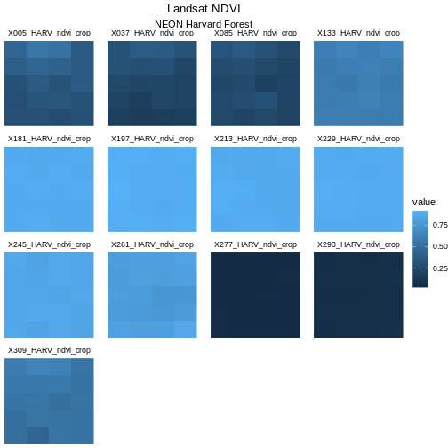
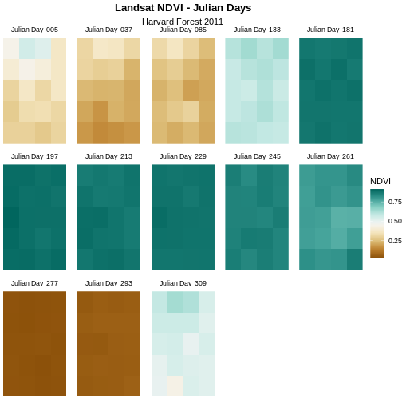

::::::::::::::::::::::::::::::::::::::: objectives

- Assign custom names to bands in a RasterStack.
- Customize raster plots using the `ggplot2` package.

::::::::::::::::::::::::::::::::::::::::::::::::::

:::::::::::::::::::::::::::::::::::::::: questions

- How can I create a publication-quality graphic and customize plot parameters?

::::::::::::::::::::::::::::::::::::::::::::::::::


::::::::::::::::::::::::::::::::::::::::::  prereq

## Things You'll Need To Complete This Episode

See the [lesson homepage](.) for detailed information about the software, data, 
and other prerequisites you will need to work through the examples in this 
episode.


::::::::::::::::::::::::::::::::::::::::::::::::::

This episode covers how to customize your raster plots using the `ggplot2` 
package in R to create publication-quality plots.

## Before and After

In [the previous episode](12-time-series-raster/), we learned how to plot 
multi-band raster data in R using the `facet_wrap()` function. This created a 
separate panel in our plot for each raster band. The plot we created together 
is shown below:


Although this plot is informative, it isn't something we would expect to see in 
a journal publication. The x and y-axis labels aren't informative. There is a 
lot of unnecessary gray background and the titles of each panel don't clearly 
state that the number refers to the Julian day the data was collected. In this
episode, we will customize this plot above to produce a publication quality 
graphic. We will go through these steps iteratively. When we're done, we will 
have created the plot shown below.


## Adjust the Plot Theme

The first thing we will do to our plot remove the x and y-axis labels and axis 
ticks, as these are unnecessary and make our plot look messy. We can do this by 
setting the plot theme to `void`.


```r
ggplot() +
  geom_raster(data = NDVI_HARV_stack_df , aes(x = x, y = y, fill = value)) +
  facet_wrap(~variable) +
  ggtitle("Landsat NDVI", subtitle = "NEON Harvard Forest") + 
  theme_void()
```


Next we will center our plot title and subtitle. We need to do this **after** 
the `theme_void()` layer, because R interprets the `ggplot` layers in order. If 
we first tell R to center our plot title, and then set the theme to `void`, any 
adjustments we've made to the plot theme will be over-written by the 
`theme_void()` function. So first we make the theme `void` and then we center 
the title. We center both the title and subtitle by using the `theme()` 
function and setting the `hjust` parameter to 0.5. The `hjust` parameter stands 
for "horizontal justification" and takes any value between 0 and 1. A setting 
of 0 indicates left justification and a setting of 1 indicates right 
justification.


```r
ggplot() +
  geom_raster(data = NDVI_HARV_stack_df , aes(x = x, y = y, fill = value)) +
  facet_wrap(~variable) +
  ggtitle("Landsat NDVI", subtitle = "NEON Harvard Forest") + 
  theme_void() + 
  theme(plot.title = element_text(hjust = 0.5),
        plot.subtitle = element_text(hjust = 0.5))
```



:::::::::::::::::::::::::::::::::::::::  challenge

## Challenge

Change the plot title (but not the subtitle) to bold font. You can (and 
should!) use the help menu in RStudio or any internet resources to figure out 
how to change this setting.

:::::::::::::::  solution

## Answers

Learners can find this information in the help files for the `theme()`
function. The parameter to set is called `face`.


```r
ggplot() +
  geom_raster(data = NDVI_HARV_stack_df,
              aes(x = x, y = y, fill = value)) +
  facet_wrap(~ variable) +
  ggtitle("Landsat NDVI", subtitle = "NEON Harvard Forest") + 
  theme_void() + 
  theme(plot.title = element_text(hjust = 0.5, face = "bold"), 
        plot.subtitle = element_text(hjust = 0.5))
```


:::::::::::::::::::::::::

::::::::::::::::::::::::::::::::::::::::::::::::::

## Adjust the Color Ramp

Next, let's adjust the color ramp used to render the rasters. First, we can
change the blue color ramp to a green one that is more visually suited to our
NDVI (greenness) data using the `colorRampPalette()` function in combination
with `colorBrewer` which requires loading the `RColorBrewer` library. Then we 
use `scale_fill_gradientn` to pass the list of colours (here 20 different 
colours) to ggplot.

First we need to create a set of colors to use. We will select a set of nine 
colors from the "YlGn" (yellow-green) color palette. This returns a set of hex 
color codes:


```r
library(RColorBrewer)
brewer.pal(9, "YlGn")
```

```{.output}
[1] "#FFFFE5" "#F7FCB9" "#D9F0A3" "#ADDD8E" "#78C679" "#41AB5D" "#238443"
[8] "#006837" "#004529"
```

Then we will pass those color codes to the `colorRampPalette` function, which
will interpolate from those colors a more nuanced color range.


```r
green_colors <- brewer.pal(9, "YlGn") %>%
  colorRampPalette()
```

We can tell the `colorRampPalette()` function how many discrete colors within 
this color range to create. In our case, we will use 20 colors when we plot our 
graphic.


```r
ggplot() +
  geom_raster(data = NDVI_HARV_stack_df , aes(x = x, y = y, fill = value)) +
  facet_wrap(~variable) +
  ggtitle("Landsat NDVI", subtitle = "NEON Harvard Forest") + 
  theme_void() + 
  theme(plot.title = element_text(hjust = 0.5, face = "bold"), 
    plot.subtitle = element_text(hjust = 0.5)) + 
  scale_fill_gradientn(name = "NDVI", colours = green_colors(20))
```


The yellow to green color ramp visually represents NDVI well given it's a
measure of greenness. Someone looking at the plot can quickly understand that
pixels that are more green have a higher NDVI value.

:::::::::::::::::::::::::::::::::::::::::  callout

## Data Tip

For all of the `brewer.pal` ramp names see the 
[brewerpal page](https://www.datavis.ca/sasmac/brewerpal.html).


::::::::::::::::::::::::::::::::::::::::::::::::::

:::::::::::::::::::::::::::::::::::::::::  callout

## Data Tip

Cynthia Brewer, the creator of ColorBrewer, offers an online tool to help 
choose suitable color ramps, or to create your own. 
[ColorBrewer 2.0; Color Advise for Cartography](https://colorbrewer2.org/)


::::::::::::::::::::::::::::::::::::::::::::::::::

## Refine Plot \& Tile Labels

Next, let's label each panel in our plot with the Julian day that the raster 
data for that panel was collected. The current names come from the band "layer 
names"" stored in the `RasterStack` and the first part of each name is the 
Julian day.

To create a more meaningful label we can remove the "x" and replace it with
"day" using the `gsub()` function in R. The syntax is as follows:
`gsub("StringToReplace", "TextToReplaceIt", object)`.

First let's remove "\_HARV\_NDVI\_crop" from each label to make the labels
shorter and remove repetition. To illustrate how this works, we will first
look at the names for our `NDVI_HARV_stack` object:


```r
names(NDVI_HARV_stack)
```

```{.output}
 [1] "X005_HARV_ndvi_crop" "X037_HARV_ndvi_crop" "X085_HARV_ndvi_crop"
 [4] "X133_HARV_ndvi_crop" "X181_HARV_ndvi_crop" "X197_HARV_ndvi_crop"
 [7] "X213_HARV_ndvi_crop" "X229_HARV_ndvi_crop" "X245_HARV_ndvi_crop"
[10] "X261_HARV_ndvi_crop" "X277_HARV_ndvi_crop" "X293_HARV_ndvi_crop"
[13] "X309_HARV_ndvi_crop"
```

Now we will use the `gsub()` function to find the character string
"\_HARV\_ndvi\_crop" and replace it with a blank string (""). We will assign 
this output to a new object (`raster_names`) and look at that object to make 
sure our code is doing what we want it to.


```r
raster_names <- names(NDVI_HARV_stack)

raster_names <- gsub("_HARV_ndvi_crop", "", raster_names)
raster_names
```

```{.output}
 [1] "X005" "X037" "X085" "X133" "X181" "X197" "X213" "X229" "X245" "X261"
[11] "X277" "X293" "X309"
```

So far so good. Now we will use `gsub()` again to replace the "X" with the word
"Day" followed by a space.


```r
raster_names  <- gsub("X", "Day ", raster_names)
raster_names
```

```{.output}
 [1] "Day 005" "Day 037" "Day 085" "Day 133" "Day 181" "Day 197" "Day 213"
 [8] "Day 229" "Day 245" "Day 261" "Day 277" "Day 293" "Day 309"
```

Our labels look good now. Let's reassign them to our `all_NDVI_HARV` object:


```r
labels_names <- setNames(raster_names, unique(NDVI_HARV_stack_df$variable))
```

Once the names for each band have been reassigned, we can render our plot with
the new labels using a`labeller`.


```r
ggplot() +
  geom_raster(data = NDVI_HARV_stack_df , aes(x = x, y = y, fill = value)) +
  facet_wrap(~variable, labeller = labeller(variable = labels_names)) +
  ggtitle("Landsat NDVI", subtitle = "NEON Harvard Forest") + 
  theme_void() + 
  theme(plot.title = element_text(hjust = 0.5, face = "bold"), 
    plot.subtitle = element_text(hjust = 0.5)) + 
  scale_fill_gradientn(name = "NDVI", colours = green_colors(20))
```


## Change Layout of Panels

We can adjust the columns of our plot by setting the number of columns `ncol`
and the number of rows `nrow` in `facet_wrap`. Let's make our plot so that it 
has a width of five panels.


```r
ggplot() +
  geom_raster(data = NDVI_HARV_stack_df , aes(x = x, y = y, fill = value)) +
  facet_wrap(~variable, ncol = 5, 
             labeller = labeller(variable = labels_names)) +
  ggtitle("Landsat NDVI", subtitle = "NEON Harvard Forest") + 
  theme_void() + 
  theme(plot.title = element_text(hjust = 0.5, face = "bold"), 
    plot.subtitle = element_text(hjust = 0.5)) + 
  scale_fill_gradientn(name = "NDVI", colours = green_colors(20))
```


Now we have a beautiful, publication quality plot!

:::::::::::::::::::::::::::::::::::::::  challenge

## Challenge: Divergent Color Ramps

When we used the `gsub()` function to modify the tile labels we replaced the 
beginning of each tile title with "Day". A more descriptive name could be 
"Julian Day". Update the plot above with the following changes:

1. Label each tile "Julian Day" with the julian day value following.
2. Change the color ramp to a divergent brown to green color ramp.

**Questions:**
Does having a divergent color ramp represent the data better than a sequential 
color ramp (like "YlGn")? Can you think of other data sets where a divergent 
color ramp may be best?

:::::::::::::::  solution

## Answers


```r
raster_names  <- gsub("Day","Julian Day ", raster_names)
labels_names <- setNames(raster_names, unique(NDVI_HARV_stack_df$variable))

brown_green_colors <- colorRampPalette(brewer.pal(9, "BrBG"))

ggplot() +
  geom_raster(data = NDVI_HARV_stack_df , aes(x = x, y = y, fill = value)) +
  facet_wrap(~variable, ncol = 5, labeller = labeller(variable = labels_names)) +
  ggtitle("Landsat NDVI - Julian Days", subtitle = "Harvard Forest 2011") +
  theme_void() +
  theme(plot.title = element_text(hjust = 0.5, face = "bold"), 
  plot.subtitle = element_text(hjust = 0.5)) +
  scale_fill_gradientn(name = "NDVI", colours = brown_green_colors(20))
```



For NDVI data, the sequential color ramp is better than the divergent as it is
more akin to the process of greening up, which starts off at one end and just 
keeps increasing.


:::::::::::::::::::::::::

::::::::::::::::::::::::::::::::::::::::::::::::::


:::::::::::::::::::::::::::::::::::::::: keypoints

- Use the `theme_void()` function for a clean background to your plot.
- Use the `element_text()` function to adjust text size, font, and position.
- Use the `brewer.pal()` function to create a custom color palette.
- Use the `gsub()` function to do pattern matching and replacement in text.

::::::::::::::::::::::::::::::::::::::::::::::::::


