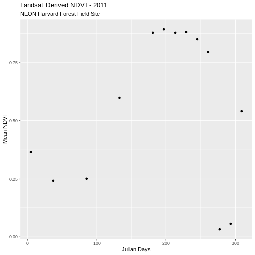
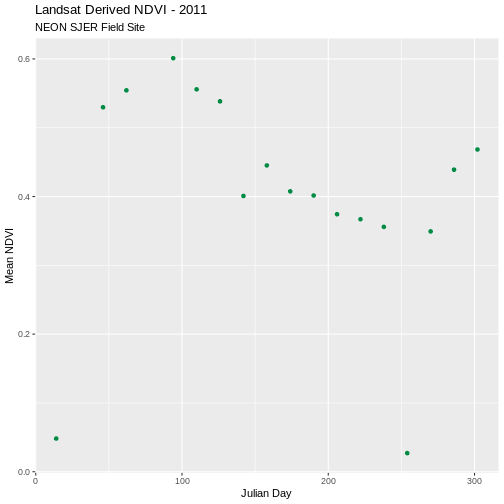

::::::::::::::::::::::::::::::::::::::: objectives

- Extract summary pixel values from a raster.
- Save summary values to a .csv file.
- Plot summary pixel values using `ggplot()`.
- Compare NDVI values between two different sites.

::::::::::::::::::::::::::::::::::::::::::::::::::

:::::::::::::::::::::::::::::::::::::::: questions

- How can I calculate, extract, and export summarized raster pixel data?

::::::::::::::::::::::::::::::::::::::::::::::::::


::::::::::::::::::::::::::::::::::::::::::  prereq

## Things You'll Need To Complete This Episode

See the [lesson homepage](.) for detailed information about the software, data, 
and other prerequisites you will need to work through the examples in this 
episode.


::::::::::::::::::::::::::::::::::::::::::::::::::

In this episode, we will extract NDVI values from a raster time series dataset 
and plot them using the `ggplot2` package.

## Extract Summary Statistics From Raster Data

We often want to extract summary values from raster data. For example, we might 
want to understand overall greeness across a field site or at each plot within 
a field site. These values can then be compared between different field sites 
and combined with other related metrics to support modeling and further 
analysis.

## Calculate Average NDVI

Our goal in this episode is to create a dataframe that contains a single, mean 
NDVI value for each raster in our time series. This value represents the mean 
NDVI value for this area on a given day.

We can calculate the mean for each raster using the `global()` function. The
`global()` function produces a named numeric vector, where each value is 
associated with the name of raster stack it was derived from.


```r
avg_NDVI_HARV <- global(NDVI_HARV_stack, mean)
avg_NDVI_HARV
```

```{.output}
                        mean
X005_HARV_ndvi_crop 0.365150
X037_HARV_ndvi_crop 0.242645
X085_HARV_ndvi_crop 0.251390
X133_HARV_ndvi_crop 0.599300
X181_HARV_ndvi_crop 0.878725
X197_HARV_ndvi_crop 0.893250
X213_HARV_ndvi_crop 0.878395
X229_HARV_ndvi_crop 0.881505
X245_HARV_ndvi_crop 0.850120
X261_HARV_ndvi_crop 0.796360
X277_HARV_ndvi_crop 0.033050
X293_HARV_ndvi_crop 0.056895
X309_HARV_ndvi_crop 0.541130
```

The output is a data frame (othewise, we could use `as.data.frame()`). It's a 
good idea to view the first few rows of our data frame with `head()` to make 
sure the structure is what we expect.


```r
head(avg_NDVI_HARV)
```

```{.output}
                        mean
X005_HARV_ndvi_crop 0.365150
X037_HARV_ndvi_crop 0.242645
X085_HARV_ndvi_crop 0.251390
X133_HARV_ndvi_crop 0.599300
X181_HARV_ndvi_crop 0.878725
X197_HARV_ndvi_crop 0.893250
```

We now have a data frame with row names that are based on the original file 
name and a mean NDVI value for each file. Next, let's clean up the column names 
in our data frame to make it easier for colleagues to work with our code.

 Let's change the NDVI column name to `meanNDVI`.


```r
names(avg_NDVI_HARV) <- "meanNDVI"
head(avg_NDVI_HARV)
```

```{.output}
                    meanNDVI
X005_HARV_ndvi_crop 0.365150
X037_HARV_ndvi_crop 0.242645
X085_HARV_ndvi_crop 0.251390
X133_HARV_ndvi_crop 0.599300
X181_HARV_ndvi_crop 0.878725
X197_HARV_ndvi_crop 0.893250
```

The new column name doesn't reminds us what site our data are from. While we 
are only working with one site now, we might want to compare several sites 
worth of data in the future. Let's add a column to our dataframe called "site".


```r
avg_NDVI_HARV$site <- "HARV"
```

We can populate this column with the site name - HARV. Let's also create a year 
column and populate it with 2011 - the year our data were collected.


```r
avg_NDVI_HARV$year <- "2011"
head(avg_NDVI_HARV)
```

```{.output}
                    meanNDVI site year
X005_HARV_ndvi_crop 0.365150 HARV 2011
X037_HARV_ndvi_crop 0.242645 HARV 2011
X085_HARV_ndvi_crop 0.251390 HARV 2011
X133_HARV_ndvi_crop 0.599300 HARV 2011
X181_HARV_ndvi_crop 0.878725 HARV 2011
X197_HARV_ndvi_crop 0.893250 HARV 2011
```

We now have a dataframe that contains a row for each raster file processed, and
columns for `meanNDVI`, `site`, and `year`.

## Extract Julian Day from row names

We'd like to produce a plot where Julian days (the numeric day of the year,
0 - 365/366) are on the x-axis and NDVI is on the y-axis. To create this plot,
we'll need a column that contains the Julian day value.

One way to create a Julian day column is to use `gsub()` on the file name in 
each row. We can replace both the `X` and the `_HARV_NDVI_crop` to extract the 
Julian Day value, just like we did in the 
[previous episode](13-plot-time-series-rasters-in-r/).

This time we will use one additional trick to do both of these steps at the 
same time. The vertical bar character ( `|` ) is equivalent to the word "or". 
Using this character in our search pattern allows us to search for more than 
one pattern in our text strings.


```r
julianDays <- gsub("X|_HARV_ndvi_crop", "", row.names(avg_NDVI_HARV))
julianDays
```

```{.output}
 [1] "005" "037" "085" "133" "181" "197" "213" "229" "245" "261" "277" "293"
[13] "309"
```

Now that we've extracted the Julian days from our row names, we can add that
data to the data frame as a column called "julianDay".


```r
avg_NDVI_HARV$julianDay <- julianDays
```

Let's check the class of this new column:


```r
class(avg_NDVI_HARV$julianDay)
```

```{.output}
[1] "character"
```

## Convert Julian Day to Date Class

Currently, the values in the Julian day column are stored as class `character`.
Storing this data as a date object is better - for plotting, data subsetting 
and working with our data. Let's convert. We worked with data conversions
[in an earlier episode](12-time-series-raster/). For an introduction to 
date-time classes, see the NEON Data Skills tutorial
[Convert Date \& Time Data from Character Class to Date-Time Class (POSIX) in R](https://www.neonscience.org/dc-convert-date-time-POSIX-r).

To convert a Julian day number to a date class, we need to set the origin, 
which is the day that our Julian days start counting from. Our data is from 
2011 and we know that the USGS Landsat Team created Julian day values for this 
year. Therefore, the first day or "origin" for our Julian day count is 01 
January 2011.


```r
origin <- as.Date("2011-01-01")
```

Next we convert the `julianDay` column from character to integer.


```r
avg_NDVI_HARV$julianDay <- as.integer(avg_NDVI_HARV$julianDay)
```

Once we set the Julian day origin, we can add the Julian day value (as an
integer) to the origin date.

Note that when we convert our integer class `julianDay` values to dates, we
subtracted 1.  This is because the origin day is 01 January 2011, so the 
extracted day is 01. The Julian Day (or year day) for this is also 01. When we 
convert from the integer 05 `julianDay` value (indicating 5th of January), we 
cannot simply add `origin + julianDay` because `01 + 05 = 06` or 06 January 
2011. To correct, this error we then subtract 1 to get the correct day, January 
05 2011.


```r
avg_NDVI_HARV$Date<- origin + (avg_NDVI_HARV$julianDay - 1)
head(avg_NDVI_HARV$Date)
```

```{.output}
[1] "2011-01-05" "2011-02-06" "2011-03-26" "2011-05-13" "2011-06-30"
[6] "2011-07-16"
```

Since the origin date was originally set as a Date class object, the new `Date`
column is also stored as class `Date`.


```r
class(avg_NDVI_HARV$Date)
```

```{.output}
[1] "Date"
```

:::::::::::::::::::::::::::::::::::::::  challenge

## Challenge: NDVI for the San Joaquin Experimental Range

We often want to compare two different sites. The National Ecological
Observatory Network (NEON) also has a field site in Southern California at the
[San Joaquin Experimental Range (SJER)](https://www.neonscience.org/field-sites/field-sites-map/SJER).

For this challenge, create a dataframe containing the mean NDVI values and the 
Julian days the data was collected (in date format) for the NEON San Joaquin 
Experimental Range field site. NDVI data for SJER are located in the
`NEON-DS-Landsat-NDVI/SJER/2011/NDVI` directory.

:::::::::::::::  solution

## Answers

First we will read in the NDVI data for the SJER field site.


```r
NDVI_path_SJER <- "data/NEON-DS-Landsat-NDVI/SJER/2011/NDVI"

all_NDVI_SJER <- list.files(NDVI_path_SJER,
                            full.names = TRUE,
                            pattern = ".tif$")

NDVI_stack_SJER <- rast(all_NDVI_SJER)
names(NDVI_stack_SJER) <- paste0("X", names(NDVI_stack_SJER))

NDVI_stack_SJER <- NDVI_stack_SJER/10000
```

Then we can calculate the mean values for each day and put that in a dataframe.


```r
avg_NDVI_SJER <- as.data.frame(global(NDVI_stack_SJER, mean))
```

Next we rename the NDVI column, and add site and year columns to our data.


```r
names(avg_NDVI_SJER) <- "meanNDVI"
avg_NDVI_SJER$site <- "SJER"
avg_NDVI_SJER$year <- "2011"
```

Now we will create our Julian day column


```r
julianDays_SJER <- gsub("X|_SJER_ndvi_crop", "", row.names(avg_NDVI_SJER))
origin <- as.Date("2011-01-01")
avg_NDVI_SJER$julianDay <- as.integer(julianDays_SJER)

avg_NDVI_SJER$Date <- origin + (avg_NDVI_SJER$julianDay - 1)

head(avg_NDVI_SJER)
```

```{.output}
                    meanNDVI site year julianDay       Date
X014_SJER_ndvi_crop 0.048216 SJER 2011        14 2011-01-14
X046_SJER_ndvi_crop 0.529780 SJER 2011        46 2011-02-15
X062_SJER_ndvi_crop 0.554368 SJER 2011        62 2011-03-03
X094_SJER_ndvi_crop 0.601096 SJER 2011        94 2011-04-04
X110_SJER_ndvi_crop 0.555836 SJER 2011       110 2011-04-20
X126_SJER_ndvi_crop 0.538336 SJER 2011       126 2011-05-06
```

:::::::::::::::::::::::::

::::::::::::::::::::::::::::::::::::::::::::::::::

## Plot NDVI Using ggplot

We now have a clean dataframe with properly scaled NDVI and Julian days. Let's
plot our data.


```r
ggplot(avg_NDVI_HARV, aes(julianDay, meanNDVI)) +
  geom_point() +
  ggtitle("Landsat Derived NDVI - 2011", 
          subtitle = "NEON Harvard Forest Field Site") +
  xlab("Julian Days") + ylab("Mean NDVI")
```



:::::::::::::::::::::::::::::::::::::::  challenge

## Challenge: Plot San Joaquin Experimental Range Data

Create a complementary plot for the SJER data. Plot the data points in a
different color.

:::::::::::::::  solution

## Answers


```r
ggplot(avg_NDVI_SJER, aes(julianDay, meanNDVI)) +
  geom_point(colour = "SpringGreen4") +
  ggtitle("Landsat Derived NDVI - 2011", subtitle = "NEON SJER Field Site") +
  xlab("Julian Day") + ylab("Mean NDVI")
```



:::::::::::::::::::::::::

::::::::::::::::::::::::::::::::::::::::::::::::::

## Compare NDVI from Two Different Sites in One Plot

Comparison of plots is often easiest when both plots are side by side. Or, even
better, if both sets of data are plotted in the same plot. We can do this by
merging the two data sets together. The date frames must have the same number
of columns and exact same column names to be merged.


```r
NDVI_HARV_SJER <- rbind(avg_NDVI_HARV, avg_NDVI_SJER)
```

Now we can plot both datasets on the same plot.


```r
ggplot(NDVI_HARV_SJER, aes(x = julianDay, y = meanNDVI, colour = site)) +
  geom_point(aes(group = site)) +
  geom_line(aes(group = site)) +
  ggtitle("Landsat Derived NDVI - 2011", 
          subtitle = "Harvard Forest vs San Joaquin") +
  xlab("Julian Day") + ylab("Mean NDVI")
```


:::::::::::::::::::::::::::::::::::::::  challenge

## Challenge: Plot NDVI with date

Plot the SJER and HARV data in one plot but use date, rather than Julian day,
on the x-axis.

:::::::::::::::  solution

## Answers


```r
ggplot(NDVI_HARV_SJER, aes(x = Date, y = meanNDVI, colour = site)) +
  geom_point(aes(group = site)) +
  geom_line(aes(group = site)) +
  ggtitle("Landsat Derived NDVI - 2011", 
          subtitle = "Harvard Forest vs San Joaquin") +
  xlab("Date") + ylab("Mean NDVI")
```


:::::::::::::::::::::::::

::::::::::::::::::::::::::::::::::::::::::::::::::

## Remove Outlier Data

As we look at these plots we see variation in greenness across the year.
However, the pattern is interrupted by a few points where NDVI quickly drops
towards 0 during a time period when we might expect the vegetation to have a
higher greenness value. Is the vegetation truly senescent or gone or are these
outlier values that should be removed from the data?

We've seen in [an earlier episode](12-time-series-raster/) that data points 
with very low NDVI values can be associated with images that are filled with 
clouds. Thus, we can attribute the low NDVI values to high levels of cloud 
cover. Is the same thing happening at SJER?


Without significant additional processing, we will not be able to retrieve a
strong reflection from vegetation, from a remotely sensed image that is
predominantly cloud covered. Thus, these points are likely bad data points.
Let's remove them.

First, we will identify the good data points that should be retained. One way
to do this is by identifying a threshold value. All values below that threshold
will be removed from our analysis. We will use 0.1 as an example for this
episode. We can then use the subset function to remove outlier datapoints
(below our identified threshold).

:::::::::::::::::::::::::::::::::::::::::  callout

## Data Tip

Thresholding, or removing outlier data, can be tricky business. In this case, 
we can be confident that some of our NDVI values are not valid due to cloud 
cover. However, a threshold value may not always be sufficient given that 0.1 
could be a valid NDVI value in some areas. This is where decision-making should 
be fueled by practical scientific knowledge of the data and the desired 
outcomes!


::::::::::::::::::::::::::::::::::::::::::::::::::


```r
avg_NDVI_HARV_clean <- subset(avg_NDVI_HARV, meanNDVI > 0.1)
avg_NDVI_HARV_clean$meanNDVI < 0.1
```

```{.output}
 [1] FALSE FALSE FALSE FALSE FALSE FALSE FALSE FALSE FALSE FALSE FALSE
```

Now we can create another plot without the suspect data.


```r
ggplot(avg_NDVI_HARV_clean, aes(x = julianDay, y = meanNDVI)) +
  geom_point() +
  ggtitle("Landsat Derived NDVI - 2011", 
          subtitle = "NEON Harvard Forest Field Site") +
  xlab("Julian Days") + ylab("Mean NDVI")
```


Now our outlier data points are removed and the pattern of "green-up" and
"brown-down" makes more sense.

## Write NDVI data to a .csv File

We can write our final NDVI dataframe out to a text format, to quickly share
with a colleague or to reuse for analysis or visualization purposes. We will
export in Comma Seperated Value (.csv) file format because it is usable in many
different tools and across platforms (MAC, PC, etc).

We will use `write.csv()` to write a specified dataframe to a `.csv` file.
Unless you designate a different directory, the output file will be saved in
your working directory.

Before saving our file, let's view the format to make sure it is what we want 
as an output format.


```r
head(avg_NDVI_HARV_clean)
```

```{.output}
                    meanNDVI site year julianDay       Date
X005_HARV_ndvi_crop 0.365150 HARV 2011         5 2011-01-05
X037_HARV_ndvi_crop 0.242645 HARV 2011        37 2011-02-06
X085_HARV_ndvi_crop 0.251390 HARV 2011        85 2011-03-26
X133_HARV_ndvi_crop 0.599300 HARV 2011       133 2011-05-13
X181_HARV_ndvi_crop 0.878725 HARV 2011       181 2011-06-30
X197_HARV_ndvi_crop 0.893250 HARV 2011       197 2011-07-16
```

It looks like we have a series of `row.names` that we do not need because we 
have this information stored in individual columns in our data frame. Let's 
remove the row names.


```r
row.names(avg_NDVI_HARV_clean) <- NULL
head(avg_NDVI_HARV_clean)
```

```{.output}
  meanNDVI site year julianDay       Date
1 0.365150 HARV 2011         5 2011-01-05
2 0.242645 HARV 2011        37 2011-02-06
3 0.251390 HARV 2011        85 2011-03-26
4 0.599300 HARV 2011       133 2011-05-13
5 0.878725 HARV 2011       181 2011-06-30
6 0.893250 HARV 2011       197 2011-07-16
```


```r
write.csv(avg_NDVI_HARV_clean, file="meanNDVI_HARV_2011.csv")
```

:::::::::::::::::::::::::::::::::::::::  challenge

## Challenge: Write to .csv

1. Create a NDVI .csv file for the NEON SJER field site that is comparable with
  the one we just created for the Harvard Forest. Be sure to inspect for
  questionable values before writing any data to a .csv file.
2. Create a NDVI .csv file that includes data from both field sites.

:::::::::::::::  solution

## Answers


```r
avg_NDVI_SJER_clean <- subset(avg_NDVI_SJER, meanNDVI > 0.1)
row.names(avg_NDVI_SJER_clean) <- NULL
head(avg_NDVI_SJER_clean)
```

```{.output}
  meanNDVI site year julianDay       Date
1 0.529780 SJER 2011        46 2011-02-15
2 0.554368 SJER 2011        62 2011-03-03
3 0.601096 SJER 2011        94 2011-04-04
4 0.555836 SJER 2011       110 2011-04-20
5 0.538336 SJER 2011       126 2011-05-06
6 0.400868 SJER 2011       142 2011-05-22
```

```r
write.csv(avg_NDVI_SJER_clean, file = "meanNDVI_SJER_2011.csv")
```

:::::::::::::::::::::::::

::::::::::::::::::::::::::::::::::::::::::::::::::


:::::::::::::::::::::::::::::::::::::::: keypoints

- Use the `global()` function to calculate summary statistics for cells in a 
  raster object.
- The pipe (`|`) operator means `or`.
- Use the `rbind()` function to combine data frames that have the same column 
  names.

::::::::::::::::::::::::::::::::::::::::::::::::::


