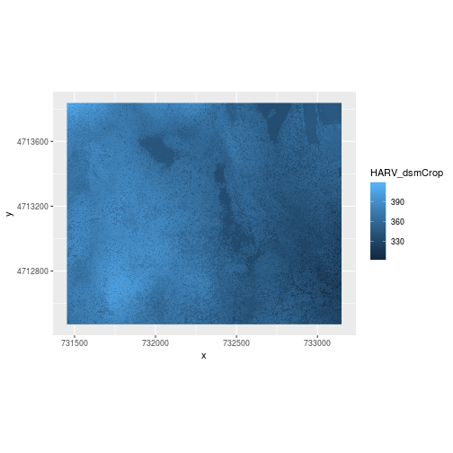

---
# Please do not edit this file directly; it is auto generated.
# Instead, please edit 01-raster-structure.md in _episodes_rmd/
source: Rmd
title: "Intro to Raster Data in R"
teaching: 20
exercises: 10
questions:
-  "What is a raster dataset?"
objectives:
-  "Understand what a raster dataset is and its fundamental attributes."
-  "Know how to explore raster attributes in `R`."
-  "Be able to import rasters into `R` using the `raster` package."
-  "Be able to quickly plot a raster file in `R`."
-  "Understand the difference between single- and multi-band rasters."
keypoints:
-  "The Coordinate Reference System or CRS tells R where the raster is located in geographic space and what method should be used to “flatten” or project the raster."
---

~~~
Loading required package: sp
~~~
{: .output}

~~~
rgdal: version: 1.3-3, (SVN revision 759)
 Geospatial Data Abstraction Library extensions to R successfully loaded
 Loaded GDAL runtime: GDAL 2.2.2, released 2017/09/15
 Path to GDAL shared files: /usr/share/gdal/2.2
 GDAL binary built with GEOS: TRUE 
 Loaded PROJ.4 runtime: Rel. 4.8.0, 6 March 2012, [PJ_VERSION: 480]
 Path to PROJ.4 shared files: (autodetected)
 Linking to sp version: 1.3-1 
~~~
{: .output}

~~~

Attaching package: 'dplyr'
~~~
{: .output}

~~~
The following objects are masked from 'package:raster':

    intersect, select, union
~~~
{: .output}

~~~
The following objects are masked from 'package:stats':

    filter, lag
~~~
{: .output}

~~~
The following objects are masked from 'package:base':

    intersect, setdiff, setequal, union
~~~
{: .output}

> ## Things You’ll Need To Complete This Episode
> See the [lesson homepage]({{ site.baseurl }}) for detailed information about the software,
> data, and other prerequisites you will need to work through the examples in this episode.
{: .prereq}

In this episode, we will review the fundamental principles, packages and
metadata/raster attributes that are needed to work with raster data in `R`.
We discuss the three core metadata elements that we need to understand to work
with rasters in `R`: CRS, extent and resolution. We will also explore
missing and bad data values as stored in a raster and how `R` handles these
elements. Finally, we will introduce the GeoTiff file format.

To open rasters in `R`, we will use the `raster` and `rgdal` packages. Make sure that you have these libraries loaded.

~~~
library(raster)
library(rgdal)
~~~
{: .language-r}

## View Raster File Attributes

We will be working with a series of `GeoTIFF` files in this
lesson. The `GeoTIFF` format contains a set of embedded tags with
metadata about the raster data. We can use the function
`GDALinfo()` to get information about our raster data before
we read that data into R. It is ideal to do this before importing
your data.

~~~
GDALinfo("data/NEON-DS-Airborne-Remote-Sensing/HARV/DSM/HARV_dsmCrop.tif")
~~~
{: .language-r}

~~~
rows        1367 
columns     1697 
bands       1 
lower left origin.x        731453 
lower left origin.y        4712471 
res.x       1 
res.y       1 
ysign       -1 
oblique.x   0 
oblique.y   0 
driver      GTiff 
projection  +proj=utm +zone=18 +datum=WGS84 +units=m +no_defs 
file        data/NEON-DS-Airborne-Remote-Sensing/HARV/DSM/HARV_dsmCrop.tif 
apparent band summary:
   GDType hasNoDataValue NoDataValue blockSize1 blockSize2
1 Float64           TRUE       -9999          1       1697
apparent band statistics:
    Bmin   Bmax    Bmean      Bsd
1 305.07 416.07 359.8531 17.83169
Metadata:
AREA_OR_POINT=Area 
~~~
{: .output}

We will be exploring this data throughout this episode. By the end of
this episode, you will be able to explain and understand
the output above.

## Raster Data in R

Now that we've previewed the metadata for our `GeoTIFF`, let's import
this raster dataset into `R` and explore its metadata more closely.

## Open a Raster in R
We can use the `raster()` function to open a raster in R.

> ## Data Tip - Object names
> To improve code
> readability, file and object names should be used that make it clear what is in
> the file. The data for this episode were collected over from Harvard Forest so
> we'll use a naming convention of `datatype_HARV`.
{: .callout}

First we will load our raster file into `R` and view the
data structure.

~~~
DSM_HARV <- raster("data/NEON-DS-Airborne-Remote-Sensing/HARV/DSM/HARV_dsmCrop.tif")

DSM_HARV
~~~
{: .language-r}

~~~
class       : RasterLayer 
dimensions  : 1367, 1697, 2319799  (nrow, ncol, ncell)
resolution  : 1, 1  (x, y)
extent      : 731453, 733150, 4712471, 4713838  (xmin, xmax, ymin, ymax)
coord. ref. : +proj=utm +zone=18 +datum=WGS84 +units=m +no_defs +ellps=WGS84 +towgs84=0,0,0 
data source : /home/travis/build/datacarpentry/r-raster-vector-geospatial/_episodes_rmd/data/NEON-DS-Airborne-Remote-Sensing/HARV/DSM/HARV_dsmCrop.tif 
names       : HARV_dsmCrop 
values      : 305.07, 416.07  (min, max)
~~~
{: .output}

To work with this data in R, we need to convert it to a dataframe. We
learned about dataframes in [an earlier lesson](https://datacarpentry.org/r-intro-geospatial/04-data-structures-part2/index.html).

First we will convert our data to a `SpatialPointsDataFrame` and
then to a conventional dataframe like the gapminder data we
worked with earlier.

~~~
DSM_HARV_df <- rasterToPoints(DSM_HARV, spatial = TRUE) %>%
    data.frame()
~~~
{: .language-r}

Now when we view the structure of our data, we will see a standard
dataframe format.

~~~
str(DSM_HARV_df)
~~~
{: .language-r}

~~~
'data.frame':	2319799 obs. of  4 variables:
 $ HARV_dsmCrop: num  409 408 407 407 409 ...
 $ x           : num  731454 731454 731456 731456 731458 ...
 $ y           : num  4713838 4713838 4713838 4713838 4713838 ...
 $ optional    : logi  TRUE TRUE TRUE TRUE TRUE TRUE ...
~~~
{: .output}

We can use `ggplot()` to plot this data.

~~~
ggplot() +
    geom_raster(data = DSM_HARV_df , aes(x = x, y = y, fill = HARV_dsmCrop)) +
    coord_equal()
~~~
{: .language-r}

This map shows the elevation of our study site in Harvard Forest.
From the legend, we can see that the maximum elevation is ~400, but
we can't tell whether this is 400 feet or 400 meters because the
legend doesn't show us the units. We can look at the metadata of our
object to see what the units are. Much of the metadata that we're
interested in is part of the `CRS`. We introduced the concept of
a `CRS` in [an earlier lesson](https://datacarpentry.org/organization-geospatial/01-spatial-data-structures-formats/index.html).
Now we will see how features of the CRS appear in our data file
and what meanings they have.

### View Raster Coordinate Reference System (CRS) in R
We can view the `CRS` string associated with our `R` object using the`crs()`
function.

~~~
crs(DSM_HARV)
~~~
{: .language-r}

~~~
CRS arguments:
 +proj=utm +zone=18 +datum=WGS84 +units=m +no_defs +ellps=WGS84
+towgs84=0,0,0 
~~~
{: .output}

> ## Challenge
> What units are our data in?
>
> > ## Answers
> > `+units=m` tells us that our data is in meters.
> {: .solution}
{: .challenge}

## Understanding CRS in Proj4 Format
The CRS for our data are given to us by `R` in `proj4` format. Let's break
down the pieces of `proj4` string. The string contains all of the individual
CRS elements that `R` or another GIS might need. Each element is specified
with a `+` sign, similar to how a `.csv` file is delimited or broken up by
a `,`. After each `+` we see the CRS element being defined. For example
projection (`proj=`) and datum (`datum=`).

### UTM Proj4 String
Our project string for `DSM_HARV` specifies the UTM projection as follows:

`+proj=utm +zone=18 +datum=WGS84 +units=m +no_defs +ellps=WGS84 +towgs84=0,0,0`

* **proj=utm:** the projection is UTM, UTM has several zones.
* **zone=18:** the zone is 18
* **datum=WGS84:** the datum WGS84 (the datum refers to the  0,0 reference for
the coordinate system used in the projection)
* **units=m:** the units for the coordinates are in METERS.
* **ellps=WGS84:** the ellipsoid (how the earth's  roundness is calculated) for
the data is WGS84

Note that the `zone` is unique to the UTM projection. Not all CRS will have a
zone.

<figure>

<figcaption> The UTM zones across the continental United States. Source:
Chrismurf, wikimedia.org.
</figcaption>
</figure>

## Calculate Raster Min and Max Values

It is useful to know the minimum or maximum values of a raster dataset. In
this case, given we are working with elevation data, these values represent the
min/max elevation range at our site.

Raster statistics are often calculated and embedded in a `geotiff` for us. We can view these values:

~~~
minValue(DSM_HARV)
~~~
{: .language-r}

~~~
[1] 305.07
~~~
{: .output}

~~~
maxValue(DSM_HARV)
~~~
{: .language-r}

~~~
[1] 416.07
~~~
{: .output}

> ## Data Tip - Set min and max values
> If the minimum and maximum values haven't already been
> calculated, we can calculate them using the
> `setMinMax()` function.
>
> 
> ~~~
> DSM_HARV <- setMinMax(DSM_HARV)
> ~~~
> {: .language-r}
{: .callout}

We can see that the elevation at our site ranges from 305.07m to 416.07m.

## Dealing with Missing Data

Raster data often has a `NoDataValue` associated with it. This is a value
assigned to pixels where data is missing or no data were collected.

By default the shape of a raster is always rectangular. So if we
have  a dataset that has a shape that isn't rectangular, some pixels
at the edge of the raster will have `NoDataValue`s. This often happens when the
data were collected by an airplane which only flew over some part of a defined
region.

In the image below, the pixels that are black have `NoDataValue`s.
The camera did not collect data in these areas.

In the next image, the black edges have been assigned `NoDataValue`. `R` doesn't render pixels that contain a specified `NoDataValue`. `R` assigns missing data with the `NoDataValue` as `NA`.
The difference here shows up as ragged edges on the plot, rather than
black spaces where there is no data.

The value that is used to take note of missing data (the `NoDataValue` value) varies across disciplines; `-9999` is a common value
used in both the remote sensing field and the atmospheric fields. It is also
the standard used by the <a href="http://www.neonscience.org" target="_blank">
National Ecological Observatory Network (NEON)</a>.

If we are lucky, our GeoTIFF file has a tag that tells us what is the
`NoDataValue`. If we are less lucky, we can find that information in the
raster's metadata. If a `NoDataValue` was stored in the GeoTIFF tag, when `R`
opens up the raster, it will assign each instance of the value to `NA`. Values
of `NA` will be ignored by `R` as demonstrated above.

> ## Challenge
> Use the output from the `GDALinfo()` function to find out what `NoDataValue` is used for our DSM_HARV dataset.
>
> > ## Answers
> >
> > 
> > ~~~
> > GDALinfo("data/NEON-DS-Airborne-Remote-Sensing/HARV/DSM/HARV_dsmCrop.tif")
> > ~~~
> > {: .language-r}
> > 
> > 
> > 
> > ~~~
> > rows        1367 
> > columns     1697 
> > bands       1 
> > lower left origin.x        731453 
> > lower left origin.y        4712471 
> > res.x       1 
> > res.y       1 
> > ysign       -1 
> > oblique.x   0 
> > oblique.y   0 
> > driver      GTiff 
> > projection  +proj=utm +zone=18 +datum=WGS84 +units=m +no_defs 
> > file        data/NEON-DS-Airborne-Remote-Sensing/HARV/DSM/HARV_dsmCrop.tif 
> > apparent band summary:
> >    GDType hasNoDataValue NoDataValue blockSize1 blockSize2
> > 1 Float64           TRUE       -9999          1       1697
> > apparent band statistics:
> >     Bmin   Bmax    Bmean      Bsd
> > 1 305.07 416.07 359.8531 17.83169
> > Metadata:
> > AREA_OR_POINT=Area 
> > ~~~
> > {: .output}
> {: .solution}
{: .callout}

## Bad Data Values in Rasters

Bad data values are different from `NoDataValue`s. Bad data values are values
that fall outside of the applicable range of a dataset.

Examples of Bad Data Values:

* The normalized difference vegetation index (NDVI), which is a measure of
greenness, has a valid range of -1 to 1. Any value outside of that range would
be considered a "bad" or miscalculated value.
* Reflectance data in an image will often range from 0-1 or 0-10,000 depending
upon how the data are scaled. Thus a value greater than 1 or greater than 10,000
is likely caused by an error in either data collection or processing.

### Find Bad Data Values
Sometimes a raster's metadata will tell us the range of expected values for a
raster. Values outside of this range are suspect and we need to consider than
when we analyze the data. Sometimes, we need to use some common sense and
scientific insight as we examine the data - just as we would for field data to
identify questionable values.

## Create A Histogram of Raster Values

We can explore the distribution of values contained within our raster using the
`geom_histogram()` function which produces a histogram. Histograms are often useful in
identifying outliers and bad data values in our raster data.

~~~
ggplot() +
    geom_histogram(data = DSM_HARV_df, aes(HARV_dsmCrop))
~~~
{: .language-r}

~~~
`stat_bin()` using `bins = 30`. Pick better value with `binwidth`.
~~~
{: .output}

Notice that an warning message is thrown when `R` creates the histogram.

`stat_bin()` using `bins = 30`. Pick better value with `binwidth`.

This warning is caused by `ggplot`'s default settings enforcing that there are 30 bins for the data.
We can define the number of bins we want in the histogram by using the `bins` value in the 
`geom_histogram()` function.

~~~
ggplot() +
    geom_histogram(data = DSM_HARV_df, aes(HARV_dsmCrop), bins = 40)
~~~
{: .language-r}

Note that the shape of both histograms looks similar to the previous one that
 was created using the default of 30 bins. The
distribution of elevation values for our `Digital Surface Model (DSM)` looks
reasonable. It is likely there are no bad data values in this particular raster.

## Raster Bands
The Digital Surface Model object (`DSM_HARV`) that we've been working with
is a single band raster. This means that there is only one dataset stored in
the raster: surface elevation in meters for one time period.

<figure>
    
    <figcaption>Source: National Ecological Observatory Network (NEON).
    </figcaption>
</figure>

A raster dataset can contain one or more bands. We can use the `raster()` function
to import one single band from a single OR multi-band raster. We can view the number
of bands in a raster using the `nlayers()` function.

~~~
nlayers(DSM_HARV)
~~~
{: .language-r}

~~~
[1] 1
~~~
{: .output}

However, raster data can also be multi-band meaning that one raster file
contains data for more than one variable or time period for each cell. By
default the `raster()` function only imports the first band in a raster
regardless of whether it has one or more bands. Jump to a later episode in
this series for information on working with multi-band rasters:
<a href="{{ site.baseurl }}/05-raster-multi-band-in-r/" target="_blank">
Work with Multi-band Rasters: Images in R</a>.

> ## Challenge: Explore Raster Metadata
>
> Use `GDALinfo() to determine the following about the  `NEON-DS-Airborne-Remote-Sensing/HARV/DSM/HARV_DSMhill.tif` file:
>
> 1. Does this file has the same `CRS` as `DSM_HARV`?
> 2. What is the `NoDataValue`?
> 3. What is resolution of the raster data?
> 4. How large would a 5x5 pixel area be on the Earth's surface?
> 5. Is the file a multi- or single-band raster?
>
> Notice: this file is a `hillshade`. We will learn about hillshades in
<a href="{{ site.baseurl }}/05-raster-multi-band-in-r/" target="_blank">  Work with Multi-band Rasters: Images in R</a>.
> >
> > ## Answers
> >
> > 
> > ~~~
> > rows        1367 
> > columns     1697 
> > bands       1 
> > lower left origin.x        731453 
> > lower left origin.y        4712471 
> > res.x       1 
> > res.y       1 
> > ysign       -1 
> > oblique.x   0 
> > oblique.y   0 
> > driver      GTiff 
> > projection  +proj=utm +zone=18 +datum=WGS84 +units=m +no_defs 
> > file        data/NEON-DS-Airborne-Remote-Sensing/HARV/DSM/HARV_DSMhill.tif 
> > apparent band summary:
> >    GDType hasNoDataValue NoDataValue blockSize1 blockSize2
> > 1 Float64           TRUE       -9999          1       1697
> > apparent band statistics:
> >         Bmin      Bmax     Bmean       Bsd
> > 1 -0.7136298 0.9999997 0.3125525 0.4812939
> > Metadata:
> > AREA_OR_POINT=Area 
> > ~~~
> > {: .output}
> > 1. If this file has the same CRS as DSM_HARV?  Yes: UTM Zone 18, WGS84, meters.
> > 2. What format `NoDataValues` take?  -9999
> > 3. The resolution of the raster data? 1x1
> > 4. How large a 5x5 pixel area would be? 5mx5m How? We are given resolution of 1x1 and units in meters, therefore resolution of 5x5 means 5x5m.
> > 5. Is the file a multi- or single-band raster?  Single.
> {: .solution}
{: .challenge}

> ## More Resources
> * <a href="http://cran.r-project.org/web/packages/raster/raster.pdf" target="_blank">
> Read more about the `raster` package in `R`.</a>
> * <a href="http://neondataskills.org/R/Raster-Data-In-R/" target="_blank" >
> NEON Data Skills: Raster Data in R - The Basics</a>
> * <a href="http://neondataskills.org/R/Image-Raster-Data-In-R/" target="_blank" >
> NEON Data Skills: Image Raster Data in R - An Intro</a>
{: .callout}
