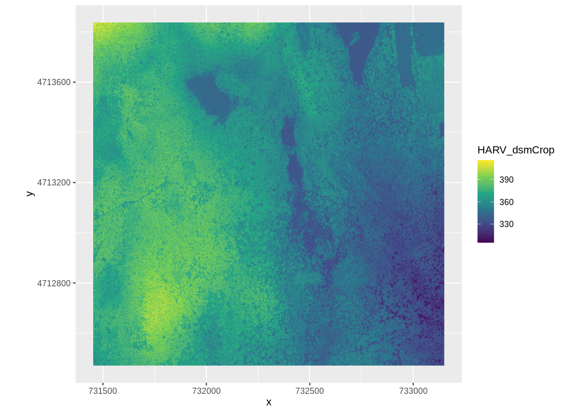
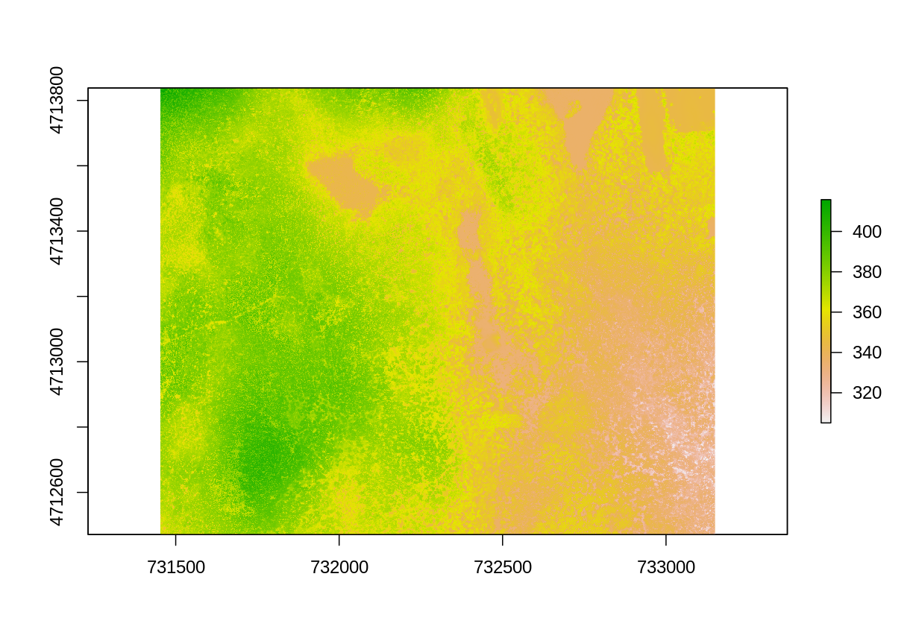
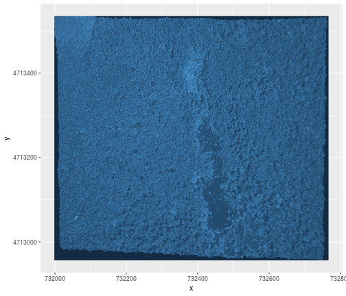
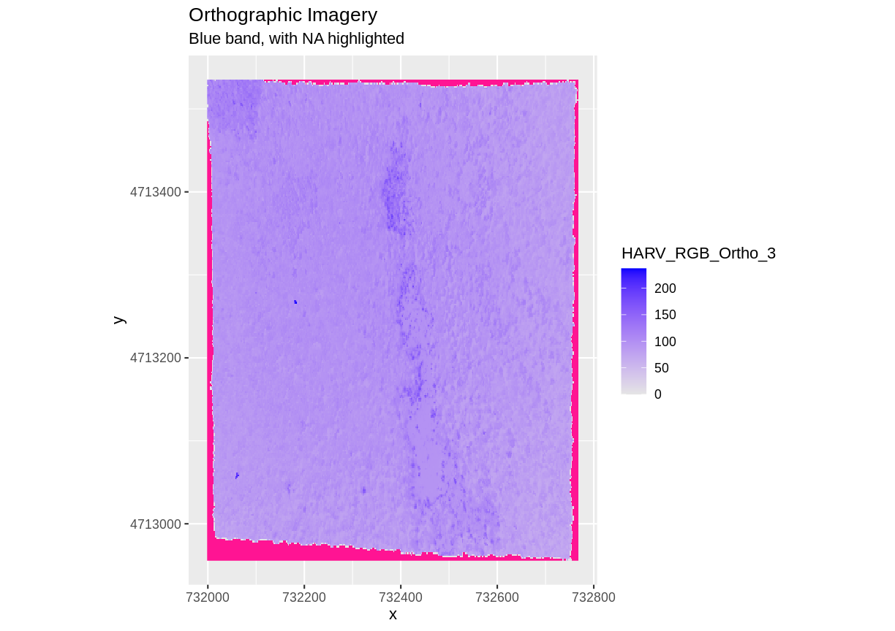
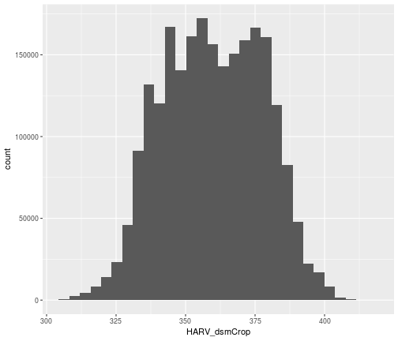
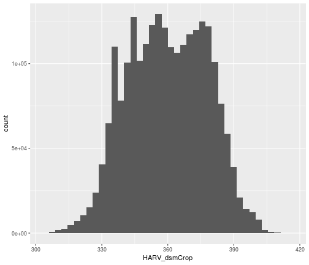

---
# Please do not edit this file directly; it is auto generated.
# Instead, please edit 01-raster-structure.md in _episodes_rmd/
title: "Intro to Raster Data in R"
teaching: 40
exercises: 20
questions:
-  "What is a raster dataset?"
-  "How do I work with and plot raster data in R?"
-  "How can I handle missing or bad data values for a raster?"
objectives:
-  "Describe the fundamental attributes of a raster dataset."
-  "Explore raster attributes and metadata using R."
-  "Import rasters into R using the `raster` package."
-  "Plot a raster file in R using the `ggplot2` package."
-  "Describe the difference between single- and multi-band rasters."
keypoints:
- "The GeoTIFF file format includes metadata about the raster data." 
- "To plot raster data with the `ggplot2` package, we need to convert it to a dataframe."
- "R stores CRS information in the Proj4 format."
- "Be careful when dealing with missing or bad data values."
source: Rmd
---

> ## Things You'll Need To Complete This Episode
>
> See the [lesson homepage]({{ site.baseurl }}) for detailed information about the software,
> data, and other prerequisites you will need to work through the examples in this episode.
{: .prereq}

In this episode, we will introduce the fundamental principles, packages and
metadata/raster attributes that are needed to work with raster data in R. We will
discuss some of the core metadata elements that we need to understand to work with
rasters in R, including CRS and resolution. We will also explore missing and bad
data values as stored in a raster and how R handles these elements.

We will continue to work with the `dplyr` and `ggplot2` packages that were introduced
in the [Introduction to R for Geospatial Data](https://datacarpentry.org/r-intro-geospatial/) lesson. We will use two additional packages in this episode to work with raster data - the
`raster` and `rgdal` packages. Make sure that you have these packages loaded.

~~~
library(raster)
library(rgdal)
~~~
{: .language-r}

> ## Introduce the Data
>
> If not already discussed, introduce the datasets that will be used in this
> lesson. A brief introduction to the datasets can be found on the 
> [Geospatial workshop homepage](https://datacarpentry.org/geospatial-workshop/#data).
> 
> For more detailed information about the datasets, check
out the [Geospatial workshop data
page](http://datacarpentry.org/geospatial-workshop/data/).
{: .callout}

## View Raster File Attributes

We will be working with a series of GeoTIFF files in this lesson. The
GeoTIFF format contains a set of embedded tags with metadata about the raster
data. We can use the function `GDALinfo()` to get information about our raster
data before we read that data into R. It is ideal to do this before importing
your data.

~~~
GDALinfo("data/NEON-DS-Airborne-Remote-Sensing/HARV/DSM/HARV_dsmCrop.tif")
~~~
{: .language-r}

~~~
rows        1367 
columns     1697 
bands       1 
lower left origin.x        731453 
lower left origin.y        4712471 
res.x       1 
res.y       1 
ysign       -1 
oblique.x   0 
oblique.y   0 
driver      GTiff 
projection  +proj=utm +zone=18 +datum=WGS84 +units=m +no_defs 
file        data/NEON-DS-Airborne-Remote-Sensing/HARV/DSM/HARV_dsmCrop.tif 
apparent band summary:
   GDType hasNoDataValue NoDataValue blockSize1 blockSize2
1 Float64           TRUE       -9999          1       1697
apparent band statistics:
    Bmin   Bmax    Bmean      Bsd
1 305.07 416.07 359.8531 17.83169
Metadata:
AREA_OR_POINT=Area 
~~~
{: .output}

If you wish to store this information in R, you can do the following:

~~~
HARV_dsmCrop_info <- capture.output(
  GDALinfo("data/NEON-DS-Airborne-Remote-Sensing/HARV/DSM/HARV_dsmCrop.tif")
)
~~~
{: .language-r}

Each line of text that was printed to the console is now stored as an element of
the character vector `HARV_dsmCrop_info`. We will be exploring this data throughout this 
episode. By the end of this episode, you will be able to explain and understand the output above.

## Open a Raster in R

Now that we've previewed the metadata for our GeoTIFF, let's import this
raster dataset into R and explore its metadata more closely. We can use the `raster()` 
function to open a raster in R.

> ## Data Tip - Object names
> To improve code
> readability, file and object names should be used that make it clear what is in
> the file. The data for this episode were collected from Harvard Forest so
> we'll use a naming convention of `datatype_HARV`.
{: .callout}

First we will load our raster file into R and view the data structure.

~~~
DSM_HARV <- 
  raster("data/NEON-DS-Airborne-Remote-Sensing/HARV/DSM/HARV_dsmCrop.tif")

DSM_HARV
~~~
{: .language-r}

~~~
class       : RasterLayer 
dimensions  : 1367, 1697, 2319799  (nrow, ncol, ncell)
resolution  : 1, 1  (x, y)
extent      : 731453, 733150, 4712471, 4713838  (xmin, xmax, ymin, ymax)
coord. ref. : +proj=utm +zone=18 +datum=WGS84 +units=m +no_defs +ellps=WGS84 +towgs84=0,0,0 
data source : /home/rave/r-raster-vector-geospatial/_episodes_rmd/data/NEON-DS-Airborne-Remote-Sensing/HARV/DSM/HARV_dsmCrop.tif 
names       : HARV_dsmCrop 
values      : 305.07, 416.07  (min, max)
~~~
{: .output}

The information above includes a report of min and max values, but no other data
range statistics. Similar to other R data structures like vectors and data frame
columns, descriptive statistics for raster data can be retrieved like

~~~
summary(DSM_HARV)
~~~
{: .language-r}

~~~
Warning in .local(object, ...): summary is an estimate based on a sample of 1e+05 cells (4.31% of all cells)
~~~
{: .error}

~~~
        HARV_dsmCrop
Min.          305.73
1st Qu.       345.56
Median        359.67
3rd Qu.       374.27
Max.          413.57
NA's            0.00
~~~
{: .output}

but note the warning - unless you force R to calculate these statistics using
every cell in the raster, it will take a random sample of 100,000 cells and
calculate from that instead. To force calculation on more, or even all values,
you can use the parameter `maxsamp`:

~~~
summary(DSM_HARV, maxsamp = ncell(DSM_HARV))
~~~
{: .language-r}

~~~
        HARV_dsmCrop
Min.          305.07
1st Qu.       345.59
Median        359.67
3rd Qu.       374.28
Max.          416.07
NA's            0.00
~~~
{: .output}

You may not see major differences in summary stats as `maxsamp` increases,
except with very large rasters.

To visualise this data in R using `ggplot2`, we need to convert it to a
dataframe. We learned about dataframes in [an earlier
lesson](https://datacarpentry.org/r-intro-geospatial/04-data-structures-part2/index.html).
The `raster` package has an built-in function for conversion to a plotable dataframe.

~~~
DSM_HARV_df <- as.data.frame(DSM_HARV, xy = TRUE)
~~~
{: .language-r}

Now when we view the structure of our data, we will see a standard
dataframe format.

~~~
str(DSM_HARV_df)
~~~
{: .language-r}

~~~
'data.frame':	2319799 obs. of  3 variables:
 $ x           : num  731454 731454 731456 731456 731458 ...
 $ y           : num  4713838 4713838 4713838 4713838 4713838 ...
 $ HARV_dsmCrop: num  409 408 407 407 409 ...
~~~
{: .output}

We can use `ggplot()` to plot this data. We will set the color scale to `scale_fill_viridis_c`
which is a color-blindness friendly color scale. We will also use the `coord_quickmap()` function to use an approximate Mercator projection for our plots. This approximation is suitable for small areas that are not too close to the poles. Other coordinate systems are available in ggplot2 if needed, you can learn about them at their help page `?coord_map`.

~~~
ggplot() +
    geom_raster(data = DSM_HARV_df , aes(x = x, y = y, fill = HARV_dsmCrop)) +
    scale_fill_viridis_c() +
    coord_quickmap()
~~~
{: .language-r}

> ## Plotting Tip
>
> More information about the Viridis palette used above at
> [R Viridis package documentation](https://cran.r-project.org/web/packages/viridis/vignettes/intro-to-viridis.html).
{: .callout}

> ## Plotting Tip
> For faster, simpler plots, you can use the `plot` function from the `raster` package.
> > ## Show plot
> >  See `?plot` for more arguments to customize the plot
> > 
> > ~~~
> > plot(DSM_HARV)
> > ~~~
> > {: .language-r}
> > 
> > 
> {: .solution}
{: .callout}

This map shows the elevation of our study site in Harvard Forest. From the
legend, we can see that the maximum elevation is ~400, but we can't tell whether
this is 400 feet or 400 meters because the legend doesn't show us the units. We
can look at the metadata of our object to see what the units are. Much of the
metadata that we're interested in is part of the CRS. We introduced the
concept of a CRS in [an earlier
lesson](https://datacarpentry.org/organization-geospatial/03-crs).

Now we will see how features of the CRS appear in our data file and what
meanings they have.

### View Raster Coordinate Reference System (CRS) in R
We can view the CRS string associated with our R object using the`crs()`
function.

~~~
crs(DSM_HARV)
~~~
{: .language-r}

~~~
CRS arguments:
 +proj=utm +zone=18 +datum=WGS84 +units=m +no_defs +ellps=WGS84
+towgs84=0,0,0 
~~~
{: .output}

> ## Challenge
> What units are our data in?
>
> > ## Answers
> > `+units=m` tells us that our data is in meters.
> {: .solution}
{: .challenge}

## Understanding CRS in Proj4 Format
The CRS for our data is given to us by R in `proj4` format. Let's break down
the pieces of `proj4` string. The string contains all of the individual CRS
elements that R or another GIS might need. Each element is specified with a
`+` sign, similar to how a `.csv` file is delimited or broken up by a `,`. After
each `+` we see the CRS element being defined. For example projection (`proj=`)
and datum (`datum=`).

### UTM Proj4 String
Our projection string for `DSM_HARV` specifies the UTM projection as follows:

`+proj=utm +zone=18 +datum=WGS84 +units=m +no_defs +ellps=WGS84 +towgs84=0,0,0`

* **proj=utm:** the projection is UTM, UTM has several zones.
* **zone=18:** the zone is 18
* **datum=WGS84:** the datum is WGS84 (the datum refers to the  0,0 reference for
the coordinate system used in the projection)
* **units=m:** the units for the coordinates are in meters
* **ellps=WGS84:** the ellipsoid (how the earth's  roundness is calculated) for
the data is WGS84

Note that the zone is unique to the UTM projection. Not all CRSs will have a
zone. Image source: Chrismurf at English Wikipedia, via [Wikimedia Commons](https://en.wikipedia.org/wiki/Universal_Transverse_Mercator_coordinate_system#/media/File:Utm-zones-USA.svg) (CC-BY).

## Calculate Raster Min and Max Values

It is useful to know the minimum or maximum values of a raster dataset. In this
case, given we are working with elevation data, these values represent the
min/max elevation range at our site.

Raster statistics are often calculated and embedded in a GeoTIFF for us. We
can view these values:

~~~
minValue(DSM_HARV)
~~~
{: .language-r}

~~~
[1] 305.07
~~~
{: .output}

~~~
maxValue(DSM_HARV)
~~~
{: .language-r}

~~~
[1] 416.07
~~~
{: .output}

> ## Data Tip - Set min and max values
> If the minimum and maximum values haven't already been
> calculated, we can calculate them using the
> `setMinMax()` function.
>
> 
> ~~~
> DSM_HARV <- setMinMax(DSM_HARV)
> ~~~
> {: .language-r}
{: .callout}

We can see that the elevation at our site ranges from 305.0700073m to
416.0699768m.

## Raster Bands
The Digital Surface Model object (`DSM_HARV`) that we've been working with is a
single band raster. This means that there is only one dataset stored in the
raster: surface elevation in meters for one time period.

A raster dataset can contain one or more bands. We can use the `raster()`
function to import one single band from a single or multi-band raster. We can
view the number of bands in a raster using the `nlayers()` function.

~~~
nlayers(DSM_HARV)
~~~
{: .language-r}

~~~
[1] 1
~~~
{: .output}

However, raster data can also be multi-band, meaning that one raster file
contains data for more than one variable or time period for each cell. By
default the `raster()` function only imports the first band in a raster
regardless of whether it has one or more bands. Jump to a later episode in
this series for information on working with multi-band rasters:
[Work with Multi-band Rasters in R]({{ site.baseurl }}/05-raster-multi-band-in-r/).

## Dealing with Missing Data

Raster data often has a `NoDataValue` associated with it. This is a value
assigned to pixels where data is missing or no data were collected.

By default the shape of a raster is always rectangular. So if we have  a dataset
that has a shape that isn't rectangular, some pixels at the edge of the raster
will have `NoDataValue`s. This often happens when the data were collected by an
airplane which only flew over some part of a defined region.

In the image below, the pixels that are black have `NoDataValue`s. The camera
did not collect data in these areas.

In the next image, the black edges have been assigned `NoDataValue`. R doesn't
render pixels that contain a specified `NoDataValue`. R assigns missing data
with the `NoDataValue` as `NA`.

The difference here shows up as ragged edges on the plot, rather than black
spaces where there is no data.

If your raster already has `NA` values set correctly but you aren't sure where they are, you can deliberately plot them in a particular colour. This can be useful when checking a dataset's coverage. For instance, sometimes data can be missing where a sensor could not 'see' its target data, and you may wish to locate that missing data and fill it in.

To highlight `NA` values in ggplot, alter the `scale_fill_*()` layer to contain a colour instruction for `NA` values, like `scale_fill_viridis_c(na.value = 'deeppink')`

The value that is conventionally used to take note of missing data (the
`NoDataValue` value) varies by the raster data type. For floating-point rasters,
the figure `-3.4e+38` is a common default, and for integers, `-9999` is
common. Some disciplines have specific conventions that vary from these
common values.

In some cases, other `NA` values may be more appropriate. An `NA` value should
be a) outside the range of valid values, and b) a value that fits the data type
in use. For instance, if your data ranges continuously from -20 to 100, 0 is
not an acceptable `NA` value! Or, for categories that number 1-15, 0 might be
fine for `NA`, but using -.000003 will force you to save the GeoTIFF on disk
as a floating point raster, resulting in a bigger file.

If we are lucky, our GeoTIFF file has a tag that tells us what is the
`NoDataValue`. If we are less lucky, we can find that information in the
raster's metadata. If a `NoDataValue` was stored in the GeoTIFF tag, when R
opens up the raster, it will assign each instance of the value to `NA`. Values
of `NA` will be ignored by R as demonstrated above.

> ## Challenge
> Use the output from the `GDALinfo()` function to find out what `NoDataValue` is used for our `DSM_HARV` dataset.
>
> > ## Answers
> >
> > 
> > ~~~
> > GDALinfo("data/NEON-DS-Airborne-Remote-Sensing/HARV/DSM/HARV_dsmCrop.tif")
> > ~~~
> > {: .language-r}
> > 
> > 
> > 
> > ~~~
> > rows        1367 
> > columns     1697 
> > bands       1 
> > lower left origin.x        731453 
> > lower left origin.y        4712471 
> > res.x       1 
> > res.y       1 
> > ysign       -1 
> > oblique.x   0 
> > oblique.y   0 
> > driver      GTiff 
> > projection  +proj=utm +zone=18 +datum=WGS84 +units=m +no_defs 
> > file        data/NEON-DS-Airborne-Remote-Sensing/HARV/DSM/HARV_dsmCrop.tif 
> > apparent band summary:
> >    GDType hasNoDataValue NoDataValue blockSize1 blockSize2
> > 1 Float64           TRUE       -9999          1       1697
> > apparent band statistics:
> >     Bmin   Bmax    Bmean      Bsd
> > 1 305.07 416.07 359.8531 17.83169
> > Metadata:
> > AREA_OR_POINT=Area 
> > ~~~
> > {: .output}
> >
> > `NoDataValue` are encoded as -9999.
> {: .solution}
{: .callout}

## Bad Data Values in Rasters

Bad data values are different from `NoDataValue`s. Bad data values are values
that fall outside of the applicable range of a dataset.

Examples of Bad Data Values:

* The normalized difference vegetation index (NDVI), which is a measure of
greenness, has a valid range of -1 to 1. Any value outside of that range would
be considered a "bad" or miscalculated value.
* Reflectance data in an image will often range from 0-1 or 0-10,000 depending
upon how the data are scaled. Thus a value greater than 1 or greater than 10,000
is likely caused by an error in either data collection or processing.

### Find Bad Data Values
Sometimes a raster's metadata will tell us the range of expected values for a
raster. Values outside of this range are suspect and we need to consider that
when we analyze the data. Sometimes, we need to use some common sense and
scientific insight as we examine the data - just as we would for field data to
identify questionable values.

Plotting data with appropriate highlighting can help reveal patterns in bad
values and may suggest a solution. Below, reclassification is used to highlight
elevation values over 400m with a contrasting colour.

~~~
Error in doColorRamp(colorMatrix, x, alpha, ifelse(is.na(na.color), "", : Not compatible with requested type: [type=NULL; target=double].
~~~
{: .error}

## Create A Histogram of Raster Values

We can explore the distribution of values contained within our raster using the
`geom_histogram()` function which produces a histogram. Histograms are often
useful in identifying outliers and bad data values in our raster data.

~~~
ggplot() +
    geom_histogram(data = DSM_HARV_df, aes(HARV_dsmCrop))
~~~
{: .language-r}

~~~
`stat_bin()` using `bins = 30`. Pick better value with `binwidth`.
~~~
{: .output}

Notice that a warning message is thrown when R creates the histogram.

`stat_bin()` using `bins = 30`. Pick better value with `binwidth`.

This warning is caused by a default setting in `geom_histogram` enforcing that there are
30 bins for the data. We can define the number of bins we want in the histogram
by using the `bins` value in the `geom_histogram()` function.

~~~
ggplot() +
    geom_histogram(data = DSM_HARV_df, aes(HARV_dsmCrop), bins = 40)
~~~
{: .language-r}

Note that the shape of this histogram looks similar to the previous one that
was created using the default of 30 bins. The distribution of elevation values
for our `Digital Surface Model (DSM)` looks reasonable. It is likely there are
no bad data values in this particular raster.

> ## Challenge: Explore Raster Metadata
>
> Use `GDALinfo()` to determine the following about the `NEON-DS-Airborne-Remote-Sensing/HARV/DSM/HARV_DSMhill.tif` file:
>
> 1. Does this file have the same CRS as `DSM_HARV`?
> 2. What is the `NoDataValue`?
> 3. What is resolution of the raster data?
> 4. How large would a 5x5 pixel area be on the Earth's surface?
> 5. Is the file a multi- or single-band raster?
>
> Notice: this file is a hillshade. We will learn about hillshades in the [Working with
> Multi-band Rasters in R]({{ site.baseurl }}/05-raster-multi-band-in-r/)  episode.
> >
> > ## Answers
> >
> > 
> > ~~~
> > GDALinfo("data/NEON-DS-Airborne-Remote-Sensing/HARV/DSM/HARV_DSMhill.tif")
> > ~~~
> > {: .language-r}
> > 
> > 
> > 
> > ~~~
> > rows        1367 
> > columns     1697 
> > bands       1 
> > lower left origin.x        731453 
> > lower left origin.y        4712471 
> > res.x       1 
> > res.y       1 
> > ysign       -1 
> > oblique.x   0 
> > oblique.y   0 
> > driver      GTiff 
> > projection  +proj=utm +zone=18 +datum=WGS84 +units=m +no_defs 
> > file        data/NEON-DS-Airborne-Remote-Sensing/HARV/DSM/HARV_DSMhill.tif 
> > apparent band summary:
> >    GDType hasNoDataValue NoDataValue blockSize1 blockSize2
> > 1 Float64           TRUE       -9999          1       1697
> > apparent band statistics:
> >         Bmin      Bmax     Bmean       Bsd
> > 1 -0.7136298 0.9999997 0.3125525 0.4812939
> > Metadata:
> > AREA_OR_POINT=Area 
> > ~~~
> > {: .output}
> > 1. If this file has the same CRS as DSM_HARV?  Yes: UTM Zone 18, WGS84, meters.
> > 2. What format `NoDataValues` take?  -9999
> > 3. The resolution of the raster data? 1x1
> > 4. How large a 5x5 pixel area would be? 5mx5m How? We are given resolution of 1x1 and units in meters, therefore resolution of 5x5 means 5x5m.
> > 5. Is the file a multi- or single-band raster?  Single.
> {: .solution}
{: .challenge}

> ## More Resources
> * [Read more about the `raster` package in R.](http://cran.r-project.org/package=raster)
{: .callout}


