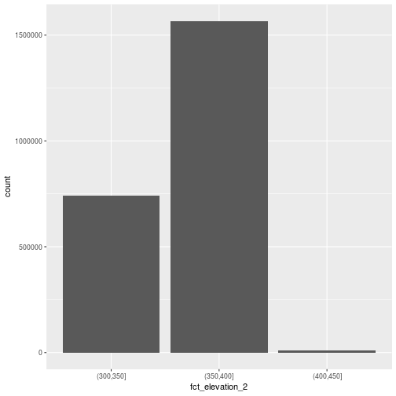
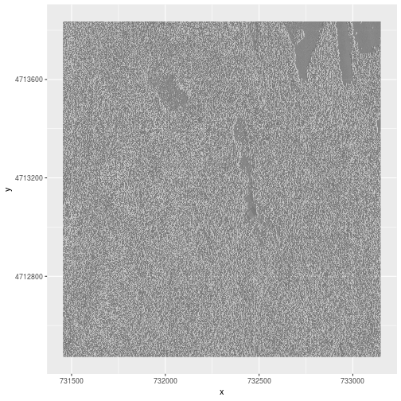

---
# Please do not edit this file directly; it is auto generated.
# Instead, please edit 02-raster-plot.md in _episodes_rmd/
title: "Plot Raster Data in R"
teaching: 20
exercises: 10
questions:
- "How can I visualize raster data?"
objectives:
- "Know how to plot a single band raster in `R`."
- "Know how to layer a raster dataset on top of a hillshade to create an elegant basemap."
keypoints:
- ""
---

> ## Things You’ll Need To Complete This Episode
> See the [lesson homepage]({{ site.baseurl }}) for detailed information about the software,
> data, and other prerequisites you will need to work through the examples in this episode.
{: .prereq}

This episode covers how to plot a raster in `R` using the `ggplot2`
package. It also covers how to layer a raster on top of a hillshade to produce
an eloquent map.

## Plot Raster Data in R
In this episode, we will plot the Digital Surface Model (DSM) raster
for the NEON Harvard Forest Field Site. We will use the `hist()` function as a
tool to explore raster values and render categorical plots, using the `breaks` argument to get bins that are meaningful representations of our data.

## Plotting Data Using Breaks
We can view our data "symbolized" or colored according to ranges of values
rather than using a continuous color ramp. This is comparable to a "classified"
map. However, to assign breaks, it is useful to first explore the distribution
of the data using a bar plot. 
We use `dplyr`'s mutate to combined with `cut()` to split the data into 3 bins.

~~~
DSM_HARV_df <- DSM_HARV_df %>%
                mutate(fct_elevation = cut(HARV_dsmCrop, breaks = 3))

ggplot() +
    geom_bar(data = DSM_HARV_df, aes(fct_elevation))
~~~
{: .language-r}

If we are want to know what the bins are we can ask for the unique values 
of `fct_elavation`:

~~~
unique(DSM_HARV_df$fct_elevation)
~~~
{: .language-r}

~~~
[1] (379,416] (342,379] (305,342]
Levels: (305,342] (342,379] (379,416]
~~~
{: .output}

And we can get the count of values in each bin using `dplyr`'s 
`group_by` and `summarize`:

~~~
DSM_HARV_df %>%
        group_by(fct_elevation) %>%
        summarize(counts = n())
~~~
{: .language-r}

~~~
# A tibble: 3 x 2
  fct_elevation  counts
  <fct>           <int>
1 (305,342]      418891
2 (342,379]     1530073
3 (379,416]      370835
~~~
{: .output}

We can customize the break points for the bins that `cut()` yields using the 
`breaks` variable in a different way. 
Lets round the breaks so that we have bins ranges of 
300-349m, 350 - 399m, and 400-450m.
To implement this we pass a numeric vector of break points instead 
of the number of breaks we want.

~~~
custom_bins <- c(300, 350, 400, 450)

DSM_HARV_df <- DSM_HARV_df %>%
                mutate(fct_elevation_2 = cut(HARV_dsmCrop, breaks = custom_bins))

unique(DSM_HARV_df$fct_elevation_2)
~~~
{: .language-r}

~~~
[1] (400,450] (350,400] (300,350]
Levels: (300,350] (350,400] (400,450]
~~~
{: .output}

> ## Data Tips
> Note that when we assign break values a set of 4 values will result in 3 bins of data.
>
> The bin intervals are shown using `(` to mean inclusive and `]` to mean exclusive. For example: `(305, 342]` means "from 305 through 341".
{: .callout}

And now we can plot our bar plot again, using the new bins:

~~~
ggplot() +
    geom_bar(data = DSM_HARV_df, aes(fct_elevation_2))
~~~
{: .language-r}

We can also look at the how frequent each occurence of our bins is:

~~~
DSM_HARV_df %>%
        group_by(fct_elevation_2) %>%
        summarize(counts = n())
~~~
{: .language-r}

~~~
# A tibble: 3 x 2
  fct_elevation_2  counts
  <fct>             <int>
1 (300,350]        741815
2 (350,400]       1567316
3 (400,450]         10668
~~~
{: .output}

We can use those bins to plot our raster data:

~~~
ggplot() +
 geom_raster(data = DSM_HARV_df , aes(x = x, y = y, fill = fct_elevation_2))
~~~
{: .language-r}

The plot above uses the default colors inside `ggplot` for raster objects. 
We can specify our own colors to make the plot look a little nicer.
`R` has a built in set of colors for plotting terrain, which are built in
to the `terrain.colors` function.
Since we have three bins, we want to use the first three terrain colors:

~~~
terrain.colors(3)
~~~
{: .language-r}

~~~
[1] "#00A600FF" "#ECB176FF" "#F2F2F2FF"
~~~
{: .output}

We can see the `terrain.colors()` function returns *hex colors* - 
 each of these character strings represents a color.
To use these in our map, we pass them across using the 
 `scale_fill_manual()` function.

~~~
ggplot() +
 geom_raster(data = DSM_HARV_df , aes(x = x, y = y,
                                      fill = fct_elevation_2)) + 
    scale_fill_manual(values = terrain.colors(3))
~~~
{: .language-r}

### More Plot Formatting

If we need to create multiple plots using the same color palette, we can create
an `R` object (`my_col`) for the set of colors that we want to use. We can then
quickly change the palette across all plots by simply modifying the `my_col`
object.

We can label the x- and y-axes of our plot too using `xlab` and `ylab`.
We can also give the legend a more meaningful title by passing a value 
to the `name` option of `scale_fill_manual.`

~~~
# Assign color to a object for repeat use/ ease of changing
my_col <- terrain.colors(3)

ggplot() +
 geom_raster(data = DSM_HARV_df , aes(x = x, y = y,
                                      fill = fct_elevation_2)) + 
    scale_fill_manual(values = my_col, name = "Elevation")
~~~
{: .language-r}

Or we can also turn off the axes altogether via passing `element_blank()` to
the relevant parts of the `theme()` function.

~~~
# or we can turn off the axis altogether
ggplot() +
 geom_raster(data = DSM_HARV_df , aes(x = x, y = y,
                                      fill = fct_elevation_2)) + 
    scale_fill_manual(values = my_col, name = "Elevation") +
    theme(axis.title.x = element_blank(),
          axis.title.y = element_blank())
~~~
{: .language-r}

> ## Challenge: Plot Using Custom Breaks
>
> Create a plot of the Harvard Forest Digital Surface Model (DSM) that has:
>
> 1. Six classified ranges of values (break points) that are evenly divided among the range of pixel values.
> 2. Axis labels
> 3. A plot title
>
> > ## Answers
> > 
> {: .solution}
{: .challenge}

## Layering Rasters
We can layer a raster on top of a hillshade raster for the same area, and use a
transparency factor to created a 3-dimensional shaded effect. A
hillshade is a raster that maps the shadows and texture that you would see from
above when viewing terrain.
We will add a custom color, making the plot grey. 

~~~
# import DSM hillshade
DSM_hill_HARV <-
  raster("data/NEON-DS-Airborne-Remote-Sensing/HARV/DSM/HARV_DSMhill.tif")

# View data structure
DSM_hill_HARV
~~~
{: .language-r}

~~~
class       : RasterLayer 
dimensions  : 1367, 1697, 2319799  (nrow, ncol, ncell)
resolution  : 1, 1  (x, y)
extent      : 731453, 733150, 4712471, 4713838  (xmin, xmax, ymin, ymax)
coord. ref. : +proj=utm +zone=18 +datum=WGS84 +units=m +no_defs +ellps=WGS84 +towgs84=0,0,0 
data source : /home/travis/build/datacarpentry/r-raster-vector-geospatial/_episodes_rmd/data/NEON-DS-Airborne-Remote-Sensing/HARV/DSM/HARV_DSMhill.tif 
names       : HARV_DSMhill 
values      : -0.7136298, 0.9999997  (min, max)
~~~
{: .output}

~~~
# convert to a df for plotting in two steps,
# First, to a SpatialPointsDataFrame
DSM_hill_HARV_df <- rasterToPoints(DSM_hill_HARV, spatial = TRUE) %>%
# Then to a 'conventional' dataframe
    data.frame()

# View data structure
str(DSM_hill_HARV_df)
~~~
{: .language-r}

~~~
'data.frame':	2313675 obs. of  4 variables:
 $ HARV_DSMhill: num  -0.15567 0.00743 0.86989 0.9791 0.96283 ...
 $ x           : num  731454 731456 731456 731458 731458 ...
 $ y           : num  4713836 4713836 4713836 4713836 4713836 ...
 $ optional    : logi  TRUE TRUE TRUE TRUE TRUE TRUE ...
~~~
{: .output}

~~~
ggplot() +
 geom_raster(data = DSM_hill_HARV_df , aes(x = x, y = y, alpha = HARV_DSMhill)) + 
    scale_alpha(range =  c(0.15, 0.65), guide = "none")
~~~
{: .language-r}

> ## Data Tip
> Turn off, or hide, the legend on a plot using by adding `guide = "none"` 
to a `scale_something()` function or by setting
`theme(legend.position="none")`.
{: .callout}

We can layer another raster on top of our hillshade using by using `add = TRUE`.
Let's overlay `DSM_HARV` on top of the `hill_HARV`.

~~~
ggplot() +
    geom_raster(data = DSM_HARV_df , 
                aes(x = x, y = y, 
                     fill = HARV_dsmCrop,
                     alpha=0.8)
                ) + 
    geom_raster(data = DSM_hill_HARV_df, 
                aes(x = x, y = y, 
                  alpha = HARV_DSMhill)
                ) +
    scale_fill_gradientn(name = "Elevation", colors = rainbow(100)) +
    guides(fill = guide_colorbar()) +
    scale_alpha(range = c(0.15, 0.65), guide = "none") +
    coord_equal()
~~~
{: .language-r}

The alpha value determines how transparent the colors will be (0 being
transparent, 1 being opaque). Note that here we used the color palette
`rainbow()` instead of `terrain.color()`.

* More information in the
<a href="https://stat.ethz.ch/R-manual/R-devel/library/grDevices/html/palettes.html" target="_blank">`R` color palettes documentation</a>.

> ## Challenge: Create DTM & DSM for SJER
> 
> Use the files in the `NEON_RemoteSensing/SJER/` directory to create a Digital
Terrain Model map and Digital Surface Model map of the San Joaquin Experimental
Range field site.
> 
> Make sure to:
> 
> * include hillshade in the maps,
> * label axes on the DSM map and exclude them from the DTM map,
> * include a title for each map,
> * experiment with various alpha values and color palettes to represent the
 data.
>
> > ## Answers
> > 
> > 
> > ~~~
> > # CREATE DSM MAPS
> > 
> > # import DSM data
> > DSM_SJER <- raster("data/NEON-DS-Airborne-Remote-Sensing/SJER/DSM/SJER_dsmCrop.tif")
> > # convert to a df for plotting
> > DSM_SJER_df <- rasterToPoints(DSM_SJER, spatial = TRUE) %>%
> >     data.frame()
> > 
> > # import DSM hillshade
> > DSM_hill_SJER <- raster("data/NEON-DS-Airborne-Remote-Sensing/SJER/DSM/SJER_dsmHill.tif")
> > # convert to a df for plotting
> > DSM_hill_SJER_df <- rasterToPoints(DSM_hill_SJER, spatial = TRUE) %>%
> >     data.frame()
> > 
> > # Build Plot
> > ggplot() +
> >     geom_raster(data = DSM_SJER_df , 
> >                 aes(x = x, y = y, 
> >                      fill = SJER_dsmCrop,
> >                      alpha=0.8)
> >                 ) + 
> >     geom_raster(data = DSM_hill_SJER_df, 
> >                 aes(x = x, y = y, 
> >                   alpha = SJER_dsmHill)
> >                 ) +
> >     scale_fill_gradientn(name = "Elevation", colors = terrain.colors(100)) +
> >     guides(fill = guide_colorbar()) +
> >     scale_alpha(range = c(0.4, 0.7), guide = "none") +
> >     # remove grey background and grid lines
> >     theme_bw() + 
> >     theme(panel.grid.major = element_blank(), 
> >           panel.grid.minor = element_blank()) +
> >     xlab("UTM Westing Coordinate (m)") +
> >     ylab("UTM Northing Coordinate (m)") +
> >     ggtitle("DSM with Hillshade") +
> >     coord_equal()
> > ~~~
> > {: .language-r}
> > 
> > 
> > 
> > ~~~
> > # CREATE DTM MAP
> > # import DTM
> > DTM_SJER <- raster("data/NEON-DS-Airborne-Remote-Sensing/SJER/DTM/SJER_dtmCrop.tif")
> > DTM_SJER_df <- rasterToPoints(DTM_SJER, spatial = TRUE) %>%
> >     data.frame()
> > 
> > # DTM Hillshade
> > DTM_hill_SJER <- raster("data/NEON-DS-Airborne-Remote-Sensing/SJER/DTM/SJER_dtmHill.tif")
> > DTM_hill_SJER_df <- rasterToPoints(DTM_hill_SJER, spatial = TRUE) %>%
> >     data.frame()
> > 
> > ggplot() +
> >     geom_raster(data = DTM_SJER_df ,
> >                 aes(x = x, y = y,
> >                      fill = SJER_dtmCrop,
> >                      alpha = 2.0)
> >                 ) +
> >     geom_raster(data = DTM_hill_SJER_df,
> >                 aes(x = x, y = y,
> >                   alpha = SJER_dtmHill)
> >                 ) +
> >     scale_fill_gradientn(name = "Elevation", colors = terrain.colors(100)) +
> >     guides(fill = guide_colorbar()) +
> >     scale_alpha(range = c(0.4, 0.7), guide = "none") +
> >     theme_bw() +
> >     theme(panel.grid.major = element_blank(), 
> >           panel.grid.minor = element_blank()) +
> >     theme(axis.title.x = element_blank(),
> >           axis.title.y = element_blank()) +
> >     ggtitle("DTM with Hillshade") +
> >     coord_equal()
> > ~~~
> > {: .language-r}
> > 
> > 
> {: .solution}
{: .challenge}

