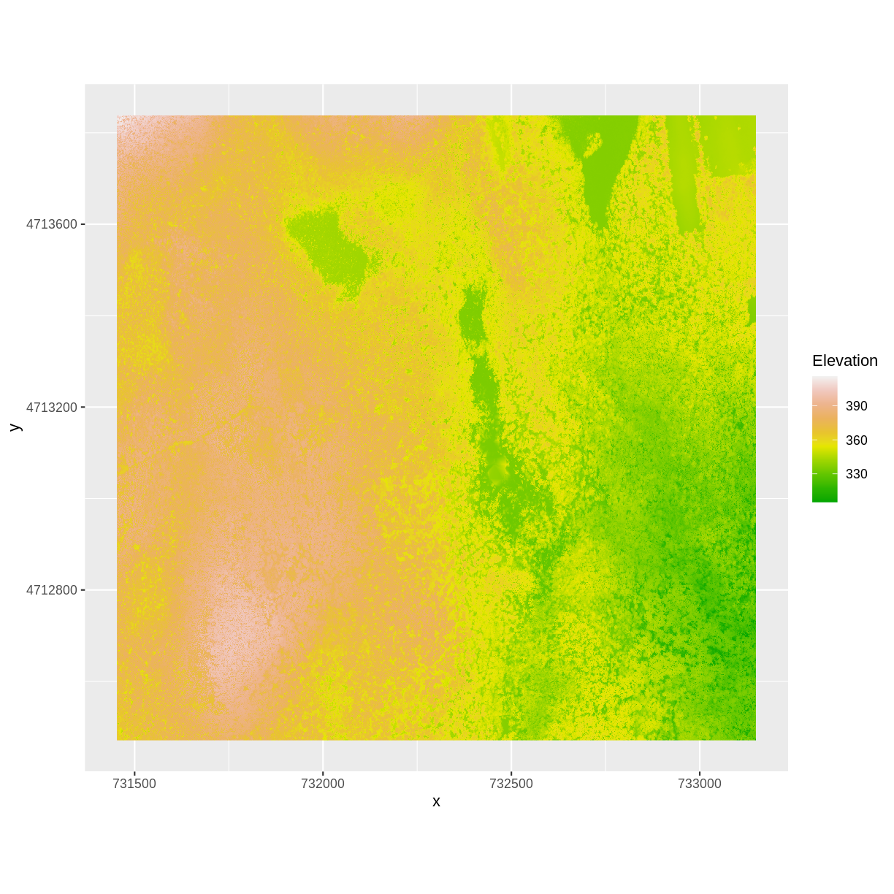
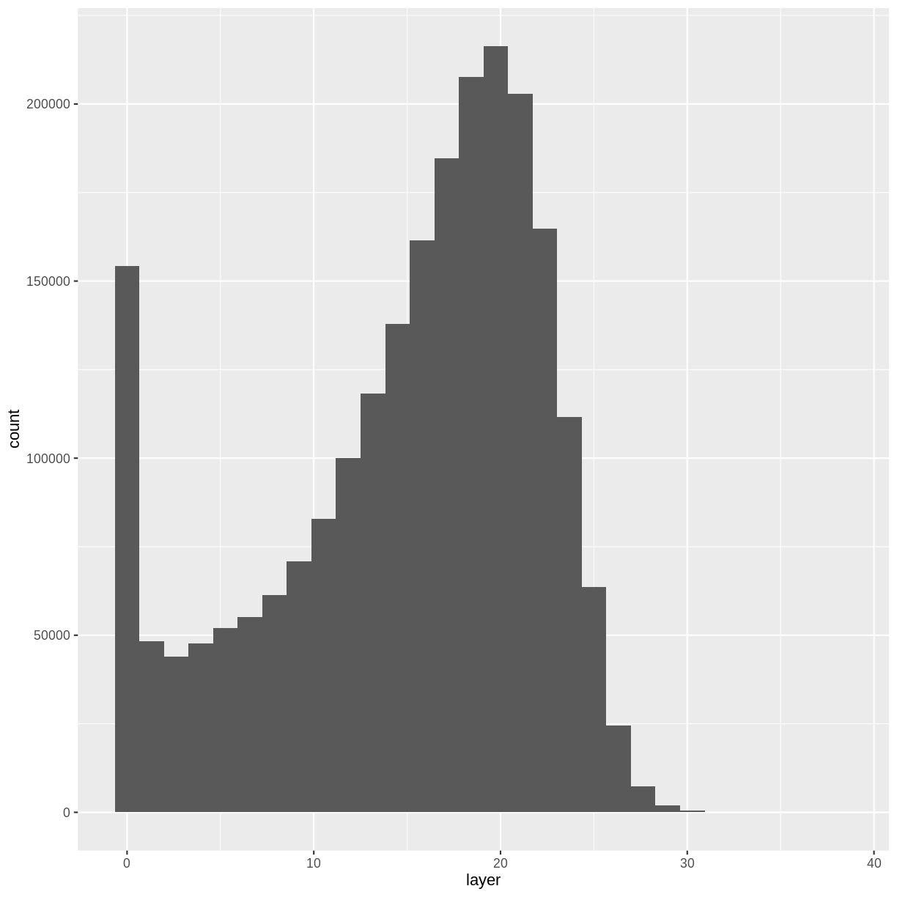
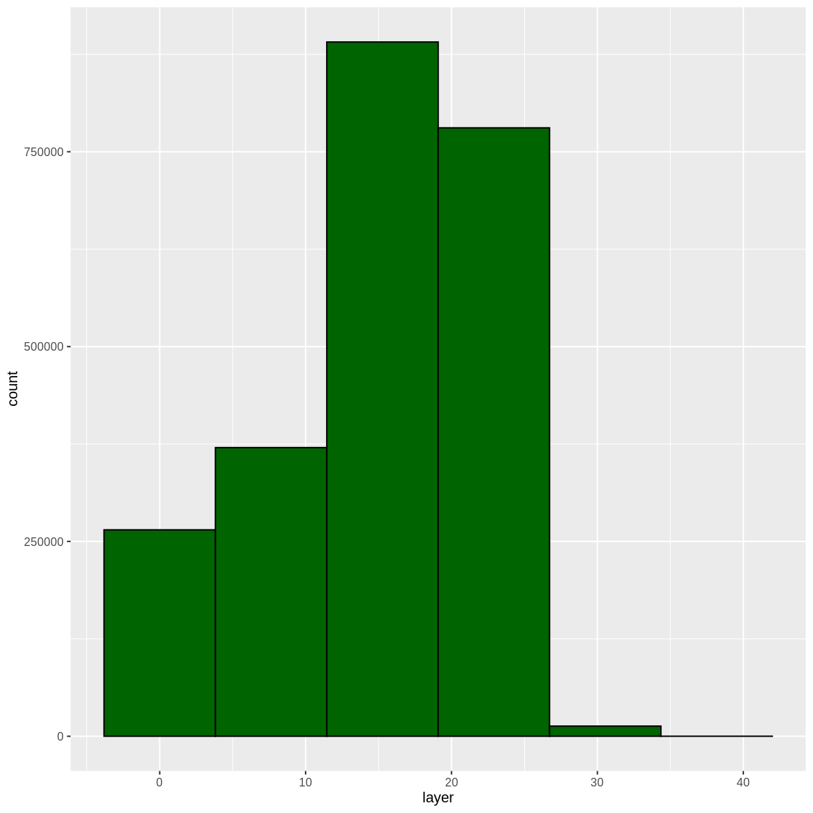
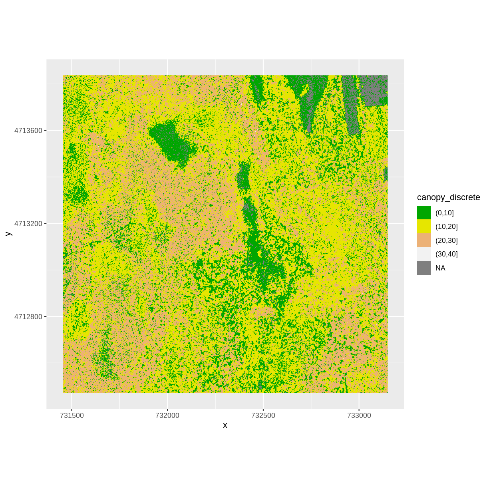
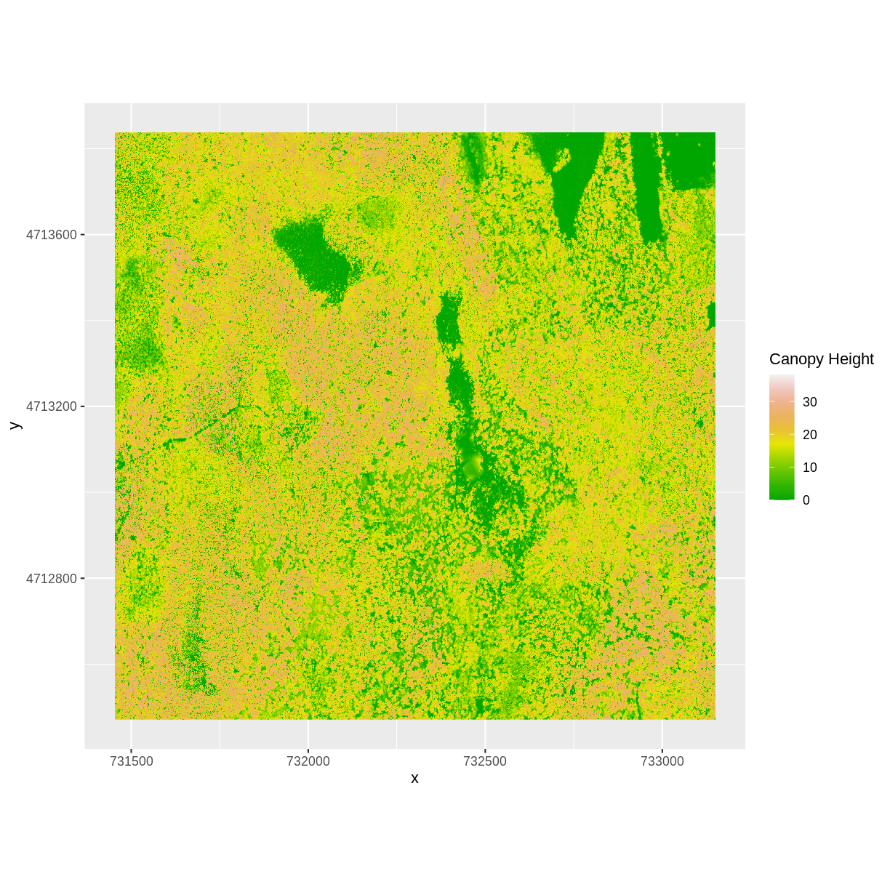
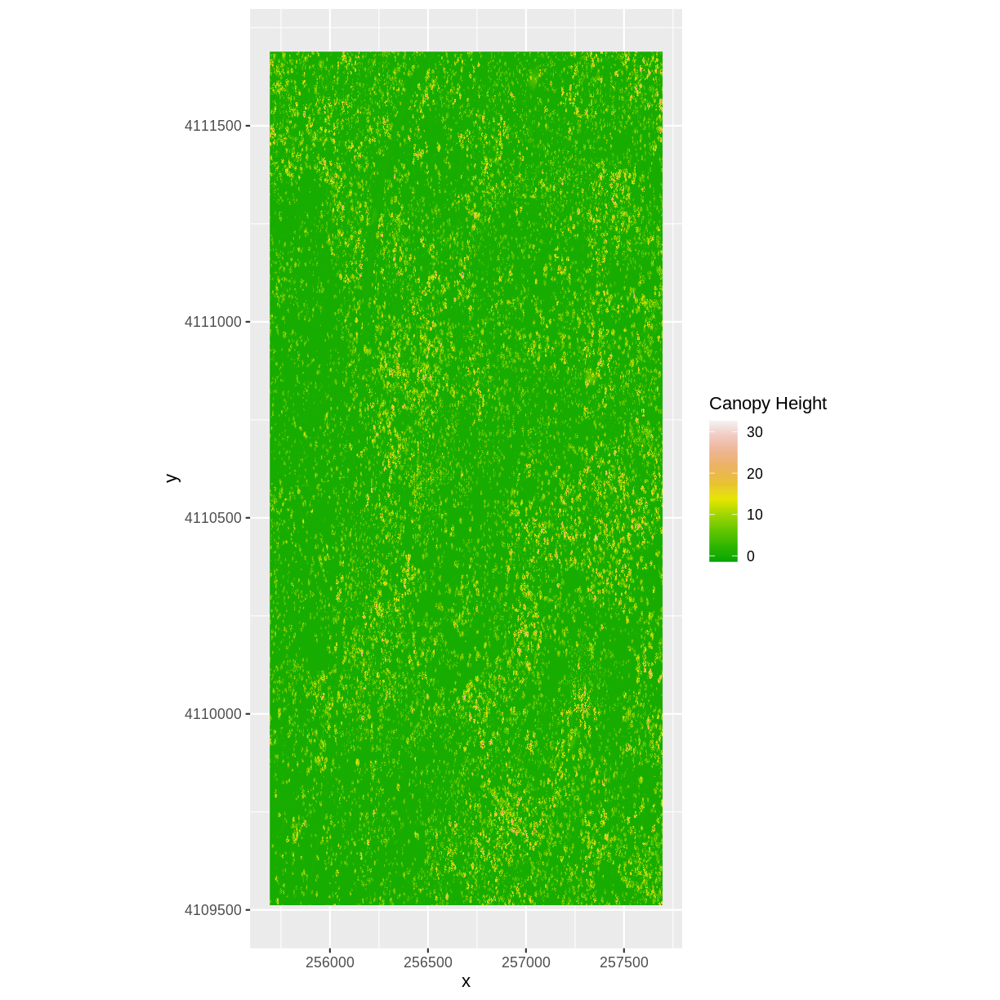
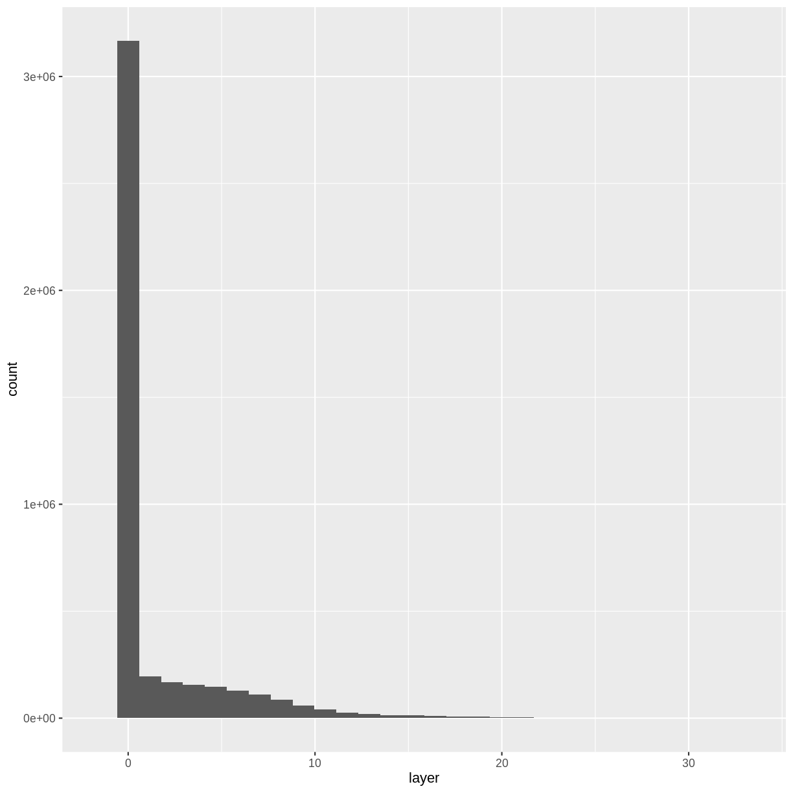

---
# Please do not edit this file directly; it is auto generated.
# Instead, please edit 04-raster-calculations-in-r.md in _episodes_rmd/
title: "Raster Calculations"
teaching: 40
exercises: 20
questions:
- "How do I subtract one raster from another and extract pixel values for defined locations?"
objectives:
- "Perform a subtraction between two rasters using raster math."
- "Perform a more efficient subtraction between two rasters using the raster `overlay()` function."
- "Export raster data as a GeoTIFF file."
keypoints:
- "Rasters can be computed on using mathematical functions."
- "The `overlay()` function provides an efficient way to do raster math."
- "The `writeRaster()` function can be used to write raster data to a file."
source: Rmd
---

> ## Things You’ll Need To Complete This Episode
> See the [lesson homepage]({{ site.baseurl }}) for detailed information about the software,
> data, and other prerequisites you will need to work through the examples in this episode.
{: .prereq}

We often want to combine values of and perform calculations on rasters to create
a new output raster. This episode covers how to subtract one raster from
another using basic raster math and the `overlay()` function. It also covers how
to extract pixel values from a set of locations - for example a buffer region
around plot locations at a field site.

## Raster Calculations in R
We often want to perform calculations on two or more rasters to create a new
output raster. For example, if we are interested in mapping the heights of trees
across an entire field site, we might want to calculate the difference between
the Digital Surface Model (DSM, tops of trees) and the
Digital Terrain Model (DTM, ground level). The resulting dataset is referred to
as a Canopy Height Model (CHM) and represents the actual height of trees,
buildings, etc. with the influence of ground elevation removed.

 

> ## More Resources
> * Check out more on LiDAR CHM, DTM and DSM in this NEON Data Skills overview tutorial:
> [What is a CHM, DSM and DTM? About Gridded, Raster LiDAR Data](https://www.neonscience.org/chm-dsm-dtm-gridded-lidar-data).
{: .callout}

### Load the Data
For this episode, we will use the DTM and DSM from the
NEON Harvard Forest Field site and San Joaquin Experimental
Range,
which we already have loaded from previous episodes.

> ## Exercise
> Use the `GDALinfo()` function to view information about the DTM and
> DSM data files. Do the two rasters have the same or different CRSs
> and resolutions? Do they both have defined minimum and maximum values?
>
> > ## Solution
> > 
> > ~~~
> > GDALinfo("data/NEON-DS-Airborne-Remote-Sensing/HARV/DTM/HARV_dtmCrop.tif")
> > ~~~
> > {: .language-r}
> > 
> > 
> > 
> > ~~~
> > rows        1367 
> > columns     1697 
> > bands       1 
> > lower left origin.x        731453 
> > lower left origin.y        4712471 
> > res.x       1 
> > res.y       1 
> > ysign       -1 
> > oblique.x   0 
> > oblique.y   0 
> > driver      GTiff 
> > projection  +proj=utm +zone=18 +datum=WGS84 +units=m +no_defs 
> > file        data/NEON-DS-Airborne-Remote-Sensing/HARV/DTM/HARV_dtmCrop.tif 
> > apparent band summary:
> >    GDType hasNoDataValue NoDataValue blockSize1 blockSize2
> > 1 Float64           TRUE       -9999          1       1697
> > apparent band statistics:
> >     Bmin   Bmax    Bmean      Bsd
> > 1 304.56 389.82 344.8979 15.86147
> > Metadata:
> > AREA_OR_POINT=Area 
> > ~~~
> > {: .output}
> > 
> > 
> > 
> > ~~~
> > GDALinfo("data/NEON-DS-Airborne-Remote-Sensing/HARV/DSM/HARV_dsmCrop.tif")
> > ~~~
> > {: .language-r}
> > 
> > 
> > 
> > ~~~
> > rows        1367 
> > columns     1697 
> > bands       1 
> > lower left origin.x        731453 
> > lower left origin.y        4712471 
> > res.x       1 
> > res.y       1 
> > ysign       -1 
> > oblique.x   0 
> > oblique.y   0 
> > driver      GTiff 
> > projection  +proj=utm +zone=18 +datum=WGS84 +units=m +no_defs 
> > file        data/NEON-DS-Airborne-Remote-Sensing/HARV/DSM/HARV_dsmCrop.tif 
> > apparent band summary:
> >    GDType hasNoDataValue NoDataValue blockSize1 blockSize2
> > 1 Float64           TRUE       -9999          1       1697
> > apparent band statistics:
> >     Bmin   Bmax    Bmean      Bsd
> > 1 305.07 416.07 359.8531 17.83169
> > Metadata:
> > AREA_OR_POINT=Area 
> > ~~~
> > {: .output}
> {: .solution}
{: .challenge}

We've already loaded and worked with these two data files in
earlier episodes. Let's plot them each once more to remind ourselves
what this data looks like. First we'll plot the DTM elevation data: 

~~~
 ggplot() +
      geom_raster(data = DTM_HARV_df , 
              aes(x = x, y = y, fill = HARV_dtmCrop)) +
     scale_fill_gradientn(name = "Elevation", colors = terrain.colors(10)) + 
     coord_quickmap()
~~~
{: .language-r}

And then the DSM elevation data: 

~~~
 ggplot() +
      geom_raster(data = DSM_HARV_df , 
              aes(x = x, y = y, fill = HARV_dsmCrop)) +
     scale_fill_gradientn(name = "Elevation", colors = terrain.colors(10)) + 
     coord_quickmap()
~~~
{: .language-r}

## Two Ways to Perform Raster Calculations

We can calculate the difference between two rasters in two different ways:

* by directly subtracting the two rasters in R using raster math

or for more efficient processing - particularly if our rasters are large and/or
the calculations we are performing are complex:

* using the `overlay()` function.

## Raster Math & Canopy Height Models
We can perform raster calculations by subtracting (or adding,
multiplying, etc) two rasters. In the geospatial world, we call this
"raster math".

Let's subtract the DTM from the DSM to create a Canopy Height Model. 
After subtracting, let's create a dataframe so we can plot with `ggplot`.

~~~
CHM_HARV <- DSM_HARV - DTM_HARV

CHM_HARV_df <- as.data.frame(CHM_HARV, xy = TRUE)
~~~
{: .language-r}

We can now plot the output CHM.

~~~
 ggplot() +
   geom_raster(data = CHM_HARV_df , 
               aes(x = x, y = y, fill = layer)) + 
   scale_fill_gradientn(name = "Canopy Height", colors = terrain.colors(10)) + 
   coord_quickmap()
~~~
{: .language-r}

Let's have a look at the distribution of values in our newly created
Canopy Height Model (CHM).

~~~
ggplot(CHM_HARV_df) +
    geom_histogram(aes(layer))
~~~
{: .language-r}

~~~
`stat_bin()` using `bins = 30`. Pick better value with `binwidth`.
~~~
{: .output}

~~~
Warning: Removed 1 rows containing non-finite values (stat_bin).
~~~
{: .warning}

Notice that the range of values for the output CHM is between 0 and 30 
meters. Does this make sense for trees in Harvard Forest?

> ## Challenge: Explore CHM Raster Values
> 
> It's often a good idea to explore the range of values in a raster dataset just like we might explore a dataset that we collected in the field.
> 
> 1. What is the min and maximum value for the Harvard Forest Canopy Height Model (`CHM_HARV`) that we just created?
> 2. What are two ways you can check this range of data for `CHM_HARV`?
> 3. What is the distribution of all the pixel values in the CHM?
> 4. Plot a histogram with 6 bins instead of the default and change the color of the histogram.
> 5. Plot the `CHM_HARV` raster using breaks that make sense for the data. Include an appropriate color palette for the data, plot title and no axes ticks / labels.
> 
> > ## Answers
> > 
> > 1) There are missing values in our data, so we need to specify 
> > `na.rm = TRUE`. 
> > 
> > ~~~
> > min(CHM_HARV_df$layer, na.rm = TRUE)
> > ~~~
> > {: .language-r}
> > 
> > 
> > 
> > ~~~
> > [1] 0
> > ~~~
> > {: .output}
> > 
> > 
> > 
> > ~~~
> > max(CHM_HARV_df$layer, na.rm = TRUE)
> > ~~~
> > {: .language-r}
> > 
> > 
> > 
> > ~~~
> > [1] 38.16998
> > ~~~
> > {: .output}
> > 2) Possible ways include: 
> > * Create a histogram
> > * Use the `min()` and `max()` functions.
> > * Print the object and look at the `values` attribute.
> > 3)
> > 
> > ~~~
> > ggplot(CHM_HARV_df) +
> >     geom_histogram(aes(layer))
> > ~~~
> > {: .language-r}
> > 
> > 
> > 
> > ~~~
> > `stat_bin()` using `bins = 30`. Pick better value with `binwidth`.
> > ~~~
> > {: .output}
> > 
> > 
> > 
> > ~~~
> > Warning: Removed 1 rows containing non-finite values (stat_bin).
> > ~~~
> > {: .warning}
> > 
> > 
> > 4)
> > 
> > ~~~
> > ggplot(CHM_HARV_df) +
> >     geom_histogram(aes(layer), colour="black", 
> >                    fill="darkgreen", bins = 6)
> > ~~~
> > {: .language-r}
> > 
> > 
> > 
> > ~~~
> > Warning: Removed 1 rows containing non-finite values (stat_bin).
> > ~~~
> > {: .warning}
> > 
> > 
> > 5) 
> > 
> > ~~~
> > custom_bins <- c(0, 10, 20, 30, 40)
> > CHM_HARV_df <- CHM_HARV_df %>%
> >                   mutate(canopy_discrete = cut(layer, breaks = custom_bins))
> > 
> > ggplot() +
> >   geom_raster(data = CHM_HARV_df , aes(x = x, y = y,
> >                                        fill = canopy_discrete)) + 
> >      scale_fill_manual(values = terrain.colors(4)) + 
> >      coord_quickmap()
> > ~~~
> > {: .language-r}
> > 
> > 
> {: .solution}
{: .challenge}

## Efficient Raster Calculations: Overlay Function

Raster math, like we just did, is an appropriate approach to raster calculations
if:

1. The rasters we are using are small in size.
2. The calculations we are performing are simple.

However, raster math is a less efficient approach as computation becomes more
complex or as file sizes become large.
The `overlay()` function is more efficient when:

1. The rasters we are using are larger in size.
2. The rasters are stored as individual files.
3. The computations performed are complex.

The `overlay()` function takes two or more rasters and applies a function to
them using efficient processing methods. The syntax is

`outputRaster <- overlay(raster1, raster2, fun=functionName)`

> ## Data Tip
> If the rasters are stacked and stored
> as `RasterStack` or `RasterBrick` objects in R, then we should use `calc()`.
> `overlay()` will not work on stacked rasters.
{: .callout}

Let's perform the same subtraction calculation that we calculated above using
raster math, using the `overlay()` function.

> ## Data Tip
>
> A custom function consists of a defined
> set of commands performed on a input object. Custom functions are particularly
> useful for tasks that need to be repeated over and over in the code. A
> simplified syntax for writing a custom function in R is:
> `function_name <- function(variable1, variable2) { WhatYouWantDone, WhatToReturn}`
{: .callout}

~~~
CHM_ov_HARV <- overlay(DSM_HARV,
                       DTM_HARV,
                       fun = function(r1, r2) { return( r1 - r2) })
~~~
{: .language-r}

Next we need to convert our new object to a data frame for plotting with 
`ggplot`. 

~~~
CHM_ov_HARV_df <- as.data.frame(CHM_ov_HARV, xy = TRUE)
~~~
{: .language-r}

Now we can plot the CHM:

~~~
 ggplot() +
   geom_raster(data = CHM_ov_HARV_df, 
               aes(x = x, y = y, fill = layer)) + 
   scale_fill_gradientn(name = "Canopy Height", colors = terrain.colors(10)) + 
   coord_quickmap()
~~~
{: .language-r}

How do the plots of the CHM created with manual raster math and the `overlay()`
function compare?

## Export a GeoTIFF
Now that we've created a new raster, let's export the data as a GeoTIFF
file using
the `writeRaster()` function.

When we write this raster object to a GeoTIFF file we'll name it
`CHM_HARV.tiff`. This name allows us to quickly remember both what the data
contains (CHM data) and for where (HARVard Forest). The `writeRaster()` function
by default writes the output file to your working directory unless you specify a
full file path.

We will specify the output format ("GTiff"), the no data value (`NAflag = -9999`. We will also tell R to overwrite any data that is already in
a file of the same name. 

~~~
writeRaster(CHM_ov_HARV, "CHM_HARV.tiff",
            format="GTiff",
            overwrite=TRUE,
            NAflag=-9999)
~~~
{: .language-r}

### writeRaster() Options

The function arguments that we used above include:

* **format:** specify that the format will be `GTiff` or GeoTIFF.
* **overwrite:** If TRUE, R will overwrite any existing file  with the same
name in the specified directory. USE THIS SETTING WITH CAUTION!
* **NAflag:** set the GeoTIFF tag for `NoDataValue` to -9999, the National
Ecological Observatory Network's (NEON) standard `NoDataValue`.

> ## Challenge: Explore the NEON San Joaquin Experimental Range Field Site
> 
> Data are often more interesting and powerful when we compare them across various
> locations. Let's compare some data collected over Harvard Forest to data
> collected in Southern California. The
> [NEON San Joaquin Experimental Range (SJER) field site](https://www.neonscience.org/field-sites/field-sites-map/SJER)
> located in Southern California has a very different ecosystem and climate than
> the
> [NEON Harvard Forest Field Site](https://www.neonscience.org/field-sites/field-sites-map/HARV)
in Massachusetts.
> 
> Import the SJER DSM and DTM raster files and create a Canopy Height Model.
> Then compare the two sites. Be sure to name your R objects and outputs
> carefully, as follows: objectType_SJER (e.g. `DSM_SJER`). This will help you
> keep track of data from different sites!
> 
> 0. You should have the DSM and DTM data for the SJER site already
> loaded from the 
> [Plot Raster Data in R]({{ site.baseurl }}/02-raster-plot/)
episode.) Don't forget to check the CRSs and units of the data. 
> 1. Create a CHM from the two raster layers and check to make sure the data
are what you expect.
> 2. Plot the CHM from SJER.
> 3. Export the SJER CHM as a GeoTIFF.
> 4. Compare the vegetation structure of the Harvard Forest and San Joaquin
> Experimental Range.
> 
> > ## Answers
> > 1) Use the `overlay()` function to subtract the two rasters & create
> > the CHM.
> >
> > 
> > ~~~
> > CHM_ov_SJER <- overlay(DSM_SJER,
> >                        DTM_SJER,
> >                        fun = function(r1, r2){ return(r1 - r2) })
> > ~~~
> > {: .language-r}
> > Convert the output to a dataframe:
> >
> > 
> > ~~~
> > CHM_ov_SJER_df <- as.data.frame(CHM_ov_SJER, xy = TRUE)
> > ~~~
> > {: .language-r}
> >
> > Create a histogram to check that the data distribution makes sense: 
> >
> > 
> > ~~~
> > ggplot(CHM_ov_SJER_df) +
> >     geom_histogram(aes(layer))
> > ~~~
> > {: .language-r}
> > 
> > 
> > 
> > ~~~
> > `stat_bin()` using `bins = 30`. Pick better value with `binwidth`.
> > ~~~
> > {: .output}
> > 
> > 
> >
> > 2) Create a plot of the CHM: 
> >
> > 
> > ~~~
> >  ggplot() +
> >       geom_raster(data = CHM_ov_SJER_df, 
> >               aes(x = x, y = y, 
> >                    fill = layer)
> >               ) + 
> >      scale_fill_gradientn(name = "Canopy Height", 
> >         colors = terrain.colors(10)) + 
> >      coord_quickmap()
> > ~~~
> > {: .language-r}
> > 
> > 
> > 
> > 3) Export the CHM object to a file: 
> >
> > 
> > ~~~
> > writeRaster(CHM_ov_SJER, "chm_ov_SJER.tiff",
> >             format = "GTiff",
> >             overwrite = TRUE,
> >             NAflag = -9999)
> > ~~~
> > {: .language-r}
> >
> > 4) Compare the SJER and HARV CHMs. 
> > Tree heights are much shorter in SJER. You can confirm this by 
> > looking at the histograms of the two CHMs. 
> >
> > 
> > ~~~
> > ggplot(CHM_HARV_df) +
> >     geom_histogram(aes(layer))
> > ~~~
> > {: .language-r}
> > 
> > 
> > 
> > ~~~
> > `stat_bin()` using `bins = 30`. Pick better value with `binwidth`.
> > ~~~
> > {: .output}
> > 
> > 
> > 
> > ~~~
> > Warning: Removed 1 rows containing non-finite values (stat_bin).
> > ~~~
> > {: .warning}
> > 
> > 
> > 
> > ~~~
> > ggplot(CHM_ov_SJER_df) +
> >     geom_histogram(aes(layer))
> > ~~~
> > {: .language-r}
> > 
> > 
> > 
> > ~~~
> > `stat_bin()` using `bins = 30`. Pick better value with `binwidth`.
> > ~~~
> > {: .output}
> > 
> > 
> {: .solution}
{: .challenge}


