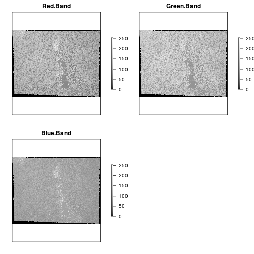
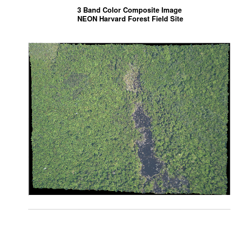
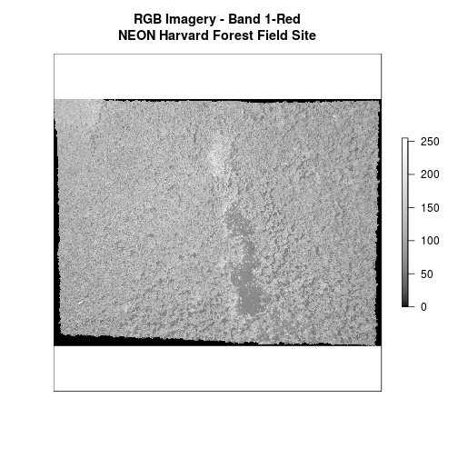
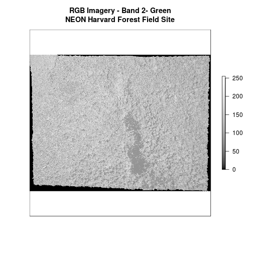
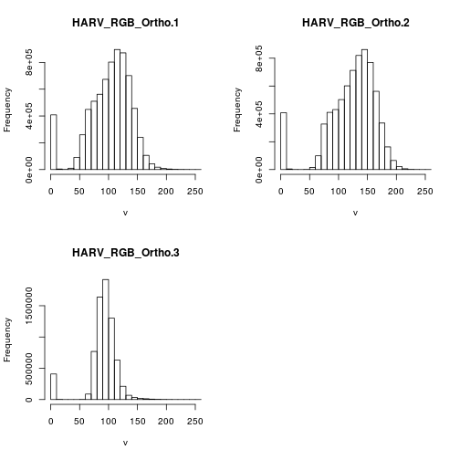
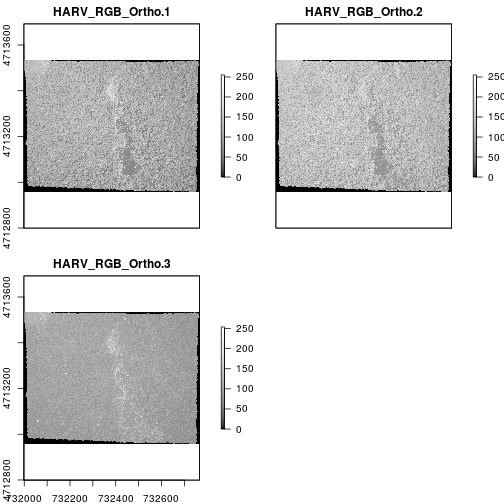
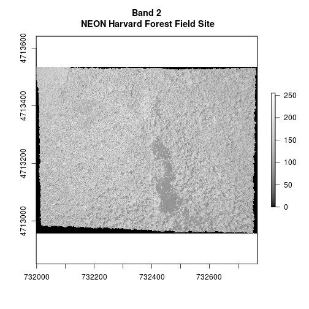
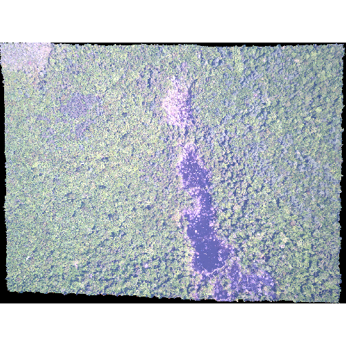
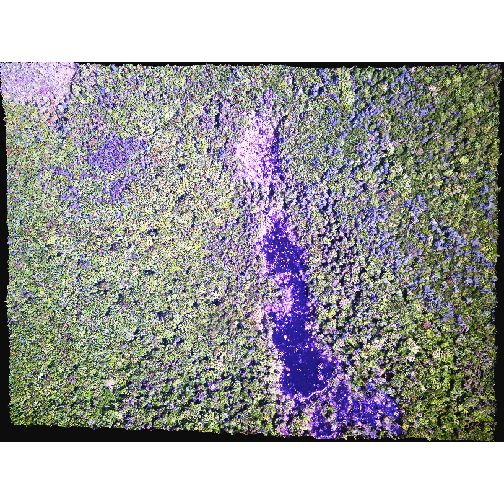
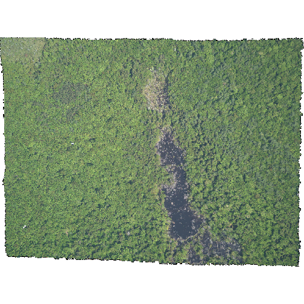

> ## Things You’ll Need To Complete This Tutorial
> **R Skill Level:** Intermediate - you've got the basics of `R` down.
>
You will need the most current version of `R` and, preferably, `RStudio` loaded
on your computer to complete this tutorial.
>
> ### Install R Packages
>
> * **raster:** `install.packages("raster")`
> * **rgdal:** `install.packages("rgdal")`
>
> * [More on Packages in R - Adapted from Software Carpentry.]({{site.baseurl}}/R/Packages-In-R/)
>
> #### Data to Download
>
{: .prereq}

This tutorial explores how to import and plot a multi-band raster in
R. It also covers how to plot a three-band color image using the `plotRGB()`
function in `R`.

## The Basics of Imagery - About Spectral Remote Sensing Data

<iframe width="560" height="315" src="https://www.youtube.com/embed/3iaFzafWJQE" frameborder="0" allowfullscreen></iframe>

## About Raster Bands in R
As discussed in the
[Intro to Raster Data tutorial]({{ base.url }}/R/Introduction-to-Raster-Data-In-R),
a raster can contain 1 or more bands.

<figure>
    
    <figcaption>A raster can contain one or more bands. We can use the
    raster function to import one single band from a single OR multi-band
    raster.  Source: National Ecological Observatory Network (NEON).</figcaption>
</figure>

To work with multi-band rasters in `R`, we need to change how we import and plot
our data in several ways.

* To import multi band raster data we will use the `stack()` function.
* If our multi-band data are imagery that we wish to composite, we can use
`plotRGB()` (instead of `plot()`) to plot a 3 band raster image.

## About Multi-Band Imagery
One type of multi-band raster dataset that is familiar to many of us is a color
image. A basic color image consists of three bands: red, green, and blue. Each
band represents light reflected from the red, green or blue portions of the
electromagnetic spectrum. The pixel brightness for each band, when composited
creates the colors that we see in an image.

<figure>
    
    <figcaption>A color image consists of 3 bands - red, green and blue. When
    rendered together in a GIS, or even a tool like Photoshop or any other
    image software, they create a color image.
	Source: National Ecological Observatory Network (NEON).
    </figcaption>
</figure>

We can plot each band of a multi-band image individually.

> ## Data Tip
> In many GIS applications, a single band
> would render as a single image in grayscale. We will therefore use a grayscale
> palette to render individual bands.
{: .callout}

~~~
Loading required package: sp
~~~
{: .output}

Or we can composite all three bands together to make a color image.

In a multi-band dataset, the rasters will always have the same *extent*,
*CRS* and *resolution*.

## Other Types of Multi-band Raster Data

Multi-band raster data might also contain:

1. **Time series:** the same variable, over the same area, over time. Check out
[Raster Time Series Data in R ]({{site.baseurl}}/R/Raster-Times-Series-Data-In-R/)
to learn more about time series stacks.
2. **Multi or hyperspectral imagery:** image rasters that have 4 or more
(multi-spectral) or more than 10-15 (hyperspectral) bands. Check out the NEON
Data Skills
[Imaging Spectroscopy HDF5 in R ]({{site.baseurl}}/HDF5/Imaging-Spectroscopy-HDF5-In-R/)
tutorial for more about working with hyperspectral data cubes.

## Getting Started with Multi-Band Data in R
To work with multi-band raster data we will use the `raster` and `rgdal`
packages.

~~~
# work with raster data
library(raster)
# export GeoTIFFs and other core GIS functions
library(rgdal)
~~~
{: .r}

~~~
rgdal: version: 1.2-8, (SVN revision 663)
 Geospatial Data Abstraction Library extensions to R successfully loaded
 Loaded GDAL runtime: GDAL 2.2.1, released 2017/06/23
 Path to GDAL shared files: /usr/share/gdal/2.2
 Loaded PROJ.4 runtime: Rel. 4.9.2, 08 September 2015, [PJ_VERSION: 492]
 Path to PROJ.4 shared files: (autodetected)
 Linking to sp version: 1.2-5 
~~~
{: .output}

In this tutorial, the multi-band data that we are working with is imagery
collected using the
<a href="http://www.neonscience.org/science-design/collection-methods/airborne-remote-sensing"
target="_blank">NEON Airborne Observation Platform</a>
high resolution camera over the
<a href="http://www.neonscience.org/science-design/field-sites/harvard-forest"
target="_blank">NEON Harvard Forest field site</a>.
Each RGB image is a 3-band raster. The same steps would apply to
working with a multi-spectral image with 4 or more bands - like Landsat imagery.

If we read a `rasterStack` into `R` using the `raster()` function, it only reads
in the first band. We can plot this band using the plot function.

~~~
# Read in multi-band raster with raster function.
# Default is the first band only.
RGB_band1_HARV <-
  raster("data/NEON-DS-Airborne-Remote-Sensing/HARV/RGB_Imagery/HARV_RGB_Ortho.tif")

# create a grayscale color palette to use for the image.
grayscale_colors <- gray.colors(100,            # number of different color levels
                                start = 0.0,    # how black (0) to go
                                end = 1.0,      # how white (1) to go
                                gamma = 2.2,    # correction between how a digital
                                # camera sees the world and how human eyes see it
                                alpha = NULL)   #Null = colors are not transparent

# Plot band 1
plot(RGB_band1_HARV,
     col = grayscale_colors,
     axes = FALSE,
     main = "RGB Imagery - Band 1-Red\nNEON Harvard Forest Field Site")
~~~
{: .r}

~~~
# view attributes: Check out dimension, CRS, resolution, values attributes, and
# band.
RGB_band1_HARV
~~~
{: .r}

~~~
class       : RasterLayer 
band        : 1  (of  3  bands)
dimensions  : 2317, 3073, 7120141  (nrow, ncol, ncell)
resolution  : 0.25, 0.25  (x, y)
extent      : 731998.5, 732766.8, 4712956, 4713536  (xmin, xmax, ymin, ymax)
coord. ref. : +proj=utm +zone=18 +datum=WGS84 +units=m +no_defs +ellps=WGS84 +towgs84=0,0,0 
data source : /home/jose/Documents/Science/Projects/software-carpentry/data-carpentry_lessons/R-spatial-raster-vector-lesson/_episodes_rmd/data/NEON-DS-Airborne-Remote-Sensing/HARV/RGB_Imagery/HARV_RGB_Ortho.tif 
names       : HARV_RGB_Ortho 
values      : 0, 255  (min, max)
~~~
{: .output}

Notice that when we look at the attributes of RGB_Band1, we see :

`band: 1  (of  3  bands)`

This is `R` telling us that this particular raster object has more bands (3)
associated with it.

> ## Data Tip
> The number of bands associated with a
> raster object can also be determined using the `nbands` slot. Syntax is
> `ObjectName@file@nbands`, or specifically for our file: `RGB_band1@file@nbands`.
{: .callout}

### Image Raster Data Values
Let's next examine the raster's min and max values. What is the value range?

~~~
# view min value
minValue(RGB_band1_HARV)
~~~
{: .r}

~~~
[1] 0
~~~
{: .output}

~~~
# view max value
maxValue(RGB_band1_HARV)
~~~
{: .r}

~~~
[1] 255
~~~
{: .output}

This raster contains values between 0 and 255. These values
represent degrees of brightness associated with the image band. In
the case of a RGB image (red, green and blue), band 1 is the red band. When
we plot the red band, larger numbers (towards 255) represent pixels with more
red in them (a strong red reflection). Smaller numbers (towards 0) represent
pixels with less red in them (less red was reflected). To
plot an RGB image, we mix red + green + blue values into one single color to
create a full color image - similar to the color image a digital camera creates.

### Import A Specific Band
We can use the `raster()` function to import specific bands in our raster object
by specifying which band we want with `band=N` (N represents the band number we
want to work with). To import the green band, we would use `band=2`.

~~~
# Can specify which band we want to read in
RGB_band2_HARV <-
  raster("data/NEON-DS-Airborne-Remote-Sensing/HARV/RGB_Imagery/HARV_RGB_Ortho.tif",
           band = 2)

# plot band 2
plot(RGB_band2_HARV,
     col = grayscale_colors, # we already created this palette & can use it again
     axes = FALSE,
     main = "RGB Imagery - Band 2- Green\nNEON Harvard Forest Field Site")
~~~
{: .r}

~~~
# view attributes of band 2
RGB_band2_HARV
~~~
{: .r}

~~~
class       : RasterLayer 
band        : 2  (of  3  bands)
dimensions  : 2317, 3073, 7120141  (nrow, ncol, ncell)
resolution  : 0.25, 0.25  (x, y)
extent      : 731998.5, 732766.8, 4712956, 4713536  (xmin, xmax, ymin, ymax)
coord. ref. : +proj=utm +zone=18 +datum=WGS84 +units=m +no_defs +ellps=WGS84 +towgs84=0,0,0 
data source : /home/jose/Documents/Science/Projects/software-carpentry/data-carpentry_lessons/R-spatial-raster-vector-lesson/_episodes_rmd/data/NEON-DS-Airborne-Remote-Sensing/HARV/RGB_Imagery/HARV_RGB_Ortho.tif 
names       : HARV_RGB_Ortho 
values      : 0, 255  (min, max)
~~~
{: .output}

Notice that band 2 is the second of 3 bands `band: 2  (of  3  bands)`.

> ## Challenge: Making Sense of Single Band Images
> 
> Compare the plots of band 1 (red) and band 2 (green). Is the forested area darker or lighter in band 2 (the green band) compared to band 1 (the red band)? >
> > ## Answers
> > 
> > 
> > ~~~
> > # We'd expect a *brighter* value for the forest in band 2 (green) than in
> > # band 1 (red) because the leaves on trees of most often appear "green" -
> > # healthy leaves reflect MORE green light compared to red light
> > ~~~
> > {: .r}
> {: .solution}
{: .challenge}

## Raster Stacks in R
Next, we will work with all three image bands (red, green and blue) as an `R`
`RasterStack` object. We will then plot a 3-band composite, or full color,
image.

To bring in all bands of a multi-band raster, we use the`stack()` function.

~~~
# Use stack function to read in all bands
RGB_stack_HARV <-
  stack("data/NEON-DS-Airborne-Remote-Sensing/HARV/RGB_Imagery/HARV_RGB_Ortho.tif")

# view attributes of stack object
RGB_stack_HARV
~~~
{: .r}

~~~
class       : RasterStack 
dimensions  : 2317, 3073, 7120141, 3  (nrow, ncol, ncell, nlayers)
resolution  : 0.25, 0.25  (x, y)
extent      : 731998.5, 732766.8, 4712956, 4713536  (xmin, xmax, ymin, ymax)
coord. ref. : +proj=utm +zone=18 +datum=WGS84 +units=m +no_defs +ellps=WGS84 +towgs84=0,0,0 
names       : HARV_RGB_Ortho.1, HARV_RGB_Ortho.2, HARV_RGB_Ortho.3 
min values  :                0,                0,                0 
max values  :              255,              255,              255 
~~~
{: .output}

We can view the attributes of each band the stack using `RGB_stack_HARV@layers`.
Or we if we have hundreds of bands, we can specify which band we'd like to view
attributes for using an index value: `RGB_stack_HARV[[1]]`. We can also use the
 `plot()` and `hist()` functions on the `RasterStack` to plot and view the
 distribution of raster band values.

~~~
# view raster attributes
RGB_stack_HARV@layers
~~~
{: .r}

~~~
[[1]]
class       : RasterLayer 
band        : 1  (of  3  bands)
dimensions  : 2317, 3073, 7120141  (nrow, ncol, ncell)
resolution  : 0.25, 0.25  (x, y)
extent      : 731998.5, 732766.8, 4712956, 4713536  (xmin, xmax, ymin, ymax)
coord. ref. : +proj=utm +zone=18 +datum=WGS84 +units=m +no_defs +ellps=WGS84 +towgs84=0,0,0 
data source : /home/jose/Documents/Science/Projects/software-carpentry/data-carpentry_lessons/R-spatial-raster-vector-lesson/_episodes_rmd/data/NEON-DS-Airborne-Remote-Sensing/HARV/RGB_Imagery/HARV_RGB_Ortho.tif 
names       : HARV_RGB_Ortho.1 
values      : 0, 255  (min, max)

[[2]]
class       : RasterLayer 
band        : 2  (of  3  bands)
dimensions  : 2317, 3073, 7120141  (nrow, ncol, ncell)
resolution  : 0.25, 0.25  (x, y)
extent      : 731998.5, 732766.8, 4712956, 4713536  (xmin, xmax, ymin, ymax)
coord. ref. : +proj=utm +zone=18 +datum=WGS84 +units=m +no_defs +ellps=WGS84 +towgs84=0,0,0 
data source : /home/jose/Documents/Science/Projects/software-carpentry/data-carpentry_lessons/R-spatial-raster-vector-lesson/_episodes_rmd/data/NEON-DS-Airborne-Remote-Sensing/HARV/RGB_Imagery/HARV_RGB_Ortho.tif 
names       : HARV_RGB_Ortho.2 
values      : 0, 255  (min, max)

[[3]]
class       : RasterLayer 
band        : 3  (of  3  bands)
dimensions  : 2317, 3073, 7120141  (nrow, ncol, ncell)
resolution  : 0.25, 0.25  (x, y)
extent      : 731998.5, 732766.8, 4712956, 4713536  (xmin, xmax, ymin, ymax)
coord. ref. : +proj=utm +zone=18 +datum=WGS84 +units=m +no_defs +ellps=WGS84 +towgs84=0,0,0 
data source : /home/jose/Documents/Science/Projects/software-carpentry/data-carpentry_lessons/R-spatial-raster-vector-lesson/_episodes_rmd/data/NEON-DS-Airborne-Remote-Sensing/HARV/RGB_Imagery/HARV_RGB_Ortho.tif 
names       : HARV_RGB_Ortho.3 
values      : 0, 255  (min, max)
~~~
{: .output}

~~~
# view attributes for one band
RGB_stack_HARV[[1]]
~~~
{: .r}

~~~
class       : RasterLayer 
band        : 1  (of  3  bands)
dimensions  : 2317, 3073, 7120141  (nrow, ncol, ncell)
resolution  : 0.25, 0.25  (x, y)
extent      : 731998.5, 732766.8, 4712956, 4713536  (xmin, xmax, ymin, ymax)
coord. ref. : +proj=utm +zone=18 +datum=WGS84 +units=m +no_defs +ellps=WGS84 +towgs84=0,0,0 
data source : /home/jose/Documents/Science/Projects/software-carpentry/data-carpentry_lessons/R-spatial-raster-vector-lesson/_episodes_rmd/data/NEON-DS-Airborne-Remote-Sensing/HARV/RGB_Imagery/HARV_RGB_Ortho.tif 
names       : HARV_RGB_Ortho.1 
values      : 0, 255  (min, max)
~~~
{: .output}

~~~
# view histogram of all 3 bands
hist(RGB_stack_HARV,
     maxpixels = ncell(RGB_stack_HARV))

# plot all three bands separately
plot(RGB_stack_HARV,
     col = grayscale_colors)
~~~
{: .r}

~~~
# revert to a single plot layout
par(mfrow = c(1, 1)) 

# plot band 2
plot(RGB_stack_HARV[[2]],
     main = "Band 2\n NEON Harvard Forest Field Site",
     col = grayscale_colors)
~~~
{: .r}

### Create A Three Band Image
To render a final 3 band, color image in `R`, we use `plotRGB()`.

This function allows us to:

1. Identify what bands we want to render in the red, green and blue regions. The
`plotRGB()` function defaults to a 1=red, 2=green, and 3=blue band order. However,
you can define what bands you'd like to plot manually. Manual definition of
bands is useful if you have, for example a near-infrared band and want to create
a color infrared image.
2. Adjust the `stretch` of the image to increase or decrease contrast.

Let's plot our 3-band image.

~~~
# Create an RGB image from the raster stack
plotRGB(RGB_stack_HARV,
        r = 1, g = 2, b = 3)
~~~
{: .r}

The image above looks pretty good. We can explore whether applying a stretch to
the image might improve clarity and contrast using  `stretch="lin"` or
`stretch="hist"`.

<figure>
    
    <figcaption>When the range of pixel brightness values is closer to 0, a
    darker image is rendered by default. We can stretch the values to extend to
    the full 0-255 range of potential values to increase the visual contrast of
    the image.
    </figcaption>
</figure>

<figure>
    
    <figcaption>When the range of pixel brightness values is closer to 255, a
    lighter image is rendered by default. We can stretch the values to extend to
    the full 0-255 range of potential values to increase the visual contrast of
    the image.
    </figcaption>
</figure>

~~~
# what does stretch do?
plotRGB(RGB_stack_HARV,
        r = 1, g = 2, b = 3,
        scale = 800,
        stretch = "lin")
~~~
{: .r}

~~~
plotRGB(RGB_stack_HARV,
        r = 1, g = 2, b = 3,
        scale = 800,
        stretch = "hist")
~~~
{: .r}

In this case, the stretch doesn't enhance the contrast our image significantly
given the distribution of reflectance (or brightness) values is distributed well
between 0 and 255.

> ## Challenge - NoData Values
> 
> Let's explore what happens with NoData values when using `RasterStack` and
> `plotRGB`. We will use the `HARV_Ortho_wNA.tif` GeoTIFF in the
> `NEON-DS-Airborne-Remote-Sensing/HARVRGB_Imagery/` directory.
> 
> 1. View the files attributes. Are there `NoData` values assigned for this file?
> 2. If so, what is the `NoData` Value?
> 3. How many bands does it have?
> 4. Open the multi-band raster file in `R`.
> 5. Plot the object as a true color image.
> 6. What happened to the black edges in the data?
> 7. What does this tell us about the difference in the data structure between
> `HARV_Ortho_wNA.tif` and `HARV_RGB_Ortho.tif` (`R` object `RGB_stack`). How can
> you check?
> 
> Answer the questions above using the functions we have covered so far in this
tutorial.
> 
> > ## Answers
> > 
> > ~~~
> > # 1.
> > # view attributes
> > GDALinfo("data/NEON-DS-Airborne-Remote-Sensing/HARV/RGB_Imagery/HARV_Ortho_wNA.tif")
> > 
> > # 2 Yes it has NoData values as they are assigned as -9999
> > # 3 3 bands
> > 
> > # 4
> > # reading in file
> > HARV_NA <-
> >   stack("data/NEON-DS-Airborne-Remote-Sensing/HARV/RGB_Imagery/HARV_Ortho_wNA.tif")
> > 
> > # 5
> > plotRGB(HARV_NA,
> >         r = 1, g = 2, b = 3)
> > ~~~
> > {: .r}
> > 
> > 
> > 
> > ~~~
> > #6 The black edges are not plotted.
> > #7 Both have NoData values, however, in RGB_stack the NoData value is not
> > # defined in the tiff tags, thus R renders them as black as the reflectance
> > # values are 0. The black edges in the other file are defined as -9999 and R
> > # renders them as NA.
> > GDALinfo("data/NEON-DS-Airborne-Remote-Sensing/HARV/RGB_Imagery/HARV_RGB_Ortho.tif")
> > ~~~
> > {: .r}
> {: .solution}
{: .challenge}

> ## Data Tip
> We can create a RasterStack from
> several, individual single-band GeoTIFFs too. Check out:
> [Raster Time Series Data in R]({{ site.baseurl }}/R/Raster-Times-Series-Data-In-R/)
> for a tutorial on how to do this.
{: .callout}

## RasterStack vs RasterBrick in R

The `R` `RasterStack` and `RasterBrick` object types can both store multiple bands.
However, how they store each band is different. The bands in a `RasterStack` are
stored as links to raster data that is located somewhere on our computer. A
`RasterBrick` contains all of the objects stored within the actual `R` object.
In most cases, we can work with a `RasterBrick` in the same way we might work
with a `RasterStack`. However a `RasterBrick` is often more efficient and faster
to process - which is important when working with larger files.

* <a href="http://www.inside-r.org/packages/cran/raster/docs/brick" target="_blank">
More on Raster Bricks</a>

We can turn a `RasterStack` into a `RasterBrick` in `R` by using
`brick(StackName)`. Let's use the `object.size()` function to compare `stack`
and `brick` `R` objects.

~~~
# view size of the RGB_stack object that contains our 3 band image
object.size(RGB_stack_HARV)
~~~
{: .r}

~~~
41928 bytes
~~~
{: .output}

~~~
# convert stack to a brick
RGB_brick_HARV <- brick(RGB_stack_HARV)

# view size of the brick
object.size(RGB_brick_HARV)
~~~
{: .r}

~~~
170896376 bytes
~~~
{: .output}

Notice that in the `RasterBrick`, all of the bands are stored within the actual
object. Thus, the `RasterBrick` object size is much larger than the
`RasterStack` object.

You use `plotRGB` to block a `RasterBrick` too.

~~~
# plot brick
plotRGB(RGB_brick_HARV)
~~~
{: .r}

> ## Challenge: What Methods Can Be Used on an R Object?
> 
> We can view various methods available to call on an `R` object with
> `methods(class=class(objectNameHere))`. Use this to figure out:
> 
> 1. What methods can be used to call on the `RGB_stack_HARV` object?
> 2. What methods are available for a single band within `RGB_stack_HARV`?
> 3. Why do you think there is a difference?
> 
> > ## Answers
> > 
> > ~~~
> > # 1
> > # methods for calling a stack
> > methods(class=class(RGB_stack_HARV))
> > # 143 methods!
> > 
> > # 2
> > # methods for calling a band (1) with a stack
> > methods(class=class(RGB_stack_HARV[1]))
> > 
> > #3 There are far more thing one could or wants to ask of a full stack than of
> > # a single band.
> > ~~~
> > {: .r}
> {: .solution}
{: .challenge}
