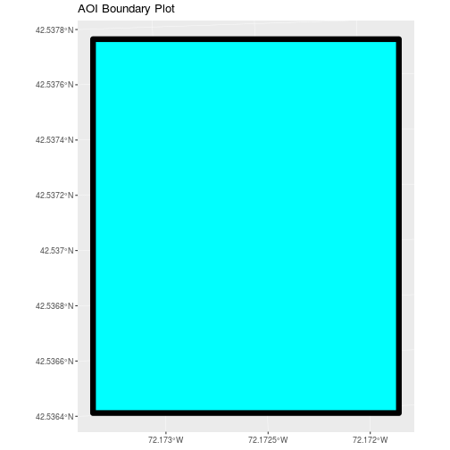
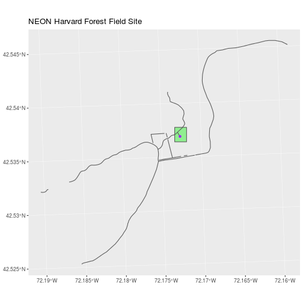
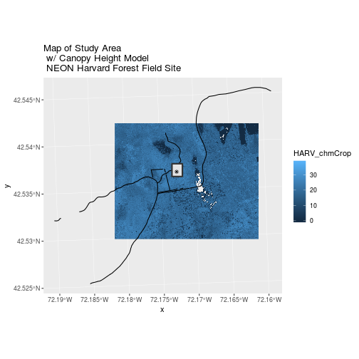

---
# Please do not edit this file directly; it is auto generated.
# Instead, please edit 06-vector-open-shapefile-in-r.md in _episodes_rmd/
title: "Open and Plot Shapefiles in R"
teaching: 20
exercises: 10
questions:
- "Getting started with point, line and polygon vector data."
objectives:
- "Know the difference between point, line, and polygon vector elements."
- "Understand the differences between opening point, line and polygon shapefiles in `R`."
- "Understand the components of a spatial object in `R`."
keypoints:
- ""
---

> ## Things You’ll Need To Complete This Episode
> See the [lesson homepage]({{ site.baseurl }}) for detailed information about the software,
> data, and other prerequisites you will need to work through the examples in this episode.
{: .prereq}

In this episode, we will open and plot point, line and polygon vector data
stored in shapefile format in `R`.

## Import Shapefiles

We will use the `sf` package to work with vector data in `R`. Notice that the
`rgdal` package automatically loads when `sf` is loaded. We will use the
`raster` package, which has been loaded in previous episodes, so we can explore raster and vector spatial metadata using similar commands.

~~~
library(sf)
~~~
{: .language-r}

~~~
Linking to GEOS 3.5.0, GDAL 2.2.2, proj.4 4.8.0
~~~
{: .output}

The shapefiles that we will import are:

* A polygon shapefile representing our field site boundary,
* A line shapefile representing roads, and
* A point shapefile representing the location of the Fisher
<a href="http://www.neonscience.org/science-design/collection-methods/flux-tower-measurements" target="_blank">flux tower</a>
located at the
<a href="http://www.neonscience.org/science-design/field-sites/harvard-forest" target="_blank"> NEON Harvard Forest field site</a>.

The first shapefile that we will open contains the boundary of our study area
(or our Area Of Interest or AOI, hence the name `aoiBoundary`). To import
shapefiles we use the `sf` function `st_read`.

`st_read()` requires the file path to the shapefile.

Let's import our AOI.

~~~
# Import a polygon shapefile
aoi_boundary_HARV <- st_read(
  "data/NEON-DS-Site-Layout-Files/HARV/HarClip_UTMZ18.shp")
~~~
{: .language-r}

~~~
Reading layer `HarClip_UTMZ18' from data source `/home/travis/build/datacarpentry/r-raster-vector-geospatial/_episodes_rmd/data/NEON-DS-Site-Layout-Files/HARV/HarClip_UTMZ18.shp' using driver `ESRI Shapefile'
Simple feature collection with 1 feature and 1 field
geometry type:  POLYGON
dimension:      XY
bbox:           xmin: 732128 ymin: 4713209 xmax: 732251.1 ymax: 4713359
epsg (SRID):    32618
proj4string:    +proj=utm +zone=18 +datum=WGS84 +units=m +no_defs
~~~
{: .output}

## Shapefile Metadata & Attributes

When we import the `HarClip_UTMZ18` shapefile layer into `R` (as our
`aoi_boundary_HARV` object), the `st_read()` function automatically stores
information about the data. We are particularly interested in the geospatial
**metadata**, describing the format, `CRS`, `extent`, and other components of
the vector data, and the **attributes** which describe properties associated
with each individual vector object.

> ## Data Tip
> The [Shapefile Metadata & Attributes in R]({{site.baseurl}}/R/shapefile-attributes-in-R/)
> episode provides more information on both metadata and attributes
> and using attributes to subset and plot data.
{: .callout}

## Spatial Metadata
Key metadata for all shapefiles include:

1. **Object Type:** the class of the imported object.
2. **Coordinate Reference System (CRS):** the projection of the data.
3. **Extent:** the spatial extent (geographic area that the shapefile covers) of
the shapefile. Note that the spatial extent for a shapefile represents the
extent for ALL spatial objects in the shapefile.

We can view shapefile metadata using the `st_geometry_type`, `st_crs` and `st_bbox` methods:

~~~
# view just the geometry type for the shapefile
st_geometry_type(aoi_boundary_HARV)
~~~
{: .language-r}

~~~
[1] POLYGON
18 Levels: GEOMETRY POINT LINESTRING POLYGON ... TRIANGLE
~~~
{: .output}

~~~
# view just the crs for the shapefile
st_crs(aoi_boundary_HARV)
~~~
{: .language-r}

~~~
Coordinate Reference System:
  EPSG: 32618 
  proj4string: "+proj=utm +zone=18 +datum=WGS84 +units=m +no_defs"
~~~
{: .output}

~~~
# view just the extent for the shapefile
st_bbox(aoi_boundary_HARV)
~~~
{: .language-r}

~~~
     xmin      ymin      xmax      ymax 
 732128.0 4713208.7  732251.1 4713359.2 
~~~
{: .output}

~~~
# view all metadata at same time
aoi_boundary_HARV
~~~
{: .language-r}

~~~
Simple feature collection with 1 feature and 1 field
geometry type:  POLYGON
dimension:      XY
bbox:           xmin: 732128 ymin: 4713209 xmax: 732251.1 ymax: 4713359
epsg (SRID):    32618
proj4string:    +proj=utm +zone=18 +datum=WGS84 +units=m +no_defs
  id                       geometry
1  1 POLYGON ((732128 4713359, 7...
~~~
{: .output}

Our `aoi_boundary_HARV` is an `sf` polygon object,
in the CRS **UTM zone 18N**. The CRS is critical to interpreting the object
`extent` values as it specifies units.

<figure>
    
    <figcaption>The spatial extent of a shapefile or R spatial object represents
    the geographic "edge" or location that is the furthest north, south east and
    west. Thus is represents the overall geographic coverage of the spatial object.
    Image Source: National Ecological Observatory Network (NEON)
    </figcaption>
</figure>

## Spatial Data Attributes
Each object in a shapefile has one or more attributes associated with it.
Shapefile attributes are similar to fields or columns in a spreadsheet. Each row
in the spreadsheet has a set of columns associated with it that describe the row
element. In the case of a shapefile, each row represents a spatial object - for
example, a road, represented as a line in a line shapefile, will have one "row"
of attributes associated with it. These attributes can include different types
of information that describe objects stored within a shapefile. Thus, our road,
may have a name, length, number of lanes, speed limit, type of road and other
attributes stored with it.

<figure>
    
    <figcaption>Each spatial feature in an R spatial object has the same set of
    associated attributes that describe or characterize the feature.
    Attribute data are stored in a separate *.dbf file. Attribute data can be
    compared to a spreadsheet. Each row in a spreadsheet represents one feature
    in the spatial object.
    Image Source: National Ecological Observatory Network (NEON)
    </figcaption>
</figure>

We can view the attributes of an `sf` object by printing it to the screen. The geometry of the object can be dropped by turning the object into a `data.frame`.

~~~
aoi_boundary_HARV
~~~
{: .language-r}

~~~
Simple feature collection with 1 feature and 1 field
geometry type:  POLYGON
dimension:      XY
bbox:           xmin: 732128 ymin: 4713209 xmax: 732251.1 ymax: 4713359
epsg (SRID):    32618
proj4string:    +proj=utm +zone=18 +datum=WGS84 +units=m +no_defs
  id                       geometry
1  1 POLYGON ((732128 4713359, 7...
~~~
{: .output}

~~~
# alternate way to view attributes
data.frame(aoi_boundary_HARV)
~~~
{: .language-r}

~~~
  id                       geometry
1  1 POLYGON ((732128 4713359, 7...
~~~
{: .output}

In this case, our polygon object only has one attribute: `id`.

## Metadata & Attribute Summary
We can view a metadata & attribute summary of each shapefile by entering
the name of the `R` object in the console. Note that the metadata output
includes the **geometry type**, the number of **features**, the **extent**, and the
**coordinate reference system** (`crs`) of the `R` object. The output of `summary()` shows a preview of the `R` object **attributes**.

~~~
# view a summary of metadata & attributes associated with the spatial object
summary(aoi_boundary_HARV)
~~~
{: .language-r}

~~~
       id             geometry
 Min.   :1   POLYGON      :1  
 1st Qu.:1   epsg:32618   :0  
 Median :1   +proj=utm ...:0  
 Mean   :1                    
 3rd Qu.:1                    
 Max.   :1                    
~~~
{: .output}

# Plot a Shapefile
Next, let's visualize the data in our `sf` object using the `ggplot` package.

~~~
# create a plot of the shapefile
# 'size' sets the line width
# 'fill' sets internal color
# 'color' sets line color
ggplot() + 
  geom_sf(data = aoi_boundary_HARV, size = 3, color = "black", fill = "cyan1") + 
  ggtitle("AOI Boundary Plot")
~~~
{: .language-r}

> ## Challenge: Import Line and Point Shapefiles
> 
> Using the steps above, import the HARV_roads and HARVtower_UTM18N layers into
> `R`. Call the Harv_roads object `lines_HARV` and the HARVtower_UTM18N
> `point_HARV`.
> 
> Answer the following questions:
> 
> 1. What type of `R` spatial object is created when you import each layer?
> 
> 2. What is the `CRS` and `extent`for each object?
> 
> 3. Do the files contain, points, lines or polygons?
> 
> 4. How many spatial objects are in each file?
> 
> > ## Answers
> > 
> > 
> > ~~~
> > # import line shapefile
> > lines_HARV <- st_read("data/NEON-DS-Site-Layout-Files/HARV/HARV_roads.shp")
> > ~~~
> > {: .language-r}
> > 
> > 
> > 
> > ~~~
> > Reading layer `HARV_roads' from data source `/home/travis/build/datacarpentry/r-raster-vector-geospatial/_episodes_rmd/data/NEON-DS-Site-Layout-Files/HARV/HARV_roads.shp' using driver `ESRI Shapefile'
> > Simple feature collection with 13 features and 15 fields
> > geometry type:  MULTILINESTRING
> > dimension:      XY
> > bbox:           xmin: 730741.2 ymin: 4711942 xmax: 733295.5 ymax: 4714260
> > epsg (SRID):    32618
> > proj4string:    +proj=utm +zone=18 +datum=WGS84 +units=m +no_defs
> > ~~~
> > {: .output}
> > 
> > 
> > 
> > ~~~
> > # import point shapefile
> > point_HARV <- st_read("data/NEON-DS-Site-Layout-Files/HARV/HARVtower_UTM18N.shp")
> > ~~~
> > {: .language-r}
> > 
> > 
> > 
> > ~~~
> > Reading layer `HARVtower_UTM18N' from data source `/home/travis/build/datacarpentry/r-raster-vector-geospatial/_episodes_rmd/data/NEON-DS-Site-Layout-Files/HARV/HARVtower_UTM18N.shp' using driver `ESRI Shapefile'
> > Simple feature collection with 1 feature and 14 fields
> > geometry type:  POINT
> > dimension:      XY
> > bbox:           xmin: 732183.2 ymin: 4713265 xmax: 732183.2 ymax: 4713265
> > epsg (SRID):    32618
> > proj4string:    +proj=utm +zone=18 +datum=WGS84 +units=m +no_defs
> > ~~~
> > {: .output}
> > 
> > 
> > 
> > ~~~
> > # 1
> > class(lines_HARV)
> > ~~~
> > {: .language-r}
> > 
> > 
> > 
> > ~~~
> > [1] "sf"         "data.frame"
> > ~~~
> > {: .output}
> > 
> > 
> > 
> > ~~~
> > class(point_HARV)
> > ~~~
> > {: .language-r}
> > 
> > 
> > 
> > ~~~
> > [1] "sf"         "data.frame"
> > ~~~
> > {: .output}
> > 
> > 
> > 
> > ~~~
> > # 2
> > st_crs(lines_HARV)
> > ~~~
> > {: .language-r}
> > 
> > 
> > 
> > ~~~
> > Coordinate Reference System:
> >   EPSG: 32618 
> >   proj4string: "+proj=utm +zone=18 +datum=WGS84 +units=m +no_defs"
> > ~~~
> > {: .output}
> > 
> > 
> > 
> > ~~~
> > st_bbox(lines_HARV)
> > ~~~
> > {: .language-r}
> > 
> > 
> > 
> > ~~~
> >      xmin      ymin      xmax      ymax 
> >  730741.2 4711942.0  733295.5 4714260.0 
> > ~~~
> > {: .output}
> > 
> > 
> > 
> > ~~~
> > st_crs(point_HARV)
> > ~~~
> > {: .language-r}
> > 
> > 
> > 
> > ~~~
> > Coordinate Reference System:
> >   EPSG: 32618 
> >   proj4string: "+proj=utm +zone=18 +datum=WGS84 +units=m +no_defs"
> > ~~~
> > {: .output}
> > 
> > 
> > 
> > ~~~
> > st_bbox(point_HARV)
> > ~~~
> > {: .language-r}
> > 
> > 
> > 
> > ~~~
> >      xmin      ymin      xmax      ymax 
> >  732183.2 4713265.0  732183.2 4713265.0 
> > ~~~
> > {: .output}
> > 
> > 
> > 
> > ~~~
> > # 3
> > #lines_HARV contains only lines and point_HARV contains only 1 point
> > 
> > # 4 -> numerous ways to find this; lines_HARV=13,
> > nrow(lines_HARV)  #easiest, but not previously taught
> > ~~~
> > {: .language-r}
> > 
> > 
> > 
> > ~~~
> > [1] 13
> > ~~~
> > {: .output}
> > 
> > 
> > 
> > ~~~
> > lines_HARV  #look at 'features'
> > ~~~
> > {: .language-r}
> > 
> > 
> > 
> > ~~~
> > Simple feature collection with 13 features and 15 fields
> > geometry type:  MULTILINESTRING
> > dimension:      XY
> > bbox:           xmin: 730741.2 ymin: 4711942 xmax: 733295.5 ymax: 4714260
> > epsg (SRID):    32618
> > proj4string:    +proj=utm +zone=18 +datum=WGS84 +units=m +no_defs
> > First 10 features:
> >    OBJECTID_1 OBJECTID       TYPE             NOTES MISCNOTES RULEID
> > 1          14       48 woods road Locust Opening Rd      <NA>      5
> > 2          40       91   footpath              <NA>      <NA>      6
> > 3          41      106   footpath              <NA>      <NA>      6
> > 4         211      279 stone wall              <NA>      <NA>      1
> > 5         212      280 stone wall              <NA>      <NA>      1
> > 6         213      281 stone wall              <NA>      <NA>      1
> > 7         214      282 stone wall              <NA>      <NA>      1
> > 8         215      283 stone wall              <NA>      <NA>      1
> > 9         216      284 stone wall              <NA>      <NA>      1
> > 10        553      674  boardwalk              <NA>      <NA>      2
> >             MAPLABEL SHAPE_LENG             LABEL BIKEHORSE RESVEHICLE
> > 1  Locust Opening Rd 1297.35706 Locust Opening Rd         Y         R1
> > 2               <NA>  146.29984              <NA>         Y         R1
> > 3               <NA>  676.71804              <NA>         Y         R2
> > 4               <NA>  231.78957              <NA>      <NA>       <NA>
> > 5               <NA>   45.50864              <NA>      <NA>       <NA>
> > 6               <NA>  198.39043              <NA>      <NA>       <NA>
> > 7               <NA>  143.19240              <NA>      <NA>       <NA>
> > 8               <NA>   90.33118              <NA>      <NA>       <NA>
> > 9               <NA>   35.88146              <NA>      <NA>       <NA>
> > 10              <NA>   67.43464              <NA>         N         R3
> >    RECMAP Shape_Le_1                            ResVehic_1
> > 1       Y 1297.10617    R1 - All Research Vehicles Allowed
> > 2       Y  146.29983    R1 - All Research Vehicles Allowed
> > 3       Y  676.71807 R2 - 4WD/High Clearance Vehicles Only
> > 4    <NA>  231.78962                                  <NA>
> > 5    <NA>   45.50859                                  <NA>
> > 6    <NA>  198.39041                                  <NA>
> > 7    <NA>  143.19241                                  <NA>
> > 8    <NA>   90.33114                                  <NA>
> > 9    <NA>   35.88152                                  <NA>
> > 10      N   67.43466              R3 - No Vehicles Allowed
> >                     BicyclesHo                       geometry
> > 1  Bicycles and Horses Allowed MULTILINESTRING ((730819.2 ...
> > 2  Bicycles and Horses Allowed MULTILINESTRING ((732040.2 ...
> > 3  Bicycles and Horses Allowed MULTILINESTRING ((732057 47...
> > 4                         <NA> MULTILINESTRING ((731903.6 ...
> > 5                         <NA> MULTILINESTRING ((732039.1 ...
> > 6                         <NA> MULTILINESTRING ((732056.2 ...
> > 7                         <NA> MULTILINESTRING ((731964 47...
> > 8                         <NA> MULTILINESTRING ((732105.2 ...
> > 9                         <NA> MULTILINESTRING ((732222.9 ...
> > 10      DO NOT SHOW ON REC MAP MULTILINESTRING ((732153.8 ...
> > ~~~
> > {: .output}
> {: .solution}
{: .challenge}

## Plot Multiple Shapefiles

The `ggplot` package can be used for basic plotting of spatial objects.
We use multiple calls to `geom_sf` to overlay shapefiles on top of each other, as
we would when creating a map in a typical GIS application like QGIS.

~~~
# Plot multiple shapefiles
# use the pch element to adjust the symbology of the points
ggplot() + 
  geom_sf(data = aoi_boundary_HARV, fill = "lightgreen") +
  geom_sf(data = lines_HARV) + 
  geom_sf(data = point_HARV, pch = 19, color = "purple") + 
  ggtitle("NEON Harvard Forest Field Site")
~~~
{: .language-r}

> ## Data Tip
> The pch argument specifies the point shape. A list of valid point shapes can be found by viewing
> <a href="http://www.statmethods.net/advgraphs/images/points.png" target="_blank">
> this graphic</a>
{: .callout}

> ## Challenge: Plot Raster & Vector Data Together
> 
> You can plot vector data layered on top of raster data using the `add = TRUE`
> plot attribute. Create a plot that uses the NEON AOP Canopy Height Model `NEON_RemoteSensing/HARV/CHM/HARV_chmCrop.tif` as a base layer. On top of the
> CHM, please add:
> 
> * The study site AOI.
> * Roads.
> * The tower location.
> 
> Be sure to give your plot a meaningful title.
> 
> > ## Answers
> > 
> > 
> > ~~~
> > # import CHM
> > chm_HARV <- raster("data/NEON-DS-Airborne-Remote-Sensing/HARV/CHM/HARV_chmCrop.tif")
> > chm_HARV_df <- rasterToPoints(chm_HARV, spatial = TRUE) %>%
> >   data.frame()
> > 
> > ggplot() + 
> >   geom_raster(data = chm_HARV_df, aes(x = x, y = y, fill = HARV_chmCrop)) +
> >   geom_sf(data = lines_HARV, color = "black") + 
> >   geom_sf(data = aoi_boundary_HARV, color = "grey20", size = 1) + 
> >   geom_sf(data = point_HARV, pch = 8) + 
> >   ggtitle("Map of Study Area \n w/ Canopy Height Model \n NEON Harvard Forest Field Site")
> > ~~~
> > {: .language-r}
> > 
> > 
> {: .solution}
{: .challenge}
