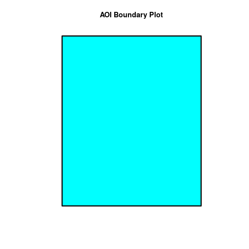
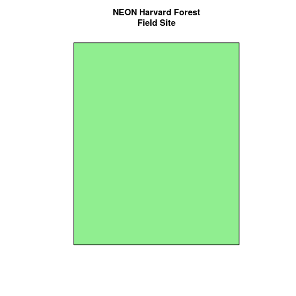
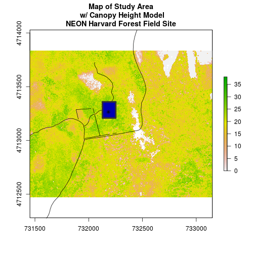

> ## Things You’ll Need To Complete This Tutorial
> **R Skill Level:** Introduction - you are just getting started with spatial data
in `R`, but have some of the other `R` basics down.
>
> You will need the most current version of `R` and, preferably, `RStudio` loaded
on your computer to complete this tutorial.
>
> ### Install R Packages
>
> * **raster:** `install.packages("raster")`
> * **sf:** `install.packages("sf")`
>
> [More on Packages in R - Adapted from Software Carpentry.]({{site.baseurl}}/R/Packages-In-R/)
>
> ## Download Data
> * [Site layout shapefiles](https://ndownloader.figshare.com/files/3708751)
{: .prereq}

In this tutorial, we will open and plot point, line and polygon vector data
stored in shapefile format in `R`.

## About Vector Data
Vector data are composed of discrete geometric locations (x, y values) known as
**vertices** that define the "shape" of the spatial object. The organization
of the vertices, determines the type of vector that we are working
with: point, line or polygon.

<figure>
    
    <figcaption> There are 3 types of vector objects: points, lines or
    polygons. Each object type has a different structure.
    Image Source: National Ecological Observatory Network (NEON)
    </figcaption>
</figure>

* **Points:** Each individual point is defined by a single x, y coordinate.
There can be many points in a vector point file. Examples of point data include:
sampling locations, the location of individual trees or the location of plots.
* **Lines:** Lines are composed of many (at least 2) vertices, or points, that
are connected. For instance, a road or a stream may be represented by a line. This
line is composed of a series of segments, each "bend" in the road or stream
represents a vertex that has defined `x, y` location.
* **Polygons:** A polygon consists of 3 or more vertices that are connected and
"closed". Thus the outlines of plot boundaries, lakes, oceans, and states or
countries are often represented by polygons. Occasionally, a polygon can have a
hole in the middle of it (like a doughnut), this is something to be aware of but
not an issue we will deal with in this tutorial.

> ## Data Tip
> Sometimes, boundary layers such as
>  states and countries, are stored as lines rather than polygons. However, these
> boundaries, when represented as a line, will not create a closed object with a defined "area" that can be "filled".
{: .callout}

## Shapefiles: Points, Lines, and Polygons
Geospatial data in vector format are often stored in a `shapefile` format.
Because the structure of points, lines, and polygons are different, each
individual shapefile can only contain one vector type (all points, all lines
or all polygons). You will not find a mixture of point, line and polygon
objects in a single shapefile.

Objects stored in a shapefile often have a set of associated `attributes` that
describe the data. For example, a line shapefile that contains the locations of
streams, might contain the associated stream name, stream "order" and other
information about each stream line object.

* More about shapefiles can found on
<a href="https://en.wikipedia.org/wiki/Shapefile" target="_blank">Wikipedia</a>.

## Import Shapefiles

We will use the `sf` package to work with vector data in `R`. Notice that the
`rgdal` package automatically loads when `sf` is loaded. We will also load the
`raster` package so we can explore raster and vector spatial metadata using similar commands.

~~~
# load required libraries
# for vector work
library(sf)
~~~
{: .r}

~~~
Linking to GEOS 3.5.1, GDAL 2.2.1, proj.4 4.9.2, lwgeom 2.3.3 r15473
~~~
{: .output}

~~~
# for metadata/attributes- vectors or rasters
library(raster)
~~~
{: .r}

~~~
Loading required package: sp
~~~
{: .output}

~~~
# set working directory to the directory location on your computer where
# you downloaded and unzipped the data files for the tutorial
# setwd("pathToDirHere")
~~~
{: .r}

The shapefiles that we will import are:

* A polygon shapefile representing our field site boundary,
* A line shapefile representing roads, and
* A point shapefile representing the location of the Fisher
<a href="http://www.neonscience.org/science-design/collection-methods/flux-tower-measurements" target="_blank">flux tower</a>
located at the
<a href="http://www.neonscience.org/science-design/field-sites/harvard-forest" target="_blank"> NEON Harvard Forest field site</a>.

The first shapefile that we will open contains the boundary of our study area
(or our Area Of Interest or AOI, hence the name `aoiBoundary`). To import
shapefiles we use the `sf` function `st_read`.

`st_read()` requires the file path to the shapefile.

Let's import our AOI.

~~~
# Import a polygon shapefile
aoi_boundary_HARV <- st_read(
  "data/NEON-DS-Site-Layout-Files/HARV/HarClip_UTMZ18.shp")
~~~
{: .r}

~~~
Reading layer `HarClip_UTMZ18' from data source `/home/jose/Documents/Science/Projects/software-carpentry/data-carpentry_lessons/R-spatial-raster-vector-lesson/_episodes_rmd/data/NEON-DS-Site-Layout-Files/HARV/HarClip_UTMZ18.shp' using driver `ESRI Shapefile'
Simple feature collection with 1 feature and 1 field
geometry type:  POLYGON
dimension:      XY
bbox:           xmin: 732128 ymin: 4713209 xmax: 732251.1 ymax: 4713359
epsg (SRID):    32618
proj4string:    +proj=utm +zone=18 +datum=WGS84 +units=m +no_defs
~~~
{: .output}

## Shapefile Metadata & Attributes

When we import the `HarClip_UTMZ18` shapefile layer into `R` (as our
`aoi_boundary_HARV` object), the `st_read()` function automatically stores
information about the data. We are particularly interested in the geospatial
**metadata**, describing the format, `CRS`, `extent`, and other components of
the vector data, and the **attributes** which describe properties associated
with each individual vector object.

> ## Data Tip
> The [Shapefile Metadata & Attributes in R]({{site.baseurl}}/R/shapefile-attributes-in-R/)
> tutorial provides more information on both metadata and attributes
> and using attributes to subset and plot data.
{: .callout}

## Spatial Metadata
Key metadata for all shapefiles include:

1. **Object Type:** the class of the imported object.
2. **Coordinate Reference System (CRS):** the projection of the data.
3. **Extent:** the spatial extent (geographic area that the shapefile covers) of
the shapefile. Note that the spatial extent for a shapefile represents the
extent for ALL spatial objects in the shapefile.

We can view shapefile metadata using the `st_geometry_type`, `st_crs` and `st_bbox` methods:

~~~
# view just the geometry type for the shapefile
st_geometry_type(aoi_boundary_HARV)
~~~
{: .r}

~~~
[1] POLYGON
18 Levels: GEOMETRY POINT LINESTRING POLYGON ... TRIANGLE
~~~
{: .output}

~~~
# view just the crs for the shapefile
st_crs(aoi_boundary_HARV)
~~~
{: .r}

~~~
$epsg
[1] 32618

$proj4string
[1] "+proj=utm +zone=18 +datum=WGS84 +units=m +no_defs"

attr(,"class")
[1] "crs"
~~~
{: .output}

~~~
# view just the extent for the shapefile
st_bbox(aoi_boundary_HARV)
~~~
{: .r}

~~~
     xmin      ymin      xmax      ymax 
 732128.0 4713208.7  732251.1 4713359.2 
~~~
{: .output}

~~~
# view all metadata at same time
aoi_boundary_HARV
~~~
{: .r}

~~~
Simple feature collection with 1 feature and 1 field
geometry type:  POLYGON
dimension:      XY
bbox:           xmin: 732128 ymin: 4713209 xmax: 732251.1 ymax: 4713359
epsg (SRID):    32618
proj4string:    +proj=utm +zone=18 +datum=WGS84 +units=m +no_defs
  id                       geometry
1  1 POLYGON ((732128.016925 471...
~~~
{: .output}

Our `aoi_boundary_HARV` is an `sf` polygon object,
in the CRS **UTM zone 18N**. The CRS is critical to interpreting the object
`extent` values as it specifies units.

<figure>
    
    <figcaption>The spatial extent of a shapefile or R spatial object represents
    the geographic "edge" or location that is the furthest north, south east and
    west. Thus is represents the overall geographic coverage of the spatial object.
    Image Source: National Ecological Observatory Network (NEON)
    </figcaption>
</figure>

## Spatial Data Attributes
Each object in a shapefile has one or more attributes associated with it.
Shapefile attributes are similar to fields or columns in a spreadsheet. Each row
in the spreadsheet has a set of columns associated with it that describe the row
element. In the case of a shapefile, each row represents a spatial object - for
example, a road, represented as a line in a line shapefile, will have one "row"
of attributes associated with it. These attributes can include different types
of information that describe objects stored within a shapefile. Thus, our road,
may have a name, length, number of lanes, speed limit, type of road and other
attributes stored with it.

<figure>
    
    <figcaption>Each spatial feature in an R spatial object has the same set of
    associated attributes that describe or characterize the feature.
    Attribute data are stored in a separate *.dbf file. Attribute data can be
    compared to a spreadsheet. Each row in a spreadsheet represents one feature
    in the spatial object.
    Image Source: National Ecological Observatory Network (NEON)
    </figcaption>
</figure>

We can view the attributes of an `sf` object by printing it to the screen. The geometry of the object can be dropped by turning the object into a `data.frame`.

~~~
aoi_boundary_HARV
~~~
{: .r}

~~~
Simple feature collection with 1 feature and 1 field
geometry type:  POLYGON
dimension:      XY
bbox:           xmin: 732128 ymin: 4713209 xmax: 732251.1 ymax: 4713359
epsg (SRID):    32618
proj4string:    +proj=utm +zone=18 +datum=WGS84 +units=m +no_defs
  id                       geometry
1  1 POLYGON ((732128.016925 471...
~~~
{: .output}

~~~
# alternate way to view attributes
data.frame(aoi_boundary_HARV)
~~~
{: .r}

~~~
  id                       geometry
1  1 POLYGON ((732128.016925 471...
~~~
{: .output}

In this case, our polygon object only has one attribute: `id`.

## Metadata & Attribute Summary
We can view a metadata & attribute summary of each shapefile by entering
the name of the `R` object in the console. Note that the metadata output
includes the **geometry type**, the number of **features**, the **extent**, and the
**coordinate reference system** (`crs`) of the `R` object. The output of `summary()` shows a preview of the `R` object **attributes**.

~~~
# view a summary of metadata & attributes associated with the spatial object
summary(aoi_boundary_HARV)
~~~
{: .r}

~~~
       id             geometry
 Min.   :1   POLYGON      :1  
 1st Qu.:1   epsg:32618   :0  
 Median :1   +proj=utm ...:0  
 Mean   :1                    
 3rd Qu.:1                    
 Max.   :1                    
~~~
{: .output}

# Plot a Shapefile
Next, let's visualize the data in our `sf` object using
`plot()`.

~~~
# create a plot of the shapefile
# 'lwd' sets the line width
# 'col' sets internal color
# 'border' sets line color
plot(aoi_boundary_HARV, col = "cyan1", border = "black", lwd = 3,
     main = "AOI Boundary Plot")
~~~
{: .r}

> ## Challenge: Import Line and Point Shapefiles
> 
> Using the steps above, import the HARV_roads and HARVtower_UTM18N layers into
> `R`. Call the Harv_roads object `lines_HARV` and the HARVtower_UTM18N
> `point_HARV`.
> 
> Answer the following questions:
> 
> 1. What type of `R` spatial object is created when you import each layer?
> 
> 2. What is the `CRS` and `extent`for each object?
> 
> 3. Do the files contain, points, lines or polygons?
> 
> 4. How many spatial objects are in each file?
> 
> > ## Answers
> > 
> > 
> > ~~~
> > # import line shapefile
> > lines_HARV <- st_read("data/NEON-DS-Site-Layout-Files/HARV/HARV_roads.shp")
> > ~~~
> > {: .r}
> > 
> > 
> > 
> > ~~~
> > Reading layer `HARV_roads' from data source `/home/jose/Documents/Science/Projects/software-carpentry/data-carpentry_lessons/R-spatial-raster-vector-lesson/_episodes_rmd/data/NEON-DS-Site-Layout-Files/HARV/HARV_roads.shp' using driver `ESRI Shapefile'
> > Simple feature collection with 13 features and 15 fields
> > geometry type:  MULTILINESTRING
> > dimension:      XY
> > bbox:           xmin: 730741.2 ymin: 4711942 xmax: 733295.5 ymax: 4714260
> > epsg (SRID):    32618
> > proj4string:    +proj=utm +zone=18 +datum=WGS84 +units=m +no_defs
> > ~~~
> > {: .output}
> > 
> > 
> > 
> > ~~~
> > # import point shapefile
> > point_HARV <- st_read("data/NEON-DS-Site-Layout-Files/HARV/HARVtower_UTM18N.shp")
> > ~~~
> > {: .r}
> > 
> > 
> > 
> > ~~~
> > Reading layer `HARVtower_UTM18N' from data source `/home/jose/Documents/Science/Projects/software-carpentry/data-carpentry_lessons/R-spatial-raster-vector-lesson/_episodes_rmd/data/NEON-DS-Site-Layout-Files/HARV/HARVtower_UTM18N.shp' using driver `ESRI Shapefile'
> > Simple feature collection with 1 feature and 14 fields
> > geometry type:  POINT
> > dimension:      XY
> > bbox:           xmin: 732183.2 ymin: 4713265 xmax: 732183.2 ymax: 4713265
> > epsg (SRID):    32618
> > proj4string:    +proj=utm +zone=18 +datum=WGS84 +units=m +no_defs
> > ~~~
> > {: .output}
> > 
> > 
> > 
> > ~~~
> > # 1
> > class(lines_HARV)
> > ~~~
> > {: .r}
> > 
> > 
> > 
> > ~~~
> > [1] "sf"         "data.frame"
> > ~~~
> > {: .output}
> > 
> > 
> > 
> > ~~~
> > class(point_HARV)
> > ~~~
> > {: .r}
> > 
> > 
> > 
> > ~~~
> > [1] "sf"         "data.frame"
> > ~~~
> > {: .output}
> > 
> > 
> > 
> > ~~~
> > # 2
> > st_crs(lines_HARV)
> > ~~~
> > {: .r}
> > 
> > 
> > 
> > ~~~
> > $epsg
> > [1] 32618
> > 
> > $proj4string
> > [1] "+proj=utm +zone=18 +datum=WGS84 +units=m +no_defs"
> > 
> > attr(,"class")
> > [1] "crs"
> > ~~~
> > {: .output}
> > 
> > 
> > 
> > ~~~
> > st_bbox(lines_HARV)
> > ~~~
> > {: .r}
> > 
> > 
> > 
> > ~~~
> >      xmin      ymin      xmax      ymax 
> >  730741.2 4711942.0  733295.5 4714260.0 
> > ~~~
> > {: .output}
> > 
> > 
> > 
> > ~~~
> > st_crs(point_HARV)
> > ~~~
> > {: .r}
> > 
> > 
> > 
> > ~~~
> > $epsg
> > [1] 32618
> > 
> > $proj4string
> > [1] "+proj=utm +zone=18 +datum=WGS84 +units=m +no_defs"
> > 
> > attr(,"class")
> > [1] "crs"
> > ~~~
> > {: .output}
> > 
> > 
> > 
> > ~~~
> > st_bbox(point_HARV)
> > ~~~
> > {: .r}
> > 
> > 
> > 
> > ~~~
> >      xmin      ymin      xmax      ymax 
> >  732183.2 4713265.0  732183.2 4713265.0 
> > ~~~
> > {: .output}
> > 
> > 
> > 
> > ~~~
> > # 3
> > #lines_HARV contains only lines and point_HARV contains only 1 point
> > 
> > # 4 -> numerous ways to find this; lines_HARV=13,
> > nrow(lines_HARV)  #easiest, but not previously taught
> > ~~~
> > {: .r}
> > 
> > 
> > 
> > ~~~
> > [1] 13
> > ~~~
> > {: .output}
> > 
> > 
> > 
> > ~~~
> > lines_HARV  #look at 'features'
> > ~~~
> > {: .r}
> > 
> > 
> > 
> > ~~~
> > Simple feature collection with 13 features and 15 fields
> > geometry type:  MULTILINESTRING
> > dimension:      XY
> > bbox:           xmin: 730741.2 ymin: 4711942 xmax: 733295.5 ymax: 4714260
> > epsg (SRID):    32618
> > proj4string:    +proj=utm +zone=18 +datum=WGS84 +units=m +no_defs
> >    OBJECTID_1 OBJECTID       TYPE             NOTES MISCNOTES RULEID
> > 1          14       48 woods road Locust Opening Rd      <NA>      5
> > 2          40       91   footpath              <NA>      <NA>      6
> > 3          41      106   footpath              <NA>      <NA>      6
> > 4         211      279 stone wall              <NA>      <NA>      1
> > 5         212      280 stone wall              <NA>      <NA>      1
> > 6         213      281 stone wall              <NA>      <NA>      1
> > 7         214      282 stone wall              <NA>      <NA>      1
> > 8         215      283 stone wall              <NA>      <NA>      1
> > 9         216      284 stone wall              <NA>      <NA>      1
> > 10        553      674  boardwalk              <NA>      <NA>      2
> > 11        752       71 woods road    Pierce Farm Rd      <NA>      5
> > 12        753       71 woods road    Pierce Farm Rd      <NA>      5
> > 13        754       71 woods road    Pierce Farm Rd      <NA>      5
> >             MAPLABEL SHAPE_LENG             LABEL BIKEHORSE RESVEHICLE
> > 1  Locust Opening Rd 1297.35706 Locust Opening Rd         Y         R1
> > 2               <NA>  146.29984              <NA>         Y         R1
> > 3               <NA>  676.71804              <NA>         Y         R2
> > 4               <NA>  231.78957              <NA>      <NA>       <NA>
> > 5               <NA>   45.50864              <NA>      <NA>       <NA>
> > 6               <NA>  198.39043              <NA>      <NA>       <NA>
> > 7               <NA>  143.19240              <NA>      <NA>       <NA>
> > 8               <NA>   90.33118              <NA>      <NA>       <NA>
> > 9               <NA>   35.88146              <NA>      <NA>       <NA>
> > 10              <NA>   67.43464              <NA>         N         R3
> > 11    Pierce Farm Rd 3808.43252    Pierce Farm Rd         Y         R2
> > 12    Pierce Farm Rd 3808.43252    Pierce Farm Rd         N         R3
> > 13    Pierce Farm Rd 3808.43252    Pierce Farm Rd         Y         R2
> >    RECMAP Shape_Le_1                            ResVehic_1
> > 1       Y 1297.10617    R1 - All Research Vehicles Allowed
> > 2       Y  146.29983    R1 - All Research Vehicles Allowed
> > 3       Y  676.71807 R2 - 4WD/High Clearance Vehicles Only
> > 4    <NA>  231.78962                                  <NA>
> > 5    <NA>   45.50859                                  <NA>
> > 6    <NA>  198.39041                                  <NA>
> > 7    <NA>  143.19241                                  <NA>
> > 8    <NA>   90.33114                                  <NA>
> > 9    <NA>   35.88152                                  <NA>
> > 10      N   67.43466              R3 - No Vehicles Allowed
> > 11      Y 1771.63108 R2 - 4WD/High Clearance Vehicles Only
> > 12      Y  144.56559              R3 - No Vehicles Allowed
> > 13      Y 1885.82912 R2 - 4WD/High Clearance Vehicles Only
> >                         BicyclesHo                       geometry
> > 1      Bicycles and Horses Allowed MULTILINESTRING ((730819.18...
> > 2      Bicycles and Horses Allowed MULTILINESTRING ((732040.22...
> > 3      Bicycles and Horses Allowed MULTILINESTRING ((732056.98...
> > 4                             <NA> MULTILINESTRING ((731903.61...
> > 5                             <NA> MULTILINESTRING ((732039.10...
> > 6                             <NA> MULTILINESTRING ((732056.22...
> > 7                             <NA> MULTILINESTRING ((731963.99...
> > 8                             <NA> MULTILINESTRING ((732105.20...
> > 9                             <NA> MULTILINESTRING ((732222.89...
> > 10          DO NOT SHOW ON REC MAP MULTILINESTRING ((732153.83...
> > 11     Bicycles and Horses Allowed MULTILINESTRING ((731164.80...
> > 12 Bicycles and Horses NOT ALLOWED MULTILINESTRING ((732341.70...
> > 13     Bicycles and Horses Allowed MULTILINESTRING ((732479.64...
> > ~~~
> > {: .output}
> {: .solution}
{: .challenge}

## Plot Multiple Shapefiles
The `plot()` function can be used for basic plotting of spatial objects.
We use the `add = TRUE` argument to overlay shapefiles on top of each other, as
we would when creating a map in a typical GIS application like QGIS.

We can use `main = ""` to give our plot a title. If we want the title to span two
lines, we use `\n` where the line should break.

~~~
# Plot multiple shapefiles
plot(aoi_boundary_HARV, col = "lightgreen",
     main = "NEON Harvard Forest\nField Site")
plot(lines_HARV, add = TRUE)

# use the pch element to adjust the symbology of the points
plot(point_HARV, add  = TRUE, pch = 19, col = "purple")
~~~
{: .r}

> ## Data Tip
> The pch argument specifies the point shape. A list of valid point shapes can be found by viewing
> <a href="http://www.statmethods.net/advgraphs/images/points.png" target="_blank">
> this graphic</a>
{: .callout}

> ## Challenge: Plot Raster & Vector Data Together
> 
> You can plot vector data layered on top of raster data using the `add = TRUE`
> plot attribute. Create a plot that uses the NEON AOP Canopy Height Model `NEON_RemoteSensing/HARV/CHM/HARV_chmCrop.tif` as a base layer. On top of the
> CHM, please add:
> 
> * The study site AOI.
> * Roads.
> * The tower location.
> 
> Be sure to give your plot a meaningful title.
> 
> For assistance consider using the
> [Shapefile Metadata & Attributes in R]({{site.baseurl}}/R/shapefile-attributes-in-R/),
> the [Plot Raster Data in R]({{site.baseurl}}/R/Plot-Rasters-In-R/ )
> tutorials.
> 
> > ## Answers
> > 
> > 
> > ~~~
> > # import CHM
> > chm_HARV <- raster("data/NEON-DS-Airborne-Remote-Sensing/HARV/CHM/HARV_chmCrop.tif")
> > 
> > plot(chm_HARV,
> >      main = "Map of Study Area\n w/ Canopy Height Model\nNEON Harvard Forest Field Site")
> > 
> > plot(lines_HARV,
> >      add = TRUE,
> >      col = "black")
> > plot(aoi_boundary_HARV, border="grey20",
> >      add = TRUE,
> >      lwd = 4)
> > plot(point_HARV, pch=8,
> >      add = TRUE)
> > ~~~
> > {: .r}
> > 
> > 
> {: .solution}
{: .challenge}

## Additional Resources: Plot Parameter Options
For more on parameter options in the base `R` `plot()` function, check out these
resources:

* <a href="http://www.statmethods.net/advgraphs/parameters.html" target="_blank">Parameter methods in `R`.</a>
* <a href="https://codeyarns.files.wordpress.com/2011/07/20110729-vim-named-colors.png?w=700" target="_blank">Color names in `R`</a>
