---
# Please do not edit this file directly; it is auto generated.
# Instead, please edit 07-vector-shapefile-attributes-in-r.md in _episodes_rmd/
title: "Explore and Plot by Vector Layer Attributes"
teaching: 40
exercises: 20
questions:
- "How can I compute on the attributes of a spatial object?"
objectives:
- "Query attributes of a spatial object."
- "Subset spatial objects using specific attribute values."
- "Plot a vector feature, colored by unique attribute values."
keypoints:
- "Spatial objects in `sf` are similar to standard data frames and can be manipulated using the same functions."
- "Almost any feature of a plot can be customized using the various functions and options in the `ggplot2` package."
source: Rmd
---

> ## Things You’ll Need To Complete This Episode
> See the [lesson homepage]({{ site.baseurl }}) for detailed information about the software,
> data, and other prerequisites you will need to work through the examples in this episode.
{: .prereq}

This episode continues our discussion of vector layer attributes and 
covers how to work with vector layer attributes in R. It covers how
to identify and query layer
attributes, as well as how to subset features by specific attribute values.
Finally, we will learn how to plot a feature according to a set of attribute
values.

## Load the Data
We will continue using the `sf`, `raster` and `ggplot2` packages in this episode. Make sure that you have these packages loaded. We will
continue to work with the three shapefiles (vector layers) that we loaded in the
[Open and Plot Shapefiles in R]({{site.baseurl}}/06-vector-open-shapefile-in-r/) episode.

## Query Vector Feature Metadata

As we discussed in the
[Open and Plot Shapefiles in R]({{site.baseurl}}/06-vector-open-shapefile-in-r/) episode,
we can view metadata associated with an R object using:

* `st_geometry_type()` - The type of vector data stored in the object.
* `nrow()` - The number of features in the object
* `st_bbox()` - The spatial extent (geographic area covered by) 
of the object.
* `st_crs()` - The CRS (spatial projection) of the data.

We started to explore our `point_HARV` object in the previous episode.
To see a summary of all of the metadata associated with our `point_HARV` object, we can view the object with `View(point_HARV)` or print a summary of the object itself to the console.

~~~
point_HARV
~~~
{: .language-r}

~~~
Simple feature collection with 1 feature and 14 fields
Geometry type: POINT
Dimension:     XY
Bounding box:  xmin: 732183.2 ymin: 4713265 xmax: 732183.2 ymax: 4713265
Projected CRS: WGS 84 / UTM zone 18N
  Un_ID Domain DomainName       SiteName Type       Sub_Type     Lat      Long
1     A      1  Northeast Harvard Forest Core Advanced Tower 42.5369 -72.17266
  Zone  Easting Northing                Ownership    County annotation
1   18 732183.2  4713265 Harvard University, LTER Worcester         C1
                  geometry
1 POINT (732183.2 4713265)
~~~
{: .output}

We can use the `ncol` function to count the number of attributes associated with a spatial object too. Note that the geometry is just another column and counts towards the total.

~~~
ncol(lines_HARV)
~~~
{: .language-r}

~~~
[1] 16
~~~
{: .output}

We can view the individual name of each attribute using the
`names()` function in R:

~~~
names(lines_HARV)
~~~
{: .language-r}

~~~
 [1] "OBJECTID_1" "OBJECTID"   "TYPE"       "NOTES"      "MISCNOTES" 
 [6] "RULEID"     "MAPLABEL"   "SHAPE_LENG" "LABEL"      "BIKEHORSE" 
[11] "RESVEHICLE" "RECMAP"     "Shape_Le_1" "ResVehic_1" "BicyclesHo"
[16] "geometry"  
~~~
{: .output}

We could also view just the first 6 rows
of attribute values using the `head()` function to get a preview of the data:

~~~
head(lines_HARV)
~~~
{: .language-r}

~~~
Simple feature collection with 6 features and 15 fields
Geometry type: MULTILINESTRING
Dimension:     XY
Bounding box:  xmin: 730741.2 ymin: 4712685 xmax: 732232.3 ymax: 4713726
Projected CRS: WGS 84 / UTM zone 18N
  OBJECTID_1 OBJECTID       TYPE             NOTES MISCNOTES RULEID
1         14       48 woods road Locust Opening Rd      <NA>      5
2         40       91   footpath              <NA>      <NA>      6
3         41      106   footpath              <NA>      <NA>      6
4        211      279 stone wall              <NA>      <NA>      1
5        212      280 stone wall              <NA>      <NA>      1
6        213      281 stone wall              <NA>      <NA>      1
           MAPLABEL SHAPE_LENG             LABEL BIKEHORSE RESVEHICLE RECMAP
1 Locust Opening Rd 1297.35706 Locust Opening Rd         Y         R1      Y
2              <NA>  146.29984              <NA>         Y         R1      Y
3              <NA>  676.71804              <NA>         Y         R2      Y
4              <NA>  231.78957              <NA>      <NA>       <NA>   <NA>
5              <NA>   45.50864              <NA>      <NA>       <NA>   <NA>
6              <NA>  198.39043              <NA>      <NA>       <NA>   <NA>
  Shape_Le_1                            ResVehic_1                  BicyclesHo
1 1297.10617    R1 - All Research Vehicles Allowed Bicycles and Horses Allowed
2  146.29983    R1 - All Research Vehicles Allowed Bicycles and Horses Allowed
3  676.71807 R2 - 4WD/High Clearance Vehicles Only Bicycles and Horses Allowed
4  231.78962                                  <NA>                        <NA>
5   45.50859                                  <NA>                        <NA>
6  198.39041                                  <NA>                        <NA>
                        geometry
1 MULTILINESTRING ((730819.2 ...
2 MULTILINESTRING ((732040.2 ...
3 MULTILINESTRING ((732057 47...
4 MULTILINESTRING ((731903.6 ...
5 MULTILINESTRING ((732039.1 ...
6 MULTILINESTRING ((732056.2 ...
~~~
{: .output}

> ## Challenge: Attributes for Different Spatial Classes
>
> Explore the attributes associated with the `point_HARV` and `aoi_boundary_HARV` spatial objects.
>
> 1. How many attributes does each have?
> 2. Who owns the site in the `point_HARV` data object?
> 3. Which of the following is NOT an attribute of the `point_HARV` data object?
>
>     A) Latitude      B) County     C) Country
>
> > ## Answers
> > 1) To find the number of attributes, we use the `ncol()` function: 
> > 
> > 
> > ~~~
> > ncol(point_HARV)
> > ~~~
> > {: .language-r}
> > 
> > 
> > 
> > ~~~
> > [1] 15
> > ~~~
> > {: .output}
> > 
> > 
> > 
> > ~~~
> > ncol(aoi_boundary_HARV)
> > ~~~
> > {: .language-r}
> > 
> > 
> > 
> > ~~~
> > [1] 2
> > ~~~
> > {: .output}
> > 2) Ownership information is in a column named `Ownership`: 
> > 
> > ~~~
> > point_HARV$Ownership
> > ~~~
> > {: .language-r}
> > 
> > 
> > 
> > ~~~
> > [1] "Harvard University, LTER"
> > ~~~
> > {: .output}
> > 3) To see a list of all of the attributes, we can use the
> > `names()` function: 
> > 
> > ~~~
> > names(point_HARV)
> > ~~~
> > {: .language-r}
> > 
> > 
> > 
> > ~~~
> >  [1] "Un_ID"      "Domain"     "DomainName" "SiteName"   "Type"      
> >  [6] "Sub_Type"   "Lat"        "Long"       "Zone"       "Easting"   
> > [11] "Northing"   "Ownership"  "County"     "annotation" "geometry"  
> > ~~~
> > {: .output}
> > "Country" is not an attribute of this object. 
> {: .solution}
{: .challenge}

## Explore Values within One Attribute
We can explore individual values stored within a particular attribute.
Comparing attributes to a spreadsheet or a data frame, this is similar
to exploring values in a column. We did this with the `gapminder` dataframe in [an earlier lesson](https://datacarpentry.org/r-intro-geospatial/05-data-subsetting/index.html). For spatial objects, we can use the same syntax: `objectName$attributeName`.

We can see the contents of the `TYPE` field of our lines feature:

~~~
lines_HARV$TYPE
~~~
{: .language-r}

~~~
 [1] "woods road" "footpath"   "footpath"   "stone wall" "stone wall"
 [6] "stone wall" "stone wall" "stone wall" "stone wall" "boardwalk" 
[11] "woods road" "woods road" "woods road"
~~~
{: .output}

To see only unique values within the `TYPE` field, we can use the
`levels()` function for extracting the possible values of a
categorical variable. The special term for categorical variables
within R is factor. We worked with factors a little bit in [an earlier lesson](https://datacarpentry.org/r-intro-geospatial/03-data-structures-part1/index.html).

~~~
levels(lines_HARV$TYPE)
~~~
{: .language-r}

~~~
NULL
~~~
{: .output}

### Subset Features
We can use the `filter()` function from `dplyr` that we worked with in [an earlier lesson](https://datacarpentry.org/r-intro-geospatial/06-dplyr) to select a subset of features
from a spatial object in R, just like with data frames.

For example, we might be interested only in features that are of `TYPE` "footpath". Once we subset out this data, we can use it as input to other code so that code only operates on the footpath lines.

~~~
footpath_HARV <- lines_HARV %>% 
  filter(TYPE == "footpath")
nrow(footpath_HARV)
~~~
{: .language-r}

~~~
[1] 2
~~~
{: .output}

Our subsetting operation reduces the `features` count to 2. This means
that only two feature lines in our spatial object have the attribute
`TYPE == footpath`. We can plot only the footpath lines:

~~~
ggplot() + 
  geom_sf(data = footpath_HARV) +
  ggtitle("NEON Harvard Forest Field Site", subtitle = "Footpaths") + 
  coord_sf()
~~~
{: .language-r}

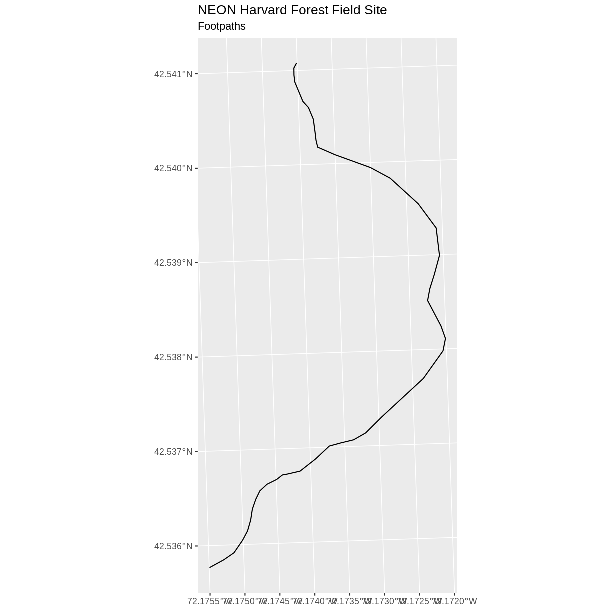

There are two features in our footpaths subset. Why does the plot look like
there is only one feature? Let's adjust the colors used in our plot. If we have
2 features in our vector object, we can plot each using a unique color by
assigning a column name to the color aesthetic (`color =`). We use the syntax
`aes(color = )` to do this. We can also alter the default line thickness by
using the `size =` parameter, as the default value of 0.5 can be hard to see.
Note that size is placed outside of the `aes()` function, as we are not
connecting line thickness to a data variable.

~~~
ggplot() + 
  geom_sf(data = footpath_HARV, aes(color = factor(OBJECTID)), size = 1.5) +
  labs(color = 'Footpath ID') +
  ggtitle("NEON Harvard Forest Field Site", subtitle = "Footpaths") + 
  coord_sf()
~~~
{: .language-r}

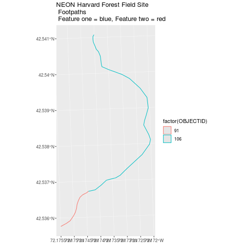

Now, we see that there are in fact two features in our plot!

> ## Challenge: Subset Spatial Line Objects Part 1
> 
> Subset out all `boardwalk` from the lines layer and plot it.
>
> > ## Answers
> > 
> > First we will save an object with only the boardwalk lines:
> > 
> > ~~~
> > boardwalk_HARV <- lines_HARV %>% 
> >   filter(TYPE == "boardwalk")
> > ~~~
> > {: .language-r}
> > Let's check how many features there are in this subset: 
> > 
> > ~~~
> > nrow(boardwalk_HARV)
> > ~~~
> > {: .language-r}
> > 
> > 
> > 
> > ~~~
> > [1] 1
> > ~~~
> > {: .output}
> > Now let's plot that data: 
> > 
> > ~~~
> > ggplot() + 
> >   geom_sf(data = boardwalk_HARV, size = 1.5) +
> >   ggtitle("NEON Harvard Forest Field Site", subtitle = "Boardwalks") + 
> >   coord_sf()
> > ~~~
> > {: .language-r}
> > 
> > 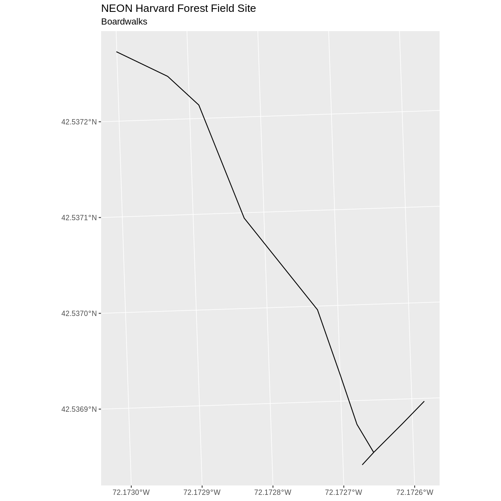
> {: .solution}
{: .challenge}

> ## Challenge: Subset Spatial Line Objects Part 2
>
> Subset out all `stone wall` features from the lines layer and plot it. For each plot, color each feature using a unique color.
>
> > ## Answer
> >
> > First we will save an object with only the stone wall lines
> > and check the number of features: 
> > 
> > ~~~
> > stoneWall_HARV <- lines_HARV %>% 
> >   filter(TYPE == "stone wall")
> > nrow(stoneWall_HARV)
> > ~~~
> > {: .language-r}
> > 
> > 
> > 
> > ~~~
> > [1] 6
> > ~~~
> > {: .output}
> > Now we can plot the data: 
> > 
> > ~~~
> > ggplot() +
> >   geom_sf(data = stoneWall_HARV, aes(color = factor(OBJECTID)), size = 1.5) +
> >   labs(color = 'Wall ID') +
> >   ggtitle("NEON Harvard Forest Field Site", subtitle = "Stonewalls") + 
> >   coord_sf()
> > ~~~
> > {: .language-r}
> > 
> > 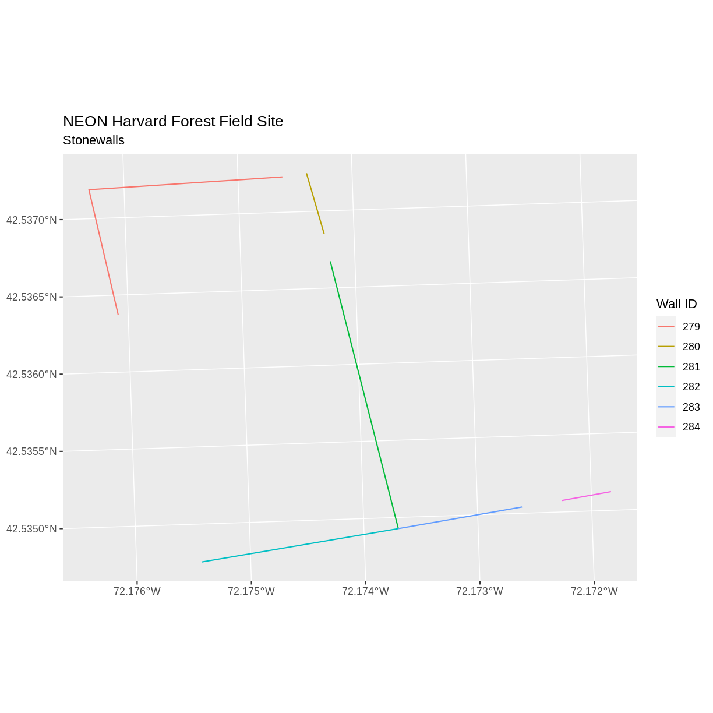
> {: .solution}
{: .challenge}

## Customize Plots

In the examples above, `ggplot()` automatically selected colors for
each line based on a default color order. If we don't like those
default colors, we can create a vector of colors - one for each
feature. To create this vector we can use the following syntax:

`c("color_one", "color_two", "color_three")[object$factor]`

Note in the above example we have

1. a vector of colors - one for each factor value (unique attribute value)
2. the attribute itself (`[object$factor]`) of class factor.

First we will check how many unique levels our factor has:

~~~
levels(lines_HARV$TYPE)
~~~
{: .language-r}

~~~
NULL
~~~
{: .output}

Then we can create a palette of four colors, one for each
feature in our vector object.

~~~
road_colors <- c("blue", "green", "navy", "purple")
~~~
{: .language-r}

We can tell `ggplot` to use these colors when we plot the data.

~~~
ggplot() +
  geom_sf(data = lines_HARV, aes(color = TYPE)) + 
  scale_color_manual(values = road_colors) +
  labs(color = 'Road Type') +
  ggtitle("NEON Harvard Forest Field Site", subtitle = "Roads & Trails") + 
  coord_sf()
~~~
{: .language-r}

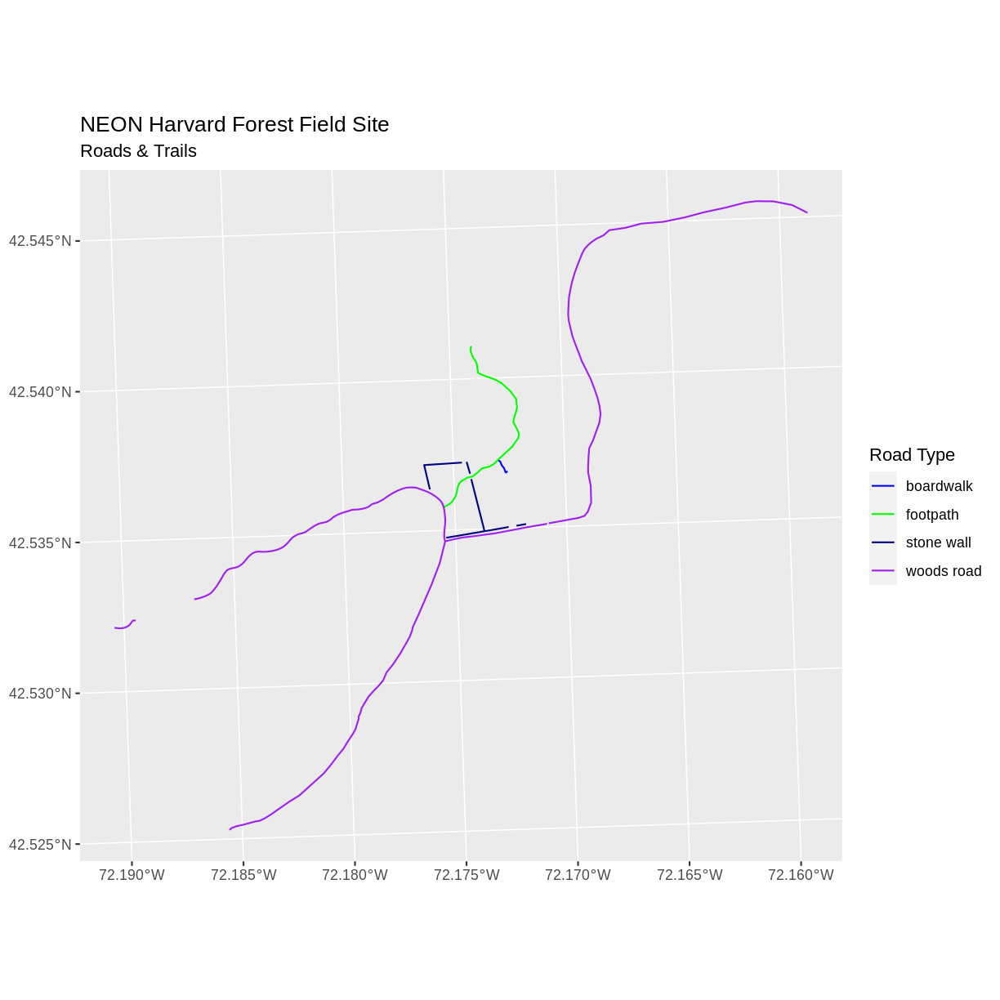

### Adjust Line Width
We adjusted line width universally earlier. If we want a unique line width for each factor level or attribute category
in our spatial object, we can use the same syntax that we used for colors, above.

We already know that we have four different `TYPE` levels in the lines_HARV object, so we will set four different line widths.

~~~
line_widths <- c(1, 2, 3, 4)
~~~
{: .language-r}

We can use those line widths when we plot the data.

~~~
ggplot() +
  geom_sf(data = lines_HARV, aes(color = TYPE, size = TYPE)) + 
  scale_color_manual(values = road_colors) +
  labs(color = 'Road Type') +
  scale_size_manual(values = line_widths) +
  ggtitle("NEON Harvard Forest Field Site", subtitle = "Roads & Trails - Line width varies") + 
  coord_sf()
~~~
{: .language-r}

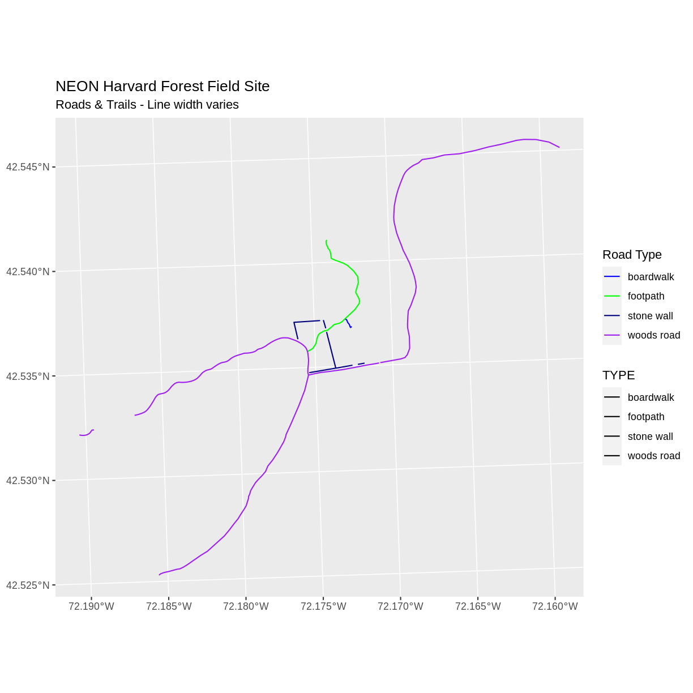

Note that we could also use `aes(size = TYPE)` to tie the line thickness to the TYPE variable, so long as we had been careful to set factor levels appropriately. ggplot prints a warning when you do this, because it is not considered a good practice to plot non-spatial data this way.

> ## Challenge: Plot Line Width by Attribute
> 
> In the example above, we set the line widths to be 1, 2, 3, and 4.
> Because R orders factor levels alphabetically by default,
> this gave us a plot where woods roads (the last factor level)
> were the thickest and boardwalks were the thinnest.
>
> Let's create another plot where we show the different line types
> with the following thicknesses:
>
> 1. woods road size = 6
> 2. boardwalks size = 1
> 3. footpath size = 3
> 4. stone wall size = 2
> 
> > ## Answers
> > 
> > First we need to look at the levels of our factor to see
> > what order the road types are in:
> >
> > 
> > ~~~
> > levels(lines_HARV$TYPE)
> > ~~~
> > {: .language-r}
> > 
> > 
> > 
> > ~~~
> > NULL
> > ~~~
> > {: .output}
> >
> > We then can create our `line_width` vector setting each of the
> > levels to the desired thickness.
> >
> > 
> > ~~~
> > line_width <- c(1, 3, 2, 6)
> > ~~~
> > {: .language-r}
> >
> > Now we can create our plot.
> >
> > 
> > ~~~
> > ggplot() +
> >   geom_sf(data = lines_HARV, aes(size = TYPE)) +
> >   scale_size_manual(values = line_width) +
> >   ggtitle("NEON Harvard Forest Field Site", subtitle = "Roads & Trails - Line width varies") + 
> >   coord_sf()
> > ~~~
> > {: .language-r}
> > 
> > 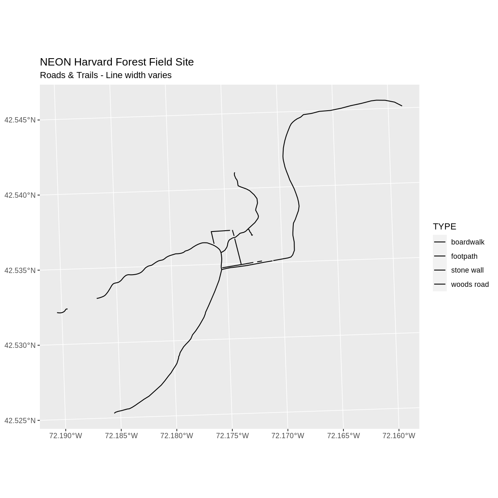
> {: .solution}
{: .challenge}

### Add Plot Legend

We can add a legend to our plot too. When we add a legend, we use the following
elements to specify labels and colors:

* `bottomright`: We specify the location of our legend by using a default
keyword. We could also use `top`, `topright`, etc.
* `levels(objectName$attributeName)`: Label the legend elements using the
categories of levels in an attribute (e.g., levels(lines_HARV$TYPE) means use
the levels boardwalk, footpath, etc).
* `fill =`: apply unique colors to the boxes in our legend. `palette()` is
the default set of colors that R applies to all plots.

Let's add a legend to our plot. We will use the `road_colors` object
that we created above to color the legend. We can customize the
appearance of our legend by manually setting different parameters.

~~~
ggplot() + 
  geom_sf(data = lines_HARV, aes(color = TYPE), size = 1.5) +
  scale_color_manual(values = road_colors) +
  labs(color = 'Road Type') + 
  ggtitle("NEON Harvard Forest Field Site", 
          subtitle = "Roads & Trails - Default Legend") + 
  coord_sf()
~~~
{: .language-r}

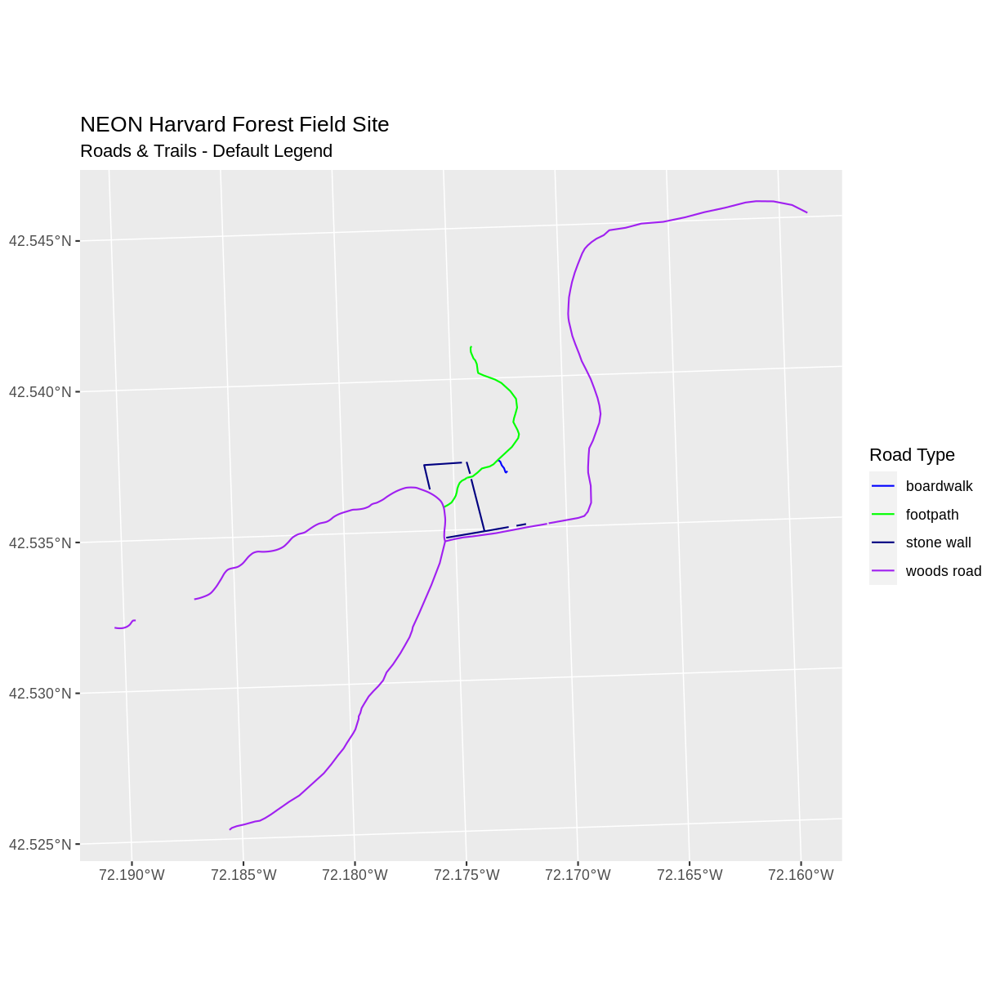

We can change the appearance of our legend by manually setting different parameters.

* `legend.text`: change the font size
* `legend.box.background`: add an outline box

~~~
ggplot() + 
  geom_sf(data = lines_HARV, aes(color = TYPE), size = 1.5) +
  scale_color_manual(values = road_colors) + 
  labs(color = 'Road Type') +
  theme(legend.text = element_text(size = 20), 
        legend.box.background = element_rect(size = 1)) + 
  ggtitle("NEON Harvard Forest Field Site", 
          subtitle = "Roads & Trails - Modified Legend") +
  coord_sf()
~~~
{: .language-r}

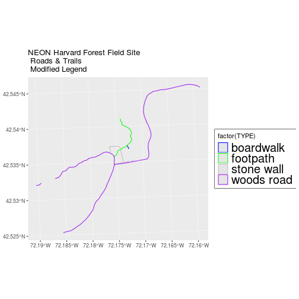

~~~
new_colors <- c("springgreen", "blue", "magenta", "orange")

ggplot() + 
  geom_sf(data = lines_HARV, aes(color = TYPE), size = 1.5) + 
  scale_color_manual(values = new_colors) +
  labs(color = 'Road Type') +
  theme(legend.text = element_text(size = 20), 
        legend.box.background = element_rect(size = 1)) + 
  ggtitle("NEON Harvard Forest Field Site", 
          subtitle = "Roads & Trails - Pretty Colors") +
  coord_sf()
~~~
{: .language-r}

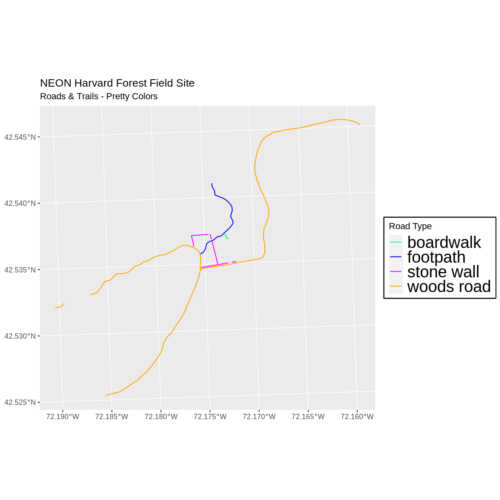

> ## Data Tip
> You can modify the default R color palette
> using the palette method. For example `palette(rainbow(6))` or
> `palette(terrain.colors(6))`. You can reset the palette colors using
> `palette("default")`!
{: .callout}

> ## Challenge: Plot Lines by Attribute
> 
> Create a plot that emphasizes only roads where bicycles and horses are allowed.
> To emphasize this, make the lines where bicycles are not allowed THINNER than
> the roads where bicycles are allowed.
> NOTE: this attribute information is located in the `lines_HARV$BicyclesHo`
> attribute.
> 
> Be sure to add a title and legend to your map. You might consider a color
> palette that has all bike/horse-friendly roads displayed in a bright color. All
> other lines can be black.
> 
> > ## Answers
> >
> > First we need to make sure that the `BicyclesHo` attribute is a
> > factor and check how many levels it has.
> >
> > 
> > ~~~
> > class(lines_HARV$BicyclesHo)
> > ~~~
> > {: .language-r}
> > 
> > 
> > 
> > ~~~
> > [1] "character"
> > ~~~
> > {: .output}
> > 
> > 
> > 
> > ~~~
> > levels(lines_HARV$BicyclesHo)
> > ~~~
> > {: .language-r}
> > 
> > 
> > 
> > ~~~
> > NULL
> > ~~~
> > {: .output}
> >
> > Next, we will create a new object `lines_removeNA` that removes missing values.
> >
> > 
> > ~~~
> > lines_removeNA <- lines_HARV[!is.na(lines_HARV$BicyclesHo),] 
> > ~~~
> > {: .language-r}
> >
> > In our plot, we will set colors so that only the allowed roads
> > are magenta, and we will set line width so that the first
> > factor level is thicker than the others.
> >
> > 
> > ~~~
> > # First, create a data frame with only those roads where bicycles and horses are allowed
> > lines_showHarv <- lines_removeNA %>% filter(BicyclesHo == "Bicycles and Horses Allowed")
> > 
> > # Next, visualise using ggplot
> > ggplot() + 
> >   geom_sf(data = lines_HARV) + 
> >   geom_sf(data = lines_showHarv, aes(color = BicyclesHo), size = 2) + 
> >   scale_color_manual(values = "magenta") +
> >   ggtitle("NEON Harvard Forest Field Site", subtitle = "Roads Where Bikes and Horses Are Allowed") + 
> >   coord_sf()
> > ~~~
> > {: .language-r}
> > 
> > 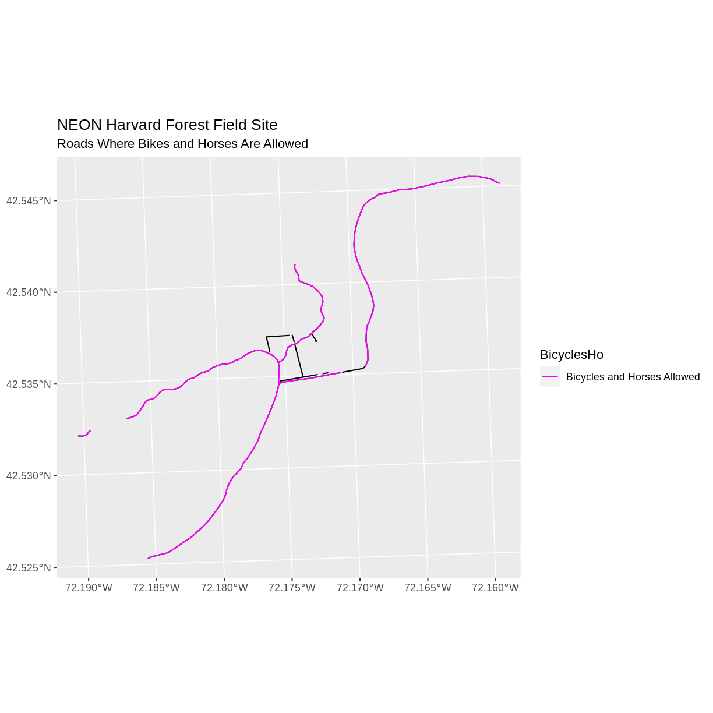
> {: .solution}
{: .challenge}

> ## Challenge: Plot Polygon by Attribute
>
> 1. Create a map of the state boundaries in the United States using the data
> located in your downloaded data folder: `NEON-DS-Site-Layout-Files/US-Boundary-Layers\US-State-Boundaries-Census-2014`.
> Apply a fill color to each state using its `region` value. Add a legend.
>
> > ## Answers
> > First we read in the data and check how many levels there are
> > in the `region` column:
> > 
> > ~~~
> > state_boundary_US <- 
> > st_read("data/NEON-DS-Site-Layout-Files/US-Boundary-Layers/US-State-Boundaries-Census-2014.shp")
> > ~~~
> > {: .language-r}
> > 
> > 
> > 
> > ~~~
> > Reading layer `US-State-Boundaries-Census-2014' from data source 
> >   `/home/runner/work/r-raster-vector-geospatial/r-raster-vector-geospatial/_episodes_rmd/data/NEON-DS-Site-Layout-Files/US-Boundary-Layers/US-State-Boundaries-Census-2014.shp' 
> >   using driver `ESRI Shapefile'
> > Simple feature collection with 58 features and 10 fields
> > Geometry type: MULTIPOLYGON
> > Dimension:     XYZ
> > Bounding box:  xmin: -124.7258 ymin: 24.49813 xmax: -66.9499 ymax: 49.38436
> > z_range:       zmin: 0 zmax: 0
> > Geodetic CRS:  WGS 84
> > ~~~
> > {: .output}
> > 
> > 
> > 
> > ~~~
> > levels(state_boundary_US$region)
> > ~~~
> > {: .language-r}
> > 
> > 
> > 
> > ~~~
> > NULL
> > ~~~
> > {: .output}
> > Next we set a color vector with that many items: 
> > 
> > ~~~
> > colors <- c("purple", "springgreen", "yellow", "brown", "navy")
> > ~~~
> > {: .language-r}
> > Now we can create our plot: 
> > 
> > ~~~
> > ggplot() +
> >   geom_sf(data = state_boundary_US, aes(color = region), size = 1) +
> >   scale_color_manual(values = colors) +
> >   ggtitle("Contiguous U.S. State Boundaries") + 
> >   coord_sf()
> > ~~~
> > {: .language-r}
> > 
> > 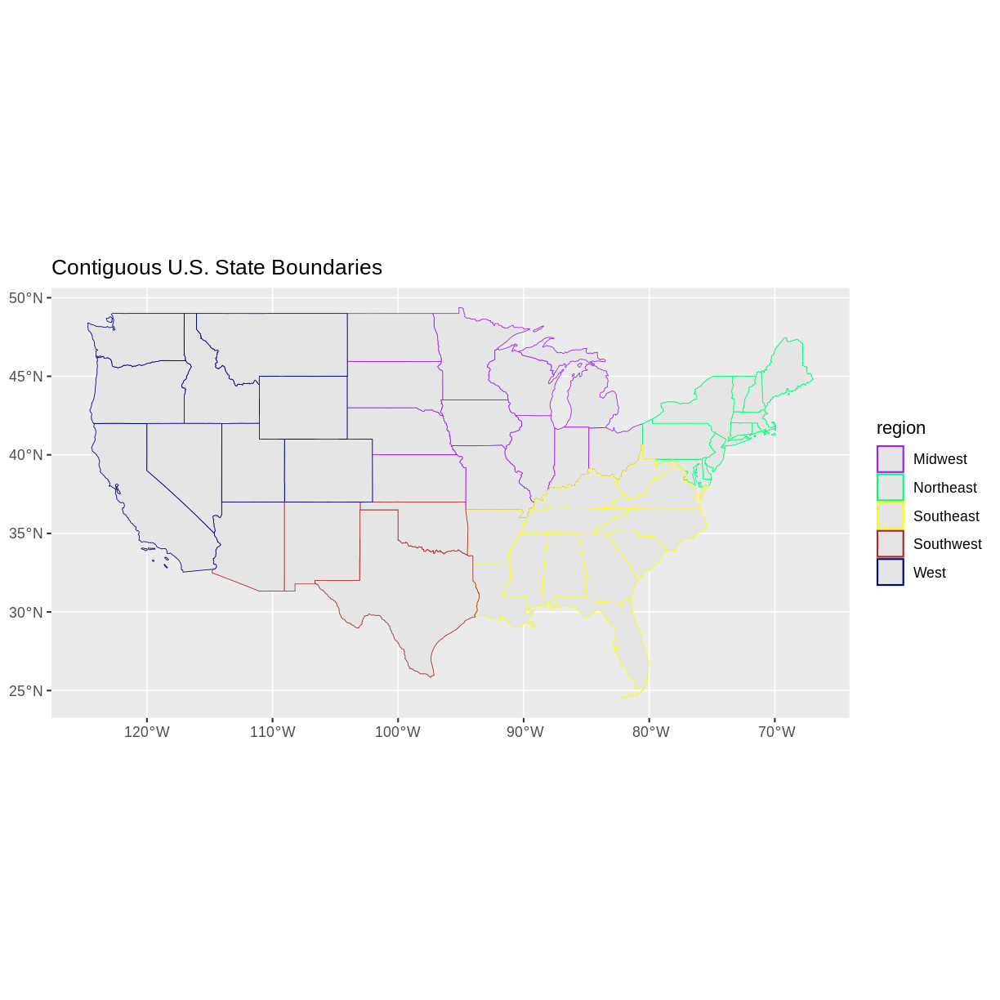
> {: .solution}
{: .challenge}


