> ## Things You’ll Need To Complete This Tutorial
> **R Skill Level:** Intermediate - you've got the basics of `R` down.
> You will need the most current version of `R` and, preferably, `RStudio` loaded
> on your computer to complete this tutorial.
>
> ### Install R Packages
>
> * **raster:** `install.packages("raster")`
> * **sf:** `install.packages("sf")`
>
> [More on Packages in R - Adapted from Software Carpentry.]({{site.baseurl}}/R/Packages-In-R/)
>
> ## Download Data
> * [Site layout shapefiles](https://ndownloader.figshare.com/files/3708751)
{: .prereq}

This tutorial explains what shapefile attributes are and how to work with
shapefile attributes in `R`. It also covers how to identify and query shapefile
attributes, as well as subset shapefiles by specific attribute values.
Finally, we will review how to plot a shapefile according to a set of attribute
values.

## Shapefile Metadata & Attributes
When we import a shapefile into `R`, the `st_read()` function automatically
stores metadata and attributes associated with the file.

## Load the Data
To work with vector data in `R`, we can use the `sf` package. The `raster`
package also allows us to explore metadata using similar commands for both
raster and vector files.

We will import three shapefiles. The first is our `AOI` or area of
interest boundary polygon that we worked with in
[Open and Plot Shapefiles in R]({{site.baseurl}}/R/open-shapefiles-in-R/).
The second is a shapefile containing the location of roads and trails within the
field site. The third is a file containing the Fisher tower location.

If you completed the
[Open and Plot Shapefiles in R]({{site.baseurl}}/R/open-shapefiles-in-R/)
tutorial, you can skip this code.

~~~
# load packages
# sf: for vector work
library(sf)
~~~
{: .r}

~~~
Linking to GEOS 3.5.1, GDAL 2.2.1, proj.4 4.9.2, lwgeom 2.3.3 r15473
~~~
{: .output}

~~~
# raster: for raster metadata/attributes
library(raster)
~~~
{: .r}

~~~
Loading required package: sp
~~~
{: .output}

~~~
# set working directory to data folder
# setwd("pathToDirHere")

# Import a polygon shapefile
aoi_boundary_HARV <- st_read("data/NEON-DS-Site-Layout-Files/HARV/HarClip_UTMZ18.shp")
~~~
{: .r}

~~~
Reading layer `HarClip_UTMZ18' from data source `/home/jose/Documents/Science/Projects/software-carpentry/data-carpentry_lessons/R-spatial-raster-vector-lesson/_episodes_rmd/data/NEON-DS-Site-Layout-Files/HARV/HarClip_UTMZ18.shp' using driver `ESRI Shapefile'
Simple feature collection with 1 feature and 1 field
geometry type:  POLYGON
dimension:      XY
bbox:           xmin: 732128 ymin: 4713209 xmax: 732251.1 ymax: 4713359
epsg (SRID):    32618
proj4string:    +proj=utm +zone=18 +datum=WGS84 +units=m +no_defs
~~~
{: .output}

~~~
# Import a line shapefile
lines_HARV <- st_read("data/NEON-DS-Site-Layout-Files/HARV/HARV_roads.shp")
~~~
{: .r}

~~~
Reading layer `HARV_roads' from data source `/home/jose/Documents/Science/Projects/software-carpentry/data-carpentry_lessons/R-spatial-raster-vector-lesson/_episodes_rmd/data/NEON-DS-Site-Layout-Files/HARV/HARV_roads.shp' using driver `ESRI Shapefile'
Simple feature collection with 13 features and 15 fields
geometry type:  MULTILINESTRING
dimension:      XY
bbox:           xmin: 730741.2 ymin: 4711942 xmax: 733295.5 ymax: 4714260
epsg (SRID):    32618
proj4string:    +proj=utm +zone=18 +datum=WGS84 +units=m +no_defs
~~~
{: .output}

~~~
# Import a point shapefile
point_HARV <- st_read("data/NEON-DS-Site-Layout-Files/HARV/HARVtower_UTM18N.shp")
~~~
{: .r}

~~~
Reading layer `HARVtower_UTM18N' from data source `/home/jose/Documents/Science/Projects/software-carpentry/data-carpentry_lessons/R-spatial-raster-vector-lesson/_episodes_rmd/data/NEON-DS-Site-Layout-Files/HARV/HARVtower_UTM18N.shp' using driver `ESRI Shapefile'
Simple feature collection with 1 feature and 14 fields
geometry type:  POINT
dimension:      XY
bbox:           xmin: 732183.2 ymin: 4713265 xmax: 732183.2 ymax: 4713265
epsg (SRID):    32618
proj4string:    +proj=utm +zone=18 +datum=WGS84 +units=m +no_defs
~~~
{: .output}

## Query Shapefile Metadata
Remember, as covered in
[Open and Plot Shapefiles in R]({{site.baseurl}}/R/open-shapefiles-in-R/),
we can view metadata associated with an `R` object using:

* `st_geometry_type()` - Describes the type of vector data stored in the object.
* `nrow()` - How many features are in this spatial object?
* object `st_bbox()` - The spatial extent (geographic area covered by) features
in the object.
* coordinate reference system (`st_crs()`) - The spatial projection that the data are
in.

Let's explore the metadata for our `point_HARV` object.

~~~
# view geometry type
st_geometry_type(point_HARV)
~~~
{: .r}

~~~
[1] POINT
18 Levels: GEOMETRY POINT LINESTRING POLYGON ... TRIANGLE
~~~
{: .output}

~~~
# x= isn't actually needed; it just specifies which object
# view features count
nrow(point_HARV)
~~~
{: .r}

~~~
[1] 1
~~~
{: .output}

~~~
# view crs - note - this only works with the raster package loaded
st_crs(point_HARV)
~~~
{: .r}

~~~
$epsg
[1] 32618

$proj4string
[1] "+proj=utm +zone=18 +datum=WGS84 +units=m +no_defs"

attr(,"class")
[1] "crs"
~~~
{: .output}

~~~
# view extent- note - this only works with the raster package loaded
st_bbox(point_HARV)
~~~
{: .r}

~~~
     xmin      ymin      xmax      ymax 
 732183.2 4713265.0  732183.2 4713265.0 
~~~
{: .output}

~~~
# view metadata summary
point_HARV
~~~
{: .r}

~~~
Simple feature collection with 1 feature and 14 fields
geometry type:  POINT
dimension:      XY
bbox:           xmin: 732183.2 ymin: 4713265 xmax: 732183.2 ymax: 4713265
epsg (SRID):    32618
proj4string:    +proj=utm +zone=18 +datum=WGS84 +units=m +no_defs
  Un_ID Domain DomainName       SiteName Type       Sub_Type     Lat
1     A      1  Northeast Harvard Forest Core Advanced Tower 42.5369
       Long Zone  Easting Northing                Ownership    County
1 -72.17266   18 732183.2  4713265 Harvard University, LTER Worcester
  annotation                       geometry
1         C1 POINT (732183.193775523 471...
~~~
{: .output}

## About Shapefile Attributes
Shapefiles often contain an associated database or spreadsheet of values called
**attributes** that describe the vector features in the shapefile. You can think
of this like a spreadsheet with rows and columns. Each column in the spreadsheet
is an individual **attribute** that describes an object. Shapefile attributes
include measurements that correspond to the geometry of the shapefile features.

For example, the `HARV_Roads` shapefile (`lines_HARV` object) contains an
attribute called `TYPE`. Each line in the shapefile has an associated `TYPE`
which describes the type of road (woods road, footpath, boardwalk, or
stone wall).

<figure>
    
    <figcaption>The shapefile format allows us to store attributes for each
    feature (vector object) stored in the shapefile. The attribute table, is
    similar to a spreadsheet. There is a row for each feature. The first column
    contains the unique ID of the feature. We can add additional columns that
    describe the feature. Image Source: National Ecological Observatory Network
    (NEON)
    </figcaption>
</figure>

We can look at all of the associated data attributes by printing the contents of the `sf` object. We can use the `ncol` function to count the number of attributes associated with a spatial object too.

~~~
# how many attributes are in our vector data object?
ncol(lines_HARV)
~~~
{: .r}

~~~
[1] 16
~~~
{: .output}

We can view the individual **name of each attribute** using the
`names` method in `R`. We could also view just the first 6 rows
of attribute values using `head(lines_HARV)`.

Let's give it a try.

~~~
# view just the attribute names for the lines_HARV spatial object
names(lines_HARV)
~~~
{: .r}

~~~
 [1] "OBJECTID_1" "OBJECTID"   "TYPE"       "NOTES"      "MISCNOTES" 
 [6] "RULEID"     "MAPLABEL"   "SHAPE_LENG" "LABEL"      "BIKEHORSE" 
[11] "RESVEHICLE" "RECMAP"     "Shape_Le_1" "ResVehic_1" "BicyclesHo"
[16] "geometry"  
~~~
{: .output}

~~~
# just view the attributes & first 6 attribute values of the data
head(lines_HARV)
~~~
{: .r}

~~~
Simple feature collection with 6 features and 15 fields
geometry type:  MULTILINESTRING
dimension:      XY
bbox:           xmin: 730741.2 ymin: 4712685 xmax: 732232.3 ymax: 4713726
epsg (SRID):    32618
proj4string:    +proj=utm +zone=18 +datum=WGS84 +units=m +no_defs
  OBJECTID_1 OBJECTID       TYPE             NOTES MISCNOTES RULEID
1         14       48 woods road Locust Opening Rd      <NA>      5
2         40       91   footpath              <NA>      <NA>      6
3         41      106   footpath              <NA>      <NA>      6
4        211      279 stone wall              <NA>      <NA>      1
5        212      280 stone wall              <NA>      <NA>      1
6        213      281 stone wall              <NA>      <NA>      1
           MAPLABEL SHAPE_LENG             LABEL BIKEHORSE RESVEHICLE
1 Locust Opening Rd 1297.35706 Locust Opening Rd         Y         R1
2              <NA>  146.29984              <NA>         Y         R1
3              <NA>  676.71804              <NA>         Y         R2
4              <NA>  231.78957              <NA>      <NA>       <NA>
5              <NA>   45.50864              <NA>      <NA>       <NA>
6              <NA>  198.39043              <NA>      <NA>       <NA>
  RECMAP Shape_Le_1                            ResVehic_1
1      Y 1297.10617    R1 - All Research Vehicles Allowed
2      Y  146.29983    R1 - All Research Vehicles Allowed
3      Y  676.71807 R2 - 4WD/High Clearance Vehicles Only
4   <NA>  231.78962                                  <NA>
5   <NA>   45.50859                                  <NA>
6   <NA>  198.39041                                  <NA>
                   BicyclesHo                       geometry
1 Bicycles and Horses Allowed MULTILINESTRING ((730819.18...
2 Bicycles and Horses Allowed MULTILINESTRING ((732040.22...
3 Bicycles and Horses Allowed MULTILINESTRING ((732056.98...
4                        <NA> MULTILINESTRING ((731903.61...
5                        <NA> MULTILINESTRING ((732039.10...
6                        <NA> MULTILINESTRING ((732056.22...
~~~
{: .output}

> ## Challenge: Attributes for Different Spatial Classes
>
> Explore the attributes associated with the `point_HARV` and `aoi_boundary_HARV` spatial objects.
>
> 1. How many attributes do each have?
> 2. Who owns the site in the `point_HARV` data object?
> 3. Which of the following is NOT an attribute of the `point` data object?
>
>     A) Latitude      B) County     C) Country
>
> > ## Answers
> >
> > 
> > ~~~
> > # 1
> > ncol(point_HARV)  #14 attributes
> > ~~~
> > {: .r}
> > 
> > 
> > 
> > ~~~
> > [1] 15
> > ~~~
> > {: .output}
> > 
> > 
> > 
> > ~~~
> > ncol(aoi_boundary_HARV)  #1 attribute
> > ~~~
> > {: .r}
> > 
> > 
> > 
> > ~~~
> > [1] 2
> > ~~~
> > {: .output}
> > 
> > 
> > 
> > ~~~
> > # 2
> > head(point_HARV)  #Harvard University, LTER
> > ~~~
> > {: .r}
> > 
> > 
> > 
> > ~~~
> > Simple feature collection with 1 feature and 14 fields
> > geometry type:  POINT
> > dimension:      XY
> > bbox:           xmin: 732183.2 ymin: 4713265 xmax: 732183.2 ymax: 4713265
> > epsg (SRID):    32618
> > proj4string:    +proj=utm +zone=18 +datum=WGS84 +units=m +no_defs
> >   Un_ID Domain DomainName       SiteName Type       Sub_Type     Lat
> > 1     A      1  Northeast Harvard Forest Core Advanced Tower 42.5369
> >        Long Zone  Easting Northing                Ownership    County
> > 1 -72.17266   18 732183.2  4713265 Harvard University, LTER Worcester
> >   annotation                       geometry
> > 1         C1 POINT (732183.193775523 471...
> > ~~~
> > {: .output}
> > 
> > 
> > 
> > ~~~
> > # 3
> > names(point_HARV)  # C Country
> > ~~~
> > {: .r}
> > 
> > 
> > 
> > ~~~
> >  [1] "Un_ID"      "Domain"     "DomainName" "SiteName"   "Type"      
> >  [6] "Sub_Type"   "Lat"        "Long"       "Zone"       "Easting"   
> > [11] "Northing"   "Ownership"  "County"     "annotation" "geometry"  
> > ~~~
> > {: .output}
> {: .solution}
{: .challenge}

## Explore Values within One Attribute
We can explore individual values stored within a particular attribute.
Again, comparing attributes to a spreadsheet or a `data.frame`, this is similar
to exploring values in a column. We can do this using the `$` and the name of
the attribute: `objectName$attributeName`.

~~~
# view all attributes in the lines shapefile within the TYPE field
lines_HARV$TYPE
~~~
{: .r}

~~~
 [1] woods road footpath   footpath   stone wall stone wall stone wall
 [7] stone wall stone wall stone wall boardwalk  woods road woods road
[13] woods road
Levels: boardwalk footpath stone wall woods road
~~~
{: .output}

~~~
# view unique values within the "TYPE" attributes
levels(lines_HARV$TYPE)
~~~
{: .r}

~~~
[1] "boardwalk"  "footpath"   "stone wall" "woods road"
~~~
{: .output}

Notice that two of our TYPE attribute values consist of two separate words:
stone wall and woods road. There are really four unique TYPE values, not six
TYPE values.

### Subset Shapefiles
We can use the `objectName$attributeName` syntax to select a subset of features
from a spatial object in `R`.

~~~
# select features that are of TYPE "footpath"
# could put this code into other function to only have that function work on
# "footpath" lines
lines_HARV[lines_HARV$TYPE == "footpath",]
~~~
{: .r}

~~~
Simple feature collection with 2 features and 15 fields
geometry type:  MULTILINESTRING
dimension:      XY
bbox:           xmin: 731954.5 ymin: 4713131 xmax: 732232.3 ymax: 4713726
epsg (SRID):    32618
proj4string:    +proj=utm +zone=18 +datum=WGS84 +units=m +no_defs
  OBJECTID_1 OBJECTID     TYPE NOTES MISCNOTES RULEID MAPLABEL SHAPE_LENG
2         40       91 footpath  <NA>      <NA>      6     <NA>   146.2998
3         41      106 footpath  <NA>      <NA>      6     <NA>   676.7180
  LABEL BIKEHORSE RESVEHICLE RECMAP Shape_Le_1
2  <NA>         Y         R1      Y   146.2998
3  <NA>         Y         R2      Y   676.7181
                             ResVehic_1                  BicyclesHo
2    R1 - All Research Vehicles Allowed Bicycles and Horses Allowed
3 R2 - 4WD/High Clearance Vehicles Only Bicycles and Horses Allowed
                        geometry
2 MULTILINESTRING ((732040.22...
3 MULTILINESTRING ((732056.98...
~~~
{: .output}

~~~
# save an object with only footpath lines
footpath_HARV <- lines_HARV[lines_HARV$TYPE == "footpath",]
footpath_HARV
~~~
{: .r}

~~~
Simple feature collection with 2 features and 15 fields
geometry type:  MULTILINESTRING
dimension:      XY
bbox:           xmin: 731954.5 ymin: 4713131 xmax: 732232.3 ymax: 4713726
epsg (SRID):    32618
proj4string:    +proj=utm +zone=18 +datum=WGS84 +units=m +no_defs
  OBJECTID_1 OBJECTID     TYPE NOTES MISCNOTES RULEID MAPLABEL SHAPE_LENG
2         40       91 footpath  <NA>      <NA>      6     <NA>   146.2998
3         41      106 footpath  <NA>      <NA>      6     <NA>   676.7180
  LABEL BIKEHORSE RESVEHICLE RECMAP Shape_Le_1
2  <NA>         Y         R1      Y   146.2998
3  <NA>         Y         R2      Y   676.7181
                             ResVehic_1                  BicyclesHo
2    R1 - All Research Vehicles Allowed Bicycles and Horses Allowed
3 R2 - 4WD/High Clearance Vehicles Only Bicycles and Horses Allowed
                        geometry
2 MULTILINESTRING ((732040.22...
3 MULTILINESTRING ((732056.98...
~~~
{: .output}

~~~
# how many features are in our new object
nrow(footpath_HARV)
~~~
{: .r}

~~~
[1] 2
~~~
{: .output}

Our subsetting operation reduces the `features` count from 13 to 2. This means
that only two feature lines in our spatial object have the attribute
"TYPE=footpath".

We can plot our subsetted shapefiles.

~~~
# plot just footpaths
plot(footpath_HARV$geometry,
     lwd = 6,
     main = "NEON Harvard Forest Field Site\n Footpaths")
~~~
{: .r}

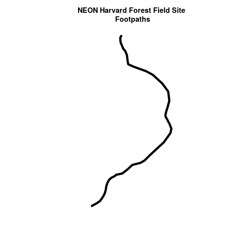

Interesting. Above, it appeared as if we had 2 features in our footpaths subset.
Why does the plot look like there is only one feature?

Let's adjust the colors used in our plot. If we have 2 features in our vector
object, we can plot each using a unique color by assigning unique colors (`col=`)
to our features. We use the syntax

`col = "c("colorOne", "colorTwo")`

to do this.

~~~
# plot just footpaths
plot(footpath_HARV$geometry,
     col = c("green", "blue"), # set color for each feature
     lwd = 6,
     main = "NEON Harvard Forest Field Site\n Footpaths \n Feature one = blue, Feature two= green")
~~~
{: .r}

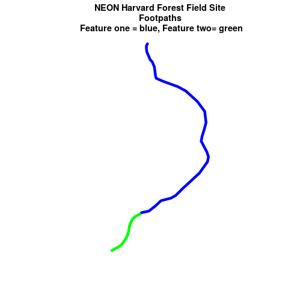

Now, we see that there are in fact two features in our plot!

> ## Challenge: Subset Spatial Line Objects
> 
> Subset out all:
> 
> 1. `boardwalk` from the lines layer and plot it.
> 2. `stone wall` features from the lines layer and plot it.
> 
> For each plot, color each feature using a unique color.
> 
> > ## Answers
> > 
> > 
> > ~~~
> > # save an object with only boardwalk lines
> > boardwalk_HARV<-lines_HARV[lines_HARV$TYPE == "boardwalk",]
> > boardwalk_HARV
> > ~~~
> > {: .r}
> > 
> > 
> > 
> > ~~~
> > Simple feature collection with 1 feature and 15 fields
> > geometry type:  MULTILINESTRING
> > dimension:      XY
> > bbox:           xmin: 732153.8 ymin: 4713258 xmax: 732189.6 ymax: 4713305
> > epsg (SRID):    32618
> > proj4string:    +proj=utm +zone=18 +datum=WGS84 +units=m +no_defs
> >    OBJECTID_1 OBJECTID      TYPE NOTES MISCNOTES RULEID MAPLABEL
> > 10        553      674 boardwalk  <NA>      <NA>      2     <NA>
> >    SHAPE_LENG LABEL BIKEHORSE RESVEHICLE RECMAP Shape_Le_1
> > 10   67.43464  <NA>         N         R3      N   67.43466
> >                  ResVehic_1             BicyclesHo
> > 10 R3 - No Vehicles Allowed DO NOT SHOW ON REC MAP
> >                          geometry
> > 10 MULTILINESTRING ((732153.83...
> > ~~~
> > {: .output}
> > 
> > 
> > 
> > ~~~
> > # how many features are in our new object
> > nrow(boardwalk_HARV)
> > ~~~
> > {: .r}
> > 
> > 
> > 
> > ~~~
> > [1] 1
> > ~~~
> > {: .output}
> > 
> > 
> > 
> > ~~~
> > # plot just footpaths
> > plot(boardwalk_HARV$geometry,
> >      col = c("green"), # set color for feature
> >      lwd = 6,
> >      main = "NEON Harvard Forest Field Site\n Boardwalks\n Feature one = blue, Feature two= green")
> > ~~~
> > {: .r}
> > 
> > 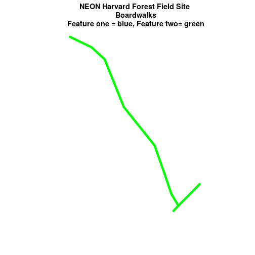
> > 
> > ~~~
> > # save an object with only stone wall lines
> > stoneWall_HARV <- lines_HARV[lines_HARV$TYPE == "stone wall",]
> > stoneWall_HARV
> > ~~~
> > {: .r}
> > 
> > 
> > 
> > ~~~
> > Simple feature collection with 6 features and 15 fields
> > geometry type:  MULTILINESTRING
> > dimension:      XY
> > bbox:           xmin: 731882.6 ymin: 4713019 xmax: 732258.2 ymax: 4713299
> > epsg (SRID):    32618
> > proj4string:    +proj=utm +zone=18 +datum=WGS84 +units=m +no_defs
> >   OBJECTID_1 OBJECTID       TYPE NOTES MISCNOTES RULEID MAPLABEL
> > 4        211      279 stone wall  <NA>      <NA>      1     <NA>
> > 5        212      280 stone wall  <NA>      <NA>      1     <NA>
> > 6        213      281 stone wall  <NA>      <NA>      1     <NA>
> > 7        214      282 stone wall  <NA>      <NA>      1     <NA>
> > 8        215      283 stone wall  <NA>      <NA>      1     <NA>
> > 9        216      284 stone wall  <NA>      <NA>      1     <NA>
> >   SHAPE_LENG LABEL BIKEHORSE RESVEHICLE RECMAP Shape_Le_1 ResVehic_1
> > 4  231.78957  <NA>      <NA>       <NA>   <NA>  231.78962       <NA>
> > 5   45.50864  <NA>      <NA>       <NA>   <NA>   45.50859       <NA>
> > 6  198.39043  <NA>      <NA>       <NA>   <NA>  198.39041       <NA>
> > 7  143.19240  <NA>      <NA>       <NA>   <NA>  143.19241       <NA>
> > 8   90.33118  <NA>      <NA>       <NA>   <NA>   90.33114       <NA>
> > 9   35.88146  <NA>      <NA>       <NA>   <NA>   35.88152       <NA>
> >   BicyclesHo                       geometry
> > 4       <NA> MULTILINESTRING ((731903.61...
> > 5       <NA> MULTILINESTRING ((732039.10...
> > 6       <NA> MULTILINESTRING ((732056.22...
> > 7       <NA> MULTILINESTRING ((731963.99...
> > 8       <NA> MULTILINESTRING ((732105.20...
> > 9       <NA> MULTILINESTRING ((732222.89...
> > ~~~
> > {: .output}
> > 
> > 
> > 
> > ~~~
> > # how many features are in our new object?
> > nrow(stoneWall_HARV)
> > ~~~
> > {: .r}
> > 
> > 
> > 
> > ~~~
> > [1] 6
> > ~~~
> > {: .output}
> > 
> > 
> > 
> > ~~~
> > # plot just footpaths
> > plot(stoneWall_HARV$geometry,
> >      col = c("green", "blue", "orange", "brown", "darkgreen", "purple"),
> >         # set color for each feature
> >      lwd = 6,
> >      main = "NEON Harvard Forest Field Site\n Stonewalls\n Each Feature in Different Color")
> > ~~~
> > {: .r}
> > 
> > 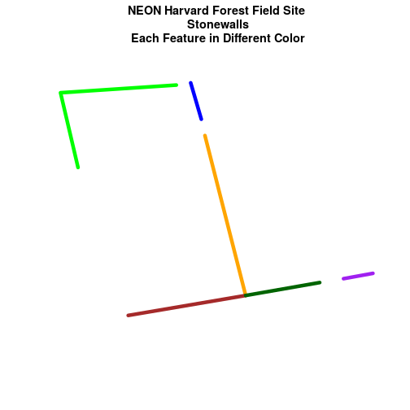
> {: .solution}
{: .challenge}

## Plot Lines by Attribute Value
To plot vector data with the color determined by a set of attribute values, the attribute values must be class = `factor`. A **factor** is similar to a category you can group vector objects by a particular category value for example you can group all lines of `TYPE=footpath`. However, in `R`, a factor can also have a determined *order*.

By default, `R` will import spatial object attributes as `factors`.

> ## Data Tip
> If our data attribute values are not
> read in as factors, we can convert the categorical
> attribute values using `as.factor()`.
{: .callout}

~~~
# view the original class of the TYPE column
class(lines_HARV$TYPE)
~~~
{: .r}

~~~
[1] "factor"
~~~
{: .output}

~~~
# view levels or categories - note that there are no categories yet in our data!
# the attributes are just read as a list of character elements.
levels(lines_HARV$TYPE)
~~~
{: .r}

~~~
[1] "boardwalk"  "footpath"   "stone wall" "woods road"
~~~
{: .output}

~~~
# Convert the TYPE attribute into a factor
# Only do this IF the data do not import as a factor!
# lines_HARV$TYPE <- as.factor(lines_HARV$TYPE)
# class(lines_HARV$TYPE)
# levels(lines_HARV$TYPE)

# how many features are in each category or level?
summary(lines_HARV$TYPE)
~~~
{: .r}

~~~
 boardwalk   footpath stone wall woods road 
         1          2          6          4 
~~~
{: .output}

When we use `plot()`, we can specify the colors to use for each attribute using
the `col=` element. To ensure that `R` renders each feature by it's associated
factor / attribute value, we need to create a `vector` or colors - one for each
feature, according to it's associated attribute value / `factor` value.

To create this vector we can use the following syntax:

`c("colorOne", "colorTwo", "colorThree")[object$factor]`

Note in the above example we have

1. a vector of colors - one for each factor value (unique attribute value)
2. the attribute itself (`[object$factor]`) of class `factor`.

Let's give this a try.

~~~
# Check the class of the attribute - is it a factor?
class(lines_HARV$TYPE)
~~~
{: .r}

~~~
[1] "factor"
~~~
{: .output}

~~~
# how many "levels" or unique values does hte factor have?
# view factor values
levels(lines_HARV$TYPE)
~~~
{: .r}

~~~
[1] "boardwalk"  "footpath"   "stone wall" "woods road"
~~~
{: .output}

~~~
# count the number of unique values or levels
length(levels(lines_HARV$TYPE))
~~~
{: .r}

~~~
[1] 4
~~~
{: .output}

~~~
# create a color palette of 4 colors - one for each factor level
roadPalette <- c("blue", "green", "grey", "purple")
roadPalette
~~~
{: .r}

~~~
[1] "blue"   "green"  "grey"   "purple"
~~~
{: .output}

~~~
# create a vector of colors - one for each feature in our vector object
# according to its attribute value
roadColors <- c("blue", "green", "grey", "purple")[lines_HARV$TYPE]
roadColors
~~~
{: .r}

~~~
 [1] "purple" "green"  "green"  "grey"   "grey"   "grey"   "grey"  
 [8] "grey"   "grey"   "blue"   "purple" "purple" "purple"
~~~
{: .output}

~~~
# plot the lines data, apply a diff color to each factor level)
plot(lines_HARV$geometry,
     col=roadColors,
     lwd = 3,
     main = "NEON Harvard Forest Field Site\n Roads & Trails")
~~~
{: .r}

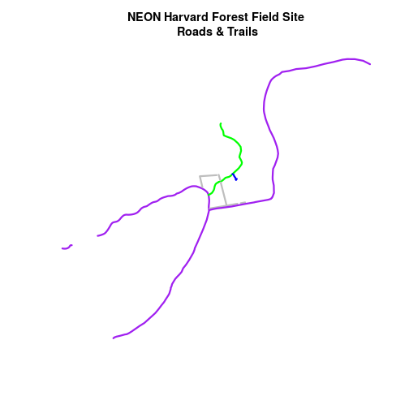

### Adjust Line Width
We can also adjust the width of our plot lines using `lwd`. We can set all lines
to be thicker or thinner using `lwd = `.

~~~
# make all lines thicker
plot(lines_HARV$geometry,
     col=roadColors,
     main = "NEON Harvard Forest Field Site\n Roads & Trails\n All Lines Thickness=6",
     lwd = 6)
~~~
{: .r}

### Adjust Line Width by Attribute

If we want a unique line width for each factor level or attribute category
in our spatial object, we can use the same syntax that we used for colors, above.

`lwd = c("widthOne", "widthTwo", "widthThree")[object$factor]`

Note that this requires the attribute to be of class `factor`. Let's give it a
try.

~~~
class(lines_HARV$TYPE)
~~~
{: .r}

~~~
[1] "factor"
~~~
{: .output}

~~~
levels(lines_HARV$TYPE)
~~~
{: .r}

~~~
[1] "boardwalk"  "footpath"   "stone wall" "woods road"
~~~
{: .output}

~~~
# create vector of line widths
lineWidths <- (c(1, 2, 3, 4))[lines_HARV$TYPE]
# adjust line width by level
# in this case, boardwalk (the first level) is the narrowest.
plot(lines_HARV$geometry,
     col=roadColors,
     main = "NEON Harvard Forest Field Site\n Roads & Trails \n Line width varies by TYPE Attribute Value",
     lwd = lineWidths)
~~~
{: .r}

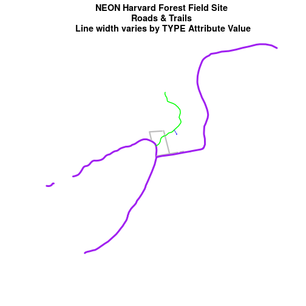

> ## Challenge: Plot Line Width by Attribute
> 
> We can customize the width of each line, according to specific attribute value,
> too. To do this, we create a vector of line width values, and map that vector
> to the factor levels - using the same syntax that we used above for colors.
> HINT: `lwd = (vector of line width thicknesses)[spatialObject$factorAttribute]`
> 
> Create a plot of roads using the following line thicknesses:
> 
> 1. woods road lwd = 8
> 2. Boardwalks lwd = 2
> 3. footpath lwd = 4
> 4. stone wall lwd = 3
> 
> > ## Answers
> > 
> > 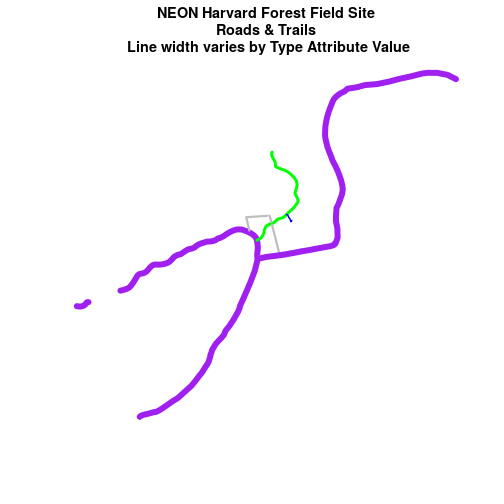
> {: .solution}
{: .challenge}

> ## Data Tip
> Given we have a factor with 4 levels,
> we can create an vector of numbers, each of which specifies the thickness of each
> feature in our `SpatialLinesDataFrame` by factor level (category): `c(6, 4, 1, 2)[lines_HARV$TYPE]`
{: .callout}

## Add Plot Legend
We can add a legend to our plot too. When we add a legend, we use the following
elements to specify labels and colors:

* `bottomright`: We specify the **location** of our legend by using a default
keyword. We could also use `top`, `topright`, etc.
* `levels(objectName$attributeName)`: Label the **legend elements** using the
categories of `levels` in an attribute (e.g., levels(lines_HARV$TYPE) means use
the levels boardwalk, footpath, etc).
* `fill=`: apply unique **colors** to the boxes in our legend. `palette()` is
the default set of colors that `R` applies to all plots.

Let's add a legend to our plot.

~~~
plot(lines_HARV$geometry,
     col=roadColors,
     main = "NEON Harvard Forest Field Site\n Roads & Trails\n Default Legend")

# we can use the color object that we created above to color the legend objects
roadPalette
~~~
{: .r}

~~~
[1] "blue"   "green"  "grey"   "purple"
~~~
{: .output}

~~~
# add a legend to our map
legend("bottomright",   # location of legend
      legend=levels(lines_HARV$TYPE), # categories or elements to render in
			 # the legend
      fill=roadPalette) # color palette to use to fill objects in legend.
~~~
{: .r}

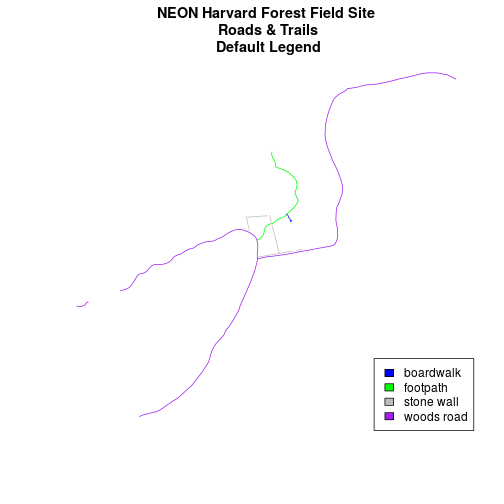

We can tweak the appearance of our legend too.

* `bty=n`: turn off the legend BORDER
* `cex`: change the font size

Let's try it out.

~~~
plot(lines_HARV$geometry,
     col=roadColors,
     main = "NEON Harvard Forest Field Site\n Roads & Trails \n Modified Legend")
# add a legend to our map
legend("bottomright",
       legend=levels(lines_HARV$TYPE),
       fill=roadPalette,
       bty = "n", # turn off the legend border
       cex = .8) # decrease the font / legend size
~~~
{: .r}

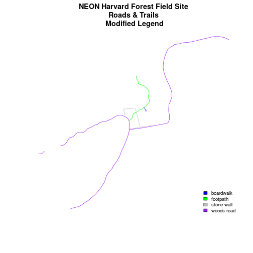

We can modify the colors used to plot our lines by creating a new color vector,
directly in the plot code too rather than creating a separate object.

`col=(newColors)[lines_HARV$TYPE]`

Let's try it!

~~~
# manually set the colors for the plot!
newColors <- c("springgreen", "blue", "magenta", "orange")
newColors
~~~
{: .r}

~~~
[1] "springgreen" "blue"        "magenta"     "orange"     
~~~
{: .output}

~~~
# plot using new colors
plot(lines_HARV$geometry,
     col=(newColors)[lines_HARV$TYPE],
     main = "NEON Harvard Forest Field Site\n Roads & Trails \n Pretty Colors")

# add a legend to our map
legend("bottomright",
       levels(lines_HARV$TYPE),
       fill=newColors,
       bty = "n", cex = .8)
~~~
{: .r}

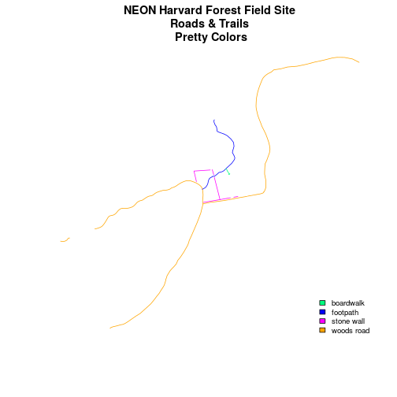

> ## Data Tip
> You can modify the defaul R color palette
> using the palette method. For example `palette(rainbow(6))` or
> `palette(terrain.colors(6))`. You can reset the palette colors using
> `palette("default")`!
{: .callout}

> ## Challenge: Plot Lines by Attribute
> 
> Create a plot that emphasizes only roads where bicycles and horses are allowed.
> To emphasize this, make the lines where bicycles are not allowed THINNER than
> the roads where bicycles are allowed.
> NOTE: this attribute information is located in the `lines_HARV$BicyclesHo`
> attribute.
> 
> Be sure to add a title and legend to your map! You might consider a color
> palette that has all bike/horse-friendly roads displayed in a bright color. All
> other lines can be grey.
> 
> > ## Answers
> > 
> > 
> > ~~~
> > # view levels
> > levels(lines_HARV$BicyclesHo)
> > # make sure the attribute is of class "Factor"
> > 
> > class(lines_HARV$BicyclesHo)
> >  
> > # convert to factor if necessary
> > lines_HARV$BicyclesHo <- as.factor(lines_HARV$BicyclesHo)
> > levels(lines_HARV$BicyclesHo)
> > 
> > # remove NA values
> > lines_removeNA <- lines_HARV[na.omit(lines_HARV$BicyclesHo),]
> > # count factor levels
> > length(levels(lines_HARV$BicyclesHo))
> > # set colors so only the allowed roads are magenta
> > # note there are 3 levels so we need 3 colors
> > challengeColors <- c("magenta", "grey", "grey")
> > challengeColors
> > 
> > # set line width so the first factor level is thicker than the others
> > lines_HARV$BicyclesHo
> > c(4, 1, 1)[lines_HARV$BicyclesHo]
> > 
> > # plot using new colors
> > plot(lines_HARV$geometry,
> >      col=(challengeColors)[lines_HARV$BicyclesHo],
> >      lwd = c(4, 1, 1)[lines_HARV$BicyclesHo],
> >      main = "NEON Harvard Forest Field Site\n Roads Where Bikes and Horses Are Allowed")
> > 
> > # add a legend to our map
> > legend("bottomright",
> >        levels(lines_HARV$BicyclesHo),
> >        fill=challengeColors,
> >        bty = "n", # turn off border
> >        cex = .8) # adjust font size
> > ~~~
> > {: .r}
> > 
> > 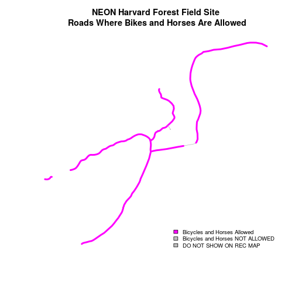
> {: .solution}
{: .challenge}

> ## Challenge: Plot Polygon by Attribute
> 
> 1. Create a map of the State boundaries in the United States using the data
> located in your downloaded data folder: `NEON-DS-Site-Layout-Files/US-Boundary-Layers\US-State-Boundaries-Census-2014`.
> Apply a fill color to each state using its `region` value. Add a legend.
> 
> 2. Using the `NEON-DS-Site-Layout-Files/HARV/PlotLocations_HARV.shp` shapefile,
> create a map of study plot locations, with each point colored by the soil type
> (`soilTypeOr`).  **Question:** How many different soil types are there at this particular field site?
> 
> 3. BONUS -- modify the field site plot above. Plot each point,
> using a different symbol. HINT: you can assign the symbol using `pch=` value.
> You can create a vector object of symbols by factor level using the syntax
> syntax that we used above to create a vector of lines widths and colors:
> `pch = c(15, 17)[lines_HARV$soilTypeOr]`. Type `?pch` to learn more about pch or
> use google to find a list of pch symbols that you can use in `R`.
> 
> > ## Answers
> > 
> > 
> > ~~~
> > ## 1
> > # Read the shapefile file
> > state_boundary_US <- st_read("data/NEON-DS-Site-Layout-Files/US-Boundary-Layers/US-State-Boundaries-Census-2014.shp")
> > ~~~
> > {: .r}
> > 
> > 
> > 
> > ~~~
> > Reading layer `US-State-Boundaries-Census-2014' from data source `/home/jose/Documents/Science/Projects/software-carpentry/data-carpentry_lessons/R-spatial-raster-vector-lesson/_episodes_rmd/data/NEON-DS-Site-Layout-Files/US-Boundary-Layers/US-State-Boundaries-Census-2014.shp' using driver `ESRI Shapefile'
> > Simple feature collection with 58 features and 10 fields
> > geometry type:  MULTIPOLYGON
> > dimension:      XYZ
> > bbox:           xmin: -124.7258 ymin: 24.49813 xmax: -66.9499 ymax: 49.38436
> > epsg (SRID):    4326
> > proj4string:    +proj=longlat +datum=WGS84 +no_defs
> > ~~~
> > {: .output}
> > 
> > 
> > 
> > ~~~
> > # how many levels?
> > levels(state_boundary_US$region)
> > ~~~
> > {: .r}
> > 
> > 
> > 
> > ~~~
> > [1] "Midwest"   "Northeast" "Southeast" "Southwest" "West"     
> > ~~~
> > {: .output}
> > 
> > 
> > 
> > ~~~
> > colors <- c("purple", "springgreen", "yellow", "brown", "grey")
> > colors
> > ~~~
> > {: .r}
> > 
> > 
> > 
> > ~~~
> > [1] "purple"      "springgreen" "yellow"      "brown"       "grey"       
> > ~~~
> > {: .output}
> > 
> > 
> > 
> > ~~~
> > plot(state_boundary_US$geometry,
> >      col=(colors)[state_boundary_US$region],
> >      main = "Contiguous U.S. State Boundaries \n 50 Colors")
> > 
> > # add a legend to our map
> > legend("bottomright",
> >        levels(state_boundary_US$region),
> >        fill=colors,
> >        bty = "n", #turn off border
> >        cex = .7) #adjust font size
> > ~~~
> > {: .r}
> > 
> > 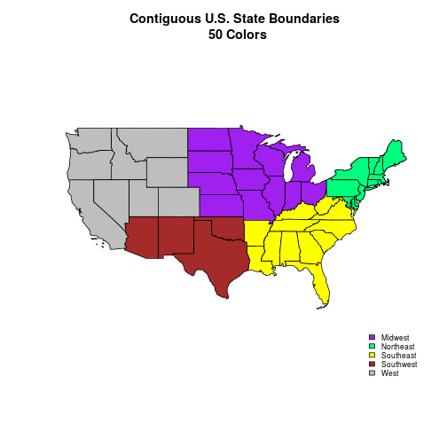
> > 
> > ~~~
> > ## 2
> > # open plot locations
> > plotLocations <- st_read("data/NEON-DS-Site-Layout-Files/HARV/PlotLocations_HARV.shp")
> > ~~~
> > {: .r}
> > 
> > 
> > 
> > ~~~
> > Reading layer `PlotLocations_HARV' from data source `/home/jose/Documents/Science/Projects/software-carpentry/data-carpentry_lessons/R-spatial-raster-vector-lesson/_episodes_rmd/data/NEON-DS-Site-Layout-Files/HARV/PlotLocations_HARV.shp' using driver `ESRI Shapefile'
> > Simple feature collection with 21 features and 25 fields
> > geometry type:  POINT
> > dimension:      XY
> > bbox:           xmin: 731405.3 ymin: 4712845 xmax: 732275.3 ymax: 4713846
> > epsg (SRID):    32618
> > proj4string:    +proj=utm +zone=18 +datum=WGS84 +units=m +no_defs
> > ~~~
> > {: .output}
> > 
> > 
> > 
> > ~~~
> > # how many unique soils?  Two
> > unique(plotLocations$soilTypeOr)
> > ~~~
> > {: .r}
> > 
> > 
> > 
> > ~~~
> > [1] Inceptisols Histosols  
> > Levels: Histosols Inceptisols
> > ~~~
> > {: .output}
> > 
> > 
> > 
> > ~~~
> > # create new color palette -- topo.colors palette
> > blueGreen <- c("blue","springgreen")
> > blueGreen
> > ~~~
> > {: .r}
> > 
> > 
> > 
> > ~~~
> > [1] "blue"        "springgreen"
> > ~~~
> > {: .output}
> > 
> > 
> > 
> > ~~~
> > # plot the locations
> > plot(plotLocations$geometry,
> >      col=(blueGreen)[plotLocations$soilTypeOr],
> >      pch=18,
> >      main = "NEON Harvard Forest Field Site\n Study Plots by Soil Type\n One Symbol for All Types")
> > 
> > # create legend
> > legend("bottomright",
> >        legend = c("Intceptisols", "Histosols"),
> >        pch=18,
> >        col=blueGreen,
> >        bty = "n",
> >        cex = 1)
> > ~~~
> > {: .r}
> > 
> > 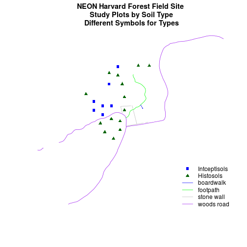
> > 
> > ~~~
> > ## 3
> > # create vector of plot symbols
> > plSymbols <- c(15, 17)[plotLocations$soilTypeOr]
> > plSymbols
> > ~~~
> > {: .r}
> > 
> > 
> > 
> > ~~~
> >  [1] 17 17 17 15 17 15 15 17 17 15 17 17 17 17 15 17 17 17 15 17 15
> > ~~~
> > {: .output}
> > 
> > 
> > 
> > ~~~
> > # plot the locations
> > plot(plotLocations$geometry,
> >      col=plotLocations$soilTypeOr,
> >      pch=plSymbols,
> >      main = "NEON Harvard Forest Field Site\n Study Plots by Soil Type\n Unique Symbol for Each Type")
> > 
> > # create vector of plot symbols ONLY. Legend needs only the symbols
> > plSymbolsL <- c(15, 17)
> > plSymbolsL
> > ~~~
> > {: .r}
> > 
> > 
> > 
> > ~~~
> > [1] 15 17
> > ~~~
> > {: .output}
> > 
> > 
> > 
> > ~~~
> > # create legend
> > legend("bottomright",
> >        legend = c("Intceptisols", "Histosols"),
> >        pch=plSymbolsL,
> >        col=palette(),
> >        bty = "n",
> >        cex = 1)
> > ~~~
> > {: .r}
> > 
> > 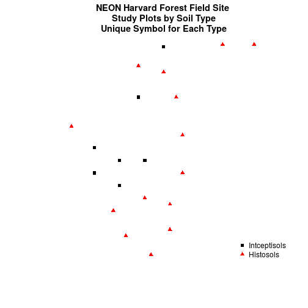
> {: .solution}
{: .challenge}
