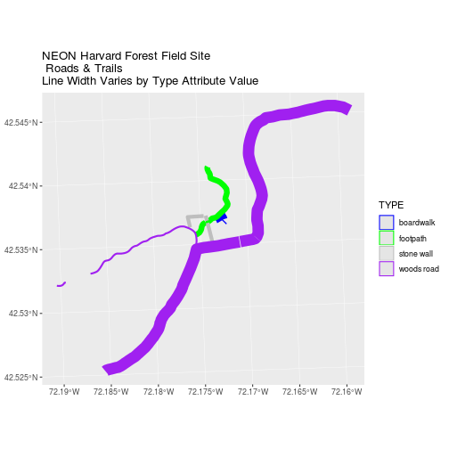
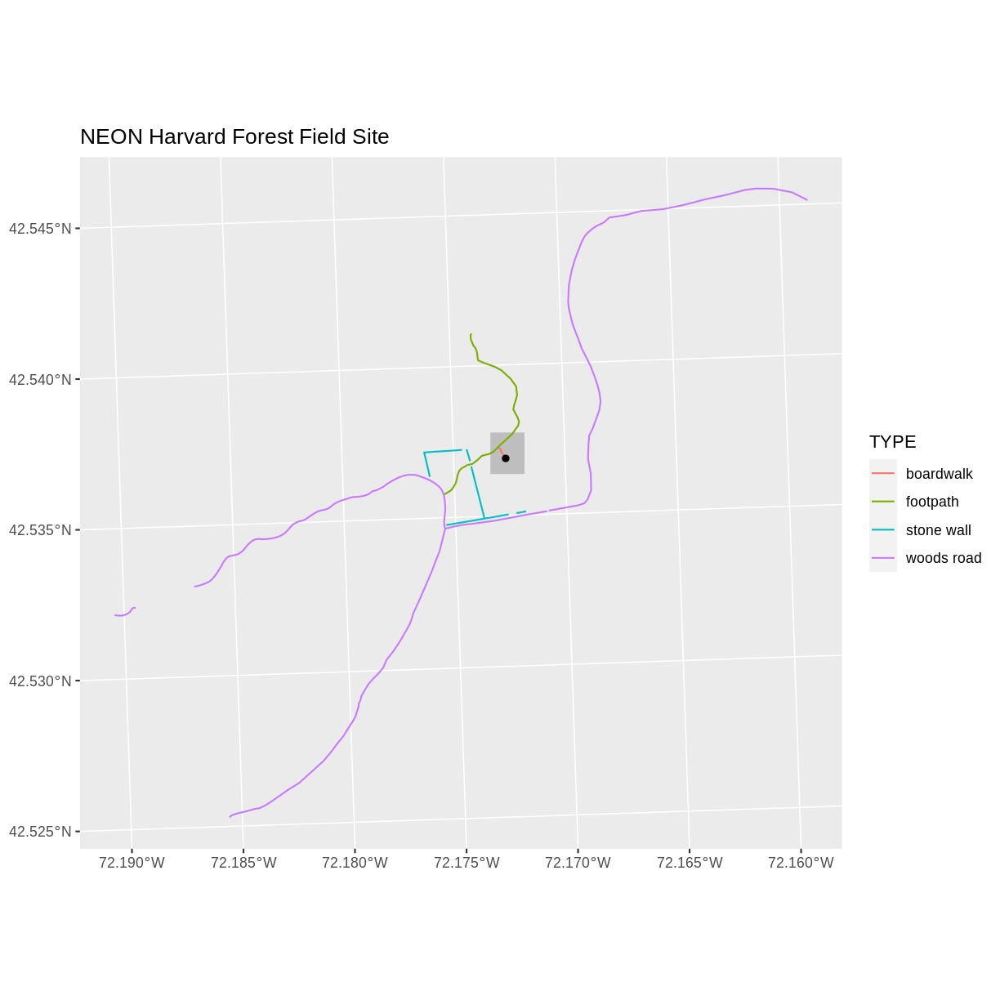
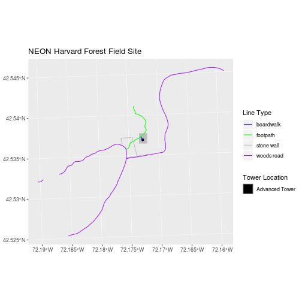
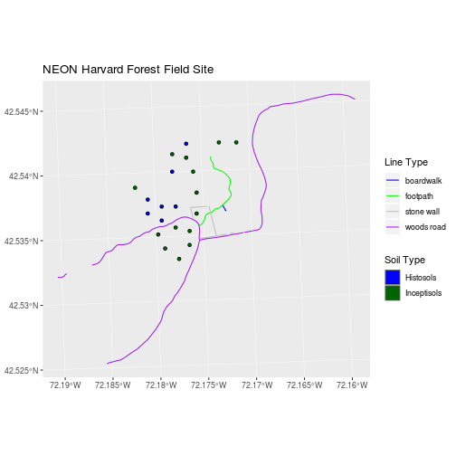

---
# Please do not edit this file directly; it is auto generated.
# Instead, please edit 08-vector-plot-shapefiles-custom-legend.md in _episodes_rmd/
title: "Plot Multiple Shapefiles in R"
teaching: 20
exercises: 10
questions:
- "How to create map compositions with custom legends in ggplot."
objectives:
- "Be able to plot multiple shapefiles using ggplot."
- "Be able to apply custom symbology to spatial objects in a plot in R."
- "Be able to customize a ggplot legend in R."
keypoints:
- ""
---

> ## Things You’ll Need To Complete This Episode
> See the [lesson homepage]({{ site.baseurl }}) for detailed information about the software,
> data, and other prerequisites you will need to work through the examples in this episode.
{: .prereq}

This episode builds upon
[the previous episode]({{ site.baseurl }}/07-vector-shapefile-attributes-in-r/)
to work with shapefile attributes in `R` and explores how to plot multiple
shapefiles using base R graphics.

## Load the Data
To work with vector data in `R`, we can use the `sf` library. The `raster`
package also allows us to explore metadata using similar commands for both
raster and vector files. Make sure that you have these libraries loaded.

~~~
library(sf)
library(raster)
~~~
{: .language-r}

We will continue to work with the three shapefiles that we loaded in the
[Open and Plot Shapefiles in R]({{site.baseurl}}/06-vector-open-shapefile-in-r/) episode.

## Plot Data

In the
[Explore Shapefile Attributes & Plot Shapefile Objects by Attribute Value in R]({{ site.baseurl }}/07-vector-shapefile-attributes-in-r/) episode,
we created a plot where we customized the width of each line in a spatial object
according to a factor level or category. To do this, we create a vector of
colors containing a color value for EACH feature in our spatial object grouped
by factor level or category.

~~~
# create a color palette of 4 colors - one for each factor level
road_palette <- c("blue", "green", "grey", "purple")
road_palette
~~~
{: .language-r}

~~~
[1] "blue"   "green"  "grey"   "purple"
~~~
{: .output}

~~~
# create vector of line width values
lineWidth <- c(1, 3, 2, 6)[lines_HARV$TYPE]

# in this case, boardwalk (the first level) is the widest.
ggplot() + 
  geom_sf(data = lines_HARV, aes(color = TYPE), size = lineWidth) +
  scale_color_manual(values = road_palette) + 
  ggtitle("NEON Harvard Forest Field Site\n Roads & Trails \nLine Width Varies by Type Attribute Value")
~~~
{: .language-r}

> ## Data Tip
> Given we have a factor with 4 levels,
> we can create a vector of numbers, each of which specifies the thickness of each
> feature in our `sf` object by factor level (category): `c(6, 4, 1, 2)[lines_HARV$TYPE]`
{: .callout}

## Customize Your Legend
In the [previous episode]({{ site.baseurl }}/R/shapefile-attributes-in-R/),
we also learned how to add a basic legend to our plot.

However, what if we want to create a more complex plot with many shapefiles
and unique symbols that need to be represented clearly in a legend?

Now, let's create a plot that combines our tower location (`point_HARV`),
site boundary (`aoi_boundary_HARV`) and roads (`lines_HARV`) spatial objects. We
will need to build a **custom legend** as well.

To begin, create a plot with the site boundary as the first layer. Then layer
the tower location and road data on top using `+`.

~~~
# Plot multiple shapefiles
ggplot() + 
  geom_sf(data = aoi_boundary_HARV, fill = "grey", color = "grey93") +
  geom_sf(data = point_HARV) +
  geom_sf(data = lines_HARV, aes(color = TYPE)) + 
  ggtitle("NEON Harvard Forest Field Site")
~~~
{: .language-r}

Next, let's build a custom legend using the symbology (the colors and symbols)
that we used to create the plot above. For example, it might be good if the lines were symbolized as a line.

~~~
ggplot() + 
  geom_sf(data = aoi_boundary_HARV, fill = "grey", color = "grey93") +
  geom_sf(data = lines_HARV, aes(color = TYPE), show.legend = "line") +
  scale_color_manual(values = road_palette) +
  geom_sf(data = point_HARV, aes(fill = Sub_Type), color = "black") +
  scale_fill_manual(values = "black") + 
  ggtitle("NEON Harvard Forest Field Site")
~~~
{: .language-r}

Now lets adjust the legend titles by passing a `name` to the respective `color` and `fill` palettes.

~~~
ggplot() + 
  geom_sf(data = aoi_boundary_HARV, fill = "grey", color = "grey93") +
  geom_sf(data = point_HARV, aes(fill = Sub_Type)) +
  geom_sf(data = lines_HARV, aes(color = TYPE), show.legend = "line") + 
  scale_color_manual(values = road_palette, name = "Line Type") + 
  scale_fill_manual(values = "black", name = "Tower Location") + 
  ggtitle("NEON Harvard Forest Field Site")
~~~
{: .language-r}

Finally, it might be better if the points were symbolized as a symbol. We can customize this using `shape` parameters in our call to `geom_sf`: **16** is a point symbol, **15** is a box.

> ## Data Tip
> To view a short list of `shape` symbols,
> type `?pch` into the `R` console.
{: .callout}

~~~
(gg <- ggplot() + 
         geom_sf(data = aoi_boundary_HARV, fill = "grey", color = "grey93") +
         geom_sf(data = point_HARV, aes(fill = Sub_Type), shape = 15) +
         geom_sf(data = lines_HARV, aes(color = TYPE), show.legend = "line") + 
  scale_color_manual(values = road_palette, name = "Line Type") + 
  scale_fill_manual(values = "black", name = "Tower Location")) + 
  ggtitle("NEON Harvard Forest Field Site")
~~~
{: .language-r}

> ## Challenge: Plot Polygon by Attribute
> 
> 1. Using the `NEON-DS-Site-Layout-Files/HARV/PlotLocations_HARV.shp` shapefile,
> create a map of study plot locations, with each point colored by the soil type
> (`soilTypeOr`). How many different soil types are there at this particular field
> site? Overlay this layer on top of the `lines_HARV` layer (the roads). Create a
> custom legend that applies line symbols to lines and point symbols to the points.
> 
> 2. Modify the plot above. Tell `R` to plot each point, using a different
symbol of `shape` value. > 
> 
> > ## Answers
> > 
> > 
> > ~~~
> > ## 1
> > # open plot locations
> > plotLocations <- st_read("data/NEON-DS-Site-Layout-Files/HARV/PlotLocations_HARV.shp")
> > 
> > # how many unique soils?  Two
> > unique(plotLocations$soilTypeOr)
> > 
> > # create new color palette -- topo.colors palette
> > blueGreen <- c("blue", "darkgreen")
> > blueGreen
> > 
> > ggplot() + 
> >   geom_sf(data = lines_HARV, aes(color = TYPE), show.legend = "line") + 
> >   geom_sf(data = plotLocations, aes(fill = soilTypeOr), shape = 21) + 
> >   scale_color_manual(name = "Line Type", values = road_palette) + 
> >   scale_fill_manual(name = "Soil Type", values = blueGreen) + 
> >   ggtitle("NEON Harvard Forest Field Site")
> > ~~~
> > {: .language-r}
> > 
> > 
> > 
> > ~~~
> > ## 2
> > # create vector of DIFFERENT filled symbols
> > plSymbols <- c(21, 22)
> > 
> >  ggplot() + 
> >    geom_sf(data = lines_HARV, aes(color = TYPE), show.legend = "line") + 
> >    geom_sf(data = plotLocations, aes(fill = soilTypeOr, shape = soilTypeOr)) + 
> >    scale_shape_manual(name = "Soil Type", values = c(21, 22)) +
> >    scale_color_manual(name = "Line Type", values = road_palette) + 
> >    scale_fill_manual(name = "Soil Type", values = blueGreen) + 
> >    ggtitle("NEON Harvard Forest Field Site")
> > ~~~
> > {: .language-r}
> > 
> > 
> {: .solution}
{: .challenge}
