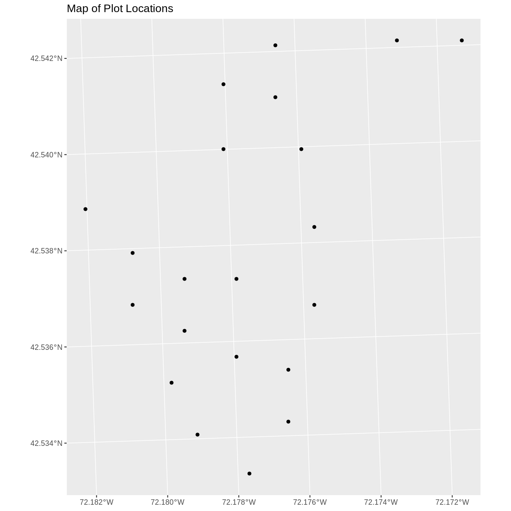
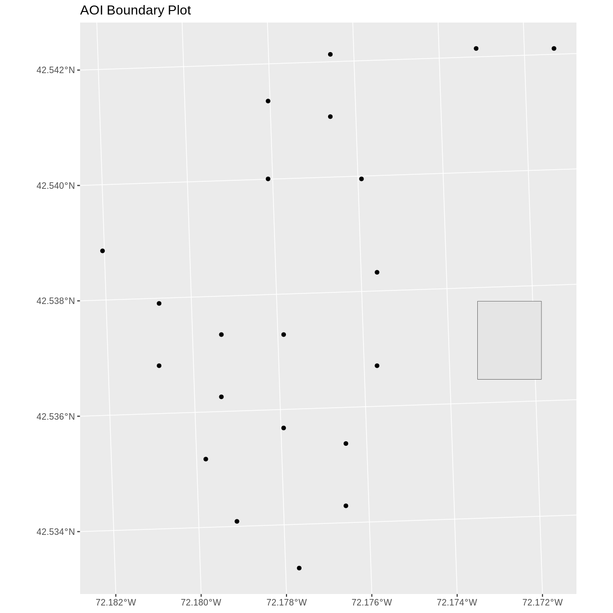
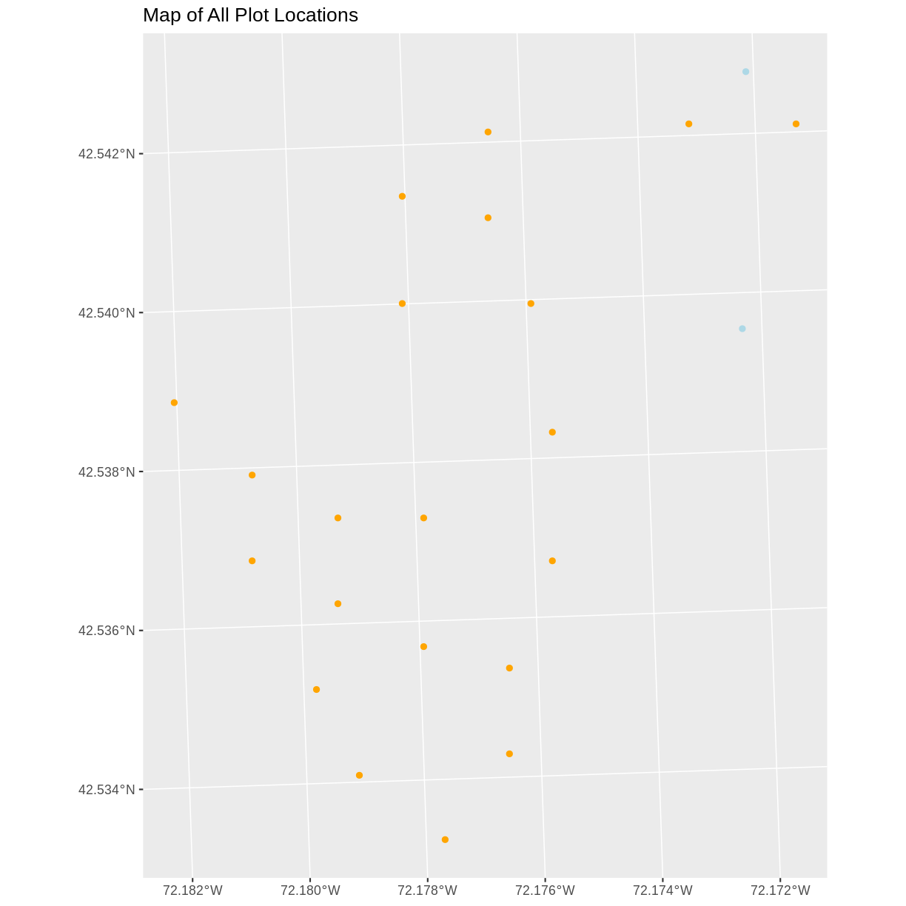

---
# Please do not edit this file directly; it is auto generated.
# Instead, please edit 10-vector-csv-to-shapefile-in-r.md in _episodes_rmd/
title: "Convert from .csv to a Shapefile"
teaching: 40
exercises: 20
questions:
- "How can I import CSV files as shapefiles in R?"
objectives:
- "Import .csv files containing x,y coordinate locations into R as a data frame."
- "Convert a data frame to a spatial object."
- "Export a spatial object to a text file."
keypoints:
- "Know the projection (if any) of your point data prior to converting to a spatial object."
- "Convert a data frame to an `sf` object using the `st_as_sf()` function."
- "Export an `sf` object as text using the `st_write()` function."
source: Rmd
---

~~~
## Warning in download.file("http://www.naturalearthdata.com/http//
## www.naturalearthdata.com/download/110m/physical/ne_110m_graticules_all.zip", :
## URL 'https://naciscdn.org/naturalearth/110m/physical/
## ne_110m_graticules_all.zip': status was 'Couldn't resolve host name'
~~~
{: .warning}

~~~
## Error in download.file("http://www.naturalearthdata.com/http//www.naturalearthdata.com/download/110m/physical/ne_110m_graticules_all.zip", : cannot open URL 'http://www.naturalearthdata.com/http//www.naturalearthdata.com/download/110m/physical/ne_110m_graticules_all.zip'
~~~
{: .error}

> ## Things You’ll Need To Complete This Episode
> See the [lesson homepage]({{ site.baseurl }}) for detailed information about the software,
> data, and other prerequisites you will need to work through the examples in this episode.
{: .prereq}

This episode will review how to import spatial points stored in `.csv` (Comma Separated Value) format into R as an `sf` spatial object. We will also reproject data imported from a shapefile format, export this data as a shapefile, and plot raster and vector data as layers in the same plot.

## Spatial Data in Text Format

The `HARV_PlotLocations.csv` file contains `x, y` (point) locations for study
plot where NEON collects data on
[vegetation and other ecological metrics](https://www.neonscience.org/data-collection/terrestrial-organismal-sampling).
We would like to:

* Create a map of these plot locations.
* Export the data in a `shapefile` format to share with our colleagues. This
shapefile can be imported into any GIS software.
* Create a map showing vegetation height with plot locations layered on top.

Spatial data are sometimes stored in a text file format (`.txt` or `.csv`). If
the text file has an associated `x` and `y` location column, then we can
convert it into an `sf` spatial object. The `sf` object allows us to store both the `x,y` values that represent the coordinate location
of each point and the associated attribute data - or columns describing each
feature in the spatial object.

We will continue using the `sf` and `raster` packages in this episode.

## Import .csv
To begin let's import a `.csv` file that contains plot coordinate `x, y`
locations at the NEON Harvard Forest Field Site (`HARV_PlotLocations.csv`) and look at the structure of
that new object:

~~~
plot_locations_HARV <-
  read.csv("data/NEON-DS-Site-Layout-Files/HARV/HARV_PlotLocations.csv")

str(plot_locations_HARV)
~~~
{: .language-r}

~~~
'data.frame':	21 obs. of  16 variables:
 $ easting   : num  731405 731934 731754 731724 732125 ...
 $ northing  : num  4713456 4713415 4713115 4713595 4713846 ...
 $ geodeticDa: chr  "WGS84" "WGS84" "WGS84" "WGS84" ...
 $ utmZone   : chr  "18N" "18N" "18N" "18N" ...
 $ plotID    : chr  "HARV_015" "HARV_033" "HARV_034" "HARV_035" ...
 $ stateProvi: chr  "MA" "MA" "MA" "MA" ...
 $ county    : chr  "Worcester" "Worcester" "Worcester" "Worcester" ...
 $ domainName: chr  "Northeast" "Northeast" "Northeast" "Northeast" ...
 $ domainID  : chr  "D01" "D01" "D01" "D01" ...
 $ siteID    : chr  "HARV" "HARV" "HARV" "HARV" ...
 $ plotType  : chr  "distributed" "tower" "tower" "tower" ...
 $ subtype   : chr  "basePlot" "basePlot" "basePlot" "basePlot" ...
 $ plotSize  : int  1600 1600 1600 1600 1600 1600 1600 1600 1600 1600 ...
 $ elevation : num  332 342 348 334 353 ...
 $ soilTypeOr: chr  "Inceptisols" "Inceptisols" "Inceptisols" "Histosols" ...
 $ plotdim_m : int  40 40 40 40 40 40 40 40 40 40 ...
~~~
{: .output}

We now have a data frame that contains 21 locations (rows) and 16 variables (attributes). Note that all of our character data was imported into R as factor (categorical) data. Next, let's explore the dataframe to determine whether it contains columns with coordinate values. If we are lucky, our `.csv` will contain columns labeled:

 * "X" and "Y" OR
 * Latitude and Longitude OR
 * easting and northing (UTM coordinates)

Let's check out the column names of our dataframe.

~~~
names(plot_locations_HARV)
~~~
{: .language-r}

~~~
 [1] "easting"    "northing"   "geodeticDa" "utmZone"    "plotID"    
 [6] "stateProvi" "county"     "domainName" "domainID"   "siteID"    
[11] "plotType"   "subtype"    "plotSize"   "elevation"  "soilTypeOr"
[16] "plotdim_m" 
~~~
{: .output}

## Identify X,Y Location Columns

Our column names include several fields that might contain spatial information. The `plot_locations_HARV$easting`
and `plot_locations_HARV$northing` columns contain coordinate values. We can confirm
this by looking at the first six rows of our data.

~~~
head(plot_locations_HARV$easting)
~~~
{: .language-r}

~~~
[1] 731405.3 731934.3 731754.3 731724.3 732125.3 731634.3
~~~
{: .output}

~~~
head(plot_locations_HARV$northing)
~~~
{: .language-r}

~~~
[1] 4713456 4713415 4713115 4713595 4713846 4713295
~~~
{: .output}

We have coordinate values in our data frame. In order to convert our
data frame to an `sf` object, we also need to know the CRS
associated with those coordinate values.

There are several ways to figure out the CRS of spatial data in text format.

1. We can check the file metadata in hopes that the CRS was recorded in the
data.
2. We can explore the file itself to see if CRS information is embedded in the
file header or somewhere in the data columns.

Following the `easting` and `northing` columns, there is a `geodeticDa` and a
`utmZone` column. These appear to contain CRS information
(`datum` and `projection`). Let's view those next.

~~~
head(plot_locations_HARV$geodeticDa)
~~~
{: .language-r}

~~~
[1] "WGS84" "WGS84" "WGS84" "WGS84" "WGS84" "WGS84"
~~~
{: .output}

~~~
head(plot_locations_HARV$utmZone)
~~~
{: .language-r}

~~~
[1] "18N" "18N" "18N" "18N" "18N" "18N"
~~~
{: .output}

It is not typical to store CRS information in a column. But this particular
file contains CRS information this way. The `geodeticDa` and `utmZone` columns
contain the information that helps us determine the CRS:

* `geodeticDa`: WGS84  -- this is geodetic datum WGS84
* `utmZone`: 18

In
[When Vector Data Don't Line Up - Handling Spatial Projection & CRS in R]({{site.baseurl}}/09-vector-when-data-dont-line-up-crs/)
we learned about the components of a `proj4` string. We have everything we need
to assign a CRS to our data frame.

To create the `proj4` associated with UTM Zone 18 WGS84 we can look up the
projection on the [Spatial Reference website](http://www.spatialreference.org/ref/epsg/wgs-84-utm-zone-18n/), which contains a list of CRS formats for each projection. From here, we can extract the [proj4 string for UTM Zone 18N WGS84](http://www.spatialreference.org/ref/epsg/wgs-84-utm-zone-18n/proj4/).

However, if we have other data in the UTM Zone 18N projection, it's much
easier to use the `st_crs()` function to extract the CRS in `proj4` format from that object and
assign it to our
new spatial object. We've seen this CRS before with our Harvard Forest study site (`point_HARV`).

~~~
st_crs(point_HARV)
~~~
{: .language-r}

~~~
Coordinate Reference System:
  User input: 32618 
  wkt:
PROJCS["WGS_1984_UTM_Zone_18N",
    GEOGCS["GCS_WGS_1984",
        DATUM["WGS_1984",
            SPHEROID["WGS_84",6378137,298.257223563]],
        PRIMEM["Greenwich",0],
        UNIT["Degree",0.017453292519943295],
        AUTHORITY["EPSG","4326"]],
    PROJECTION["Transverse_Mercator"],
    PARAMETER["latitude_of_origin",0],
    PARAMETER["central_meridian",-75],
    PARAMETER["scale_factor",0.9996],
    PARAMETER["false_easting",500000],
    PARAMETER["false_northing",0],
    UNIT["Meter",1],
    AUTHORITY["EPSG","32618"]]
~~~
{: .output}

The output above shows that the points shapefile is in
UTM zone 18N. We can thus use the CRS from that spatial object to convert our
non-spatial dataframe into an `sf` object.

Next, let's create a `crs` object that we can use to define the CRS of our
`sf` object when we create it.

~~~
utm18nCRS <- st_crs(point_HARV)
utm18nCRS
~~~
{: .language-r}

~~~
Coordinate Reference System:
  User input: 32618 
  wkt:
PROJCS["WGS_1984_UTM_Zone_18N",
    GEOGCS["GCS_WGS_1984",
        DATUM["WGS_1984",
            SPHEROID["WGS_84",6378137,298.257223563]],
        PRIMEM["Greenwich",0],
        UNIT["Degree",0.017453292519943295],
        AUTHORITY["EPSG","4326"]],
    PROJECTION["Transverse_Mercator"],
    PARAMETER["latitude_of_origin",0],
    PARAMETER["central_meridian",-75],
    PARAMETER["scale_factor",0.9996],
    PARAMETER["false_easting",500000],
    PARAMETER["false_northing",0],
    UNIT["Meter",1],
    AUTHORITY["EPSG","32618"]]
~~~
{: .output}

~~~
class(utm18nCRS)
~~~
{: .language-r}

~~~
[1] "crs"
~~~
{: .output}

## .csv to sf object
Next, let's convert our dataframe into an `sf` object. To do
this, we need to specify:

1. The columns containing X (`easting`) and Y (`northing`) coordinate values
2. The CRS that the column coordinate represent (units are included in the CRS) - stored in our `utmCRS` object.

We will use the `st_as_sf()` function to perform the conversion.

~~~
plot_locations_sp_HARV <- st_as_sf(plot_locations_HARV, coords = c("easting", "northing"), crs = utm18nCRS)
~~~
{: .language-r}

We should double check the CRS to make sure it is correct.

~~~
st_crs(plot_locations_sp_HARV)
~~~
{: .language-r}

~~~
Coordinate Reference System:
  User input: 32618 
  wkt:
PROJCS["WGS_1984_UTM_Zone_18N",
    GEOGCS["GCS_WGS_1984",
        DATUM["WGS_1984",
            SPHEROID["WGS_84",6378137,298.257223563]],
        PRIMEM["Greenwich",0],
        UNIT["Degree",0.017453292519943295],
        AUTHORITY["EPSG","4326"]],
    PROJECTION["Transverse_Mercator"],
    PARAMETER["latitude_of_origin",0],
    PARAMETER["central_meridian",-75],
    PARAMETER["scale_factor",0.9996],
    PARAMETER["false_easting",500000],
    PARAMETER["false_northing",0],
    UNIT["Meter",1],
    AUTHORITY["EPSG","32618"]]
~~~
{: .output}

## Plot Spatial Object
We now have a spatial R object, we can plot our newly created spatial object.

~~~
ggplot() +
  geom_sf(data = plot_locations_sp_HARV) +
  ggtitle("Map of Plot Locations")
~~~
{: .language-r}

## Plot Extent

In
[Open and Plot Shapefiles in R]({{site.baseurl}}/06-vector-open-shapefile-in-r/)
we learned about spatial object extent. When we plot several spatial layers in
R using `ggplot`, all of the layers of the plot are considered in setting the boundaries
of the plot. To show this, let's plot our `aoi_boundary_HARV` object with our vegetation plots.

~~~
ggplot() +
  geom_sf(data = aoi_boundary_HARV) +
  geom_sf(data = plot_locations_sp_HARV) +
  ggtitle("AOI Boundary Plot")
~~~
{: .language-r}

When we plot the two layers together, `ggplot` sets the plot boundaries
so that they are large enough to include all of the data included in all of the layers.
That's really handy!

> ## Challenge - Import & Plot Additional Points
>
> We want to add two phenology plots to our existing map of vegetation plot
> locations.
>
> Import the .csv: `HARV/HARV_2NewPhenPlots.csv` into R and do the following:
>
> 1. Find the X and Y coordinate locations. Which value is X and which value is Y?
> 2. These data were collected in a geographic coordinate system (WGS84). Convert
> the dataframe into an `sf` object.
> 3. Plot the new points with the plot location points from above. Be sure to add
> a legend. Use a different symbol for the 2 new points!
>
> If you have extra time, feel free to add roads and other layers to your map!
>
> > ## Answers
> >
> > 1)
> > First we will read in the new csv file and look at the
> > data structure.
> >
> > 
> > ~~~
> > newplot_locations_HARV <-
> >   read.csv("data/NEON-DS-Site-Layout-Files/HARV/HARV_2NewPhenPlots.csv")
> > str(newplot_locations_HARV)
> > ~~~
> > {: .language-r}
> > 
> > 
> > 
> > ~~~
> > 'data.frame':	2 obs. of  13 variables:
> >  $ decimalLat: num  42.5 42.5
> >  $ decimalLon: num  -72.2 -72.2
> >  $ country   : chr  "unitedStates" "unitedStates"
> >  $ stateProvi: chr  "MA" "MA"
> >  $ county    : chr  "Worcester" "Worcester"
> >  $ domainName: chr  "Northeast" "Northeast"
> >  $ domainID  : chr  "D01" "D01"
> >  $ siteID    : chr  "HARV" "HARV"
> >  $ plotType  : chr  "tower" "tower"
> >  $ subtype   : chr  "phenology" "phenology"
> >  $ plotSize  : int  40000 40000
> >  $ plotDimens: chr  "200m x 200m" "200m x 200m"
> >  $ elevation : num  358 346
> > ~~~
> > {: .output}
> >
> > 2)
> > The US boundary data we worked with previously is in a geographic
> > WGS84 CRS. We can use that data to establish a CRS for this data. First
> > we will extract the CRS from the `country_boundary_US` object and
> > confirm that it is WGS84.
> >
> > 
> > ~~~
> > geogCRS <- st_crs(country_boundary_US)
> > geogCRS
> > ~~~
> > {: .language-r}
> > 
> > 
> > 
> > ~~~
> > Coordinate Reference System:
> >   User input: 4326 
> >   wkt:
> > GEOGCS["GCS_WGS_1984",
> >     DATUM["WGS_1984",
> >         SPHEROID["WGS_84",6378137,298.257223563]],
> >     PRIMEM["Greenwich",0],
> >     UNIT["Degree",0.017453292519943295],
> >     AUTHORITY["EPSG","4326"]]
> > ~~~
> > {: .output}
> >
> > Then we will convert our new data to a spatial dataframe, using
> > the `geogCRS` object as our CRS.
> >
> > 
> > ~~~
> > newPlot.Sp.HARV <- st_as_sf(newplot_locations_HARV, coords = c("decimalLon", "decimalLat"), crs = geogCRS)
> > ~~~
> > {: .language-r}
> >
> > Next we'll confirm that the CRS for our new object is correct.
> >
> > 
> > ~~~
> > st_crs(newPlot.Sp.HARV)
> > ~~~
> > {: .language-r}
> > 
> > 
> > 
> > ~~~
> > Coordinate Reference System:
> >   User input: 4326 
> >   wkt:
> > GEOGCS["GCS_WGS_1984",
> >     DATUM["WGS_1984",
> >         SPHEROID["WGS_84",6378137,298.257223563]],
> >     PRIMEM["Greenwich",0],
> >     UNIT["Degree",0.017453292519943295],
> >     AUTHORITY["EPSG","4326"]]
> > ~~~
> > {: .output}
> >
> > We will be adding these new data points to the plot we
> > created before. The data for the earlier plot was in UTM.
> > Since we're using `ggplot`, it will reproject the data for us.
> >
> > 3) Now we can create our plot.
> >
> > 
> > ~~~
> > ggplot() +
> >   geom_sf(data = plot_locations_sp_HARV, color = "orange") +
> >   geom_sf(data = newPlot.Sp.HARV, color = "lightblue") +
> >   ggtitle("Map of All Plot Locations")
> > ~~~
> > {: .language-r}
> > 
> > 
> {: .solution}
{: .challenge}

## Export a Shapefile

We can write an R spatial object to a shapefile using the `st_write` function
in `sf`. To do this we need the following arguments:

* the name of the spatial object (`plot_locations_sp_HARV`)
* the directory where we want to save our shapefile
           (to use `current = getwd()` or you can specify a different path)
* the name of the new shapefile  (`PlotLocations_HARV`)
* the driver which specifies the file format (ESRI Shapefile)

We can now export the spatial object as a shapefile.

~~~
st_write(plot_locations_sp_HARV,
         "data/PlotLocations_HARV.shp", driver = "ESRI Shapefile")
~~~
{: .language-r}


