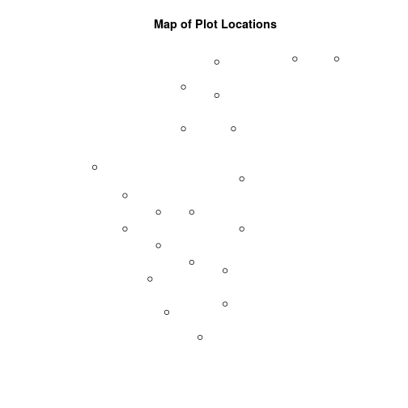
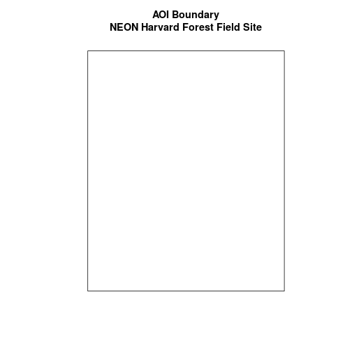
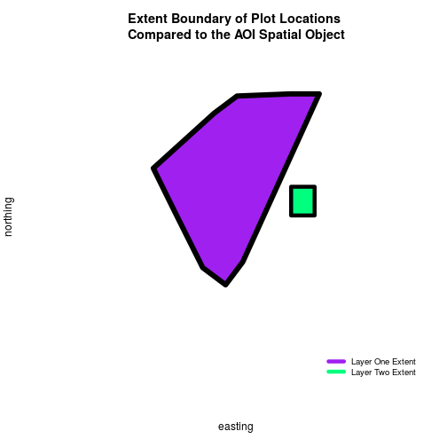
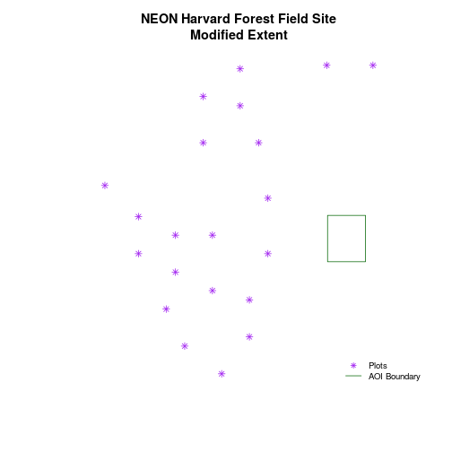
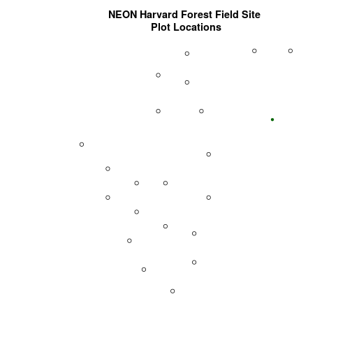
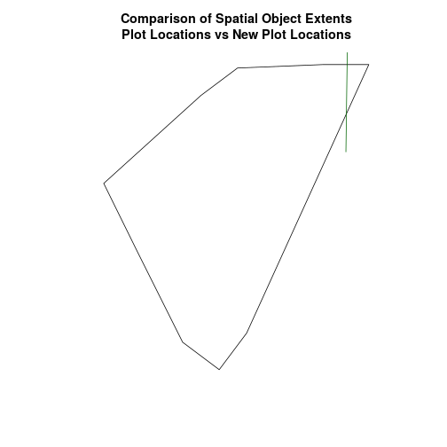
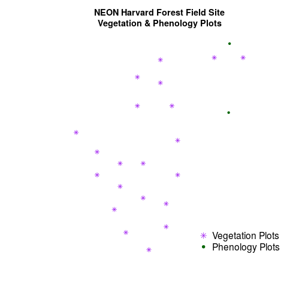

> ## Things You’ll Need To Complete This Tutorial
> **R Skill Level:** Intermediate - you've got the basics of `R` down.
> You will need the most current version of `R` and, preferably, `RStudio` loaded
> on your computer to complete this tutorial.
>
> ### Install R Packages
>
> * **raster:** `install.packages("raster")`
> * **sf:** `install.packages("sf")`
>
> * [More on Packages in R - Adapted from Software Carpentry.]({{site.baseurl}}/R/Packages-In-R/)
>
> ## Data to Download
> * [Site layout shapefiles](https://ndownloader.figshare.com/files/3708751)
{: .prereq}

This tutorial will review how to import spatial points stored in `.csv` (Comma Separated Value) format into `R` as an `sf` spatial object. We will also reproject data imported from a shapefile format, export this data as a shapefile as well as plot raster and vector data as layers in the same plot.

## Spatial Data in Text Format

The `HARV_PlotLocations.csv` file contains `x, y` (point) locations for study
plot where NEON collects data on
<a href="http://www.neonscience.org/science-design/collection-methods/terrestrial-organismal-sampling" target="_blank"> vegetation and other ecological metrics</a>.
We would like to:

* Create a map of these plot locations.
* Export the data in a `shapefile` format to share with our colleagues. This
shapefile can be imported into any GIS software.
* Create a map showing vegetation height with plot locations layered on top.

Spatial data are sometimes stored in a text file format (`.txt` or `.csv`). If
the text file has an associated `x` and `y` location column, then we can
convert it into an `sf` spatial object. The `sf` object allows us to store both the `x,y` values that represent the coordinate location
of each point and the associated attribute data - or columns describing each
feature in the spatial object.

We will use the `sf` and `raster` libraries in this tutorial.

~~~
# load packages
library(sf)  # for vector work;
~~~
{: .r}

~~~
Linking to GEOS 3.5.1, GDAL 2.2.1, proj.4 4.9.2, lwgeom 2.3.3 r15473
~~~
{: .output}

~~~
library(raster)   # for  raster metadata/attributes
~~~
{: .r}

~~~
Loading required package: sp
~~~
{: .output}

~~~
# set working directory to data folder
# setwd("pathToDirHere")
~~~
{: .r}

## Import .csv
To begin let's import `.csv` file that contains plot coordinate `x, y`
locations at the NEON Harvard Forest Field Site (`HARV_PlotLocations.csv`) in
`R`. Note that we set `stringsAsFactors=FALSE` so our data import as a
`character` rather than a `factor` class.

~~~
# Read the .csv file
plot_locations_HARV <-
  read.csv("data/NEON-DS-Site-Layout-Files/HARV/HARV_PlotLocations.csv",
           stringsAsFactors = FALSE)

# look at the data structure
str(plot_locations_HARV)
~~~
{: .r}

~~~
'data.frame':	21 obs. of  16 variables:
 $ easting   : num  731405 731934 731754 731724 732125 ...
 $ northing  : num  4713456 4713415 4713115 4713595 4713846 ...
 $ geodeticDa: chr  "WGS84" "WGS84" "WGS84" "WGS84" ...
 $ utmZone   : chr  "18N" "18N" "18N" "18N" ...
 $ plotID    : chr  "HARV_015" "HARV_033" "HARV_034" "HARV_035" ...
 $ stateProvi: chr  "MA" "MA" "MA" "MA" ...
 $ county    : chr  "Worcester" "Worcester" "Worcester" "Worcester" ...
 $ domainName: chr  "Northeast" "Northeast" "Northeast" "Northeast" ...
 $ domainID  : chr  "D01" "D01" "D01" "D01" ...
 $ siteID    : chr  "HARV" "HARV" "HARV" "HARV" ...
 $ plotType  : chr  "distributed" "tower" "tower" "tower" ...
 $ subtype   : chr  "basePlot" "basePlot" "basePlot" "basePlot" ...
 $ plotSize  : int  1600 1600 1600 1600 1600 1600 1600 1600 1600 1600 ...
 $ elevation : num  332 342 348 334 353 ...
 $ soilTypeOr: chr  "Inceptisols" "Inceptisols" "Inceptisols" "Histosols" ...
 $ plotdim_m : int  40 40 40 40 40 40 40 40 40 40 ...
~~~
{: .output}

Also note that `plot_locations_HARV` is a `data.frame` that contains 21 locations (rows) and 15 variables (attributes).

Next, let's explore the `data.frame` to determine whether it contains columns with coordinate values. If we are lucky, our `.csv` will contain columns labeled:

 * "X" and "Y" OR
 * Latitude and Longitude OR
 * easting and northing (UTM coordinates)

Let's check out the column `names` of our `data.frame`.

~~~
# view column names
names(plot_locations_HARV)
~~~
{: .r}

~~~
 [1] "easting"    "northing"   "geodeticDa" "utmZone"    "plotID"    
 [6] "stateProvi" "county"     "domainName" "domainID"   "siteID"    
[11] "plotType"   "subtype"    "plotSize"   "elevation"  "soilTypeOr"
[16] "plotdim_m" 
~~~
{: .output}

## Identify X,Y Location Columns

View the column names, we can see that our `data.frame`  that contains several
fields that might contain spatial information. The `plot_locations_HARV$easting`
and `plot_locations_HARV$northing` columns contain coordinate values.

~~~
# view first 6 rows of the X and Y columns
head(plot_locations_HARV$easting)
~~~
{: .r}

~~~
[1] 731405.3 731934.3 731754.3 731724.3 732125.3 731634.3
~~~
{: .output}

~~~
head(plot_locations_HARV$northing)
~~~
{: .r}

~~~
[1] 4713456 4713415 4713115 4713595 4713846 4713295
~~~
{: .output}

~~~
# note that  you can also call the same two columns using their COLUMN NUMBER
# view first 6 rows of the X and Y columns
head(plot_locations_HARV[, 1])
~~~
{: .r}

~~~
[1] 731405.3 731934.3 731754.3 731724.3 732125.3 731634.3
~~~
{: .output}

~~~
head(plot_locations_HARV[, 2])
~~~
{: .r}

~~~
[1] 4713456 4713415 4713115 4713595 4713846 4713295
~~~
{: .output}

So, we have coordinate values in our `data.frame` but in order to convert our
`data.frame` to an `sf` object, we also need to know the CRS (projection)
associated with those coordinate values.

There are several ways to figure out the CRS of spatial data in text format.

1. We can check the file **metadata** in hopes that the CRS was recorded in the
data. For more information on metadata, check out the
[Why Metadata Are Important: How to Work with Metadata in Text & EML Format]({{site.baseurl}}/R/why-metadata-are-important/)
tutorial.
2. We can explore the file itself to see if CRS information is embedded in the
file header or somewhere in the data columns.

Following the `easting` and `northing` columns, there is a `geodeticDa` and a
`utmZone` column. These appear to contain CRS information
(`datum` and `projection`). Let's view those next.

~~~
# view first 6 rows of the X and Y columns
head(plot_locations_HARV$geodeticDa)
~~~
{: .r}

~~~
[1] "WGS84" "WGS84" "WGS84" "WGS84" "WGS84" "WGS84"
~~~
{: .output}

~~~
head(plot_locations_HARV$utmZone)
~~~
{: .r}

~~~
[1] "18N" "18N" "18N" "18N" "18N" "18N"
~~~
{: .output}

It is not typical to store CRS information in a column. But this particular
file contains CRS information this way. The `geodeticDa` and `utmZone` columns
contain the information that helps us determine the CRS:

* `geodeticDa`: WGS84  -- this is geodetic datum WGS84
* `utmZone`: 18

In
[When Vector Data Don't Line Up - Handling Spatial Projection & CRS in R]({{site.baseurl}}/03-raster-reproject-in-r/)
we learned about the components of a `proj4` string. We have everything we need
to now assign a CRS to our data.frame.

To create the `proj4` associated with `UTM Zone 18 WGS84` we can look up the
projection on the
<a href="http://www.spatialreference.org/ref/epsg/wgs-84-utm-zone-18n/" target="_blank"> spatial reference website</a>
which contains a list of CRS formats for each projection:

* This link shows
<a href="http://www.spatialreference.org/ref/epsg/wgs-84-utm-zone-18n/proj4/" target="_blank">the proj4 string for UTM Zone 18N WGS84</a>.

However, if we have other data in the `UTM Zone 18N` projection, it's much
easier to simply assign the `st_crs()` in `proj4` format from that object to our
new spatial object. Let's import the roads layer from Harvard forest and check
out its CRS.

~~~
# Import the line shapefile
lines_HARV <- st_read("data/NEON-DS-Site-Layout-Files/HARV/HARV_roads.shp")
~~~
{: .r}

~~~
Reading layer `HARV_roads' from data source `/home/jose/Documents/Science/Projects/software-carpentry/data-carpentry_lessons/R-spatial-raster-vector-lesson/_episodes_rmd/data/NEON-DS-Site-Layout-Files/HARV/HARV_roads.shp' using driver `ESRI Shapefile'
Simple feature collection with 13 features and 15 fields
geometry type:  MULTILINESTRING
dimension:      XY
bbox:           xmin: 730741.2 ymin: 4711942 xmax: 733295.5 ymax: 4714260
epsg (SRID):    32618
proj4string:    +proj=utm +zone=18 +datum=WGS84 +units=m +no_defs
~~~
{: .output}

~~~
# view CRS
st_crs(lines_HARV)
~~~
{: .r}

~~~
$epsg
[1] 32618

$proj4string
[1] "+proj=utm +zone=18 +datum=WGS84 +units=m +no_defs"

attr(,"class")
[1] "crs"
~~~
{: .output}

~~~
# view extent
st_bbox(lines_HARV)
~~~
{: .r}

~~~
     xmin      ymin      xmax      ymax 
 730741.2 4711942.0  733295.5 4714260.0 
~~~
{: .output}

Exploring the data above, we can see that the lines shapefile is in
`UTM zone 18N`. We can thus use the CRS from that spatial object to convert our
non-spatial `data.frame` into an `sf` object.

Next, let's create a `crs` object that we can use to define the CRS of our
`sf` object when we create it

~~~
# create crs object
utm18nCRS <- st_crs(lines_HARV)
utm18nCRS
~~~
{: .r}

~~~
$epsg
[1] 32618

$proj4string
[1] "+proj=utm +zone=18 +datum=WGS84 +units=m +no_defs"

attr(,"class")
[1] "crs"
~~~
{: .output}

~~~
class(utm18nCRS)
~~~
{: .r}

~~~
[1] "crs"
~~~
{: .output}

## .csv to sf object
Next, let's convert our `data.frame` into an `sf` object. To do
this, we need to specify:

1. The columns containing X (`easting`) and Y (`northing`) coordinate values
2. The CRS that the column coordinate represent (units are included in the CRS) - stored in our `utmCRS` object.

We will use the `st_as_sf()` function to perform the conversion.

~~~
# note that the easting and northing columns are in columns 1 and 2
plot_locations_sp_HARV <- st_as_sf(plot_locations_HARV, coords = c("easting", "northing"), crs = utm18nCRS)

# look at the CRS
st_crs(plot_locations_sp_HARV)
~~~
{: .r}

~~~
$epsg
[1] 32618

$proj4string
[1] "+proj=utm +zone=18 +datum=WGS84 +units=m +no_defs"

attr(,"class")
[1] "crs"
~~~
{: .output}

## Plot Spatial Object
We now have a spatial `R` object, we can plot our newly created spatial object.

~~~
# plot spatial object
plot(plot_locations_sp_HARV$geometry,
     main = "Map of Plot Locations")
~~~
{: .r}

## Define Plot Extent

In
[Open and Plot Shapefiles in R]({{site.baseurl}}/R/open-shapefiles-in-R/)
we learned about spatial object `extent`. When we plot several spatial layers in
`R`, the first layer that is plotted, becomes the extent of the plot. If we add
additional layers that are outside of that extent, then the data will not be
visible in our plot. It is thus useful to know how to set the spatial extent of
a plot using `xlim` and `ylim`.

Let's first create an `sf` object from the
`NEON-DS-Site-Layout-Files/HarClip_UTMZ18` shapefile. (If you have completed
Vector 00-02 tutorials in this
[Introduction to Working with Vector Data in R]({{site.baseurl}}/tutorial-series/vector-data-series/)
series, you can skip this code as you have already created this object.)

~~~
# create boundary object
aoi_boundary_HARV <- st_read("data/NEON-DS-Site-Layout-Files/HARV/HarClip_UTMZ18.shp")
~~~
{: .r}

~~~
Reading layer `HarClip_UTMZ18' from data source `/home/jose/Documents/Science/Projects/software-carpentry/data-carpentry_lessons/R-spatial-raster-vector-lesson/_episodes_rmd/data/NEON-DS-Site-Layout-Files/HARV/HarClip_UTMZ18.shp' using driver `ESRI Shapefile'
Simple feature collection with 1 feature and 1 field
geometry type:  POLYGON
dimension:      XY
bbox:           xmin: 732128 ymin: 4713209 xmax: 732251.1 ymax: 4713359
epsg (SRID):    32618
proj4string:    +proj=utm +zone=18 +datum=WGS84 +units=m +no_defs
~~~
{: .output}

To begin, let's plot our `aoiBoundary` object with our vegetation plots.

~~~
# plot Boundary
plot(aoi_boundary_HARV$geometry,
     main = "AOI Boundary\nNEON Harvard Forest Field Site")

# add plot locations
plot(plot_locations_sp_HARV$geometry,
     pch = 8, add = TRUE)
~~~
{: .r}

~~~
# no plots added, why? CRS?
# view CRS of each
st_crs(aoi_boundary_HARV)
~~~
{: .r}

~~~
$epsg
[1] 32618

$proj4string
[1] "+proj=utm +zone=18 +datum=WGS84 +units=m +no_defs"

attr(,"class")
[1] "crs"
~~~
{: .output}

~~~
st_crs(plot_locations_sp_HARV)
~~~
{: .r}

~~~
$epsg
[1] 32618

$proj4string
[1] "+proj=utm +zone=18 +datum=WGS84 +units=m +no_defs"

attr(,"class")
[1] "crs"
~~~
{: .output}

When we attempt to plot the two layers together, we can see that the plot
locations are not rendered. We can see that our data are in the same projection
- so what is going on?

~~~
# view extent of each
st_bbox(aoi_boundary_HARV)
~~~
{: .r}

~~~
     xmin      ymin      xmax      ymax 
 732128.0 4713208.7  732251.1 4713359.2 
~~~
{: .output}

~~~
st_bbox(plot_locations_sp_HARV)
~~~
{: .r}

~~~
     xmin      ymin      xmax      ymax 
 731405.3 4712845.0  732275.3 4713846.3 
~~~
{: .output}

~~~
# add extra space to right of plot area;
# par(mar = c(5.1, 4.1, 4.1, 8.1), xpd=TRUE)
plot(st_convex_hull(st_sfc(st_union(plot_locations_sp_HARV))),
     col = "purple",
     xlab = "easting",
     ylab = "northing", lwd = 8,
     main = "Extent Boundary of Plot Locations \nCompared to the AOI Spatial Object",
     ylim = c(4712400, 4714000)) # extent the y axis to make room for the legend

plot(aoi_boundary_HARV$geometry,
     add = TRUE,
     lwd = 6,
     col = "springgreen")

legend("bottomright",
       #inset = c(-0.5,0),
       legend = c("Layer One Extent", "Layer Two Extent"),
       bty = "n",
       col = c("purple", "springgreen"),
       cex = .8,
       lty = c(1, 1),
       lwd = 6)
~~~
{: .r}

The **extents** of our two objects are **different**. `plot_locations_sp_HARV` is
much larger than `aoi_boundary_HARV`. When we plot `aoi_boundary_HARV` first, `R`
uses the extent of that object to as the plot extent. Thus the points in the
`plot_locations_sp_HARV` object are not rendered. To fix this, we can manually
assign the plot extent using `xlims` and `ylims`. We can grab the extent
values from the spatial object that has a larger extent. Let's try it.

<figure>
    
    <figcaption>The spatial extent of a shapefile or R spatial object
    represents the geographic <b> edge </b> or location that is the furthest
    north, south, east and west. Thus is represents the overall geographic
    coverage of the spatial object. Source: National Ecological Observatory
    Network (NEON)
    </figcaption>
</figure>

~~~
plotLoc.extent <- st_bbox(plot_locations_sp_HARV)
plotLoc.extent
~~~
{: .r}

~~~
     xmin      ymin      xmax      ymax 
 731405.3 4712845.0  732275.3 4713846.3 
~~~
{: .output}

~~~
# grab the x and y min and max values from the spatial plot locations layer
xmin <- plotLoc.extent[1]
xmax <- plotLoc.extent[3]
ymin <- plotLoc.extent[2]
ymax <- plotLoc.extent[4]

# adjust the plot extent using x and ylim
plot(aoi_boundary_HARV$geometry,
     main = "NEON Harvard Forest Field Site\nModified Extent",
     border = "darkgreen",
     xlim = c(xmin, xmax),
     ylim = c(ymin, ymax))

plot(plot_locations_sp_HARV$geometry,
		 col = "purple",
		 add = TRUE)

# add a legend
legend("bottomright",
       legend = c("Plots", "AOI Boundary"),
       pch = c(8, NA),
       lty = c(NA, 1),
       bty = "n",
       col = c("purple", "darkgreen"),
       cex = .8)
~~~
{: .r}

> ## Challenge - Import & Plot Additional Points
> 
> We want to add two phenology plots to our existing map of vegetation plot
> locations.
> 
> Import the .csv: `HARV/HARV_2NewPhenPlots.csv` into `R` and do the following:
> 
> 1. Find the X and Y coordinate locations. Which value is X and which value is Y?
> 2. These data were collected in a geographic coordinate system (WGS84). Convert
> the `data.frame` into an `sf` object.
> 3. Plot the new points with the plot location points from above. Be sure to add
> a legend. Use a different symbol for the 2 new points!  You may need to adjust
> the X and Y limits of your plot to ensure that both points are rendered by `R`!
> 
> If you have extra time, feel free to add roads and other layers to your map!
> 
> HINT: Refer to
> [When Vector Data Don't Line Up - Handling Spatial Projection & CRS in R]({{site.baseurl}}/R/vector-data-reproject-crs-R/)
> for more on working with geographic coordinate systems. You may want to "borrow"
> the projection from the objects used in that tutorial!
> 
> > ## Answers
> > 
> > 
> > ~~~
> > ## 1
> > # Read the .csv file
> > newplot_locations_HARV <-
> >   read.csv("data/NEON-DS-Site-Layout-Files/HARV/HARV_2NewPhenPlots.csv",
> >            stringsAsFactors = FALSE)
> > 
> > # look at the data structure -> locations in lat/long
> > str(newplot_locations_HARV)
> > 
> > ## 2
> > ## Find/ establish a CRS for new points
> > # Import the US boundary which is in a geographic WGS84 coordinate system
> > country_boundary_US <- st_read("data/NEON-DS-Site-Layout-Files/US-Boundary-Layers/US-Boundary-Dissolved-States.shp")
> > 
> > # grab the geographic CRS
> > geogCRS <- st_crs(country_boundary_US)
> > geogCRS
> > 
> > ## Convert to spatial data frame
> > # note that the easting and northing columns are in columns 1 and 2
> > newPlot.Sp.HARV <- st_as_sf(newplot_locations_HARV, coords = c("decimalLon", "decimalLat"), crs = geogCRS)
> > 
> > # view CRS
> > st_crs(newPlot.Sp.HARV)
> > 
> > ## We now have the data imported and in WGS84 Lat/Long. We want to map with plot
> > # locations in UTM so we'll have to reproject.
> > 
> > # remember we have a UTM Zone 18N crs object from previous code
> > utm18nCRS
> > 
> > # reproject the new points into UTM using `utm18nCRS`
> > newPlot.Sp.HARV.UTM <- st_transform(newPlot.Sp.HARV,
> >                                   utm18nCRS)
> > # check new plot CRS
> > st_crs(newPlot.Sp.HARV.UTM)
> > 
> > ## 3
> > # create plot
> > plot(plot_locations_sp_HARV$geometry,
> >      main = "NEON Harvard Forest Field Site \nPlot Locations" )
> > 
> > plot(newPlot.Sp.HARV.UTM$geometry,
> >      add = TRUE,  pch=20, col = "darkgreen")
> > ~~~
> > {: .r}
> > 
> > 
> > 
> > ~~~
> > # oops - looks like we are missing a point on our new plot. let's compare
> > # the spatial extents of both objects!
> > st_bbox(plot_locations_sp_HARV)
> > st_bbox(newPlot.Sp.HARV.UTM)
> > 
> > # when you plot in base plot, if the extent isn't specified, then the data that
> > # is added FIRST will define the extent of the plot
> > 
> > plot(st_convex_hull(st_sfc(st_union(plot_locations_sp_HARV))),
> >      main = "Comparison of Spatial Object Extents\nPlot Locations vs New Plot Locations")
> > 
> > plot(st_convex_hull(st_sfc(st_union(newPlot.Sp.HARV.UTM))),
> >      col = "darkgreen",
> >      add = TRUE)
> > ~~~
> > {: .r}
> > 
> > 
> > 
> > ~~~
> > # looks like the green box showing the newPlot extent extends
> > # beyond the plot.locations extent.
> > 
> > # We need to grab the x min and max and y min from our original plots
> > # but then the ymax from our new plots
> > 
> > originalPlotExtent <- st_bbox(plot_locations_sp_HARV)
> > newPlotExtent <- st_bbox(newPlot.Sp.HARV.UTM)
> > 
> > # set xmin and max
> > xmin <- originalPlotExtent[1]
> > xmax <- originalPlotExtent[3]
> > ymin <- originalPlotExtent[2]
> > ymax <- newPlotExtent[4]
> > 
> > # 3 again... re-plot
> > # try again but this time specify the x and ylims
> > # note: we could also write a function that would harvest the smallest and
> > # largest
> > # x and y values from an extent object. This is beyond the scope of this tutorial.
> > plot(plot_locations_sp_HARV$geometry,
> >      main = "NEON Harvard Forest Field Site\nVegetation & Phenology Plots",
> >      pch=8,
> >      col = "purple",
> >      xlim = c(xmin, xmax),
> >      ylim = c(ymin, ymax))
> > 
> > plot(newPlot.Sp.HARV.UTM$geometry,
> >      add = TRUE,  pch=20, col = "darkgreen")
> > 
> > # when we create a legend in R, we need to specify the text for each item
> > # listed in the legend.
> > legend("bottomright",
> >        legend = c("Vegetation Plots", "Phenology Plots"),
> >        pch = c(8, 20),
> >        bty = "n",
> >        col = c("purple", "darkgreen"),
> >        cex = 1.3)
> > ~~~
> > {: .r}
> > 
> > 
> {: .solution}
{: .challenge}

## Export a Shapefile

We can write an `R` spatial object to a shapefile using the `st_write` function
in `sf`. To do this we need the following arguments:

* the name of the spatial object (`plot_locations_sp_HARV`)
* the directory where we want to save our shapefile
           (to use `current = getwd()` or you can specify a different path)
* the name of the new shapefile  (`PlotLocations_HARV`)
* the driver which specifies the file format (ESRI Shapefile)

We can now export the spatial object as a shapefile.

~~~
# write a shapefile
st_write(plot_locations_sp_HARV,
         "data/PlotLocations_HARV.shp", driver = "ESRI Shapefile")
~~~
{: .r}
