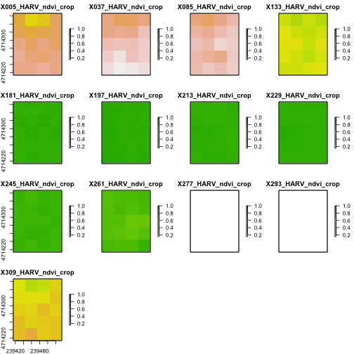
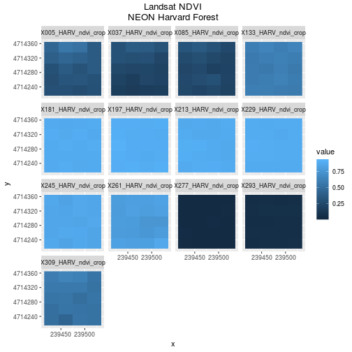
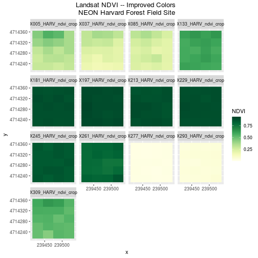
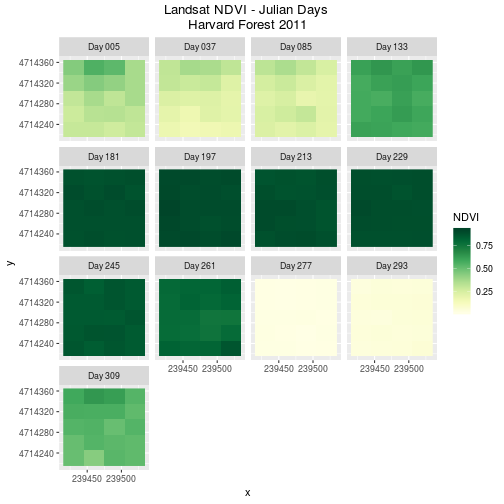
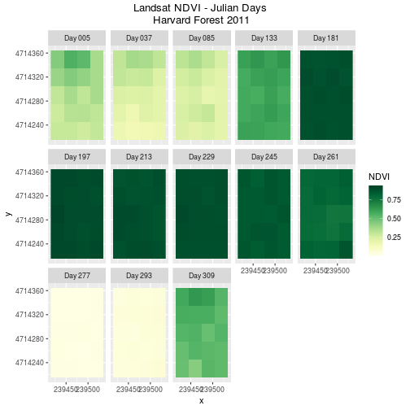
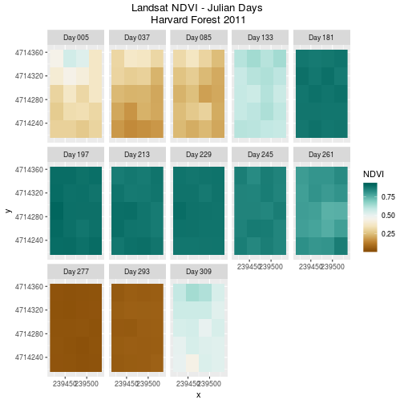

---
# Please do not edit this file directly; it is auto generated.
# Instead, please edit 13-plot-time-series-rasters-in-r.md in _episodes_rmd/
title: "Plot Raster Time Series Data in R"
teaching: 20
exercises: 10
questions:
- ""
objectives:
- "Be able to assign custom names to bands in a RasterStack for prettier plotting."
- "Understand advanced plotting of rasters using the `ggplot2` package."
keypoints:
- ""
---

> ## Things You’ll Need To Complete This Episode
> See the [lesson homepage]({{ site.baseurl }}) for detailed information about the software,
> data, and other prerequisites you will need to work through the examples in this episode.
{: .prereq}

This episode covers how to improve plotting output using the `ggplot2` package
in `R`. Specifically it covers adding meaningful custom names to bands within a `RasterStack`.

## Plot Raster Time Series Data
We can use the `ggplot` function to plot our raster time series data.

~~~
# view a plot of all of the rasters
# 'ncol' specifies number of columns (we will have 13 plots)
ggplot() +
  geom_raster(data = NDVI_HARV_stack_df , aes(x = x, y = y, fill = value)) +
# we use ggplot2 faceting technique to split the plot into multiple plots
# based on the factor called 'variable'
  facet_wrap(~variable)
~~~
{: .language-r}

> ## Data Tip
> The range of values for NDVI is 0-1.
> However, the data stored in our raster ranges from 0 - 10,000. If we view the
> metadata for the original .tif files, we will see a scale factor of 10,000 is
> defined.
> Multiplying values with decimal places by a factor of 10, allows the data to be
> stored in integer format (no decimals) rather than a floating point format
> (containing decimals). This keeps the file size smaller.
{: .callout}

Our plot is nice however, it's missing some key elements including, easily
readable titles. We can customize it with `ggplot2` package to make our plot prettier!

* <a href="https://ggplot2.tidyverse.org/" target="_blank">More on
the `ggplot2` package</a>

We use `ggtitle("TITLE")` to add a title to the entire plot series and `theme` to
center the title.

~~~
ggplot() +
# Add main title
  geom_raster(data = NDVI_HARV_stack_df , aes(x = x, y = y, fill = value)) +
# we use ggplot2 faceting technique to split the plot into multiple plots
# based on the factor called 'variable'
  facet_wrap(~variable) +
  ggtitle("Landsat NDVI\nNEON Harvard Forest") +
# justify horizontally the title by giving a value of 0.5 (hjust is between [0,1])
  theme(plot.title = element_text(hjust = 0.5))
~~~
{: .language-r}

## Adjust the Color Ramp
Next, let's adjust the color ramp used to render the rasters. First, we
can change the blue color ramp to a green one that is more visually suited to our
NDVI (greenness) data using the `colorRampPalette()` function in combination with
`colorBrewer`. Then we use `scale_fill_gradientn` to pass the list of colours
(here 20 different colours) to ggplot.

~~~
# use colorbrewer which loads with the rasterVis package to generate
# a color ramp of yellow to green
cols <- colorRampPalette(brewer.pal(9, "YlGn"))
ggplot() +
# Add main title
  geom_raster(data = NDVI_HARV_stack_df , aes(x = x, y = y, fill = value)) +
# we use ggplot2 faceting technique to split the plot into multiple plots
# based on the factor called 'variable'
  facet_wrap(~variable) +
  ggtitle("Landsat NDVI -- Improved Colors \nNEON Harvard Forest Field Site") +
# justify horizontally the title by giving a value of 0.5 (hjust is between [0,1])
  theme(plot.title = element_text(hjust = 0.5)) +
  scale_fill_gradientn(name = "NDVI", colours = cols(20))
~~~
{: .language-r}

The yellow to green color ramp visually represents NDVI well given it's a
measure of greenness. Someone looking at the plot can quickly understand that
pixels that are more green, have a higher NDVI value.

* For all of the `brewer.pal` ramp names see the
<a href="http://www.datavis.ca/sasmac/brewerpal.html" target="_blank">
brewerpal page</a>.

> ## Data Tip
> Cynthia Brewer, the creater of
> ColorBrewer, offers an online tool to help choose suitable color ramps, or to
> create your own. <a href="http://colorbrewer2.org/" target="_blank">
> ColorBrewer 2.0; Color Advise for Cartography </a>
{: .callout}

## Refine Plot & Tile Labels
Next, let's label each raster in our plot with the Julian day that the raster
represents. The current names come from the band (layer names) stored in the
`RasterStack` and first part each name is the Julian day.

To create a more meaningful label we can remove the "x" and replace it with
"day" using the `gsub()` function in `R`. The syntax is as follows:
`gsub("StringToReplace", "TextToReplaceIt", Robject)`.

First let's remove "_HARV_NDVI_crop" from each label.

~~~
# view names for each raster layer
names(NDVI_HARV_stack)
~~~
{: .language-r}

~~~
 [1] "X005_HARV_ndvi_crop" "X037_HARV_ndvi_crop" "X085_HARV_ndvi_crop"
 [4] "X133_HARV_ndvi_crop" "X181_HARV_ndvi_crop" "X197_HARV_ndvi_crop"
 [7] "X213_HARV_ndvi_crop" "X229_HARV_ndvi_crop" "X245_HARV_ndvi_crop"
[10] "X261_HARV_ndvi_crop" "X277_HARV_ndvi_crop" "X293_HARV_ndvi_crop"
[13] "X309_HARV_ndvi_crop"
~~~
{: .output}

~~~
# use gsub to modify label names.that we'll use for the plot
rasterNames  <- gsub("X", "Day ", names(NDVI_HARV_stack))

# view Names
rasterNames
~~~
{: .language-r}

~~~
 [1] "Day 005_HARV_ndvi_crop" "Day 037_HARV_ndvi_crop"
 [3] "Day 085_HARV_ndvi_crop" "Day 133_HARV_ndvi_crop"
 [5] "Day 181_HARV_ndvi_crop" "Day 197_HARV_ndvi_crop"
 [7] "Day 213_HARV_ndvi_crop" "Day 229_HARV_ndvi_crop"
 [9] "Day 245_HARV_ndvi_crop" "Day 261_HARV_ndvi_crop"
[11] "Day 277_HARV_ndvi_crop" "Day 293_HARV_ndvi_crop"
[13] "Day 309_HARV_ndvi_crop"
~~~
{: .output}

~~~
# Remove HARV_NDVI_crop from the second part of the string
rasterNames  <- gsub("_HARV_ndvi_crop", "", rasterNames)

# view names for each raster layer
rasterNames
~~~
{: .language-r}

~~~
 [1] "Day 005" "Day 037" "Day 085" "Day 133" "Day 181" "Day 197" "Day 213"
 [8] "Day 229" "Day 245" "Day 261" "Day 277" "Day 293" "Day 309"
~~~
{: .output}
Once the names for each band have been reassigned, we can render our plot with
the new labels using a`labeller`.

~~~
# Associate the new label names to each plot using rasterNames
labels_names <- setNames(rasterNames, unique(NDVI_HARV_stack_df$variable))

ggplot() +
  geom_raster(data = NDVI_HARV_stack_df , aes(x = x, y = y, fill = value)) +
  # add customized labels for each plot
  facet_wrap(~variable, labeller = labeller(variable=labels_names)) +
  ggtitle("Landsat NDVI - Julian Days \nHarvard Forest 2011") +
  theme(plot.title = element_text(hjust = 0.5)) +
  scale_fill_gradientn(name = "NDVI", colours = cols(20))
~~~
{: .language-r}

We can adjust the columns of our plot too by setting the number of columns `ncol`
and the number of rows `nrow` in `facet_wrap`. Below
we adjust the layout to be a matrix of 5 columns and 3 rows.

~~~
ggplot() +
  geom_raster(data = NDVI_HARV_stack_df , aes(x = x, y = y, fill = value)) +
  # create a 5x3 layout for the data
  facet_wrap(~variable, nrow=3, ncol=5, labeller = labeller(variable=labels_names)) +
  ggtitle("Landsat NDVI - Julian Days \nHarvard Forest 2011") +
  theme(plot.title = element_text(hjust = 0.5)) +
  scale_fill_gradientn(name = "NDVI", colours = cols(20))
~~~
{: .language-r}

Finally, `scales` allows us to modify the x and y-axis scale. Let's simply
remove the axis ticks from the plot with `scales =list(draw=FALSE)`.

~~~
ggplot() +
  geom_raster(data = NDVI_HARV_stack_df , aes(x = x, y = y, fill = value)) +
  facet_wrap(~variable, nrow=3, ncol=5, labeller = labeller(variable=labels_names)) +
  ggtitle("Landsat NDVI - Julian Days \nHarvard Forest 2011") +
  theme(plot.title = element_text(hjust = 0.5),
  # remove x and y-axis title, text and ticks
        axis.title.x=element_blank(),
        axis.text.x=element_blank(),
        axis.ticks.x=element_blank(),
        axis.title.y=element_blank(),
        axis.text.y=element_blank(),
        axis.ticks.y=element_blank()
        ) +
  # set same scale for both x and y coordinates
  coord_equal() +
  scale_fill_gradientn(name = "NDVI", colours = cols(20))
~~~
{: .language-r}

> ## Challenge: Divergent Color Ramps
>
> When we used `gsub` to modify the tile labels we replaced the beginning of each
> tile title with "Day". A more descriptive name could be "Julian Day".
>
> 1. Create a plot and label each tile "Julian Day" with the julian day value
> following.
> 2. Change the colorramp to a divergent brown to green color ramp to
> represent the data. *Hint:* Use the
> <a href="http://www.datavis.ca/sasmac/brewerpal.html" target="_blank"> brewerpal page</a>
> to help choose a color ramp.
>
> **Questions:**
> Does having a divergent color ramp represent the data
> better than a sequential color ramp (like "YlGn")? Can you think of other data
> sets where a divergent color ramp may be best?
>
> > ## Answers
> >
> > 
> > ~~~
> > # change Day to Julian Day
> > rasterNames  <- gsub("Day","Julian Day ", rasterNames)
> > # create a new color ramp
> > cols <- colorRampPalette(brewer.pal(9, "BrBG"))
> > ggplot() +
> >  geom_raster(data = NDVI_HARV_stack_df , aes(x = x, y = y, fill = value)) +
> >  facet_wrap(~variable, nrow=3, ncol=5, labeller = labeller(variable=labels_names)) +
> >  ggtitle("Landsat NDVI - Julian Days \nHarvard Forest 2011") +
> >  theme(plot.title = element_text(hjust = 0.5)) +
> >  scale_fill_gradientn(name = "NDVI", colours = cols(20))
> > ~~~
> > {: .language-r}
> > 
> > 
> > 
> > ~~~
> > # The sequential is better than the divergent as it is more akin to the process
> > # of greening up, which starts off at one end and just keeps increasing.
> > ~~~
> > {: .language-r}
> {: .solution}
{: .challenge}
