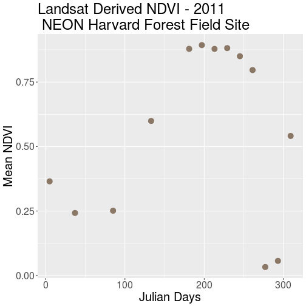
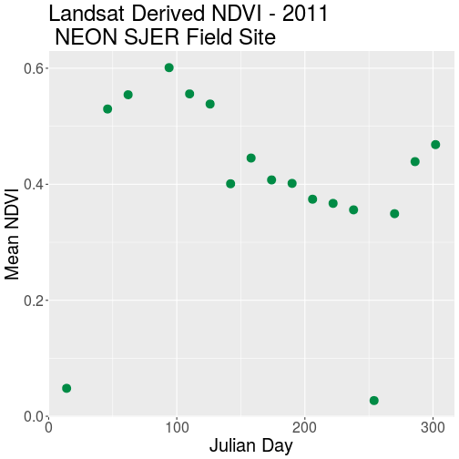
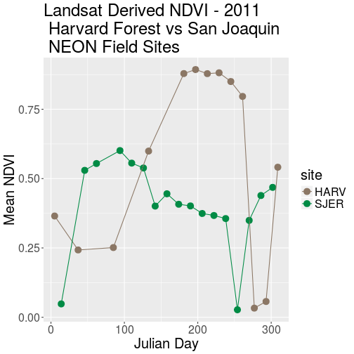
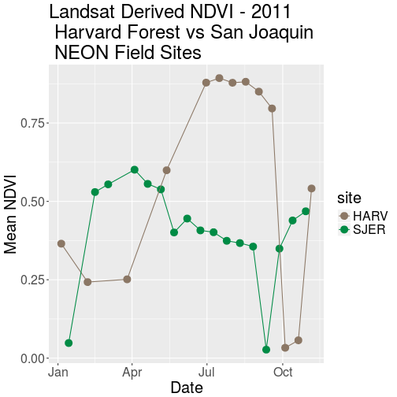
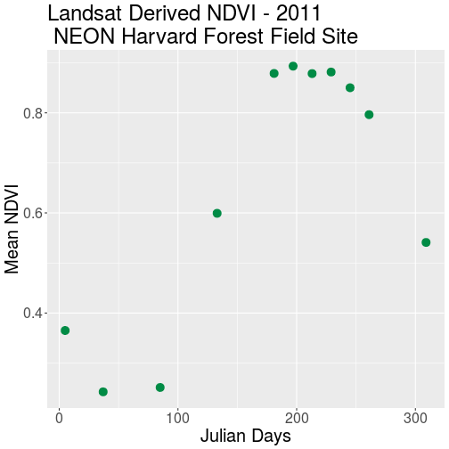

> ## Things You'll Need To Complete This Tutorial
> **R Skill Level:** Intermediate - you've got the basics of `R` down.
> You will need the most current version of `R` and, preferably, `RStudio` loaded
> on your computer to complete this tutorial.
>
> ### Install R Packages
>
> * **raster:** `install.packages("raster")`
> * **rgdal:** `install.packages("rgdal")`
> * **ggplot2:** `install.packages("ggplot2")`
>
> * [More on Packages in R - Adapted from Software Carpentry.]({{site.baseurl}}/R/Packages-In-R/)
>
> #### Data to Download
{: .prereq}

In this tutorial, we will extract NDVI values from a raster time series dataset
in `R` and plot them using `ggplot`.

## Extract Summary Statistics From Raster Data
In science, we often want to extract summary values from raster data. For
example, we might want to understand overall greeness across a field site or at
each plot within a field site. These values can then be compared betweeen
different field sites and combined with other
related metrics to support modeling and further analysis.

## Get Started
In this tutorial, we will work with the same set of rasters used in the
[Raster Time Series Data in R ]({{ site.baseurl }}/R/Raster-Times-Series-Data-In-R/)
and
[Plot Raster Time Series Data in R Using RasterVis and Levelplot ]({{ site.baseurl }}/R/Plot-Raster-Times-Series-Data-In-R/)
tutorials. To begin, we will create a raster stack (also created in the previous
tutorials so you may be able to skip this first step!).

~~~
library(raster)
~~~
{: .r}

~~~
Loading required package: sp
~~~
{: .output}

~~~
library(rgdal)
~~~
{: .r}

~~~
rgdal: version: 1.2-8, (SVN revision 663)
 Geospatial Data Abstraction Library extensions to R successfully loaded
 Loaded GDAL runtime: GDAL 2.2.1, released 2017/06/23
 Path to GDAL shared files: /usr/share/gdal/2.2
 Loaded PROJ.4 runtime: Rel. 4.9.2, 08 September 2015, [PJ_VERSION: 492]
 Path to PROJ.4 shared files: (autodetected)
 Linking to sp version: 1.2-5 
~~~
{: .output}

~~~
library(ggplot2)

# Create list of NDVI file paths
all_HARV_NDVI <- list.files("data/NEON-DS-Landsat-NDVI/HARV/2011/NDVI",
                            full.names = TRUE,
                            pattern = ".tif$")

# Create a time series raster stack
NDVI_HARV_stack <- stack(all_HARV_NDVI)

# apply scale factor
NDVI_HARV_stack <- NDVI_HARV_stack/10000
~~~
{: .r}

## Calculate Average NDVI
Our goal in this tutorial, is to create a `data.frame` that contains a single,
mean NDVI value for each raster in our time series. This value represents the
mean NDVI value for this area on a given day.

We can calculate the mean for each raster using the `cellStats` function. The
`cellStats` function produces a numeric array of values. We can then convert our
array format output to a data.frame using `as.data.frame()`.

~~~
# calculate mean NDVI for each raster
avg_NDVI_HARV <- cellStats(NDVI_HARV_stack, mean)

# convert output array to data.frame
avg_NDVI_HARV <- as.data.frame(avg_NDVI_HARV)

# To be more efficient we could do the above two steps with one line of code
# avg_NDVI_HARV <- as.data.frame(cellStats(NDVI_stack_HARV, mean))

# view data
avg_NDVI_HARV
~~~
{: .r}

~~~
                    avg_NDVI_HARV
X005_HARV_ndvi_crop      0.365150
X037_HARV_ndvi_crop      0.242645
X085_HARV_ndvi_crop      0.251390
X133_HARV_ndvi_crop      0.599300
X181_HARV_ndvi_crop      0.878725
X197_HARV_ndvi_crop      0.893250
X213_HARV_ndvi_crop      0.878395
X229_HARV_ndvi_crop      0.881505
X245_HARV_ndvi_crop      0.850120
X261_HARV_ndvi_crop      0.796360
X277_HARV_ndvi_crop      0.033050
X293_HARV_ndvi_crop      0.056895
X309_HARV_ndvi_crop      0.541130
~~~
{: .output}

~~~
# view only the value in row 1, column 1 of the data frame
avg_NDVI_HARV[1,1]
~~~
{: .r}

~~~
[1] 0.36515
~~~
{: .output}

We now have a `data.frame` with `row.names` based on the original file name and
a mean NDVI value for each file. Next, let's clean up the column names in our
data.frame to make it easier for colleagues to work with our code.

It is a bit confusing to have duplicate object & column names (e.g.
`avg_NDVI_HARV`), additionally the "avg" does not clearly what the value in that
particular column is. Let's change the NDVI column name to `MeanNDVI`.

~~~
# view column name slot
names(avg_NDVI_HARV)
~~~
{: .r}

~~~
[1] "avg_NDVI_HARV"
~~~
{: .output}

~~~
# rename the NDVI column
names(avg_NDVI_HARV) <- "meanNDVI"

# view cleaned column names
names(avg_NDVI_HARV)
~~~
{: .r}

~~~
[1] "meanNDVI"
~~~
{: .output}

By renaming the column, we lose the "HARV" in the header that reminds us what
site our data are from. While, we are only working with one site now, we
might want to compare several sites worth of data in the future. Let's add a
column to our `data.frame` called "site". We can populate this column with the
site name - HARV. Let's also create a year column and populate it with 2011 -
the year our data were collected.

~~~
# add a site column to our data
avg_NDVI_HARV$site <- "HARV"

# add a "year" column to our data
avg_NDVI_HARV$year <- "2011"

# view data
head(avg_NDVI_HARV)
~~~
{: .r}

~~~
                    meanNDVI site year
X005_HARV_ndvi_crop 0.365150 HARV 2011
X037_HARV_ndvi_crop 0.242645 HARV 2011
X085_HARV_ndvi_crop 0.251390 HARV 2011
X133_HARV_ndvi_crop 0.599300 HARV 2011
X181_HARV_ndvi_crop 0.878725 HARV 2011
X197_HARV_ndvi_crop 0.893250 HARV 2011
~~~
{: .output}

We now have data frame that contains a row for each raster file processed, and a
column for `meanNDVI`,  `site` and `year`.

## Extract Julian Day from row.names
We'd like to produce a plot where Julian days (the numeric day of the year,
0 - 365/366) is on the x-axis and NDVI is on the y-axis. To create this plot,
we'll need a column that contains the Julian day value.

One way to create a Julian day column is to use `gsub` on the file name in each
row. We can replace both the `X` and the `_HARV_NDVI_crop` to extract the Julian
Day value:

 X**005**_HARV_NDVI_crop

~~~
# note the use of the vertical bar character ( | ) is equivalent to "or". This
# allows us to search for more than one pattern in our text strings.
julianDays <- gsub(pattern = "X|_HARV_ndvi_crop", #the pattern to find
            x = row.names(avg_NDVI_HARV), #the object containing the strings
            replacement = "") #what to replace each instance of the pattern with

# alternately you can include the above code on one single line
# julianDays <- gsub("X|_HARV_NDVI_crop", "", row.names(avg_NDVI_HARV))

# make sure output looks ok
head(julianDays)
~~~
{: .r}

~~~
[1] "005" "037" "085" "133" "181" "197"
~~~
{: .output}

~~~
# add julianDay values as a column in the data frame
avg_NDVI_HARV$julianDay <- julianDays

# what class is the new column
class(avg_NDVI_HARV$julianDay)
~~~
{: .r}

~~~
[1] "character"
~~~
{: .output}

What class is our `julianDay` column?

> ## Data Tip
> To be efficient, we substituted two
> elements in one line of code using the "|". You can often combine commands in `R`
> to improve code efficiency.
> `avg_NDVI_HARV$julianDay <- gsub("X|_HARV_NDVI_crop", "", row.names(avg_NDVI_HARV))`.
{: .callout }

## Convert Julian Day to Date Class
Currently, the values in the Julian day column are stored as a `character` class.
Storing this data as a date object is better - for plotting, data subsetting and
working with our data. Let's convert.

For more information on date-time classes, see the NEON Data Skills tutorial
[Convert Date & Time Data from Character Class to Date-Time Class (POSIX) in R]({{ site.baseurl }}/R/time-series-convert-date-time-class-POSIX/).

To convert a Julian Day number to a date class, we need to set the **origin**
of the day which "counting" Julian Days began. Our data is from 2011, and we
know that the USGS Landsat Team created Julian Day values for this year.
Therefore, the first day or "origin" for our Julian day count is 01 January 2011.
Once we set the Julian Day origin, we can add the Julian Day value (as an
integer) to the origin date.

Since the origin date was originally set as a Date class object, the new `Date`
column is also stored as class `Date`.

~~~
# set the origin for the julian date (1 Jan 2011)
origin <- as.Date("2011-01-01")

# convert "julianDay" from class character to integer
avg_NDVI_HARV$julianDay <- as.integer(avg_NDVI_HARV$julianDay)

# create a date column; -1 added because origin is the 1st.
# If not -1, 01/01/2011 + 5 = 01/06/2011 which is Julian day 6, not 5.
avg_NDVI_HARV$Date<- origin + (avg_NDVI_HARV$julianDay-1)

# did it work?
head(avg_NDVI_HARV$Date)
~~~
{: .r}

~~~
[1] "2011-01-05" "2011-02-06" "2011-03-26" "2011-05-13" "2011-06-30"
[6] "2011-07-16"
~~~
{: .output}

~~~
# What are the classes of the two columns now?
class(avg_NDVI_HARV$Date)
~~~
{: .r}

~~~
[1] "Date"
~~~
{: .output}

~~~
class(avg_NDVI_HARV$julianDay)
~~~
{: .r}

~~~
[1] "integer"
~~~
{: .output}

Note that when we convert our integer class `julianDay` values to dates, we
subtracted 1 as follows:
`avg_NDVI_HARV$Date <- origin + (avg_NDVI_HARV$julianDay-1)`
This is because the origin day is 01 January 2011, so the extracted day is 01.
The Julian Day (or year day) for this is also 01. When we convert from the
integer 05 `julianDay` value (indicating 5th of January), we cannot simply add
`origin + julianDay` because `01 + 05 = 06` or 06 January 2011. To correct, this
error we then subtract 1 to get the correct day, January 05 2011.

> ## Challenge: NDVI for the San Joaquin Experimental Range
> 
> We often want to compare two different sites. The National Ecological
> Observatory Network (NEON) also has a field site in Southern California
> at the
> <a href="http://www.neonscience.org/science-design/field-sites/san-joaquin-experimental-range" target="_blank" >San Joaquin Experimental Range (SJER) </a>.
> 
> For this challenge, compare NDVI values for the NEON Harvard Forest and San
> Joaquin Experimental Range field sites. NDVI data for SJER are located in the
> `NEON-DS-Landsat-NDVI/SJER/2011/NDVI` directory.
> 
> > ## Answers
> > 
> > 
> > ~~~
> > # Create list of NDVI file paths
> > NDVI_path_SJER <- "data/NEON-DS-Landsat-NDVI/SJER/2011/NDVI"
> > all_NDVI_SJER <- list.files(NDVI_path_SJER,
> >                             full.names = TRUE,
> >                             pattern = ".tif$")
> > 
> > # Create a time series raster stack
> > NDVI_stack_SJER <- stack(all_NDVI_SJER)
> > 
> > # Calculate Mean, Scale Data, convert to data.frame all in 1 line!
> > avg_NDVI_SJER <- as.data.frame(cellStats(NDVI_stack_SJER, mean)/10000)
> > 
> > # rename NDVI column
> > names(avg_NDVI_SJER) <- "meanNDVI"
> > 
> > # add a site column to our data
> > avg_NDVI_SJER$site <- "SJER"
> > 
> > # add a "year" column to our data
> > avg_NDVI_SJER$year <- "2011"
> > 
> > # Create Julian Day Column
> > julianDays_SJER <- gsub(pattern = "X|_SJER_ndvi_crop", #the pattern to find
> >             x = row.names(avg_NDVI_SJER), #the object containing the strings
> >             replacement = "") #what to replace each instance of the pattern with
> > 
> > ## Create Date column based on julian day & make julianDay an integer
> > 
> > # set the origin for the julian date (1 Jan 2011)
> > origin<-as.Date ("2011-01-01")
> > 
> > #add julianDay values as a column in the data frame
> > avg_NDVI_SJER$julianDay <- as.integer(julianDays_SJER)
> > 
> > # create a date column, 1 once since the origin IS day 1.
> > avg_NDVI_SJER$Date<- origin + (avg_NDVI_SJER$julianDay-1)
> > 
> > # did it work?
> > avg_NDVI_SJER
> > ~~~
> > {: .r}
> {: .solution}
{: .challenge}

## Plot NDVI Using ggplot
We now have a clean data.frame with properly scaled NDVI and Julian days. Let's
plot our data.

We will use the `ggplot()` function within the `ggplot2` package for this plot.
If you are unfamiliar with `ggplot()` or would like to learn more about plotting
in `ggplot()` see the tutorial on
[Plotting Time Series with ggplot in R]({{ site.baseurl }}/R/time-series-plot-ggplot/).

~~~
# plot NDVI
ggplot(avg_NDVI_HARV, aes(julianDay, meanNDVI), na.rm=TRUE) +
  geom_point(size=4, colour = "PeachPuff4") +
  ggtitle("Landsat Derived NDVI - 2011\n NEON Harvard Forest Field Site") +
  xlab("Julian Days") + ylab("Mean NDVI") +
  theme(text = element_text(size=20))
~~~
{: .r}

> ## Challenge: Plot San Joaquin Experimental Range Data
> 
> Create a complementary plot for the SJER data. Plot the data points in a
different color.
> 
> > ## Answers
> > 
> > 
> > ~~~
> > # plot NDVI
> > ggplot(avg_NDVI_SJER, aes(julianDay, meanNDVI)) +
> >   geom_point(size=4, colour = "SpringGreen4") +
> >   ggtitle("Landsat Derived NDVI - 2011\n NEON SJER Field Site") +
> >   xlab("Julian Day") + ylab("Mean NDVI") +
> >   theme(text = element_text(size=20))
> > ~~~
> > {: .r}
> > 
> > 
> {: .solution}
{: .challenge}

## Compare NDVI from Two Different Sites in One Plot
Comparison of plots is often easiest when both plots are side by side. Or, even
better, if both sets of data are plotted in the same plot. We can do this by
binding the two data sets together. The date frames must have the same number
of columns and exact same column names to be bound.

~~~
# Merge Data Frames
NDVI_HARV_SJER <- rbind(avg_NDVI_HARV, avg_NDVI_SJER)

# plot NDVI values for both sites
ggplot(NDVI_HARV_SJER, aes(julianDay, meanNDVI, colour = site)) +
  geom_point(size = 4, aes(group = site)) +
  geom_line(aes(group = site)) +
  ggtitle("Landsat Derived NDVI - 2011\n Harvard Forest vs San Joaquin \n NEON Field Sites") +
  xlab("Julian Day") + ylab("Mean NDVI") +
  scale_colour_manual(values = c("PeachPuff4", "SpringGreen4"))+
	# scale_colour : match previous plots
  theme(text = element_text(size=20))
~~~
{: .r}

> ## Challenge: Plot NDVI with Date
> 
> Plot the SJER and HARV data in one plot but use date, rather than Julian day,
> on the x-axis.
> 
> > ## Answers
> >
> > 
> > ~~~
> > # plot NDVI values for both sites
> > ggplot(NDVI_HARV_SJER, aes(Date, meanNDVI, colour=site)) +
> >   geom_point(size = 4, aes(group = site)) +
> >   geom_line(aes(group = site)) +
> >   ggtitle("Landsat Derived NDVI - 2011\n Harvard Forest vs San Joaquin \n NEON Field Sites") +
> >   xlab("Date") + ylab("Mean NDVI") +
> >   scale_colour_manual(values = c("PeachPuff4", "SpringGreen4"))+  # match previous plots
> >   theme(text = element_text(size = 20))
> > ~~~
> > {: .r}
> > 
> > 
> {: .solution}
{: .challenge}

## Remove Outlier Data
As we look at these plots we see variation in greenness across the year.
However, the pattern is interrupted by a few points where NDVI quickly drops
towards 0 during a time period when we might expect the vegetation to have a
larger greenness value. Is the vegetation truly senescent or gone or are these
outlier values that should be removed from the data?

Let's look at the RGB images from Harvard Forest.

NOTE: the code below uses loops which we will not teach in this tutorial.
However the code demonstrates one way to plot multiple RGB rasters in a grid.

~~~
# open up RGB imagery

rgb.allCropped <-  list.files("data/NEON-DS-Landsat-NDVI/HARV/2011/RGB/",
                              full.names=TRUE,
                              pattern = ".tif$")
# create a layout
par(mfrow=c(4, 4))

# super efficient code
for (aFile in rgb.allCropped){
  NDVI.rastStack <- stack(aFile)
  plotRGB(NDVI.rastStack, stretch="lin")
  }

# reset layout
par(mfrow=c(1, 1))
~~~
{: .r}

Notice that the data points with very low NDVI values can be associated with
images that are filled with clouds. Thus, we can attribute the low NDVI values
to high levels of cloud cover.

Is the same thing happening at SJER?

~~~
# open up the cropped files
rgb.allCropped.SJER <-  list.files("data/NEON-DS-Landsat-NDVI/SJER/2011/RGB/",
                              full.names=TRUE,
                              pattern = ".tif$")
# create a layout
par(mfrow = c(5, 4))

# Super efficient code
# note that there is an issue with one of the rasters
# NEON-DS-Landsat-NDVI/SJER/2011/RGB/254_SJER_landRGB.tif has a blue band with no range
# thus you can't apply a stretch to it. The code below skips the stretch for
# that one image. You could automate this by testing the range of each band in each image

for (aFile in rgb.allCropped.SJER)
  {NDVI.rastStack <- stack(aFile)
  if (aFile =="data/NEON-DS-Landsat-NDVI/SJER/2011/RGB//254_SJER_landRGB.tif")
    {plotRGB(NDVI.rastStack) }
  else { plotRGB(NDVI.rastStack, stretch="lin") }
}

# reset layout
par(mfrow=c(1, 1))
~~~
{: .r}

Without significant additional processing, we will not be able to retrieve a
strong reflection from vegetation, from a remotely sensed image that is
predominantly cloud covered. Thus, these points are likely bad data points.
Let's remove them.

First, we will identify the good data points - that should be retained. One way
to do this is by identifying a threhold value. All values below that threshold
will be removed from our analysis. We will use 0.1 as an example for this
tutorials. We can then use the subset function to remove outlier datapoints
(below our identified threshold).

> ## Data Tip
> Thresholding, or removing outlier data,
> can be tricky business. In this case, we can be confident that some of our NDVI
> values are not valid due to cloud cover. However, a threshold value may not
> always be sufficient given 0.1 could be a valid NDVI value in some areas. This
> is where decision making should be fueled by practical scientific knowledge of
> the data and the desired outcomes!
{: .callout}

~~~
# retain only rows with meanNDVI>0.1
avg_NDVI_HARV_clean<-subset(avg_NDVI_HARV, meanNDVI>0.1)

# Did it work?
avg_NDVI_HARV_clean$meanNDVI<0.1
~~~
{: .r}

~~~
 [1] FALSE FALSE FALSE FALSE FALSE FALSE FALSE FALSE FALSE FALSE FALSE
~~~
{: .output}

Now we can create another plot without the suspect data.

~~~
# plot without questionable data

ggplot(avg_NDVI_HARV_clean, aes(julianDay, meanNDVI)) +
  geom_point(size = 4, colour = "SpringGreen4") +
  ggtitle("Landsat Derived NDVI - 2011\n NEON Harvard Forest Field Site") +
  xlab("Julian Days") + ylab("Mean NDVI") +
  theme(text = element_text(size=20))
~~~
{: .r}

Now our outlier data points are removed and the pattern of "green-up" and
"brown-down" makes a bit more sense.

## Write NDVI data to a .csv File
We can write our final NDVI `data.frame` out to a text format, to quickly share
with a colleague or to resuse for analysis or visualization purposes. We will
export in Comma Seperated Value (.csv) file format given it is usable in many
different tools and across platforms (MAC, PC, etc).

We will use `write.csv()` to write a specified `data.frame` to a `.csv` file.
Unless you designate a different directory, the output file will be saved in
your working directory.

Before saving our file, let's quickly view the format to make sure it is what we
want as an output format.

~~~
# confirm data frame is the way we want it

head(avg_NDVI_HARV_clean)
~~~
{: .r}

~~~
                    meanNDVI site year julianDay       Date
X005_HARV_ndvi_crop 0.365150 HARV 2011         5 2011-01-05
X037_HARV_ndvi_crop 0.242645 HARV 2011        37 2011-02-06
X085_HARV_ndvi_crop 0.251390 HARV 2011        85 2011-03-26
X133_HARV_ndvi_crop 0.599300 HARV 2011       133 2011-05-13
X181_HARV_ndvi_crop 0.878725 HARV 2011       181 2011-06-30
X197_HARV_ndvi_crop 0.893250 HARV 2011       197 2011-07-16
~~~
{: .output}

It looks like we have a series of `row.names` that we do not need given we have
this information stored in individual columns in our data.frame. Let's remove
the row names.

~~~
# create new df to prevent changes to avg_NDVI_HARV
NDVI_HARV_toWrite<-avg_NDVI_HARV_clean

# drop the row.names column
row.names(NDVI_HARV_toWrite)<-NULL

# check data frame
head(NDVI_HARV_toWrite)
~~~
{: .r}

~~~
  meanNDVI site year julianDay       Date
1 0.365150 HARV 2011         5 2011-01-05
2 0.242645 HARV 2011        37 2011-02-06
3 0.251390 HARV 2011        85 2011-03-26
4 0.599300 HARV 2011       133 2011-05-13
5 0.878725 HARV 2011       181 2011-06-30
6 0.893250 HARV 2011       197 2011-07-16
~~~
{: .output}

~~~
# create a .csv of mean NDVI values being sure to give descriptive name
# write.csv(DateFrameName, file="NewFileName")
write.csv(NDVI_HARV_toWrite, file="meanNDVI_HARV_2011.csv")
~~~
{: .r}

> ## Challenge: Write to .csv
> 
> 1. Create a NDVI .csv file for the NEON SJER field site that is comparable with
> the one we just created for the Harvard Forest. Be sure to inspect for
> questionable values before writing any data to a .csv file.
> 2. Create a NDVI .csv file that stacks data from both field sites.
> 
> > ## Answers
> > 
> > 
> > ~~~
> > # retain only rows with meanNDVI>0.1
> > avg_NDVI_SJER_clean<-subset(avg_NDVI_SJER, meanNDVI>0.1)
> > 
> > # create new df to prevent changes to avg_NDVI_HARV
> > NDVI_SJER_toWrite<-avg_NDVI_SJER_clean
> > 
> > # drop the row.names column
> > row.names(NDVI_SJER_toWrite)<-NULL
> > 
> > # check data frame
> > head(NDVI_SJER_toWrite)
> > ~~~
> > {: .r}
> > 
> > 
> > 
> > ~~~
> >   meanNDVI site year julianDay       Date
> > 1 0.529780 SJER 2011        46 2011-02-15
> > 2 0.554368 SJER 2011        62 2011-03-03
> > 3 0.601096 SJER 2011        94 2011-04-04
> > 4 0.555836 SJER 2011       110 2011-04-20
> > 5 0.538336 SJER 2011       126 2011-05-06
> > 6 0.400868 SJER 2011       142 2011-05-22
> > ~~~
> > {: .output}
> > 
> > 
> > 
> > ~~~
> > # create a .csv of mean NDVI values being sure to give descriptive name
> > # write.csv(DateFrameName, file="NewFileName")
> > write.csv(NDVI_SJER_toWrite, file="meanNDVI_SJER_2011.csv")
> > ~~~
> > {: .r}
> {: .solution}
{: .challenge}
