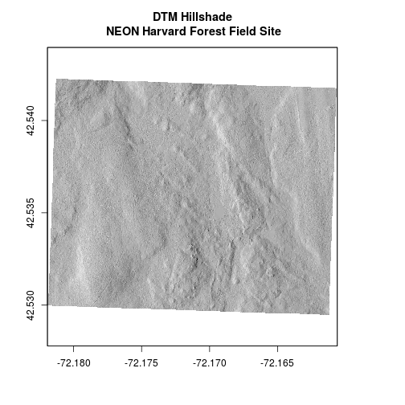
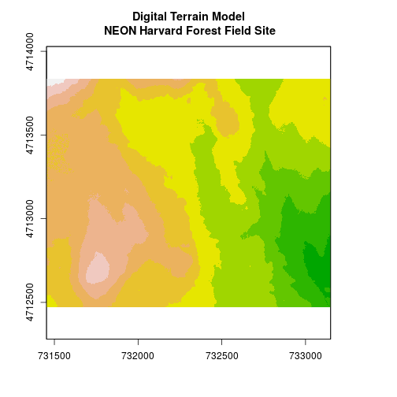
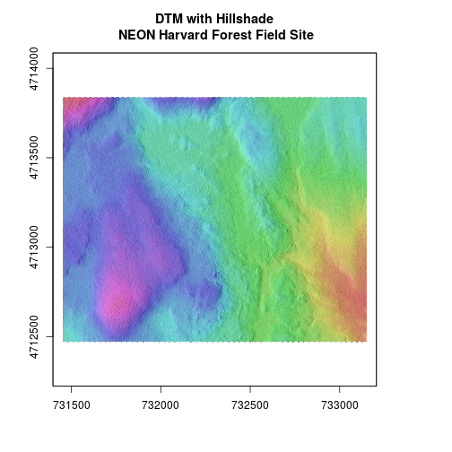
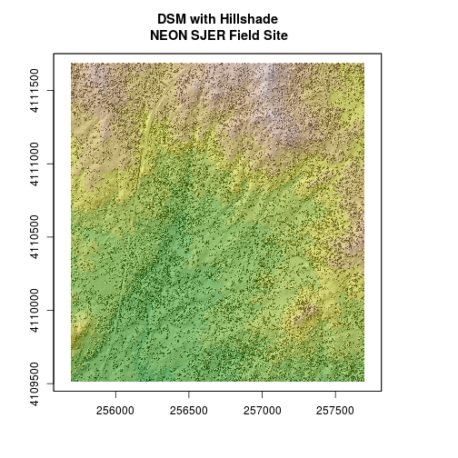

> ## Things You’ll Need To Complete This Tutorial
> **R Skill Level:** Intermediate - you've got the basics of `R` down.
You will need the most current version of `R` and, preferably, `RStudio` loaded
on your computer to complete this tutorial.
>
> ### Install R Packages
>
> * **raster:** `install.packages("raster")`
> * **rgdal:** `install.packages("rgdal")`
>
> * [More on Packages in R - Adapted from Software Carpentry.]({{site.baseurl}}/R/Packages-In-R/)
>
> #### Data to Download
>
>
> ### Additional Resources
>
* <a href="http://cran.r-project.org/web/packages/raster/raster.pdf" target="_blank">
> Read more about the `raster` package in `R`.</a>
{: .prereq}

Sometimes we encounter raster datasets that do not "line up" when plotted or
analyzed. Rasters that don't line up are most often in different Coordinate
Reference Systems (CRS).

This tutorial explains how to deal with rasters in different, known CRSs. It
will walk though reprojecting rasters in `R` using the `projectRaster()`
function in the `raster` package.

## Raster Projection in R

In the [Plot Raster Data in R]({{ site.baseurl }}/R/Plot-Rasters-In-R/)
tutorial, we learned how to layer a raster file on top of a hillshade for a nice
looking basemap. In this tutorial, all of our data were in the same CRS. What
happens when things don't line up?

We will use the `raster` and `rgdal` packages in this tutorial.

~~~
# load raster package
library(raster)
~~~
{: .r}

~~~
Loading required package: sp
~~~
{: .output}

~~~
library(rgdal)
~~~
{: .r}

~~~
rgdal: version: 1.2-8, (SVN revision 663)
 Geospatial Data Abstraction Library extensions to R successfully loaded
 Loaded GDAL runtime: GDAL 2.2.1, released 2017/06/23
 Path to GDAL shared files: /usr/share/gdal/2.2
 Loaded PROJ.4 runtime: Rel. 4.9.2, 08 September 2015, [PJ_VERSION: 492]
 Path to PROJ.4 shared files: (autodetected)
 Linking to sp version: 1.2-5 
~~~
{: .output}

Let's create a map of the Harvard Forest Digital Terrain Model
(`DTM_HARV`) draped or layered on top of the hillshade (`DTM_hill_HARV`).

~~~
# import DTM
DTM_HARV <- raster("data/NEON-DS-Airborne-Remote-Sensing/HARV/DTM/HARV_dtmCrop.tif")
# import DTM hillshade
DTM_hill_HARV <- raster("data/NEON-DS-Airborne-Remote-Sensing/HARV/DTM/HARV_DTMhill_WGS84.tif")

# plot hillshade using a grayscale color ramp
plot(DTM_hill_HARV,
    col = grey(1:100 / 100),
    legend = FALSE,
    main = "DTM Hillshade\n NEON Harvard Forest Field Site")

# overlay the DTM on top of the hillshade
plot(DTM_HARV,
     col = terrain.colors(10),
     alpha = 0.4,
     add = TRUE,
     legend = FALSE)
~~~
{: .r}

Our results are curious - the Digital Terrain Model (`DTM_HARV`) did not plot on
top of our hillshade. The hillshade plotted just fine on it's own. Let's try to
plot the DTM on it's own to make sure there are data there.

<i class="fa fa-star"></i> **Code Tip:** For boolean `R` elements, such as
 `add = TRUE`, you can use `T` and `F` in place of `TRUE` and `FALSE`.
{: .notice}

~~~
# Plot DTM
plot(DTM_HARV,
     col = terrain.colors(10),
     alpha = 1,
     legend = FALSE,
     main = "Digital Terrain Model\n NEON Harvard Forest Field Site")
~~~
{: .r}

Our DTM seems to contain data and plots just fine. Let's next check the
 Coordinate Reference System (CRS) and compare it to our hillshade.

~~~
# view crs for DTM
crs(DTM_HARV)
~~~
{: .r}

~~~
CRS arguments:
 +proj=utm +zone=18 +datum=WGS84 +units=m +no_defs +ellps=WGS84
+towgs84=0,0,0 
~~~
{: .output}

~~~
# view crs for hillshade
crs(DTM_hill_HARV)
~~~
{: .r}

~~~
CRS arguments:
 +proj=longlat +datum=WGS84 +no_defs +ellps=WGS84 +towgs84=0,0,0 
~~~
{: .output}

Aha! `DTM_HARV` is in the UTM projection. `DTM_hill_HARV` is in
`Geographic WGS84` - which is represented by latitude and longitude values.
Because the two rasters are in different CRSs, they don't line up when plotted
in `R`. We need to *reproject* `DTM_hill_HARV` into the UTM CRS. Alternatively,
we could project `DTM_HARV` into WGS84.

## Reproject Rasters
We can use the `projectRaster` function to reproject a raster into a new CRS.
Keep in mind that reprojection only works when you first have a *defined* CRS
for the raster object that you want to reproject. It cannot be used if *no*
CRS is defined. Lucky for us, the `DTM_hill_HARV` has a defined CRS.

> ## Data Tip
> When we reproject a raster, we
> move it from one "grid" to another. Thus, we are modifying the data! Keep this
> in mind as we work with raster data.
{: .callout}

To use the `projectRaster` function, we need to define two things:

1. the object we want to reproject and
2. the CRS that we want to reproject it to.

The syntax is `projectRaster(RasterObject, crs = CRSToReprojectTo)`

We want the CRS of our hillshade to match the `DTM_HARV` raster. We can thus
assign the CRS of our `DTM_HARV` to our hillshade within the `projectRaster()`
function as follows: `crs = crs(DTM_HARV)`.

~~~
# reproject to UTM
DTM_hill_UTMZ18N_HARV <- projectRaster(DTM_hill_HARV,
                                       crs = crs(DTM_HARV))

# compare attributes of DTM_hill_UTMZ18N to DTM_hill
crs(DTM_hill_UTMZ18N_HARV)
~~~
{: .r}

~~~
CRS arguments:
 +proj=utm +zone=18 +datum=WGS84 +units=m +no_defs +ellps=WGS84
+towgs84=0,0,0 
~~~
{: .output}

~~~
crs(DTM_hill_HARV)
~~~
{: .r}

~~~
CRS arguments:
 +proj=longlat +datum=WGS84 +no_defs +ellps=WGS84 +towgs84=0,0,0 
~~~
{: .output}

~~~
# compare attributes of DTM_hill_UTMZ18N to DTM_hill
extent(DTM_hill_UTMZ18N_HARV)
~~~
{: .r}

~~~
class       : Extent 
xmin        : 731397.3 
xmax        : 733205.3 
ymin        : 4712403 
ymax        : 4713907 
~~~
{: .output}

~~~
extent(DTM_hill_HARV)
~~~
{: .r}

~~~
class       : Extent 
xmin        : -72.18192 
xmax        : -72.16061 
ymin        : 42.52941 
ymax        : 42.54234 
~~~
{: .output}

Notice in the output above that the `crs()` of `DTM_hill_UTMZ18N_HARV` is now
UTM. However, the extent values of `DTM_hillUTMZ18N_HARV` are different from
`DTM_hill_HARV`.

> ## Challenge: Extent Change with CRS Change
> 
> Why do you think the two extents differ?
> > ## Answers
> > 
> > ~~~
> > # The extent for DTM_hill_UTMZ18N_HARV is in UTMs so the extent is in meters.
> > # The extent for DTM_hill_HARV is still in lat/long so the extent is expressed
> > # in decimal degrees.
> > ~~~
> > {: .r}
> {: .solution}
{: .challenge}

## Deal with Raster Resolution

Let's next have a look at the resolution of our reprojected hillshade.

~~~
# compare resolution
res(DTM_hill_UTMZ18N_HARV)
~~~
{: .r}

~~~
[1] 1.000 0.998
~~~
{: .output}

The output resolution of `DTM_hill_UTMZ18N_HARV` is 1 x 0.998. Yet, we know that
the resolution for the data should be 1m x 1m. We can tell `R` to force our
newly reprojected raster to be 1m x 1m resolution by adding a line of code
(`res=`).

~~~
# adjust the resolution
DTM_hill_UTMZ18N_HARV <- projectRaster(DTM_hill_HARV,
                                  crs = crs(DTM_HARV),
                                  res = 1)
# view resolution
res(DTM_hill_UTMZ18N_HARV)
~~~
{: .r}

~~~
[1] 1 1
~~~
{: .output}

Let's plot our newly reprojected raster.

~~~
# plot newly reprojected hillshade
plot(DTM_hill_UTMZ18N_HARV,
    col = grey(1:100/100),
    legend = FALSE,
    main = "DTM with Hillshade\n NEON Harvard Forest Field Site")

# overlay the DTM on top of the hillshade
plot(DTM_HARV,
     col = rainbow(100),
     alpha = 0.4,
     add = TRUE,
     legend = FALSE)
~~~
{: .r}

We have now successfully draped the Digital Terrain Model on top of our
hillshade to produce a nice looking, textured map!

> ## Challenge: Reproject, then Plot a Digital Terrain Model
> Create a map of the
> <a href="http://www.neoninc.org/science-design/field-sites/san-joaquin-experimental-range" target="_blank" >San Joaquin Experimental Range</a>
field site using the `SJER_DSMhill_WGS84.tif` and `SJER_dsmCrop.tif` files.
> 
> Reproject the data as necessary to make things line up!
> > ## Answers
> > 
> > ~~~
> > # import DTM
> > DSM_SJER <- raster("data/NEON-DS-Airborne-Remote-Sensing/SJER/DSM/SJER_dsmCrop.tif")
> > # import DTM hillshade
> > DSM_hill_SJER_WGS <-
> > raster("data/NEON-DS-Airborne-Remote-Sensing/SJER/DSM/SJER_DSMhill_WGS84.tif")
> > 
> > # reproject raster
> > DTM_hill_UTMZ18N_SJER <- projectRaster(DSM_hill_SJER_WGS,
> >                                   crs = crs(DSM_SJER),
> >                                   res = 1)
> > # plot hillshade using a grayscale color ramp
> > plot(DTM_hill_UTMZ18N_SJER,
> >     col = grey(1:100/100),
> >     legend = FALSE,
> >     main = "DSM with Hillshade\n NEON SJER Field Site")
> > 
> > # overlay the DSM on top of the hillshade
> > plot(DSM_SJER,
> >      col = terrain.colors(10),
> >      alpha = 0.4,
> >      add = TRUE,
> >      legend = FALSE)
> > ~~~
> > {: .r}
> > 
> > 
> {: .solution}
{: .challenge}

If you completed the San Joaquin plotting challenge in the
[Plot Raster Data in R]({{ site.baseurl }}/R/Plot-Rasters-In-R#challenge-create-dtm--dsm-for-sjer)
tutorial, how does the map you just created compare to that map?

