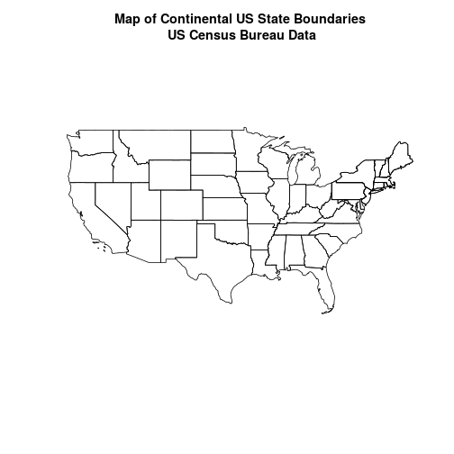
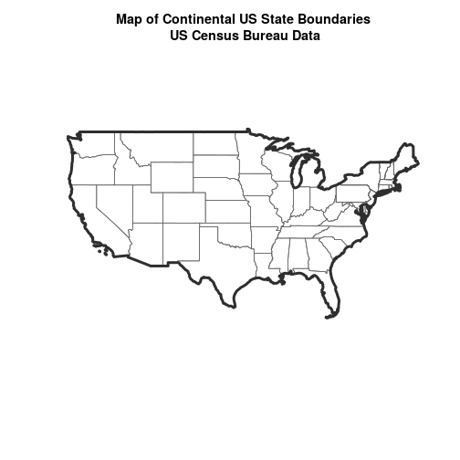
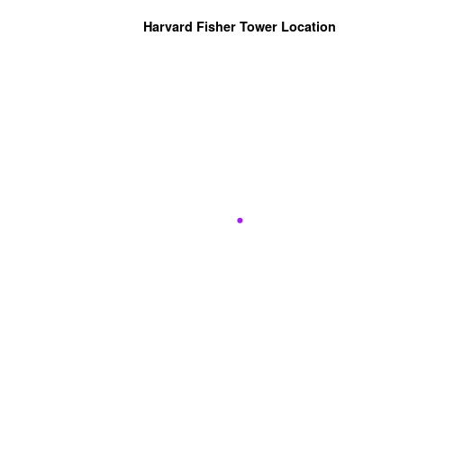
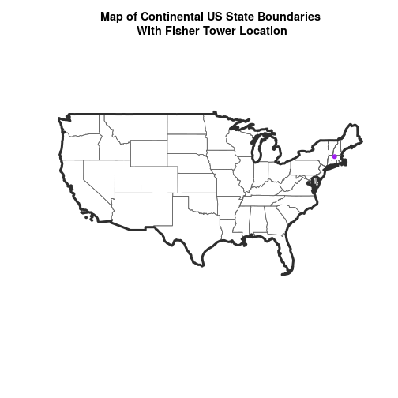
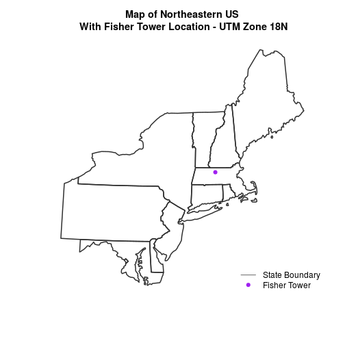

> ## Things You’ll Need To Complete This Tutorial
> **R Skill Level:** Intermediate - you've got the basics of `R` down.
> You will need the most current version of `R` and, preferably, `RStudio` loaded
> on your computer to complete this tutorial.
>
> ### Install R Packages
>
> * **raster:** `install.packages("raster")`
> * **sf:** `install.packages("sf")`
>
> * [More on Packages in R - Adapted from Software Carpentry.]({{site.baseurl}}/R/Packages-In-R/)
>
> ## Data to Download
> * [Site layout shapefiles](https://ndownloader.figshare.com/files/3708751)
{: .prereq}

In this tutorial, we will create a base map of our study site using a United States
state and country boundary accessed from the
<a href="https://www.census.gov/geo/maps-data/data/cbf/cbf_state.html" target="_blank"> United States Census Bureau</a>.
We will learn how to map vector data that are in different `CRS` and thus
don't line up on a map.

## Working With Spatial Data From Different Sources

To support a project, we often need to gather spatial datasets for from
different sources and/or data that cover different spatial `extents`. Spatial
data from different sources and that cover different extents are often in
different Coordinate Reference Systems (CRS).

Some reasons for data being in different CRS include:

1. The data are stored in a particular CRS convention used by the data
provider which might be a federal agency, or a state planning office.
2. The data are stored in a particular CRS that is customized to a region.
For instance, many states prefer to use a **State Plane** projection customized
for that state.

<figure>
    

    <figcaption>Maps of the United States using data in different projections.
    Notice the differences in shape associated with each different projection.
    These differences are a direct result of the calculations used to "flatten"
    the data onto a 2-dimensional map. Often data are stored purposefully in a
    particular projection that optimizes the relative shape and size of
    surrounding geographic boundaries (states, counties, countries, etc).
    Source: opennews.org</figcaption>
</figure>

Check out this short video highlighting how map projections can make continents
seems proportionally larger or smaller than they actually are!

<iframe width="560" height="315" src="https://www.youtube.com/embed/KUF_Ckv8HbE" frameborder="0" allowfullscreen></iframe>

In this tutorial we will learn how to identify and manage spatial data
in different projections. We will learn how to `reproject` the data so that they
are in the same projection to support plotting / mapping. Note that these skills
are also required for any geoprocessing / spatial analysis. Data need to be in
the same CRS to ensure accurate results.

We will use the `sf` and `raster` packages in this tutorial.

~~~
# load packages
library(sf)  # for vector work
~~~
{: .r}

~~~
Linking to GEOS 3.5.1, GDAL 2.2.1, proj.4 4.9.2, lwgeom 2.3.3 r15473
~~~
{: .output}

~~~
library(raster)   # for raster metadata/attributes
~~~
{: .r}

~~~
Loading required package: sp
~~~
{: .output}

~~~
# set working directory to data folder
# setwd("pathToDirHere")
~~~
{: .r}

## Import US Boundaries - Census Data

There are many good sources of boundary base layers that we can use to create a
basemap. Some `R` packages even have these base layers built in to support quick
and efficient mapping. In this tutorial, we will use boundary layers for the
United States, provided by the
<a href="https://www.census.gov/geo/maps-data/data/cbf/cbf_state.html" target="_blank"> United States Census Bureau.</a>

It is useful to have shapefiles to work with because we can add additional
attributes to them if need be - for project specific mapping.

## Read US Boundary File

We will use the `st_read()` function to import the
`/US-Boundary-Layers/US-State-Boundaries-Census-2014` layer into `R`. This layer
contains the boundaries of all continental states in the U.S. Please note that
these data have been modified and reprojected from the original data downloaded
from the Census website to support the learning goals of this tutorial.

~~~
# Read the .csv file
state_boundary_US <- st_read("data/NEON-DS-Site-Layout-Files/US-Boundary-Layers/US-State-Boundaries-Census-2014.shp")
~~~
{: .r}

~~~
Reading layer `US-State-Boundaries-Census-2014' from data source `/home/jose/Documents/Science/Projects/software-carpentry/data-carpentry_lessons/R-spatial-raster-vector-lesson/_episodes_rmd/data/NEON-DS-Site-Layout-Files/US-Boundary-Layers/US-State-Boundaries-Census-2014.shp' using driver `ESRI Shapefile'
Simple feature collection with 58 features and 10 fields
geometry type:  MULTIPOLYGON
dimension:      XYZ
bbox:           xmin: -124.7258 ymin: 24.49813 xmax: -66.9499 ymax: 49.38436
epsg (SRID):    4326
proj4string:    +proj=longlat +datum=WGS84 +no_defs
~~~
{: .output}

Next, let's plot the U.S. states data.

~~~
# view column names
plot(state_boundary_US$geometry,
     main = "Map of Continental US State Boundaries\n US Census Bureau Data")
~~~
{: .r}

## U.S. Boundary Layer

We can add a boundary layer of the United States to our map - to make it look
nicer. We will import
`NEON-DS-Site-Layout-Files/US-Boundary-Layers/US-Boundary-Dissolved-States`.
If we specify a thicker line width using `lwd = 4` for the border layer, it will
make our map pop!

~~~
# Read the .csv file
country_boundary_US <- st_read("data/NEON-DS-Site-Layout-Files/US-Boundary-Layers/US-Boundary-Dissolved-States.shp")
~~~
{: .r}

~~~
Reading layer `US-Boundary-Dissolved-States' from data source `/home/jose/Documents/Science/Projects/software-carpentry/data-carpentry_lessons/R-spatial-raster-vector-lesson/_episodes_rmd/data/NEON-DS-Site-Layout-Files/US-Boundary-Layers/US-Boundary-Dissolved-States.shp' using driver `ESRI Shapefile'
Simple feature collection with 1 feature and 9 fields
geometry type:  MULTIPOLYGON
dimension:      XYZ
bbox:           xmin: -124.7258 ymin: 24.49813 xmax: -66.9499 ymax: 49.38436
epsg (SRID):    4326
proj4string:    +proj=longlat +datum=WGS84 +no_defs
~~~
{: .output}

~~~
plot(state_boundary_US$geometry,
     main = "Map of Continental US State Boundaries\n US Census Bureau Data",
     border = "gray40")

plot(country_boundary_US$geometry,
     lwd = 4,
     border = "gray18",
     add = TRUE)
~~~
{: .r}

Next, let's add the location of a flux tower where our study area is.
As we are adding these layers, take note of the class of each object.

~~~
# Import a point shapefile
point_HARV <- st_read("data/NEON-DS-Site-Layout-Files/HARV/HARVtower_UTM18N.shp")
~~~
{: .r}

~~~
Reading layer `HARVtower_UTM18N' from data source `/home/jose/Documents/Science/Projects/software-carpentry/data-carpentry_lessons/R-spatial-raster-vector-lesson/_episodes_rmd/data/NEON-DS-Site-Layout-Files/HARV/HARVtower_UTM18N.shp' using driver `ESRI Shapefile'
Simple feature collection with 1 feature and 14 fields
geometry type:  POINT
dimension:      XY
bbox:           xmin: 732183.2 ymin: 4713265 xmax: 732183.2 ymax: 4713265
epsg (SRID):    32618
proj4string:    +proj=utm +zone=18 +datum=WGS84 +units=m +no_defs
~~~
{: .output}

~~~
# plot point - looks ok?
plot(point_HARV$geometry,
     pch = 19,
     col = "purple",
     main = "Harvard Fisher Tower Location")
~~~
{: .r}

The plot above demonstrates that the tower point location data is readable and
will plot! Let's next add it as a layer on top of the U.S. states and boundary
layers in our basemap plot.

~~~
# plot state boundaries
plot(state_boundary_US$geometry,
     main = "Map of Continental US State Boundaries \n with Tower Location",
     border = "gray40")

# add US border outline
plot(country_boundary_US$geometry,
     lwd = 4,
     border = "gray18",
     add = TRUE)

# add point tower location
plot(point_HARV$geometry,
     pch = 19,
     col = "purple",
     add = TRUE)
~~~
{: .r}

What do you notice about the resultant plot? Do you see the tower location in
purple in the Massachusetts area? No! What went wrong?

Let's check out the CRS (`st_crs()`) of both datasets to see if we can identify any
issues that might cause the point location to not plot properly on top of our
U.S. boundary layers.

~~~
# view CRS of our site data
st_crs(point_HARV)
~~~
{: .r}

~~~
$epsg
[1] 32618

$proj4string
[1] "+proj=utm +zone=18 +datum=WGS84 +units=m +no_defs"

attr(,"class")
[1] "crs"
~~~
{: .output}

~~~
# view crs of census data
st_crs(state_boundary_US)
~~~
{: .r}

~~~
$epsg
[1] 4326

$proj4string
[1] "+proj=longlat +datum=WGS84 +no_defs"

attr(,"class")
[1] "crs"
~~~
{: .output}

~~~
st_crs(country_boundary_US)
~~~
{: .r}

~~~
$epsg
[1] 4326

$proj4string
[1] "+proj=longlat +datum=WGS84 +no_defs"

attr(,"class")
[1] "crs"
~~~
{: .output}

It looks like our data are in different CRS. We can tell this by looking at
the CRS strings in `proj4` format.

## Understanding CRS in Proj4 Format
The CRS for our data are given to us by `R` in `proj4` format. Let's break
down the pieces of `proj4` string. The string contains all of the individual
CRS elements that `R` or another GIS might need. Each element is specified
with a `+` sign, similar to how a `.csv` file is delimited or broken up by
a `,`. After each `+` we see the CRS element being defined. For example
projection (`proj=`) and datum (`datum=`).

### UTM Proj4 String
Our project string for `point_HARV` specifies the UTM projection as follows:

`+proj=utm +zone=18 +datum=WGS84 +units=m +no_defs +ellps=WGS84 +towgs84=0,0,0`

* **proj=utm:** the projection is UTM, UTM has several zones.
* **zone=18:** the zone is 18
* **datum=WGS84:** the datum WGS84 (the datum refers to the  0,0 reference for
the coordinate system used in the projection)
* **units=m:** the units for the coordinates are in METERS.
* **ellps=WGS84:** the ellipsoid (how the earth's  roundness is calculated) for
the data is WGS84

Note that the `zone` is unique to the UTM projection. Not all CRS will have a
zone.

### Geographic (lat / long) Proj4 String

Our project string for `state_boundary_US` and `country_boundary_US` specifies
the lat/long projection as follows:

`+proj=longlat +datum=WGS84 +no_defs +ellps=WGS84 +towgs84=0,0,0`

* **proj=longlat:** the data are in a geographic (latitude and longitude)
coordinate system
* **datum=WGS84:** the datum WGS84 (the datum refers to the  0,0 reference for
the coordinate system used in the projection)
* **ellps=WGS84:** the ellipsoid (how the earth's roundness is calculated)
is WGS84

Note that there are no specified units above. This is because this geographic
coordinate reference system is in latitude and longitude which is most
often recorded in *Decimal Degrees*.

> ## Data Tip
> the last portion of each `proj4` string
> is `+towgs84=0,0,0 `. This is a conversion factor that is used if a datum
> conversion is required. We will not deal with datums in this tutorial series.
{: .callout}

## CRS Units - View Object Extent

Next, let's view the extent or spatial coverage for the `point_HARV` spatial
object compared to the `state_boundary_US` object.

~~~
# extent for HARV in UTM
st_bbox(point_HARV)
~~~
{: .r}

~~~
     xmin      ymin      xmax      ymax 
 732183.2 4713265.0  732183.2 4713265.0 
~~~
{: .output}

~~~
# extent for object in geographic
st_bbox(state_boundary_US)
~~~
{: .r}

~~~
      xmin       ymin       xmax       ymax 
-124.72584   24.49813  -66.94989   49.38436 
~~~
{: .output}

Note the difference in the units for each object. The extent for
`state_boundary_US` is in latitude and longitude which yields smaller numbers
representing decimal degree units. Our tower location point is in UTM, is
represented in meters.

***

## Proj4 & CRS Resources

* <a href="http://proj.maptools.org/faq.html" target="_blank">More information on the proj4 format.</a>
* <a href="http://spatialreference.org" target="_blank">A fairly comprehensive list of CRS by format.</a>
* To view a list of datum conversion factors type: `projInfo(type = "datum")`
into the `R` console.

***

## Reproject Vector Data

Now we know our data are in different CRS. To address this, we have to modify
or **reproject** the data so they are all in the **same** CRS. We can use
`st_transform()` function to reproject our data. When we reproject the data, we
specify the CRS that we wish to transform our data to. This CRS contains
the datum, units and other information that `R` needs to **reproject** our data.

The `st_transform()` function requires two inputs:

1. the name of the object that you wish to transform
2. the CRS that you wish to transform that object too. In this case we can
use the `st_crs()` of the `state_boundary_US` object as follows:
`st_crs(state_boundary_US)`

> ## Data Tip
> `st_transform()` will only work if your
> original spatial object has a CRS assigned to it AND if that CRS is the
> correct CRS!
{: .callout}

Next, let's reproject our point layer into the geographic - latitude and
longitude `WGS84` coordinate reference system (CRS).

~~~
# reproject data
point_HARV_WGS84 <- st_transform(point_HARV,
                                st_crs(state_boundary_US))

# what is the CRS of the new object
st_crs(point_HARV_WGS84)
~~~
{: .r}

~~~
$epsg
[1] 4326

$proj4string
[1] "+proj=longlat +datum=WGS84 +no_defs"

attr(,"class")
[1] "crs"
~~~
{: .output}

~~~
# does the extent look like decimal degrees?
st_bbox(point_HARV_WGS84)
~~~
{: .r}

~~~
     xmin      ymin      xmax      ymax 
-72.17266  42.53690 -72.17266  42.53690 
~~~
{: .output}

Once our data are reprojected, we can try to plot again.

~~~
# plot state boundaries
plot(state_boundary_US$geometry,
     main = "Map of Continental US State Boundaries\n With Fisher Tower Location",
     border = "gray40")

# add US border outline
plot(country_boundary_US$geometry,
     lwd = 4,
     border = "gray18",
     add = TRUE)

# add point tower location
plot(point_HARV_WGS84$geometry,
     pch = 19,
     col = "purple",
     add = TRUE)
~~~
{: .r}

Reprojecting our data ensured that things line up on our map! It will also
allow us to perform any required geoprocessing (spatial calculations /
transformations) on our data.

> ## Challenge - Reproject Spatial Data
> 
> Create a map of the North Eastern United States as follows:
> 
> 1. Import and plot `Boundary-US-State-NEast.shp`. Adjust line width as necessary.
> 2. **Reproject** the layer into UTM zone 18 north.
> 3. Layer the Fisher Tower point location `point_HARV` on top of the above plot.
> 4. Add a **title** to your plot.
> 5. Add a **legend** to your plot that shows both the state boundary (line) and
> the Tower location point.
> 
> > ## Answers
> > 
> > 
> > ~~~
> > # import mass boundary layer
> > # read the .csv file
> > NE.States.Boundary.US <- st_read("data/NEON-DS-Site-Layout-Files/US-Boundary-Layers/Boundary-US-State-NEast.shp")
> > # view crs
> > st_crs(NE.States.Boundary.US)
> > 
> > # create CRS object
> > UTM_CRS <- st_crs(point_HARV)
> > UTM_CRS
> > 
> > # reproject line and point data
> > NE.States.Boundary.US.UTM  <- st_transform(NE.States.Boundary.US,
> >                                 UTM_CRS)
> > NE.States.Boundary.US.UTM
> > 
> > # plot state boundaries
> > plot(NE.States.Boundary.US.UTM$geometry,
> >      main = "Map of Northeastern US\n With Fisher Tower Location - UTM Zone 18N",
> >      border="gray18",
> >      lwd = 2)
> > 
> > # add point tower location
> > plot(point_HARV$geometry,
> >      pch = 19,
> >      col = "purple",
> >      add = TRUE)
> > 
> > # add legend
> > # to create a custom legend, we need to fake it
> > legend("bottomright",
> >        legend = c("State Boundary", "Fisher Tower"),
> >        lty = c(1, NA),
> >        pch = c(NA, 19),
> >        col = c("gray18", "purple"),
> >        bty = "n")
> > ~~~
> > {: .r}
> > 
> > 
> {: .solution}
{: .challenge}
